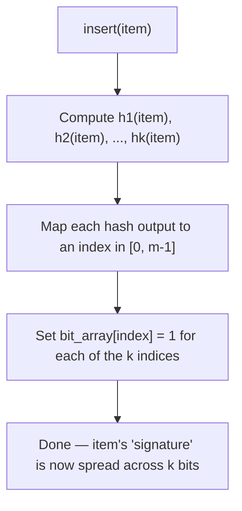
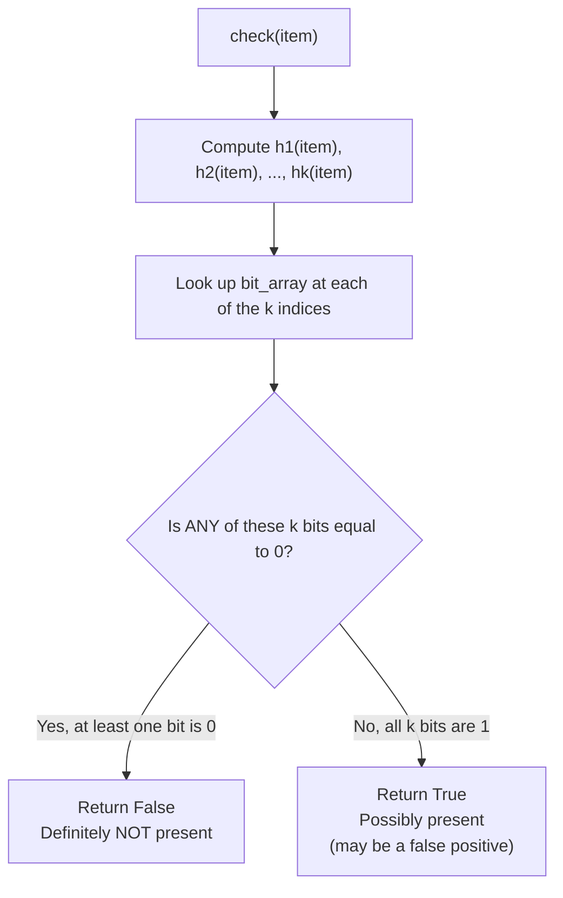
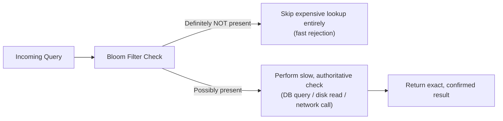

### 🔷🔶🔷 Chapter 7: Bloom Filters — Introduction, Internals, and Implementation

---

### 🔷🔶🔷 Introduction — What This Chapter Covers

    🔹 A Bloom filter is a space-efficient, probabilistic data structure used
      to test whether an element is a member of a set — trading a small,
      controllable chance of error for massive memory savings.

    🔹 It shows up constantly in real-world, large-scale systems — databases,
      browsers, and distributed caches — anywhere a system needs to quickly
      answer "have I possibly seen this before?" without storing every item.

    🔹 We follow this structured breakdown:
        🔸 Topic 1 — The Problem Bloom Filters Solve
        🔸 Topic 2 — What is a Bloom Filter?
        🔸 Topic 3 — Internal Structure — The Bit Array and Hash Functions
        🔸 Topic 4 — The Insert Operation
        🔸 Topic 5 — The Lookup (Membership Check) Operation
        🔸 Topic 6 — False Positives Explained With an Example
        🔸 Topic 7 — Why Deletion is Not Possible
        🔸 Topic 8 — The Math — Bit Array Size, Hash Count, and False Positive Rate
        🔸 Topic 9 — Python Implementation From Scratch
        🔸 Topic 10 — Real-World Applications
        🔸 Topic 11 — Bloom Filter Variants

---

### 🔷🔶🔷 Topic 1 — The Problem Bloom Filters Solve

**🔘 A Motivating Scenario — Username Availability Checking**

    🔹 Imagine signing up on a large social platform with 500 million registered
      users, and typing a username — the platform must instantly tell you
      whether that username is already taken.

    🔹 Doing this naively means checking your typed username against every
      single one of those 500 million existing usernames — clearly this
      cannot be done with a slow, brute-force approach at that scale.

**🔘 Traditional Approaches and Their Limits**

    🔹 Linear scan — compare the input against every stored username, one by
      one — this is an O(n) operation, hopelessly slow for hundreds of millions of records.

    🔹 Binary search — keep usernames sorted, and repeatedly narrow the search
      range in half until a match is found or ruled out — an improvement to
      O(log n), but still requires multiple comparisons and a fully sorted,
      centrally accessible dataset.

    🔹 Hash table / hash set — store every username as a key, giving O(1)
      average lookup time — fast, but memory-hungry, since every single
      username's actual text must be stored somewhere in memory.

**🔘 The Core Insight Behind Bloom Filters**

    🔹 A Bloom filter asks a different question — instead of "store every
      item so I can look it up later," it asks "can I get away with storing
      almost nothing, and still answer membership questions correctly most of the time?"

    🔹 The answer is yes, as long as we accept a small, tunable chance of a
      false positive — occasionally saying "this might be present" when it
      actually isn't — in exchange for dramatic memory savings and constant-time
      operations regardless of how many items are stored.

---

### 🔷🔶🔷 Topic 2 — What is a Bloom Filter?

**🔘 Formal Definition**

    🔹 A Bloom filter is a probabilistic, space-efficient data structure used
      to test set membership — it can tell you an item is "possibly in the
      set" or "definitely not in the set," but never "definitely in the set."

    🔹 It is "probabilistic" because it can produce false positives — reporting
      an item as present when it was never actually added — but it can NEVER
      produce a false negative.

**🔘 The Four Defining Properties**

    🔹 Property 1 — Fixed memory footprint: a Bloom filter of a given size can
      represent a set containing an arbitrarily large number of elements,
      unlike a hash table, whose memory usage grows with the number of stored items.

    🔹 Property 2 — Insertion never fails: you can always add another item,
      though as more items are added, the false positive rate steadily climbs.

    🔹 Property 3 — Zero false negatives, guaranteed: if a Bloom filter says
      "not present," that answer is always correct — this guarantee is what
      makes Bloom filters safe to use as a fast, preliminary filter in front
      of a slower, authoritative check.

    🔹 Property 4 — No deletion support (in the basic/classic version): once
      an item is added, it cannot be safely removed without risking corrupting
      the membership status of other items — explored fully in Topic 7.

**🔘 False Positive vs False Negative — Getting the Terms Straight**

    🔹 False Positive — the filter claims an item IS in the set, when it
      actually was never added — this can happen with Bloom filters.

    🔹 False Negative — the filter claims an item is NOT in the set, when it
      actually WAS added — this can NEVER happen with a correctly implemented
      Bloom filter, and is the structure's core reliability guarantee.

---

### 🔷🔶🔷 Topic 3 — Internal Structure — The Bit Array and Hash Functions

**🔘 The Bit Array — The Only Storage a Bloom Filter Uses**

    🔹 At its core, a Bloom filter is nothing more than a bit array of size
      `m`, with every bit initially set to `0` — no usernames, no strings, no
      objects are stored anywhere.

```
Index:  0   1   2   3   4   5   6   7   8   9
Bit:    0   0   0   0   0   0   0   0   0   0
```

    🔹 This is the entire "storage" of an empty Bloom filter — a single,
      compact array of bits, regardless of how many items will eventually be inserted.

**🔘 The Role of Hash Functions**

    🔹 A Bloom filter uses `k` independent hash functions, each of which takes
      an input item and maps it to an index within the bit array (i.e., a
      number between `0` and `m - 1`).

    🔹 Crucially, these are NOT cryptographic hash functions — they are
      chosen to be fast and to distribute outputs uniformly across the array,
      since speed and even spread matter far more than cryptographic security here.

    🔹 Common choices in practice include MurmurHash, the FNV family, and
      Jenkins hashes — all fast, non-cryptographic, well-distributed hash functions.

**🔘 Why Multiple Hash Functions, Rather Than Just One?**

    🔹 Using several independent hash functions per item spreads that item's
      "signature" across multiple, scattered bit positions, rather than just one.

    🔹 This makes it far less likely that an unrelated item will accidentally
      collide on ALL of the same positions, which is exactly what keeps the
      false positive rate low — the precise trade-off is quantified later in Topic 8.

---

### 🔷🔶🔷 Topic 4 — The Insert Operation

**🔘 Step-by-Step — Adding an Item**

    🔹 Step 1 — Take the input item (e.g., the string `"mango"`).

    🔹 Step 2 — Run it through each of the `k` hash functions, producing `k`
      index positions within the bit array.

    🔹 Step 3 — Set the bit at each of these `k` positions to `1`, regardless
      of whether they were already `0` or `1`.

**🔘 Worked Example — Inserting "mango"**

    🔹 Suppose we use a 10-bit array and 3 hash functions, and inserting
      `"mango"` produces the following (illustrative) hash outputs:

```
h1("mango") % 10 = 2
h2("mango") % 10 = 5
h3("mango") % 10 = 6
```

    🔹 We set bits at indices 2, 5, and 6 to `1`:

```
Index:  0   1   2   3   4   5   6   7   8   9
Bit:    0   0   1   0   0   1   1   0   0   0
                ▲               ▲   ▲
              set by "mango" (indices 2, 5, 6)
```

**🔘 Inserting a Second Item — "kiwi"**

    🔹 Now suppose we also insert `"kiwi"`, and its hashes produce:

```
h1("kiwi") % 10 = 1
h2("kiwi") % 10 = 5
h3("kiwi") % 10 = 8
```

    🔹 We set bits at indices 1, 5, and 8 — notice index 5 was already `1`
      from `"mango"`, and simply stays `1`:

```
Index:  0   1   2   3   4   5   6   7   8   9
Bit:    0   1   1   0   0   1   1   0   1   0
            ▲   ▲           ▲   ▲       ▲
        "kiwi" "mango"    shared  "mango" "kiwi"
```

    🔹 This overlap at index 5 is completely normal and expected — it is
      precisely this kind of overlap, multiplied across many items, that
      eventually leads to false positives.

**🔘 Insert Flow Diagram**



---

### 🔷🔶🔷 Topic 5 — The Lookup (Membership Check) Operation

**🔘 Step-by-Step — Checking if an Item is Present**

    🔹 Step 1 — Take the item being queried (e.g., `"mango"`).

    🔹 Step 2 — Run it through the exact same `k` hash functions used during insertion.

    🔹 Step 3 — Check the bit array at each of the resulting `k` positions.

    🔹 Step 4 — If ANY of these `k` bits is `0`, the item is definitely NOT in
      the set — return `False` immediately.

    🔹 Step 5 — If ALL `k` bits are `1`, the item is possibly in the set —
      return `True`, with the understanding that this could be a false positive.

**🔘 Lookup Decision Flowchart**



**🔘 Worked Example — Checking "mango" (True Positive)**

    🔹 Continuing the array from Topic 4:

```
Index:  0   1   2   3   4   5   6   7   8   9
Bit:    0   1   1   0   0   1   1   0   1   0
```

    🔹 Checking `"mango"` recomputes indices 2, 5, and 6 — all three bits are
      `1`, so the filter correctly reports "possibly present" — and in this
      case, it genuinely was inserted.

**🔘 Worked Example — Checking "papaya" (True Negative)**

    🔹 Suppose `"papaya"` hashes to indices 0, 3, and 9:

```
h1("papaya") % 10 = 0
h2("papaya") % 10 = 3
h3("papaya") % 10 = 9
```

    🔹 Checking the array at indices 0, 3, and 9, we find all three are still
      `0` — so the filter immediately and correctly reports "definitely not present."

---

### 🔷🔶🔷 Topic 6 — False Positives Explained With an Example

**🔘 Why "Possibly Present" is Sometimes Wrong**

    🔹 Because multiple items can share bit positions (as seen with index 5
      shared by `"mango"` and `"kiwi"` earlier), it's entirely possible for an
      item that was NEVER inserted to still have all of its hash positions
      already set to `1`, purely by coincidence.

**🔘 Worked Example — Checking "grape" (False Positive)**

    🔹 Suppose `"grape"` — an item that was never inserted — happens to hash
      to indices 1, 2, and 8:

```
h1("grape") % 10 = 1
h2("grape") % 10 = 2
h3("grape") % 10 = 8
```

    🔹 Looking at our bit array:

```
Index:  0   1   2   3   4   5   6   7   8   9
Bit:    0   1   1   0   0   1   1   0   1   0
            ▲   ▲                       ▲
       all 3 of "grape"'s indices happen to already be 1
```

    🔹 Bit 1 was set by `"kiwi"`, bit 2 was set by `"mango"`, and bit 8 was
      set by `"kiwi"` — none of these bits were set because of `"grape"`, yet
      the filter reports `"grape"` as "possibly present," which is a false positive.

**🔘 Controlling the False Positive Rate**

    🔹 The false positive rate rises as more items are inserted into a
      fixed-size bit array, since more and more bits gradually become `1`.

    🔹 It can be reduced (at the cost of more memory and more computation) by:
        🔸 Increasing the bit array size `m`, spreading bits more thinly across more space.
        🔸 Increasing the number of hash functions `k`, up to an optimal point
          (covered precisely in Topic 8).

    🔹 In the extreme case where every single bit in the array has been set
      to `1`, the Bloom filter will report every possible query as "possibly
      present," becoming completely useless — this is why sizing the filter
      correctly for the expected number of items is essential.

---

### 🔷🔶🔷 Topic 7 — Why Deletion is Not Possible

**🔘 The Core Problem With Removing an Item**

    🔹 To "delete" an item from a classic Bloom filter, the natural instinct
      would be to reset its `k` bits back to `0` — but this is unsafe, because
      those same bit positions are very likely shared with other, still-present items.

**🔘 Worked Example — Why Deleting "mango" Breaks "kiwi"**

    🔹 Recall that `"mango"` set bits at indices 2, 5, and 6, while `"kiwi"`
      set bits at indices 1, 5, and 8 — notice they share index 5.

    🔹 If we tried to "delete" `"mango"` by resetting bits 2, 5, and 6 back to `0`:

```
Before deleting "mango":
Index:  0   1   2   3   4   5   6   7   8   9
Bit:    0   1   1   0   0   1   1   0   1   0

After naively deleting "mango" (reset bits 2, 5, 6):
Index:  0   1   2   3   4   5   6   7   8   9
Bit:    0   1   0   0   0   0   0   0   1   0
                        ▲
          bit 5 is now 0 — but "kiwi" also needed it!
```

    🔹 Now, checking whether `"kiwi"` is present would check indices 1, 5, and
      8 — bit 5 is now `0`, so the filter would incorrectly report `"kiwi"` as
      "definitely not present," even though it genuinely was inserted.

    🔹 This is a **false negative** — and as established in Topic 2, a
      correctly functioning Bloom filter must never produce one — which is
      exactly why deletion is unsupported in the classic design.

**🔘 The Workaround — Counting Bloom Filters**

    🔹 If deletion support is genuinely required, a variant called a
      "Counting Bloom Filter" can be used instead — covered in Topic 11.

---

### 🔷🔶🔷 Topic 8 — The Math — Bit Array Size, Hash Count, and False Positive Rate

**🔘 The Three Interrelated Variables**

    🔹 `n` — the expected number of items that will be inserted into the filter.
    🔹 `m` — the size of the bit array (in bits).
    🔹 `k` — the number of hash functions used.
    🔹 `p` — the desired (or resulting) false positive probability.

    🔹 These four values are mathematically linked — choosing any two
      typically determines a recommended value for the others.

**🔘 Formula 1 — False Positive Probability**

    🔹 Given `m`, `k`, and `n`, the approximate false positive probability is:

```
p ≈ ( 1 - e^(-k*n/m) )^k
```

    🔹 In plain terms — as more items (`n`) are inserted into a fixed-size
      array (`m`), the probability of a false positive climbs, following this curve.

**🔘 Formula 2 — Required Bit Array Size**

    🔹 Given a target false positive probability `p` and expected item count
      `n`, the ideal bit array size is:

```
m = -( n * ln(p) ) / (ln(2))^2
```

    🔹 In plain terms — a lower desired false-positive rate, or a larger
      number of expected items, both push the required bit array size upward.

**🔘 Formula 3 — Optimal Number of Hash Functions**

    🔹 Given `m` and `n`, the optimal number of hash functions to minimize
      false positives is:

```
k = (m / n) * ln(2)
```

    🔹 In plain terms — there is a sweet spot for `k`; too few hash functions
      under-utilizes the bit array, while too many hash functions sets bits
      unnecessarily fast, both increasing the false positive rate.

**🔘 A Concrete Worked Example**

    🔹 Suppose we want to store `n = 1,000,000` items, with a target false
      positive rate of `p = 1%` (i.e., `0.01`).

    🔹 Applying Formula 2, this works out to roughly `m ≈ 9,585,058` bits
      (about 1.14 MB) — remarkably small compared to storing a million full
      strings directly.

    🔹 Applying Formula 3 with this `m` and `n`, the optimal hash count comes
      out to roughly `k ≈ 7` hash functions.

    🔹 Compare this to a plain hash set storing a million average-length
      usernames (say, 15 bytes each) — that would require roughly 15 MB just
      for the raw string data, more than 13 times the Bloom filter's footprint.

**🔘 The General Trade-Off Rule**

    🔹 More bits (`m`) -> lower false positive rate, but more memory used.
    🔹 More hash functions (`k`, up to the optimum) -> lower false positive
      rate, but slower insert/lookup operations.
    🔹 More items inserted (`n`) beyond the originally planned capacity ->
      higher false positive rate, for a fixed `m` and `k`.

---

### 🔷🔶🔷 Topic 9 — Python Implementation From Scratch

**🔘 Design Overview**

    🔹 We'll build a simple, self-contained Bloom filter class, computing its
      own optimal bit array size and hash count from the formulas in Topic 8,
      and simulating multiple hash functions using a single hash function
      combined with different seed values.

**🔘 Full Implementation**

```python
import math
import hashlib


class BloomFilter:
    """
    A simple Bloom filter implementation for approximate set membership
    testing. Supports insert() and might_contain(), but intentionally
    has no delete() method — see Topic 7 for why.
    """

    def __init__(self, expected_items: int, false_positive_rate: float):
        self.expected_items = expected_items
        self.false_positive_rate = false_positive_rate

        # Formula 2 from Topic 8 — ideal bit array size
        self.size = self._optimal_size(expected_items, false_positive_rate)

        # Formula 3 from Topic 8 — ideal number of hash functions
        self.hash_count = self._optimal_hash_count(self.size, expected_items)

        # The bit array itself — a simple list of 0/1 values
        self.bit_array = [0] * self.size

    @staticmethod
    def _optimal_size(n: int, p: float) -> int:
        m = -(n * math.log(p)) / (math.log(2) ** 2)
        return max(1, int(math.ceil(m)))

    @staticmethod
    def _optimal_hash_count(m: int, n: int) -> int:
        k = (m / n) * math.log(2)
        return max(1, int(round(k)))

    def _hash_positions(self, item: str):
        """
        Simulate k independent hash functions by combining the item
        with k different seed values, then hashing the combined string.
        """
        positions = []
        for seed in range(self.hash_count):
            combined = f"{seed}-{item}".encode("utf-8")
            digest = hashlib.sha256(combined).hexdigest()
            index = int(digest, 16) % self.size
            positions.append(index)
        return positions

    def insert(self, item: str) -> None:
        for index in self._hash_positions(item):
            self.bit_array[index] = 1

    def might_contain(self, item: str) -> bool:
        return all(self.bit_array[index] == 1 for index in self._hash_positions(item))


if __name__ == "__main__":
    bloom = BloomFilter(expected_items=20, false_positive_rate=0.05)

    print(f"Bit array size (m): {bloom.size}")
    print(f"Hash function count (k): {bloom.hash_count}")

    fruits_added = ["mango", "kiwi", "papaya", "lychee", "guava"]
    for fruit in fruits_added:
        bloom.insert(fruit)

    test_items = ["mango", "grape", "papaya", "orange", "lychee"]
    for item in test_items:
        result = bloom.might_contain(item)
        if result and item not in fruits_added:
            print(f"'{item}' -> POSSIBLY present (this is a FALSE POSITIVE)")
        elif result:
            print(f"'{item}' -> POSSIBLY present (correctly identified)")
        else:
            print(f"'{item}' -> DEFINITELY NOT present")
```

**🔘 What to Expect From This Program**

    🔹 Every item that was genuinely inserted (`"mango"`, `"papaya"`, `"lychee"`)
      will always correctly report as "possibly present," honoring the
      "no false negatives" guarantee.

    🔹 Items never inserted (`"grape"`, `"orange"`) will almost always report
      as "definitely not present," though — depending on the random hash
      distribution and how full the bit array is — one of them might
      occasionally trigger a false positive, exactly as expected from the
      false-positive math in Topic 8.

**🔘 Using a Faster, Non-Cryptographic Hash in Production**

    🔹 The example above uses SHA-256 purely for clarity and zero external
      dependencies — but as noted in Topic 3, production-grade Bloom filters
      typically use faster, non-cryptographic hash functions (like MurmurHash
      via the `mmh3` package) combined with different seed values, since
      raw speed matters far more than cryptographic strength here.

---

### 🔷🔶🔷 Topic 10 — Real-World Applications

**🔘 Web Browsers — Malicious URL Detection**

    🔹 Browsers can maintain a Bloom filter of known-malicious URLs locally,
      instantly ruling out the vast majority of safe URLs without a network
      call, and only querying a remote, authoritative service when the local
      filter reports a possible match.

**🔘 Databases — Avoiding Unnecessary Disk Reads**

    🔹 Distributed databases and storage engines (such as wide-column stores
      and LSM-tree-based systems) use Bloom filters to quickly check whether
      a given key might exist in a particular data file, before performing an
      expensive disk read.

    🔹 If the Bloom filter says "definitely not present," the expensive disk
      lookup is skipped entirely — this is the single biggest performance win
      Bloom filters provide in this context.

**🔘 Content Recommendation Systems**

    🔹 Large content platforms use Bloom filters to track which posts, articles,
      or videos a given user has already been shown, allowing extremely fast
      "have they seen this?" checks across huge, ever-growing content catalogs,
      without storing a full list of every item ever shown to every user.

**🔘 Network Systems — Duplicate Packet or Request Detection**

    🔹 Networking and caching systems use Bloom filters to detect duplicate
      requests or packets efficiently, avoiding redundant processing without
      needing to store every previously seen request in full.

**🔘 Spell Checkers and Autocomplete**

    🔹 A Bloom filter can quickly rule out clearly misspelled words (definitely
      not in the dictionary), falling back to a slower, exact dictionary
      lookup only for words the filter flags as "possibly valid."

---

### 🔷🔶🔷 Topic 11 — Bloom Filter Variants

**🔘 Counting Bloom Filter**

    🔹 Instead of a plain bit (0 or 1) at each position, a Counting Bloom
      Filter stores a small counter (e.g., a 4-bit integer) at each position.

    🔹 Inserting an item increments its `k` counters; deleting an item
      decrements them — and a position only becomes "empty" again once its
      counter drops back to zero, which safely solves the deletion problem
      described in Topic 7.

    🔹 The trade-off is increased memory usage — typically 4x to 8x more
      space than a classic single-bit Bloom filter, depending on counter size.

**🔘 Scalable Bloom Filter**

    🔹 A classic Bloom filter must be sized in advance for an expected number
      of items — a Scalable Bloom Filter instead starts small, and
      automatically adds new, progressively larger Bloom filter "layers" as
      the original one fills up, keeping the overall false positive rate bounded.

**🔘 Cuckoo Filter**

    🔹 A more modern alternative data structure, offering similar space
      efficiency to Bloom filters, while additionally supporting deletion
      natively and often achieving a lower false positive rate for the same
      amount of memory — at the cost of a somewhat more complex implementation.

**🔘 Quick Comparison**

    🔹 Classic Bloom Filter:
        🔸 Supports deletion? No.
        🔸 Memory efficiency: Excellent.
        🔸 Complexity: Very simple.

    🔹 Counting Bloom Filter:
        🔸 Supports deletion? Yes.
        🔸 Memory efficiency: Good (more than classic, less than a hash set).
        🔸 Complexity: Simple, slightly more bookkeeping.

    🔹 Cuckoo Filter:
        🔸 Supports deletion? Yes, natively.
        🔸 Memory efficiency: Very good, often better than Counting Bloom Filters.
        🔸 Complexity: Moderate — requires cuckoo hashing logic.

---

### 🔷🔶🔷 Bonus — Bloom Filter vs Hash Set, Side by Side

    🔹 Memory usage:
        🔸 Hash Set — stores the full item (or at least a reference to it);
          memory grows linearly and substantially with item count and size.
        🔸 Bloom Filter — stores only a fixed-size bit array; memory grows
          far more slowly, independent of individual item sizes.

    🔹 Membership query accuracy:
        🔸 Hash Set — always 100% accurate, no false positives or negatives.
        🔸 Bloom Filter — always accurate for "not present" answers, but
          "present" answers carry a small, tunable false positive chance.

    🔹 Deletion support:
        🔸 Hash Set — trivially supported.
        🔸 Bloom Filter (classic) — not supported; requires a Counting Bloom
          Filter or a different structure entirely.

    🔹 Best used when:
        🔸 Hash Set — exact correctness is mandatory, and memory is not a
          tight constraint.
        🔸 Bloom Filter — used as a fast, memory-light pre-filter in front of
          a slower, exact, authoritative lookup (e.g., a database or disk read).

**🔘 The Classic Pairing Pattern**



    🔹 This "fast filter in front of a slow, exact system" pattern is the
      single most common way Bloom filters are actually deployed in production
      — they are almost never used as the sole, final source of truth.

---

### 🔷🔶🔷 Summary — Chapter 7 at a Glance

    🔸 What It Is             ->  A space-efficient, probabilistic data
                                    structure for approximate set membership
                                    testing, built on a bit array and multiple
                                    hash functions.

    🔸 Guarantees              ->  Never produces false negatives; may produce
                                    false positives, at a rate that is
                                    mathematically tunable via `m`, `k`, and `n`.

    🔸 Core Operations          ->  `insert(item)` sets k bits; `check(item)`
                                    verifies all k bits are set, returning
                                    "possibly present" or "definitely not present."

    🔸 Deletion                ->  Not supported in the classic version, since
                                    clearing shared bits can silently corrupt
                                    other items' membership status; solved by
                                    Counting Bloom Filters.

    🔸 Sizing Formulas          ->  `m` (bit array size), `k` (hash count), and
                                    `p` (false positive rate) are all
                                    mathematically related, given an expected
                                    item count `n`.

    🔸 Real-World Use           ->  Malicious URL detection, database disk-read
                                    avoidance, content recommendation dedup,
                                    duplicate packet detection, and spell-checking
                                    pre-filters.

    🔸 Variants                ->  Counting Bloom Filters (support deletion),
                                    Scalable Bloom Filters (grow dynamically),
                                    and Cuckoo Filters (deletion + often better
                                    space efficiency).

    🔹 Bloom filters are a great example of a broader engineering principle —
      accepting a small, well-understood, and controllable margin of error in
      exchange for a dramatic gain in speed and memory efficiency, especially
      valuable at very large scale.

---