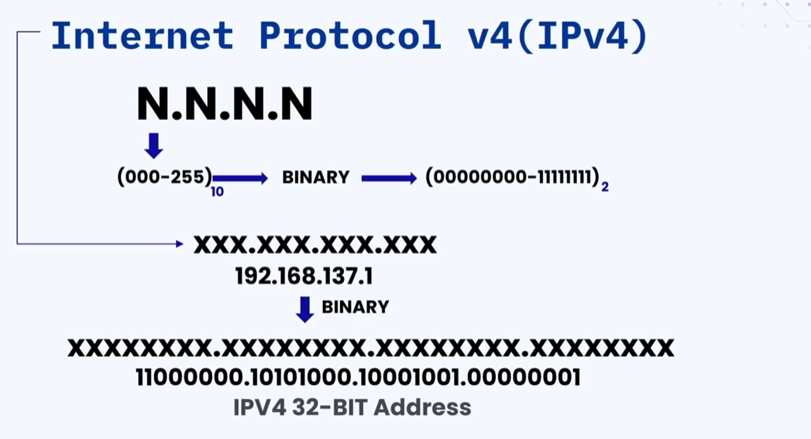
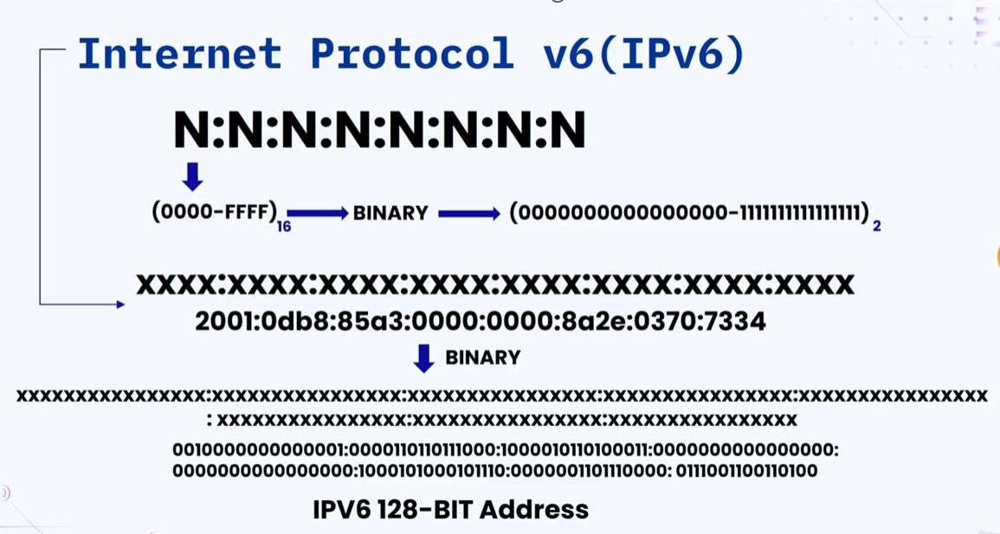
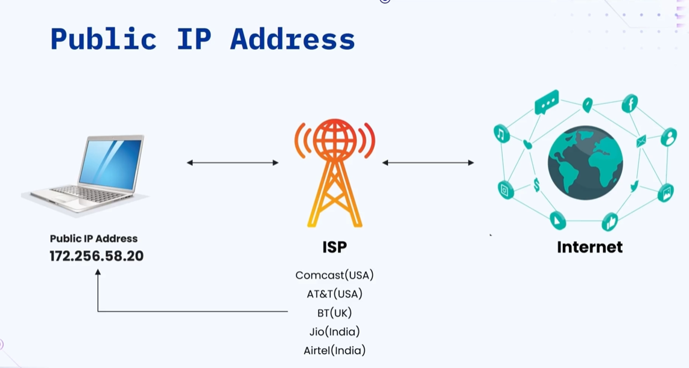
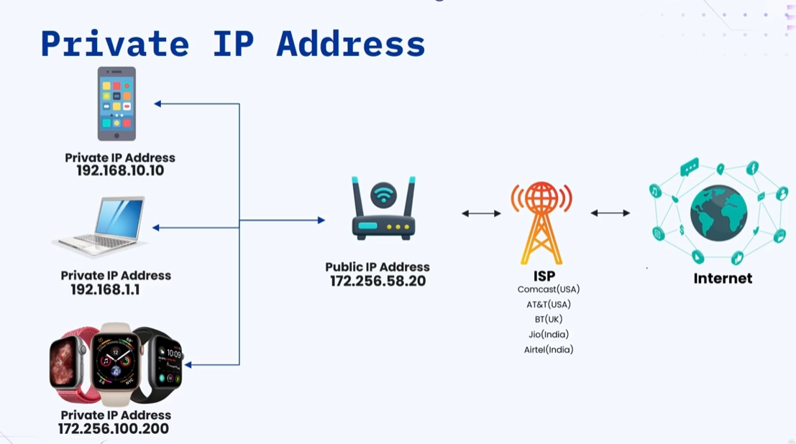
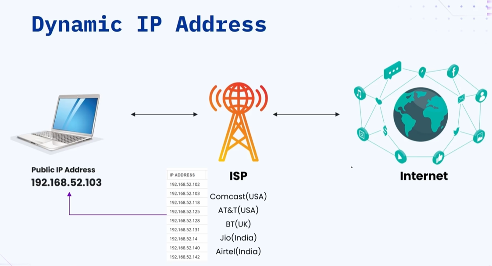

### 🔷🔶🔷 Chapter 1: IP Address (Internet Protocol Address)

---

### 🔷🔶🔷 What is an IP Address?

    🔹 Before understanding the technical part, let's understand why
       an IP address is needed through a simple analogy.

**🟠 The Letter Analogy**

    🔹 Assume you are staying in the US and your friend is living in India.

    🔹 To send a letter to your friend:
        🔸 You need your friend's address
        🔸 You write the address on the envelope and mail the letter
        🔸 The letter reaches your friend because the address is correct

    🔹 For your friend to reply back:
        🔸 He needs your address
        🔸 Once he has it, he can mail the letter back to you

    🔹 You both can communicate because you have each other's address.

**🟠 How This Relates to the Internet**

    🔹 In the same way, if you want to send or receive data from the internet,
       your device must have an address associated with it — so the internet
       knows exactly where to send the data.

    🔹 This address is a string of numbers written in a specific format.

    🔹 The format is governed by protocols and rules present on the internet.

    🔹 Hence it is called Internet Protocol Address — or IP Address for short.

---

### 🔷🔶🔷 Key Terminologies

    🔹 IP  ->  Internet Protocol — the set of rules governing data sent via the internet.

    🔹 IP addresses are always unique — used to identify a device on the internet.

    🔹 IP address contains the location of the device, making it accessible
       for communication.

---

### 🔷🔶🔷 Versions of IP Address

    🔹 There are two versions of IP address:
        🔸 IPv4  ->  Internet Protocol Version 4
        🔸 IPv6  ->  Internet Protocol Version 6

---

**🔘 1. IPv4 (Internet Protocol Version 4)**

    🔹 IPv4 is a group of four numbers, each separated by a dot.

    🔹 Each number is in the range of 000 to 255 — in decimal format.

    🔹 Computers cannot understand decimal format, so it is internally
       converted into binary.
        🔸 Decimal range: 000 to 255
        🔸 Binary range:  00000000 to 11111111  (8 characters per number)

    🔹 Example IPv4 address:
        🔸 Decimal  ->  192.168.137.1
        🔸 Binary   ->  11000000.10101000.10001001.00000001

    🔹 Each decimal number converts to 8 binary characters.
       There are 4 such numbers.
        🔸 Total characters  =  8 x 4  =  32 characters
        🔸 Each character takes 1 bit of memory space
        🔸 Hence IPv4 is known as a 32-bit address

**🟠 Key Points of IPv4**

    🔹 IPv4 was the first IP version used when the internet was introduced.
    🔹 It uses 32-bit numeric dot-decimal notation.
    🔹 Total addresses possible  =  2^32  ~  4 billion addresses
        🔸 Base 2 is used because all addresses are in binary format
    🔹 Initially, 4 billion addresses was more than enough.
    🔹 But today, with smart devices like Amazon Echo, Google Home,
       smartwatches, smartphones, and smart TVs — 4 billion is no longer sufficient.
    🔹 This shortage of addresses led to the introduction of IPv6.

---

**🔘 2. IPv6 (Internet Protocol Version 6)**

    🔹 IPv6 is a group of eight numbers, each separated by a colon.
        🔸 IPv4  ->  4 numbers separated by a dot
        🔸 IPv6  ->  8 numbers separated by a colon

    🔹 Each number is in the range of 0000 to FFFF — in hexadecimal format.

    🔹 Computers cannot understand hexadecimal either, so it is converted
       into binary.
        🔸 Hexadecimal range: 0000 to FFFF
        🔸 Binary range: 0000000000000000 to 1111111111111111  (16 characters per number)

    🔹 Example IPv6 address:
        🔸 Hexadecimal  ->  2001:0db8:85a3:0000:0000:8a2e:0370:7334
        🔸 Each 4-character hexadecimal number converts to 16 binary characters

    🔹 Total characters  =  16 x 8  =  128 characters
        🔸 Hence IPv6 is known as a 128-bit address

**🟠 Key Points of IPv6**

    🔹 IPv6 is a new protocol introduced in 1998.
    🔹 Deployment commenced in the mid-2000s and is still in progress.
    🔹 It uses 128-bit alphanumeric hexadecimal notation.
    🔹 Total addresses possible  =  2^128  =  3.4 x 10^38 addresses
    🔹 Number of devices supported  =  340 trillion x trillion x trillion devices
    🔹 In simple terms — it can support an unlimited number of devices.
    🔹 These many addresses are more than enough for generations to come.

---

### 🔷🔶🔷 IPv4 vs IPv6 — Quick Comparison

    🔸 Format         ->  IPv4: Decimal (dot-separated)     |  IPv6: Hexadecimal (colon-separated)
    🔸 Groups         ->  IPv4: 4 numbers                   |  IPv6: 8 numbers
    🔸 Bit Size       ->  IPv4: 32-bit                      |  IPv6: 128-bit
    🔸 Total Address  ->  IPv4: ~4 billion                  |  IPv6: 3.4 x 10^38
    🔸 Introduced     ->  IPv4: When internet began         |  IPv6: 1998

---

### 🔷🔶🔷 Types of IP Address

    🔹 There are four types of IP addresses:
        🔸 Public IP Address
        🔸 Private IP Address
        🔸 Static IP Address
        🔸 Dynamic IP Address

---

**🔘 1. Public IP Address**

    🔹 To connect a device to the internet, you cannot connect directly.
       You need to subscribe to an Internet Service Provider (ISP).

    🔹 Popular ISPs:
        🔸 USA    ->  Comcast, AT&T
        🔸 UK     ->  British Telecom
        🔸 India  ->  Jio, Airtel

    🔹 When you subscribe to an ISP, they assign a Public IP Address
       to your device.

    🔹 Using this public IP address, you can request data from the internet
       and the internet knows exactly where to send it back.

**🟠 Key Points of Public IP Address**

    🔹 Unique identifier assigned to a device connected to the internet.
    🔹 Accessible from anywhere on the internet across the globe.
    🔹 Always assigned by an Internet Service Provider (ISP).
    🔹 Used for identifying devices on the internet and enabling communication
       between devices across the internet.
    🔹 Since it is visible globally, it is more prone to attacks
       and has the least security.

---

**🔘 2. Private IP Address**

    🔹 Now instead of a single device, imagine a Wi-Fi router connected to the ISP.

    🔹 The ISP assigns a public IP address to the Wi-Fi router.

    🔹 Multiple devices are connected to this Wi-Fi router.

    🔹 The Wi-Fi router assigns a Private IP Address to each connected device.

    🔹 When any device requests data from the internet:
        🔸 The internet sends data to the Wi-Fi router (via the public IP)
        🔸 The router uses a mapping table (device name + private IP)
           to route the data correctly to the right device

**🟠 Key Points of Private IP Address**

    🔹 Unique identifier assigned to a device within a local network.
    🔹 Limited to the local network — not visible across the internet.
    🔹 Only visible to the Wi-Fi router and other devices on the same network.
    🔹 Assigned by routers or Network Address Translators (NAT).
    🔹 Used for identifying devices within a local network and facilitating
       internal communication between devices.
    🔹 More secure since it is not visible across the internet.

---

**🔘 3. Dynamic IP Address**

    🔹 When an ISP assigns an IP address to a device, it picks from
       its available pool of IP addresses at that moment.

    🔹 Whenever the same device restarts or reconnects to the ISP,
       a new IP address is assigned to it from the available pool.

    🔹 Since the IP address keeps changing on reconnection,
       it is called a Dynamic IP Address.

**🟠 Key Points of Dynamic IP Address**

    🔹 Changes from time to time — not always the same.
    🔹 The protocol used to assign dynamic IP addresses is called
       DHCP — Dynamic Host Configuration Protocol.
    🔹 Keeps changing whenever the device reconnects to the internet.
    🔹 More secure compared to static IP address (since it keeps changing).
    🔹 Maintenance cost is lower than static IP address.

---

**🔘 4. Static IP Address**

    🔹 When you subscribe to the ISP specifically for a static IP,
       the ISP assigns a fixed, dedicated public IP address to your device.

    🔹 Even if the device restarts or reconnects to the ISP,
       the same fixed IP address is assigned back to the same device.

    🔹 This unchanging address is called a Static IP Address.

**🟠 Key Points of Static IP Address**

    🔹 Does not change — reserved for a specific device by the ISP.
    🔹 Visible across the internet and never changes — hence less secure.
    🔹 Costs more than dynamic IP addresses because the ISP maintains
       a dedicated IP for that device.
    🔹 Used for web servers, remote servers, and hosting servers.

---

### 🔷🔶🔷 How to Check Your IP Address

    🔹 There are three different ways to check your IP address:

        🔘 Method 1 — Website:
            🔸 Visit: whatismyip.com
            🔸 It will display your public IPv4 and IPv6 address.

        🔘 Method 2 — Command Prompt / Terminal:
            🔸 Windows   ->  Open CMD and type:      ipconfig
            🔸 Mac/Linux ->  Open Terminal and type:  ifconfig
            🔸 Both will show your IPv4 and IPv6 addresses.

        🔘 Method 3 — Google Search:
            🔸 Simply search:  what is my IP
            🔸 Google will display your IP address directly
               in the search results.

---

### 🔷🔶🔷 Summary

    🔹 IP Address is a unique address assigned to every device to identify
       it on the internet — just like a home address is needed to send a letter.

    🔹 Versions of IP:
        🔸 IPv4  ->  32-bit, ~4 billion addresses, now insufficient
        🔸 IPv6  ->  128-bit, 3.4 x 10^38 addresses, unlimited for future

    🔹 Types of IP:
        🔸 Public IP   ->  Assigned by ISP, visible on the internet
        🔸 Private IP  ->  Assigned by router, visible only on local network
        🔸 Dynamic IP  ->  Changes on every reconnection, more secure
        🔸 Static IP   ->  Fixed, never changes, used for servers

    🔹 Ways to check your IP:
        🔸 whatismyip.com
        🔸 ipconfig (Windows) or ifconfig (Mac/Linux)
        🔸 Google search: "what is my IP"

---