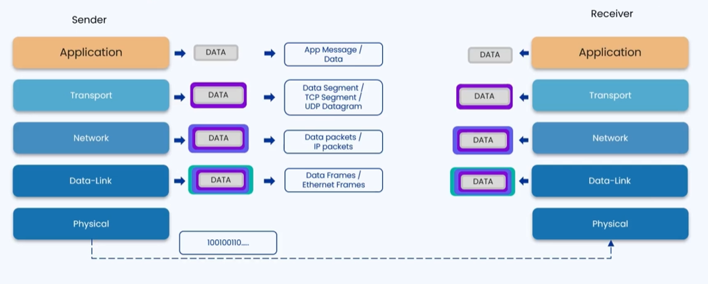

### 🔷🔶🔷 Chapter 3: TCP/IP Model

---

### 🔷🔶🔷 OSI vs TCP/IP — A Quick Recap

    🔹 In the previous chapter, we studied the OSI Model.

    🔹 The OSI Model only has theoretical presence —
       it has no practical implementation in the real world.

    🔹 The TCP/IP Model is the actual model that is practically
       implemented and used for communication between systems today.

**🟠 How TCP/IP Differs from OSI**

    🔹 The Application, Presentation, and Session layers of the OSI Model
       are combined into a single Application Layer in TCP/IP.

    🔹 All other layers remain the same:
        🔸 Transport Layer
        🔸 Network Layer
        🔸 Data Link Layer
        🔸 Physical Layer

---

### 🔷🔶🔷 What is the TCP/IP Model?

    🔹 TCP/IP is a set of protocols that supports network communication.

    🔹 TCP/IP stands for:
        🔸 TCP  ->  Transmission Control Protocol
        🔸 IP   ->  Internet Protocol

    🔹 Designed and developed by the Department of Defense in the 1960s.

    🔹 Main purpose: To enable communication and transfer of data
       between devices over a network.

**🟠 What TCP and IP Do Individually**

    🔹 TCP (Transmission Control Protocol):
        🔸 Ensures reliable, ordered, and error-checked delivery
           of data between applications.

    🔹 IP (Internet Protocol):
        🔸 Provides the addressing and routing of packets
           across the network.

---

### 🔷🔶🔷 Layers of the TCP/IP Model

    🔸 Layer 4  ->  Application Layer
    🔸 Layer 3  ->  Transport Layer
    🔸 Layer 2  ->  Network Layer
    🔸 Layer 1  ->  Data Link Layer + Physical Layer

---

### 🔷🔶🔷 Each Layer — Explained in Detail

---

**🔘 Layer 4 — Application Layer**

    🔹 Provides the user interface and services for applications
       to interact over the network.

    🔹 Used in network applications like:
        🔸 Web browsers (Chrome, Edge)
        🔸 File sharing tools (FileZilla)
        🔸 Email clients (Outlook)
        🔸 Communication tools (Microsoft Teams)

    🔹 Functions of the Application Layer:

        🔸 Translation:
            - Converts data from ASCII to binary (computer-understandable format)

        🔸 Compression:
            - Reduces the size of data before transmission
            - Lossy Compression   ->  Data is reduced but some quality is lost
                                      Example: Images/videos on WhatsApp
            - Lossless Compression ->  Data is reduced with no quality loss
                                       Example: Emails, SMS texts

        🔸 Encryption:
            - An encryption key is used to secure the data
            - Maintains the integrity and security of data during transmission

    🔹 Protocols provided by the Application Layer:

        🔸 DNS   ->  Domain Name System
                     Maps a domain name to its IP address
        🔸 HTTP / HTTPS  ->  For browsing websites
        🔸 FTP   ->  File Transfer Protocol — for sharing files between devices
        🔸 SMTP  ->  Simple Mail Transfer Protocol — for sending and receiving emails

---

**🔘 Layer 3 — Transport Layer**

    🔹 The most important layer in the TCP/IP Model.

    🔹 Ensures reliable data transmission between devices.

    🔹 Plays a pivotal role in managing the flow of data in a network.

    🔹 Provides two important protocols:
        🔸 TCP  ->  Transmission Control Protocol
        🔸 UDP  ->  User Datagram Protocol

---

**🟠 Protocol 1 — TCP (Transmission Control Protocol)**

    🔹 TCP is a connection-oriented protocol that provides:
        🔸 Reliable delivery
        🔸 Ordered delivery
        🔸 Secure delivery of data between applications

    🔹 TCP has three stages:

        🔘 Stage 1 — Connection Establishment (3-Way Handshake):

            Step 1  ->  Client sends a connection request to the server
            Step 2  ->  Server verifies the request and sends an acknowledgement
            Step 3  ->  Client receives the acknowledgement and sends one back

            Since there are 3 requests between sender and receiver,
            this is called the Three-Way TCP Handshake.

        🔘 Stage 2 — Data Transfer:

            TCP ensures data transfer through four features:

            🔸 Ordered Data Transfer:
                - Data is broken into smaller units called Data Segments
                - Each segment gets:
                    Sequence Number -> Used to rearrange data at receiver's end
                    Port Number     -> Indicates which port on the receiver
                                       the data should be delivered to

            🔸 Error-Free Data Transfer:
                - A Checksum is added to each data unit
                - At the receiver's end, the checksum is verified
                - If the checksum is wrong (data was tampered):
                    -> Receiver discards the data
                    -> No acknowledgement is sent to the sender
                    -> Sender retransmits the data after a timeout
                - If the checksum is correct:
                    -> Receiver sends an acknowledgement to the sender

            🔸 Retransmission of Lost Data:
                - If a data unit is lost during transmission:
                    -> Receiver never receives it, so no acknowledgement is sent
                    -> Sender waits for a timeout period
                    -> Sender retransmits the lost data unit
                    -> Once received, receiver sends acknowledgement
                    -> Sender stops retrying for that data unit

            🔸 Discard of Duplicate Segments:
                - If the server is slow to acknowledge, the client may
                  retransmit thinking the data was lost
                - But the data had already reached the server
                - TCP ensures the receiver detects and discards
                  the duplicate segment

        🔘 Stage 3 — Connection Termination (4-Way Handshake):

            Step 1  ->  Client sends a FINISH signal to the server
            Step 2  ->  Server acknowledges the client's FINISH signal
            Step 3  ->  Server sends its own FINISH signal to the client
            Step 4  ->  Client acknowledges the server's FINISH signal

            Since there are 4 requests, this is called the
            Four-Way Handshake for connection termination.

---

**🟠 Protocol 2 — UDP (User Datagram Protocol)**

    🔹 UDP is a connectionless protocol.

    🔹 It provides unreliable, unordered delivery of data
       between applications.

    🔹 Data is divided into smaller units called UDP Datagrams.

    🔹 Each UDP datagram contains only the Port Number
       (where the data needs to be delivered).

    🔹 UDP is much faster than TCP.

    🔹 Used in applications where speed is more important than reliability:
        🔸 Video and audio streaming platforms
        🔸 Online gaming applications
        🔸 Voice communication applications

---

**🟠 TCP vs UDP — Quick Comparison**

    🔸 Connection     ->  TCP: Connection-oriented  |  UDP: Connectionless
    🔸 Reliability    ->  TCP: Reliable             |  UDP: Unreliable
    🔸 Order          ->  TCP: Ordered delivery      |  UDP: No guaranteed order
    🔸 Speed          ->  TCP: Slower               |  UDP: Faster
    🔸 Use Case       ->  TCP: File transfer, web   |  UDP: Streaming, gaming

---

**🔘 Layer 2 — Network Layer**

    🔹 Responsible for transmission of data from one device to another
       device present in a different network.

    🔹 Receives data segments (TCP) or UDP datagrams from the Transport Layer.

    🔹 Functions of the Network Layer:

        🔸 Logical Addressing:
            - Takes data segments from the Transport Layer
            - Adds Source IP Address and Destination IP Address
            - Creates a Data Packet
            - These IP addresses are used to deliver data to the
              correct device over the network

        🔸 Routing:
            - Determines the shortest possible path for sending data
              from the source device to the destination device

    🔹 IP (Internet Protocol) is the major protocol used
       in the Network Layer.

---

**🔘 Layer 1 — Data Link Layer + Physical Layer**

**🟠 Data Link Layer**

    🔹 Responsible for transmitting data across a physical network.

    🔹 Two sub-layers:
        🔸 LLC — Logical Link Control
        🔸 MAC — Media Access Control

    🔹 Receives Data Packets from the Network Layer.

    🔹 Adds:
        🔸 Source MAC Address
        🔸 Destination MAC Address

    🔹 Creates an Ethernet Frame (Data Frame) from the Data Packet.

    🔹 MAC Address:
        🔸 A unique 12-digit hexadecimal number
        🔸 Identifies a device connected to the network
        🔸 Provided by the Network Interface Card (NIC) of each system
        🔸 Used for physically identifying the source and destination device

**🟠 Physical Layer**

    🔹 Specifies how bits are represented on the medium.

    🔹 Receives Data Frames from the Data Link Layer.

    🔹 Converts the data into bits and then into signals
       based on the transmission medium:
        🔸 Copper cables    ->  Electrical signals
        🔸 Optical fibers   ->  Light pulses
        🔸 Wireless         ->  Radio waves

    🔹 At the receiver's end, the Physical Layer converts
       signals back into bits and passes them up to the Data Link Layer.

---

### 🔷🔶🔷 Data Flow — Sender to Receiver

**🟠 At the Sender's End (Top to Bottom)**

    🔹 Application Layer:
        🔸 Data is created, translated, compressed, and encrypted

    🔹 Transport Layer:
        🔸 Data is segmented (TCP) or made into datagrams (UDP)
        🔸 Sequence numbers, port numbers, and checksums are added

    🔹 Network Layer:
        🔸 Segments become Data Packets
        🔸 Source and destination IP addresses are added
        🔸 Best route is determined

    🔹 Data Link Layer:
        🔸 Data Packets become Ethernet Frames
        🔸 Source and destination MAC addresses are added

    🔹 Physical Layer:
        🔸 Frames are converted into bits
        🔸 Bits are converted into electrical / light / radio signals
        🔸 Signals are transmitted over the network

**🟠 At the Receiver's End (Bottom to Top)**

    🔹 Physical Layer:
        🔸 Signals are converted back into Data Frames

    🔹 Data Link Layer:
        🔸 Checks destination MAC address
        🔸 Removes the frame and passes Data Packets to Network Layer

    🔹 Network Layer:
        🔸 Checks destination IP address
        🔸 Converts Data Packets back into Data Segments
        🔸 Passes to Transport Layer

    🔹 Transport Layer:
        🔸 Reorders the data using sequence numbers
        🔸 Passes the complete, ordered data to the Application Layer

    🔹 Application Layer:
        🔸 Data is decrypted, decompressed, and presented to the user

---

### 🔷🔶🔷 Summary — TCP/IP Model at a Glance

    🔸 Application Layer  ->  Data creation, Translation, Compression,
                              Encryption, Protocols (DNS, HTTP, FTP, SMTP)
    🔸 Transport Layer    ->  TCP (reliable) or UDP (fast), Segmentation,
                              Flow Control, Error Control
    🔸 Network Layer      ->  Logical Addressing (IP), Routing, Data Packets
    🔸 Data Link Layer    ->  Physical Addressing (MAC), Ethernet Frames
    🔸 Physical Layer     ->  Converts data to signals (electrical/light/radio)

    🔹 TCP/IP is the model practically used today for all
       internet communication between devices.

---