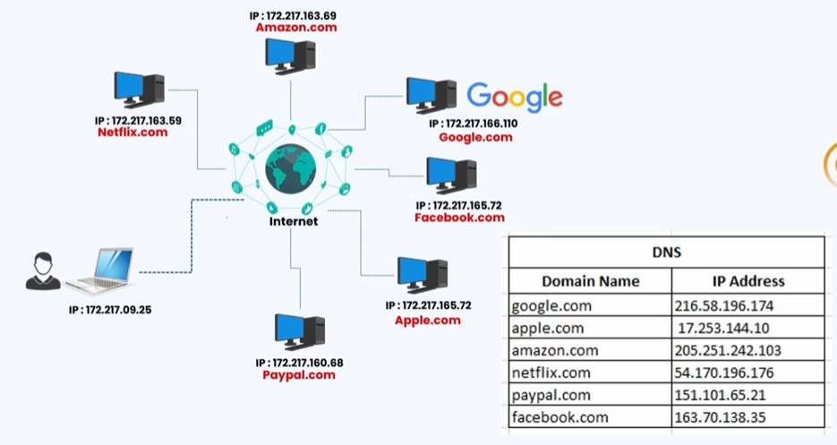
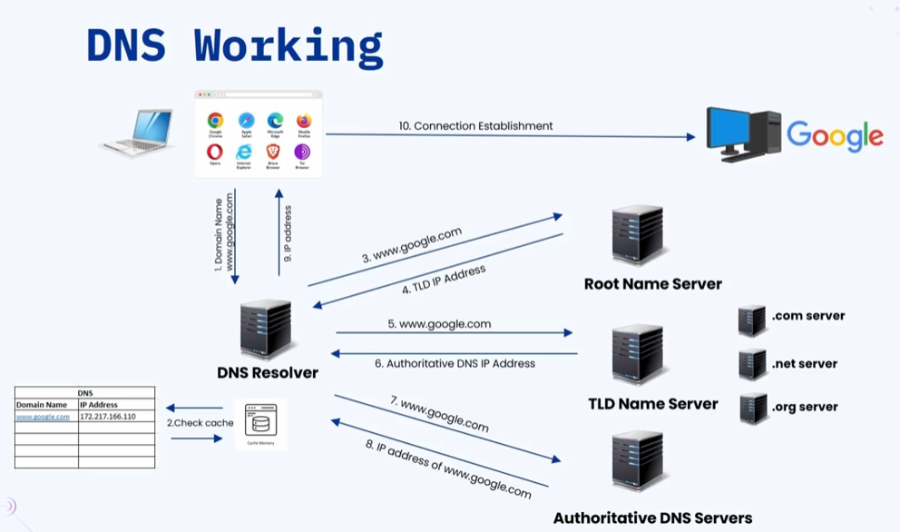
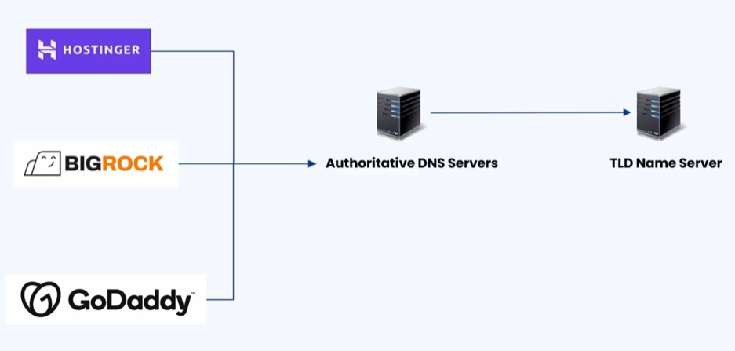

### 🔷🔶🔷 Chapter 4: Domain Name System (DNS)

---

### 🔷🔶🔷 The Problem — Why DNS is Needed?

    🔹 Every device connected to the internet has a unique IP address
       associated with it.

    🔹 To access any application server (like Google), you need its IP address
       to establish communication.

    🔹 But in daily life, we don't access just one website —
       we use YouTube, Netflix, Wikipedia, Amazon, and many more.

    🔹 Remembering the IP address for each of these is very difficult because:
        🔸 IP addresses are a string of numbers — hard to memorize
        🔸 IP addresses are dynamic in nature — they can change at any time
        🔸 Keeping track of updated IP addresses is a challenge

---

### 🔷🔶🔷 The Solution — Domain Name System (DNS)

    🔹 DNS enables users to remember the name of the application server
       instead of its IP address.

    🔹 Remembering "google.com" is far easier than remembering
       a string of numbers like "142.250.190.46".

    🔹 At a high level, DNS is like a Phone Book of the internet —
       it keeps the mapping of domain names to their IP addresses.

    🔹 Whenever you enter a domain name in your browser, DNS converts
       that domain name into an IP address and helps establish communication
       with the desired application server.

**🟠 Is DNS 100% Required?**

    🔹 No — DNS is not absolutely required.

    🔹 If you know the IP address of an application, you can directly
       use it in the browser and access the server.

    🔹 Example:
        🔸 Go to dns.google to find the IP address of google.com
        🔸 Copy the IP address and paste it directly in the browser
        🔸 Google will open — without using the domain name at all

    🔹 But since IP addresses are hard to remember, DNS makes
       the internet much easier to use.

---

### 🔷🔶🔷 What is DNS?

    🔹 DNS stands for Domain Name System.

    🔹 It translates human-readable domain names (like google.com)
       into machine-readable IP addresses (like 142.250.190.46).

    🔹 DNS is considered the Phone Book of the Internet.

    🔹 Without DNS, you would have to remember long strings of numbers
       to visit every website.

---

### 🔷🔶🔷 The Four Key Components of DNS

    🔹 To convert a domain name into an IP address, DNS uses
       four important components:

        🔸 1. DNS Resolver         (also called Recursive DNS Resolver)
        🔸 2. Root Name Server
        🔸 3. TLD Name Server      (Top Level Domain Name Server)
        🔸 4. Authoritative DNS Server

    🔹 Each component has its own specific role and responsibility.

---

**🔘 1. DNS Resolver (Recursive DNS Resolver)**

    🔹 The first point of contact for the browser when a DNS query is made.

    🔹 Responsibility:
        🔸 Receives the DNS query from the client (your browser)
        🔸 Contacts other DNS servers to find the IP address
        🔸 Responds back to the client with the final IP address

    🔹 To speed up the process, the DNS Resolver maintains
       an internal cache memory:
        🔸 If the domain name is already present in the cache,
           it directly returns the IP address without contacting other servers
        🔸 If not found in cache, it proceeds to contact the Root Name Server

---

**🔘 2. Root Name Server**

    🔹 The DNS Resolver contacts the Root Name Server when
       the answer is not in its cache.

    🔹 Responsibility:
        🔸 Identifies the correct Top Level Domain (TLD) Name Server
           based on the domain extension (.com, .net, .org, etc.)
        🔸 Responds with the IP address of the correct TLD Name Server

    🔹 Example:
        🔸 For google.com — Root Server identifies it as a .com domain
           and responds with the IP address of the .com TLD Server

---

**🔘 3. TLD Name Server (Top Level Domain Name Server)**

    🔹 Not a single server — it is a group of servers, each dedicated
       to a specific domain extension.

    🔹 Examples:
        🔸 .com  ->  Served by the .com TLD servers
        🔸 .net  ->  Served by the .net TLD servers
        🔸 .org  ->  Served by the .org TLD servers

    🔹 Responsibility:
        🔸 Receives the DNS query from the DNS Resolver
        🔸 Identifies the correct Authoritative DNS Server
           for the requested domain
        🔸 Responds with the IP address of the Authoritative DNS Server

---

**🔘 4. Authoritative DNS Server**

    🔹 The ultimate server in the DNS chain.

    🔹 Responsibility:
        🔸 Stores the actual mapping of domain names to their IP addresses
        🔸 Responds with the IP address of the requested domain name

    🔹 Example:
        🔸 For google.com — the Authoritative DNS Server responds
           with the actual IP address of the Google application server

---

### 🔷🔶🔷 How DNS Works — Step by Step Flow

    🔹 Assume you open your browser and type google.com and press Enter.

        🔘 Step 1 — DNS Query Sent to DNS Resolver:
            🔸 Your browser sends the DNS query to the DNS Resolver.

        🔘 Step 2 — DNS Resolver Checks Cache:
            🔸 The DNS Resolver checks its cache memory.
            🔸 If the IP address for google.com is found in cache:
                -> It directly returns the IP address to your browser.
            🔸 If not found in cache:
                -> It proceeds to contact the Root Name Server.

        🔘 Step 3 — DNS Resolver Contacts Root Name Server:
            🔸 The DNS Resolver sends the domain name to the Root Name Server.
            🔸 The Root Name Server sees the domain extension (.com).
            🔸 It responds with the IP address of the .com TLD Server.

        🔘 Step 4 — DNS Resolver Contacts TLD Name Server:
            🔸 The DNS Resolver contacts the .com TLD Server
               with the same DNS query.
            🔸 The .com TLD Server responds with the IP address
               of the Authoritative DNS Server for google.com.

        🔘 Step 5 — DNS Resolver Contacts Authoritative DNS Server:
            🔸 The DNS Resolver contacts the Authoritative DNS Server
               with the same DNS query.
            🔸 The Authoritative DNS Server responds with the
               actual IP address of google.com.

        🔘 Step 6 — DNS Resolver Returns IP to Browser:
            🔸 The DNS Resolver stores the result in its cache memory
               (for future queries).
            🔸 It responds to your browser with the IP address of google.com.

        🔘 Step 7 — Browser Establishes Connection:
            🔸 Now that your browser has the IP address, it establishes
               a communication channel with Google's application servers.
            🔸 Google loads in your browser.

---

### 🔷🔶🔷 How Does the Authoritative DNS Server Know the IP Address?

**🟠 DNS Registration Process**

    🔹 When you purchase a domain name from a platform like
       GoDaddy, BigRock, or Hostinger:

        🔘 Step 1:
            🔸 You purchase a domain name from the platform.

        🔘 Step 2:
            🔸 The platform gives you an option to configure
               Authoritative DNS Servers.
            🔸 You configure the Authoritative DNS Servers in their platform.

        🔘 Step 3:
            🔸 Your domain record (domain name -> IP address mapping)
               is stored in the Authoritative DNS Server.

        🔘 Step 4:
            🔸 The Authoritative DNS Server updates the TLD Name Server
               so it knows which Authoritative DNS Server to point to
               for your domain.

    🔹 All of this happens automatically in the background when
       you purchase and configure a new domain name.

    🔹 This is how the DNS Resolver is ultimately able to track down
       the IP address of any given domain name.

---

### 🔷🔶🔷 Summary — DNS Components at a Glance

    🔸 DNS Resolver         ->  First point of contact for the browser.
                                Handles DNS queries, checks cache, contacts
                                other servers to find the IP address.

    🔸 Root Name Server     ->  Identifies the correct TLD Name Server
                                based on the domain extension.
                                Responds with the TLD Server's IP address.

    🔸 TLD Name Server      ->  Handles requests for a specific domain extension
                                (.com, .net, .org etc.)
                                Responds with the Authoritative DNS Server's IP address.

    🔸 Authoritative DNS    ->  The ultimate server.
       Server                   Stores the actual domain name to IP address mapping.
                                Responds with the IP address of the requested domain.

    🔹 DNS converts human-readable domain names into machine-readable
       IP addresses — making the internet easy and accessible for everyone.

---