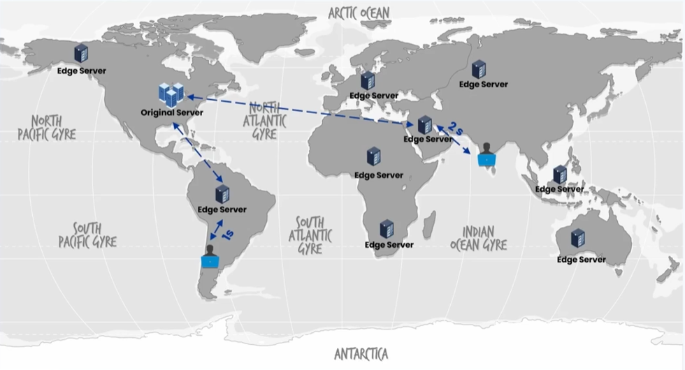

### 🔷🔶🔷 Chapter 5: Content Delivery Network (CDN)

---

### 🔷🔶🔷 The Problem — Why CDN is Needed?

    🔹 Let us understand the problem with a real-world example.

**🟠 Example — User in India, Server in North America**

    🔹 A user in India wants to watch a video on YouTube.
    🔹 YouTube servers are located in North America.

    🔹 The user makes a request → the server processes it
       → responds with the video.

    🔹 Since the user (client) and the server are geographically
       far apart, there is latency (delay) in delivering the resource.

        🔸 Time taken: 8 seconds  (too long for a user to wait)

**🟠 Partial Solution — Move the Server Closer**

    🔹 What if YouTube servers were moved from North America to Europe?

    🔹 Now the server is geographically closer to the user in India.

        🔸 Time taken: 5 seconds  (reduced by 3 seconds)

    🔹 But this only partially solves the problem.

    🔹 What about a user in South America?
        🔸 Europe is far from South America
        🔸 Time taken: 9 seconds  (latency increases again)

**🟠 The Core Problem**

    🔹 No matter where you place a single server, users in other
       geographical locations will always face high latency.

    🔹 The question is:
        How do we deliver content to users across different geographical
        areas with the least possible latency?

---

### 🔷🔶🔷 The Solution — Content Delivery Network (CDN)

    🔹 CDN solves this by distributing servers across multiple
       geographical locations worldwide.

    🔹 How it works:
        🔸 The original server stays in its original location
        🔸 Multiple Edge Servers are placed in different geographical locations
        🔸 Each edge server keeps a cached copy of the content
           from the original server

    🔹 When a user makes a request:
        🔸 The user is connected to the nearest edge server
        🔸 The edge server serves the content from its cache
        🔸 Since the edge server is geographically close to the user,
           the content is delivered with very low latency

**🟠 What if the Edge Server Does Not Have the Content?**

    🔹 If the requested content is not in the edge server's cache:
        🔸 The edge server pulls the content from the original server
        🔸 Stores it in its own cache memory
        🔸 Then serves the content to the user

    🔹 For all future requests for the same content from that region,
       the edge server is ready and can serve immediately.

---

### 🔷🔶🔷 Key Terminologies in CDN

**🔘 Content Delivery Network (CDN)**

    🔹 A distributed network of servers that work together to deliver
       content to users based on their geographical location.

    🔹 Main goal: Reduce latency and deliver content as fast as possible.

---

**🔘 Origin Server**

    🔹 The server that hosts the original version of the website
       or application.

    🔹 Contains the original resources as requested by users.

---

**🔘 Edge Servers**

    🔹 Servers distributed across different geographical locations.

    🔹 Serve cached content quickly to nearby users.

    🔹 Play an important role in reducing latency and improving load times.

---

**🔘 Point of Presence (PoP)**

    🔹 The different geographical locations where edge servers are present.

    🔹 Each PoP contains one or more edge servers.

---

**🔘 Content Caching**

    🔹 Instead of accessing the original server every time a user makes
       a request, CDN caches the content in edge servers.

    🔹 The cached content is served directly to the client as a response,
       reducing load on the origin server and improving speed.

---

### 🔷🔶🔷 Types of CDN

---

**🔘 1. Push CDN**

    🔹 Whenever there is an update to resources in the original server,
       the update is pushed to all edge servers simultaneously.

    🔹 Each edge server caches the updated resource in its memory.

    🔹 When a user makes a request, the edge server is already ready
       with the resource and serves it immediately.

    🔹 Flow:
        🔸 Original server updates content
        🔸 Update is pushed to all edge servers at the same time
        🔸 All edge servers cache the updated content
        🔸 User requests content -> edge server serves it instantly

**🟠 Advantages of Push CDN**

    🔹 Latency is reduced to a very large extent.
    🔹 Very minimal delay in processing user requests.

**🟠 Disadvantages of Push CDN**

    🔹 All edge servers cache the updated content — even if users
       from that region never request it.
    🔹 This wastes cache memory on the edge servers.
    🔹 Increases the cost of memory management.

---

**🔘 2. Pull CDN**

    🔹 Edge servers do not receive content in advance.

    🔹 When a user makes a request, the edge server first checks
       its own cache:
        🔸 If the content is present in cache:
            -> Serves the user immediately
        🔸 If the content is NOT in cache:
            -> Pulls the content from the original server
            -> Caches it in its own memory
            -> Then serves the user request

    🔹 Flow:
        🔸 User requests content
        🔸 Edge server checks cache
        🔸 Cache miss -> pulls from origin server -> caches -> serves user
        🔸 Cache hit  -> serves user directly from cache

**🟠 Advantages of Pull CDN**

    🔹 No wasted cache memory — content is only cached when requested.
    🔹 More efficient use of edge server resources.

**🟠 Disadvantages of Pull CDN**

    🔹 There may be slight latency for the very first request
       for a specific resource (since it needs to be pulled first).
    🔹 Subsequent requests are fast because the content is now cached.

---

**🟠 Push CDN vs Pull CDN — Quick Comparison**

    🔸 Content Update   ->  Push: Proactively pushed to all servers
                            Pull: Pulled only when a user requests it

    🔸 Initial Latency  ->  Push: Very low (content already cached)
                            Pull: Slightly higher for first request

    🔸 Cache Efficiency ->  Push: May waste memory (unused content cached)
                            Pull: Efficient (only requested content cached)

    🔸 Best For         ->  Push: Content that is popular everywhere
                            Pull: Content with varied regional demand

---

### 🔷🔶🔷 Advantages of CDN

**🔘 1. Improved Load Time**

    🔹 The major advantage — CDN significantly reduces latency.

    🔹 Without CDN:
        🔸 Content is always served by the original server
        🔸 The original server may be geographically far from the user
        🔸 This increases the time taken to deliver the resource

    🔹 With CDN:
        🔸 User is connected to the nearest edge server
        🔸 Edge server processes the request and serves the content quickly

---

**🔘 2. Scalability**

    🔹 Without CDN:
        🔸 If 1 million users request a resource simultaneously,
           the entire load falls on the original server
        🔸 The server takes a very long time to process all requests

    🔹 With CDN:
        🔸 The 1 million requests are distributed across multiple edge servers
        🔸 No single server bears the entire load
        🔸 Additional edge servers can be added as traffic increases

---

**🔘 3. Reliability and Availability**

    🔹 Without CDN:
        🔸 There is only one server processing all user requests
        🔸 If the server goes down — no requests can be processed
        🔸 This creates a Single Point of Failure

    🔹 With CDN:
        🔸 Multiple edge servers process user requests
        🔸 If one edge server fails, the user is connected to
           the next available edge server geographically closest to them
        🔸 No single point of failure

---

**🔘 4. SEO Benefits (Search Engine Optimization)**

    🔹 CDN reduces load time and delivers resources faster.

    🔹 Faster load times are a positive factor in search engine rankings.

    🔹 This means applications using CDN rank better in search results
       on engines like Google — improving visibility and traffic.

---

### 🔷🔶🔷 Disadvantages of CDN

**🔘 1. Complexity**

    🔹 CDN has multiple working parts:
        🔸 Point of Presence locations
        🔸 Edge servers
        🔸 Caching mechanisms
        🔸 Communication paths between edge servers and origin server

    🔹 Setting up and managing all these components adds significant
       complexity.

    🔹 Most application owners do not set up their own CDN —
       they rely heavily on third-party CDN providers.

---

**🔘 2. Cost**

    🔹 Along with maintaining the original server, the application owner
       must also maintain:
        🔸 Edge servers with powerful cache memory
        🔸 Servers across multiple geographical locations

    🔹 The infrastructure cost can be very high — especially for
       smaller companies.

---

**🔘 3. Dependency on Third-Party Providers**

    🔹 Due to high complexity and cost, most companies outsource
       CDN solutions to third-party providers.

    🔹 This creates a tightly coupled dependency on external service
       providers — which can be a risk if the provider faces downtime
       or changes pricing.

---

### 🔷🔶🔷 Popular CDN Providers

    🔹 Three of the most widely used CDN providers in the market today:

        🔸 Amazon CloudFront  ->  Part of AWS (Amazon Web Services)
        🔸 Google Cloud CDN   ->  Part of Google Cloud Platform
        🔸 Cloudflare CDN     ->  Independent CDN provider

---

### 🔷🔶🔷 Summary

    🔹 Problem:
        🔸 Users far from the origin server experience high latency
           when requesting content.

    🔹 Solution — CDN:
        🔸 Distributes edge servers across multiple geographical locations
        🔸 Caches content on edge servers closest to users
        🔸 Delivers content with minimal latency

    🔹 Types of CDN:
        🔸 Push CDN  ->  Content pushed proactively to all edge servers
        🔸 Pull CDN  ->  Content pulled to edge servers only when requested

    🔹 Advantages:
        🔸 Improved load time
        🔸 Scalability
        🔸 Reliability and availability (no single point of failure)
        🔸 SEO benefits

    🔹 Disadvantages:
        🔸 High complexity of setup
        🔸 High cost of infrastructure
        🔸 Dependency on third-party providers

    🔹 Popular Providers:
        🔸 Amazon CloudFront, Google Cloud CDN, Cloudflare CDN

---