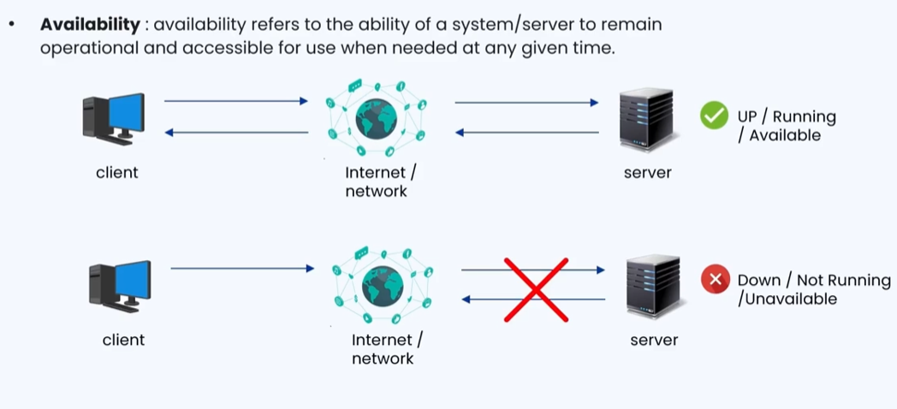
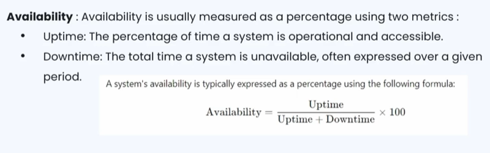
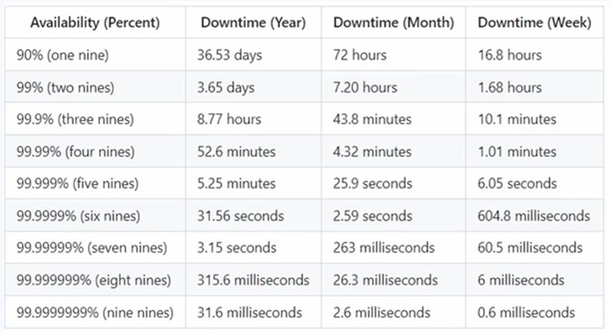
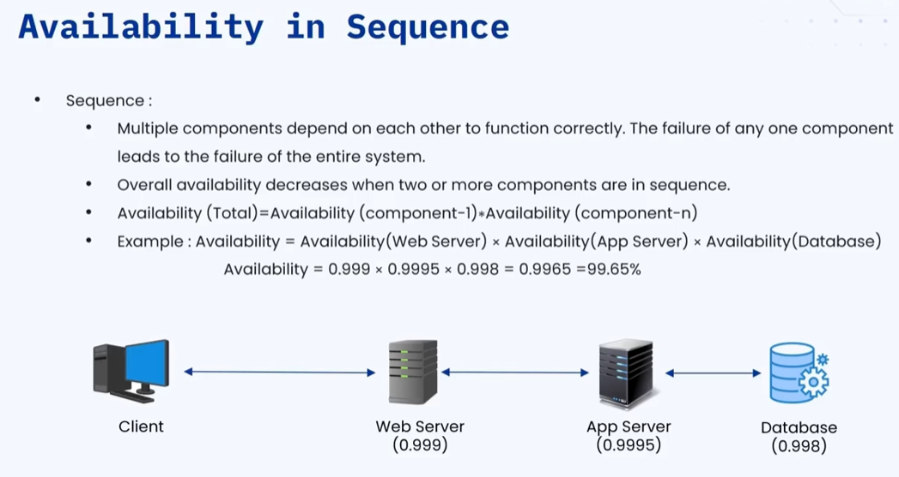
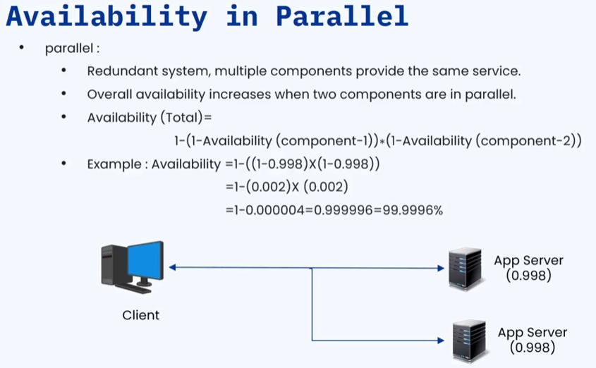
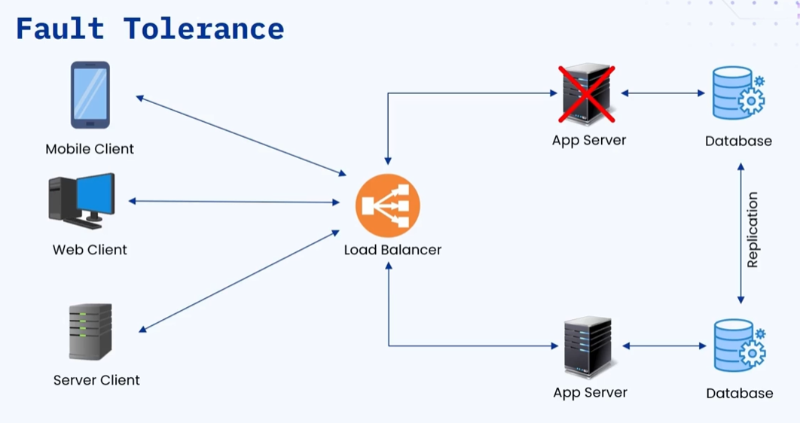
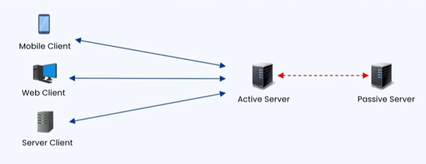
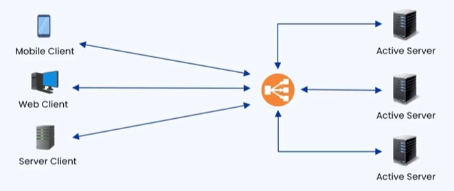

### 🔷🔶🔷 Chapter 6: Availability

---

### 🔷🔶🔷 What is Availability?

    🔹 Availability in the simplest form refers to the ability of a system
       or server to remain operational and accessible for use when needed
       at any given time.

**🟠 Understanding with an Example**

    🔹 A client makes a request to a server over the internet.

        🔸 If the server receives the request, processes it, and responds
           back to the client:
            -> The server is Available (Up and Running)

        🔸 If the server is not able to receive, process, or respond
           to the client request:
            -> The server is Unavailable (Down / Not Running)

---

### 🔷🔶🔷 How to Measure Availability?

    🔹 Availability is measured as a percentage using two metrics:

        🔸 Uptime   ->  The percentage of time a system is operational
                        and accessible
        🔸 Downtime ->  The total time a system is unavailable,
                        expressed over a given period

**🟠 Formula**

    🔹 Availability (%) = ( Uptime / (Uptime + Downtime) ) x 100

    🔹 Units of uptime and downtime can be hours, minutes, seconds,
       days, or years — any unit of time.

**🟠 Example 1**

    🔹 Server uptime   = 12 hours/day
       Server downtime = 12 hours/day

    🔹 Availability = ( 12 / (12 + 12) ) x 100 = 50%

        🔸 The server is available only 50% of the time.

**🟠 Example 2**

    🔹 Server uptime   = 12.5 hours/day
       Server downtime = 2.5 hours/day

    🔹 Availability = ( 12.5 / (12.5 + 2.5) ) x 100 = ~90%

        🔸 The server is available 90% of the time.

---

### 🔷🔶🔷 Availability and the "Nines"

**🔹 In the real world, availability is measured in terms of "Nines":**

    🔸 99%      ->  Two Nines
    🔸 99.9%    ->  Three Nines
    🔸 99.99%   ->  Four Nines
    🔸 99.999%  ->  Five Nines
    🔸 99.9999% ->  Six Nines (and beyond)

**🟠 What is Recommended?**

    🔹 90% and 99% availability are NOT recommended in real-world systems.

    🔹 Anything above 99.9% is used in the industry today.

    🔹 Five Nines (99.999%) is the recommended availability
       for web applications:
        🔸 Applications like YouTube, Google, Netflix, Amazon, Flipkart
           maintain at least Five Nines of availability
        🔸 Five Nines means only 5 minutes of downtime per year

    🔹 Six Nines and beyond are used in mission-critical systems:
        🔸 Air traffic control systems
        🔸 Satellite systems
        🔸 IoT systems like self-driving cars
        🔸 (Even a second of downtime can have fatal consequences)

---

### 🔷🔶🔷 Availability in Sequence

    🔹 When components are in sequence, they are dependent on each other.
    🔹 If one component fails, the entire system fails.
    🔹 The overall availability DECREASES when components are in sequence.

**🟠 Formula for Components in Sequence**

    🔹 Overall Availability = Availability of A x Availability of B x Availability of C ...

**🟠 Example**

    🔹 System: Client -> Web Server -> App Server -> Database

        🔸 Web Server availability   = 99.9%
        🔸 App Server availability   = 99.95%
        🔸 Database availability     = 99.8%

    🔹 Overall Availability = 99.9% x 99.95% x 99.8% = ~99.65%

        🔸 The overall availability is LESS than any individual component.

**🟠 Impact of Failure in Sequence**

    🔹 If the Web Server fails:
        🔸 Client cannot reach the App Server at all

    🔹 If the App Server fails:
        🔸 Web Server gets no response to process

    🔹 If the Database fails:
        🔸 App Server cannot process the user request

    🔹 Failure of ANY ONE component leads to failure of the ENTIRE system.

---

### 🔷🔶🔷 Availability in Parallel

    🔹 When components are in parallel, they are redundant or replica servers.
    🔹 Multiple components provide the same service simultaneously.
    🔹 The overall availability INCREASES when components are in parallel.
    🔹 There is NO single point of failure.

**🟠 Formula for Components in Parallel**

    🔹 Overall Availability = 1 - ( (1 - Availability of A) x (1 - Availability of B) ... )

**🟠 Example**

    🔹 Two App Servers, each with 99% availability:

    🔹 Overall Availability = 1 - ( (1 - 0.99) x (1 - 0.99) )
                            = 1 - ( 0.01 x 0.01 )
                            = 1 - 0.0001
                            = 99.99%

        🔸 The overall availability is HIGHER than any individual component.

    🔹 If one App Server fails, the other continues to serve requests.

---

### 🔷🔶🔷 Factors Affecting Availability

**🔘 1. Hardware Failure**

    🔹 Physical components can fail:
        🔸 Disk failure
        🔸 Power supply failure
        🔸 Hard drive failure

---

**🔘 2. Software Bugs**

    🔹 Defects in software can crash the system:
        🔸 Unhandled exceptions or errors
        🔸 Memory leaks in the application

---

**🔘 3. Network Issues**

    🔹 Problems in the network infrastructure:
        🔸 Faulty network adapters
        🔸 Latency and packet loss leading to network failures

---

**🔘 4. Human Errors**

    🔹 Mistakes made by people managing the system:
        🔸 Misconfiguration of servers
        🔸 Unplanned updates or deployments
        🔸 Accidental data deletions

---

**🔘 5. External Dependencies**

    🔹 Large organizations often rely on third-party APIs or servers.

    🔹 If a third-party service fails, it can cause your own system to fail.

    🔹 It is important to have proper SLAs (Service Level Agreements)
       defined with third-party service providers.

---

### 🔷🔶🔷 Strategies to Improve Availability

---

**🔘 Strategy 1 — Fault Tolerance**

    🔹 A fault-tolerant system continues operating even when a component fails.

    🔹 Key practices to achieve fault tolerance:

        🔸 Redundancy / Replication:
            - Hardware Redundancy:
                Multiple servers, hard drives, power supplies, disks
            - Data Redundancy:
                Duplicate data across multiple database servers
                in different regions to prevent data loss
            - Network Redundancy:
                More than one network path available for the client
                to reach the server

        🔸 Load Balancers:
            - Distribute traffic across multiple servers
            - If one server fails, the load balancer routes traffic
              to remaining healthy servers

**🟠 How Fault Tolerance Works — Example**

    🔹 System setup:
        🔸 Client -> Load Balancer -> Multiple App Servers -> Multiple Databases

    🔹 When a client request comes in:
        🔸 Client sends request to the Load Balancer
        🔸 Load Balancer distributes the request to one of the App Servers
        🔸 App Server performs database operations
        🔸 Data is synchronized across multiple databases

    🔹 If one App Server fails:
        🔸 Load Balancer routes incoming requests to the remaining
           healthy App Servers
        🔸 Overall system remains available

**🟠 Redundancy Patterns**

    🔘 Active-Passive Approach:

        🔹 There is one Active Server and one Passive Server.

        🔹 Active and Passive servers share heartbeat signals so that
           the Passive Server knows if the Active Server is running.

        🔹 Client always sends requests to the Active Server.

        🔹 If the Active Server fails:
            🔸 No heartbeat is received by the Passive Server
            🔸 Passive Server takes over as the new Active Server

        🔹 Drawbacks:
            🔸 Failover Downtime:
                A small (but non-zero) downtime occurs while the
                Passive Server transitions to Active
            🔸 Underutilization of Resources:
                The Passive Server remains completely idle until failure
                — resources are not fully utilized at all times

    🔘 Active-Active Approach:

        🔹 There are multiple Active Servers running simultaneously.

        🔹 A Load Balancer sits in front of all servers and distributes
           incoming requests across them based on an algorithm.

        🔹 If one Active Server fails:
            🔸 Load Balancer routes traffic to the remaining healthy servers
            🔸 No single point of failure

        🔹 Advantages:
            🔸 No single point of failure
            🔸 Supports scalability — add more servers as traffic grows

        🔹 Disadvantage:
            🔸 Higher cost due to multiple active components
               and their maintenance

---

**🔘 Strategy 2 — Graceful Degradation**

    🔹 In case of a partial failure, the system can degrade its
       functionality while still remaining useful to the user.

    🔹 Example — Database connected to the server fails:
        🔸 The server can use cached content to serve user requests
        🔸 If cached content is also unavailable, the server responds
           with a meaningful error message to the client
        🔸 The system remains partially functional instead of completely down

---

**🔘 Strategy 3 — Auto Recovery and Self-Healing**

    🔹 Systems often have self-healing capabilities — they can detect
       failures and automatically recover without human intervention.

    🔹 Example — AWS Auto Scaling Groups:
        🔸 If an application deployed on EC2 fails for any reason,
           the Auto Scaling Group automatically restarts the application
        🔸 No manual intervention required

    🔹 Using such tools ensures faster recovery from failures.

---

**🔘 Strategy 4 — Geographic Distribution**

    🔹 To avoid a single point of failure due to natural disasters
       or regional issues, services can be distributed across multiple
       geographical locations.

    🔹 Multi-Region Deployments:
        🔸 Application servers and databases are deployed in different regions
        🔸 Example: Servers deployed in both North America and South America
        🔸 If a natural disaster (earthquake, cyclone) affects North America,
           the South America servers continue to serve user requests
        🔸 Overall availability is not affected

    🔹 Content Delivery Networks (CDN):
        🔸 As seen in Chapter 5, CDNs are distributed across multiple regions
        🔸 CDNs also help in increasing availability for content delivery

---

### 🔷🔶🔷 Monitoring and Alerting

    🔹 Along with the above strategies, it is equally important to have
       monitoring and alerting mechanisms in place.

**🟠 Monitoring**

    🔹 Continuous collection, tracking, and analysis of system data:
        🔸 Performance metrics
        🔸 Resource usage (CPU, memory, disk)
        🔸 Uptime status

    🔹 Monitoring helps track whether the application servers are
       healthy and running at all times.

**🟠 Alerting**

    🔹 Sends notifications to appropriate personnel when a failure
       or anomaly is detected — allowing quicker resolution.

    🔹 Alerts should be configured based on predefined metrics:
        🔸 Downtime thresholds
        🔸 Latency spikes
        🔸 CPU usage spikes
        🔸 Memory or disk issues

    🔹 Ensures administrators are properly notified of potential
       failures before they escalate.

---

### 🔷🔶🔷 Design Considerations for High Availability

    🔹 When designing a highly available system, keep these points in mind:

        🔸 Avoid Single Point of Failure:
            Ensure no single component failure can bring down the whole system

        🔸 Use Redundancy and Replication:
            Have multiple instances of critical services
            Replicate data across multiple databases

        🔸 Automated Failover:
            Traffic should be automatically rerouted to healthy instances
            when a component fails

        🔸 Continuous Monitoring and Self-Recovery:
            Continuously monitor for failures
            Use self-healing tools to automatically recover from failures

        🔸 Plan for Disaster Recovery:
            Prepare for catastrophic failures
            Have a proper backup and recovery plan in place

---

### 🔷🔶🔷 Interview Scope — How Availability Questions Are Asked

    🔹 Interviewers can ask about availability in several ways:

        🔘 "Design a system that achieves Five Nines of availability."

        🔘 "Design a resilient system / resilient architecture."

        🔘 "Design a system with no single point of failure."

        🔘 "Design an architecture to handle system failures
            and ensure availability."

    🔹 For all of the above, you need to discuss:
        🔸 Fault tolerance (redundancy, load balancers)
        🔸 Active-Active or Active-Passive redundancy patterns
        🔸 Graceful degradation
        🔸 Auto recovery and self-healing
        🔸 Geographic distribution
        🔸 Monitoring and alerting

---

### 🔷🔶🔷 Summary

    🔹 Availability:
        🔸 The ability of a system to remain operational and accessible
           at any given time, measured as a percentage.

    🔹 Formula:
        🔸 Availability (%) = ( Uptime / (Uptime + Downtime) ) x 100

    🔹 Nines of Availability:
        🔸 Five Nines (99.999%) is the industry standard
           for web applications (~5 min downtime/year)
        🔸 Six Nines+ for mission-critical systems

    🔹 Sequence vs Parallel:
        🔸 Sequence  ->  Availability decreases, single point of failure
        🔸 Parallel  ->  Availability increases, no single point of failure

    🔹 Factors Affecting Availability:
        🔸 Hardware failure, Software bugs, Network issues,
           Human errors, External dependencies

    🔹 Strategies to Improve Availability:
        🔸 Fault Tolerance (Redundancy + Load Balancers)
        🔸 Active-Passive and Active-Active redundancy patterns
        🔸 Graceful Degradation
        🔸 Auto Recovery and Self-Healing
        🔸 Geographic Distribution (Multi-region + CDN)
        🔸 Monitoring and Alerting

---