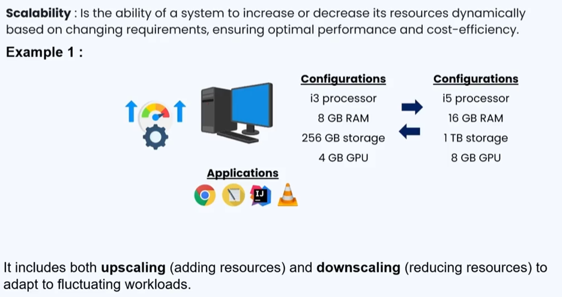
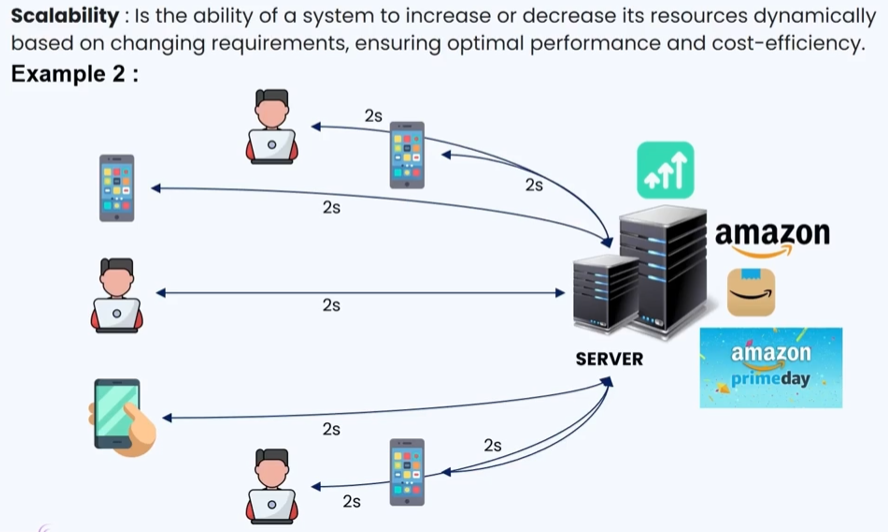
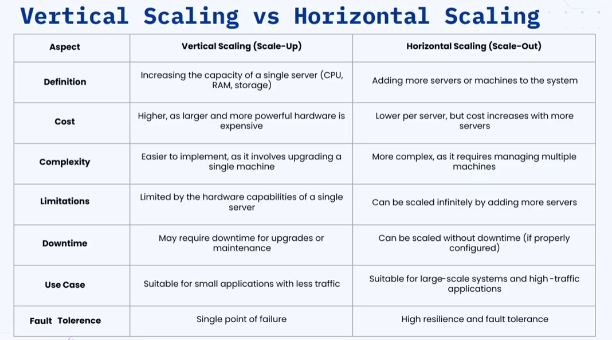

### 🔷🔶🔷 Chapter 7: Scalability

---

### 🔷🔶🔷 What is Scalability?

    🔹 Scalability is defined as the ability of a system to increase or
       decrease its resources dynamically based on changing requirements.

    🔹 This ensures optimal performance and cost efficiency.

    🔹 In the simplest terms:
        🔸 Increasing system resources when demand rises   -> Upscaling
        🔸 Decreasing system resources when demand falls   -> Downscaling

---

### 🔷🔶🔷 Understanding Scalability with Examples

**🟠 Example 1 — Personal Computer**

    🔹 You have a system with the following configuration:
        🔸 Processor: i3
        🔸 RAM: 8 GB
        🔸 Storage: 256 GB
        🔸 GPU: 4 GB

    🔹 You are running basic applications:
        🔸 Google Chrome (browsing)
        🔸 Notepad / WordPad (documentation)
        🔸 Code editors (development)
        🔸 VLC Player (media playback)

    🔹 This configuration is sufficient for these applications.

    🔹 Now your requirements change — you want to run:
        🔸 Adobe Photoshop (photo editing)
        🔸 Adobe After Effects / DaVinci Resolve (video editing)
        🔸 Android Studio (mobile development)

    🔹 These applications are resource-intensive.
       Running them alongside basic apps on the existing config
       will degrade system performance — apps will lag or become slow.

    🔹 Solution — Upscale:
        🔸 Upgrade the processor to a better one
        🔸 Add more RAM
        🔸 Upgrade memory or GPU

    🔹 When you no longer need video editing or mobile development:
        🔸 Downgrade back to the original configuration -> Downscaling

    🔹 This increase or decrease of resources based on requirements
       is exactly what Scalability means.

---

**🟠 Example 2 — Amazon Prime Day Sale (Real-World System Design)**

    🔹 Amazon's application is hosted on a server with a certain configuration.

    🔹 During normal days:
        🔸 Multiple users make requests (place orders, search, make payments)
        🔸 Server processes each request and responds in 2 seconds

    🔹 Amazon announces a Prime Day Sale with heavy discounts:
        🔸 Traffic to the server increases drastically
        🔸 Server has to process far more requests than usual
        🔸 Response time degrades from 2 seconds to 5 seconds

    🔹 Solution — Upscale the server:
        🔸 Upgrade RAM from 8 GB to 16 GB
        🔸 Upgrade processor from i3 to i7
        🔸 Response time returns to the original 2 seconds

    🔹 After the Prime Day Sale — traffic reduces:
        🔸 Downscale back to the original configuration

---

### 🔷🔶🔷 Approaches to Scalability

    🔹 There are two approaches to scalability:
        🔸 Vertical Scaling  (Scaling Up)
        🔸 Horizontal Scaling (Scaling Out)

---

### 🔷🔶🔷 Vertical Scaling (Scaling Up)

    🔹 Vertical scaling involves increasing or decreasing the capacity
       of a single server or machine by adding more resources such as
       CPU, memory, or storage.

    🔹 Also known as Scaling Up.

    🔹 Improves the capability of the application by increasing the
       hardware capacity of the server where it is hosted.

**🟠 How It Works — Example**

    🔹 Multiple users send requests to a single server.
    🔹 Server processes requests and responds in 2 seconds.

    🔹 Traffic increases -> Server is overloaded -> Response time degrades to 5 seconds.

    🔹 Solution:
        🔸 Upgrade the same server (better processor, more RAM)
        🔸 Server can now handle the increased load
        🔸 Response time returns to 2 seconds

    🔹 In vertical scaling, you always upgrade or downgrade the SAME server.

**🟠 Advantages of Vertical Scaling**

    🔹 Easy to implement:
        🔸 Just replace or upgrade the parts that need improvement

    🔹 Easier to manage:
        🔸 Only a single server to update and maintain

    🔹 Data consistency:
        🔸 All data remains on the same server
        🔸 No issues with data synchronization across multiple systems

**🟠 Disadvantages of Vertical Scaling**

    🔹 Single Point of Failure:
        🔸 Since there is only one server, if it fails,
           the entire application becomes unavailable

    🔹 Limited Scalability:
        🔸 There is a hardware limit to how much you can upgrade
        🔸 Example: Cannot add 32 GB RAM to a server that supports only 16 GB
        🔸 Cannot add a multi-core processor to a system that supports only single-core

    🔹 Increased Cost:
        🔸 Higher-end hardware is significantly more expensive
        🔸 Example: An i9 processor can cost 3-4x more than an i3 processor

**🟠 Use Cases for Vertical Scaling**

    🔹 When you need to enhance a single server's performance.
    🔹 When your application requires significant processing power:
        🔸 ML (Machine Learning) and AI applications
        🔸 Resource-intensive applications with lower traffic
    🔹 When your application follows a monolithic architecture
       (all components tightly coupled in one server).

---

### 🔷🔶🔷 Horizontal Scaling (Scaling Out)

    🔹 Horizontal scaling involves adding more machines or nodes to a
       distributed system to handle increased load or demand.

    🔹 Also known as Scaling Out.

    🔹 Improves performance by adding more server instances to the existing
       pool — distributing the load more evenly across all servers.

    🔹 Important: In horizontal scaling, multiple servers host the SAME
       copy of the application.

**🟠 How It Works — Example**

    🔹 Multiple users send requests to a single server.
    🔹 A Load Balancer sits in front and receives all incoming requests.
    🔹 The Load Balancer forwards requests to the server.
    🔹 Server responds in 2 seconds.

    🔹 Traffic increases -> Server is overloaded -> Response time degrades to 5 seconds.

    🔹 Solution:
        🔸 Add more servers, each hosting the same application
        🔸 The Load Balancer distributes incoming traffic across all servers
        🔸 Multiple servers process requests simultaneously
        🔸 Response time returns to 2 seconds

    🔹 When traffic decreases, reduce the number of servers.

**🟠 Advantages of Horizontal Scaling**

    🔹 Increased Redundancy:
        🔸 No single point of failure
        🔸 If one server fails, other servers continue to process user requests

    🔹 Flexibility and Efficiency:
        🔸 Easy to add servers when traffic increases
        🔸 Easy to remove servers when traffic decreases

    🔹 Fault Tolerance:
        🔸 Failure of one server does not cause downtime
        🔸 Multiple servers ensure continuous availability

**🟠 Disadvantages of Horizontal Scaling**

    🔹 Increased Complexity:
        🔸 Requires managing additional network components:
            Load balancers, routers, network adapters
        🔸 More components = more complexity to maintain

    🔹 Data Inconsistency:
        🔸 When scaling database systems, the same data needs to be
           replicated across multiple servers
        🔸 Synchronization of data across servers can be challenging

**🟠 Use Cases for Horizontal Scaling**

    🔹 When you need to manage growing demands and sudden traffic spikes:
        🔸 Example: Amazon during peak day sales
    🔹 When you need high availability and high redundancy
       with minimal risk of a single point of failure.
    🔹 Applications with a microservices architecture
       (distributed system with distinct interconnected services).
    🔹 Large-scale systems with very high traffic:
        🔸 Amazon.com, Google.com, Netflix, Facebook, Instagram

---

### 🔷🔶🔷 Vertical Scaling vs Horizontal Scaling — Comparison

---

### 🔷🔶🔷 Choosing the Right Approach — Factors to Consider

**🔘 1. Application Architecture**

    🔹 Monolithic application (tightly coupled components):
        🔸 Vertical scaling is more suitable

    🔹 Microservices / Distributed application:
        🔸 Horizontal scaling is more suitable

---

**🔘 2. Cost**

    🔹 Vertical scaling:
        🔸 Upgrading hardware can be very costly for high-end resources

    🔹 Horizontal scaling:
        🔸 Usually cheaper in the long run — adding servers with
           the same configuration costs less than premium hardware

---

**🔘 3. Security**

    🔹 If your application requires high security:
        🔸 Vertical scaling gives more control over a single server
        🔸 Maintaining security across multiple servers in horizontal
           scaling is more challenging

---

**🔘 4. Performance**

    🔹 If your application needs low latency and high performance:
        🔸 Horizontal scaling is better — multiple servers share the load
        🔸 Reduces processing time per server

    🔹 Note: For a truly highly scalable system, a combination
       of both vertical and horizontal scaling is recommended.

---

### 🔷🔶🔷 Importance of Scalability

**🔘 1. Managing Growth**

    🔹 As the number of users increases day by day, scalability ensures
       that performance is not degraded.

**🔘 2. Improved Performance**

    🔹 Dividing the load among multiple resources or servers increases
       the overall performance of the system when needed.

**🔘 3. Ensures Availability**

    🔹 A scalable system keeps applications operational even during
       unanticipated traffic spikes or component failures.

**🔘 4. Cost Effectiveness**

    🔹 Scale up when traffic increases — performance is maintained.
    🔹 Scale down when traffic decreases — resources are not wasted.
    🔹 The same freed resources can be used for other applications or projects.
    🔹 Prevents over-provisioning and results in significant cost savings.

---

### 🔷🔶🔷 Best Practices for Scalability

**🔘 1. Automation**

    🔹 Manually adding or removing resources is not practical at scale.

    🔹 Use automation tools for:
        🔸 Provisioning new servers
        🔸 Deploying applications
        🔸 Configuration management

    🔹 Resources should scale up and down automatically based on traffic.

---

**🔘 2. Monitoring and Alerting**

    🔹 Track system performance continuously:
        🔸 CPU usage, RAM consumption, number of active servers
        🔸 Response times and request throughput

    🔹 Set up alerts to be notified of:
        🔸 Potential failures
        🔸 Performance degradation
        🔸 Resource thresholds being crossed

---

**🔘 3. Scalability Testing**

    🔹 Perform regular tests to ensure the architecture is scalable.

    🔹 Identify different use cases and address issues during testing
       before they become problems in production.

---

**🔘 4. Capacity Planning**

    🔹 Monitor and plan:
        🔸 How much CPU the application requires
        🔸 How much RAM is needed under peak traffic
        🔸 How many servers are required at minimum and maximum load

    🔹 Proper planning prevents over-provisioning and under-provisioning,
       ensuring optimal cost benefit.

---

**🔘 5. Disaster Recovery**

    🔹 Ensure recovery and failover measures are in place.

    🔹 The system must remain operational and recover from failures
       whenever required.

---

### 🔷🔶🔷 Scalability Testing Strategies

**🔘 1. Load Testing**

    🔹 Simulate multiple users using the application simultaneously.

    🔹 Observe how the application behaves under the simulated load.

    🔹 Identify performance bottlenecks at expected traffic levels.

---

**🔘 2. Stress Testing**

    🔹 Push the application to its absolute limit:
        🔸 Maximum CPU utilization
        🔸 Maximum storage capacity
        🔸 Maximum RAM usage

    🔹 Add load until the application is on the verge of breaking.

    🔹 Monitor where and why it breaks — helps identify the maximum
       capacity of the system before failure.

---

**🔘 3. Horizontal Scalability Testing**

    🔹 If adopting horizontal scaling, test the Load Balancer:
        🔸 Verify that traffic is distributed equally across all servers
        🔸 Ensure no server is overloaded while others remain idle

---

**🔘 4. Failure Testing (Fail on Purpose)**

    🔹 Deliberately cause component failures and observe system behavior.

    🔹 Test how the application manages user requests during component failures.

    🔹 Verify that fault tolerance and failover mechanisms work correctly.

**🟠 Popular Scalability Testing Tools**

    🔹 JMeter
    🔹 Gatling
    🔹 Locust

---

### 🔷🔶🔷 Real-World Examples of Highly Scalable Systems

**🔘 Amazon**

    🔹 Deployed on a robust cloud infrastructure.
    🔹 Supports millions of sellers and customers worldwide.
    🔹 Ensures seamless operation even during peak traffic hours like Prime Day.

**🔘 Google Search**

    🔹 One of the most scalable systems ever built.
    🔹 Handles billions of search queries every single day.

**🔘 Netflix**

    🔹 A prime example of a highly scalable streaming service.
    🔹 Serves millions of concurrent viewers worldwide with minimal downtime.

**🔘 Facebook and Instagram**

    🔹 Used by billions of users every day.
    🔹 Rarely experience failures — handle massive volumes of requests
       simultaneously across the globe.

---

### 🔷🔶🔷 Summary

    🔹 Scalability:
        🔸 The ability to increase or decrease system resources dynamically
           based on changing requirements.
        🔸 Upscaling  ->  Adding resources when demand increases
        🔸 Downscaling ->  Removing resources when demand decreases

    🔹 Two Approaches:
        🔸 Vertical Scaling   ->  Upgrade a single server (Scale Up)
        🔸 Horizontal Scaling ->  Add more servers (Scale Out)

    🔹 Choosing the Right Approach:
        🔸 Monolithic app, resource-intensive, high security -> Vertical
        🔸 Microservices, high traffic, high availability   -> Horizontal
        🔸 Highly scalable systems use a COMBINATION of both

    🔹 Importance:
        🔸 Manages growth, improves performance, ensures availability,
           and reduces cost through efficient resource usage

    🔹 Best Practices:
        🔸 Automation, Monitoring & Alerting, Scalability Testing,
           Capacity Planning, Disaster Recovery

    🔹 Testing Strategies:
        🔸 Load Testing, Stress Testing, Horizontal Scalability Testing,
           Failure Testing (Fail on Purpose)
        🔸 Tools: JMeter, Gatling, Locust

---