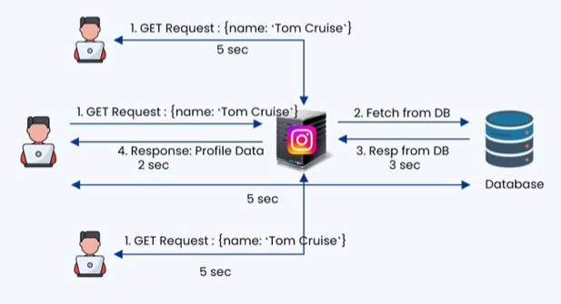
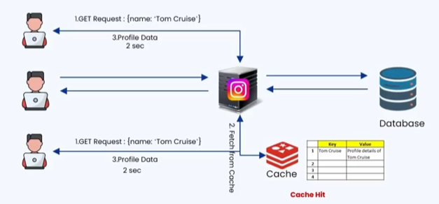
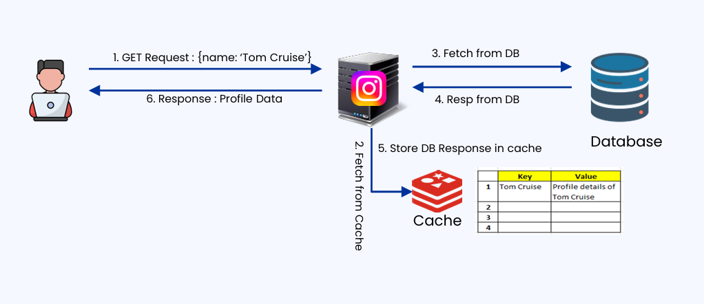
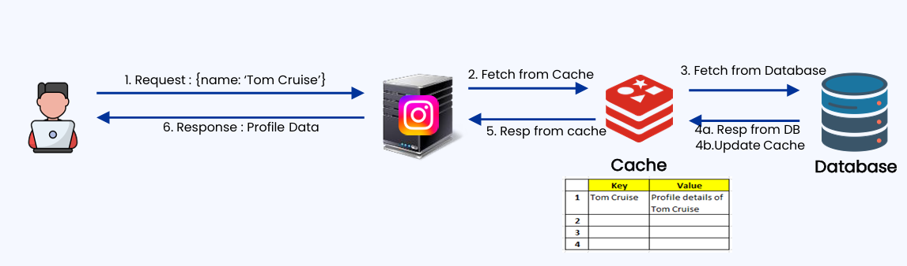
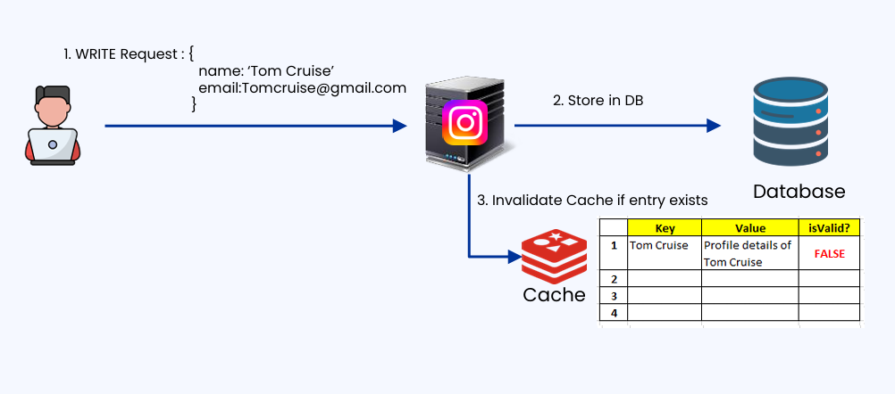
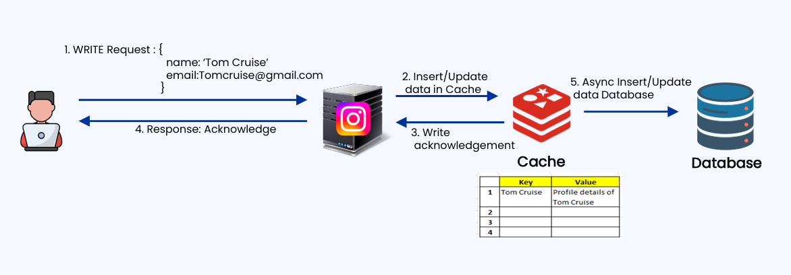
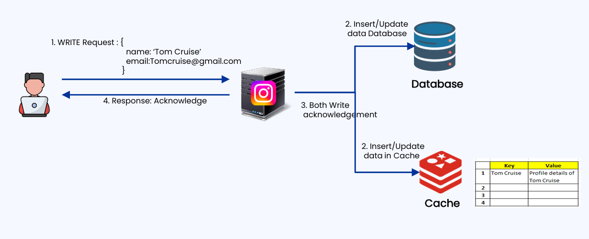

### 🔷🔶🔷 Chapter 8: Caching

---

### 🔷🔶🔷 Introduction — What is Cache and Caching?

    🔹 Cache is a high speed storage that temporarily holds
       frequently accessed or computationally expensive data
       to improve retrieval speed.

    🔹 Caching is the process of putting frequently needed data
       into the cache so that it can be accessed faster later.

    🔹 In short:
        🔸 Cache      -> A high speed, temporary storage.
        🔸 Caching    -> The process of putting frequently
                         accessed data into this high speed
                         temporary storage.

---

### 🔷🔶🔷 Understanding Caching Through an Illustration

**🟠 Scenario Without Cache**

    🔹 Consider an Instagram application hosted on a server and
       connected to a database.

    🔹 A user makes a request to the server for Tom Cruise's profile.

    🔹 Flow:
        🔸 The server processes the request by querying the database.
        🔸 The database responds with Tom Cruise's profile —
           taking around 3 seconds.
        🔸 The server responds to the user with this data —
           taking around 2 seconds.
        🔸 Total time taken = 5 seconds (3 seconds database +
           2 seconds server).

    🔹 If multiple other users request the same data (Tom Cruise's
       profile), each of them will also be processed by the server
       and will get the response in 5 seconds each.

    🔹 Question: If multiple users are requesting the same data,
       can the time taken be reduced?
        🔸 Answer: Yes — through caching.

**🟠 Scenario With Cache**

    🔹 Same setup — an application server hosting Instagram,
       connected to a database, and a user — but this time the
       application server is configured with cache storage.

    🔹 Flow for the first request:
        🔸 The user requests Tom Cruise's profile.
        🔸 The application server first checks the cache memory.
        🔸 Since this is the first request, the data is not
           present in cache — this is called a Cache Miss
           (the requested data is not present in the cache memory).
        🔸 The application server fetches the data from the
           database (around 3 seconds).
        🔸 Before responding to the user, the application server
           first updates the cache memory with the response from
           the database.
        🔸 It then gives the response to the user.

    🔹 Flow for subsequent requests (from other users, same data):
        🔸 The application server checks the cache memory.
        🔸 Since the data is present, this is called a Cache Hit
           (the requested data is present in the cache storage).
        🔸 The application server retrieves the data from cache —
           this takes negligible time.
        🔸 Since the application server doesn't have to
           communicate with the database, the response time is
           reduced by 3 seconds — the user now gets the data
           within 2 seconds.

    🔹 This is how cache memory helps reduce the time taken to
       serve requests.

**🟠 Cache is Not a Replacement for Database**

    🔹 Cache storage is temporary storage.
        🔸 Whenever there is an application restart or
           redeployment, the data present in the cache memory is
           lost.
        🔸 Data stored in the database is permanent — it is not
           lost even after redeploying the application.

    🔹 Cache memory is expensive storage:
        🔸 Cache resides in the RAM storage of an application server.
        🔸 Database is usually stored in secondary storage, which
           is not as expensive.

---

### 🔷🔶🔷 Caching Strategies

    🔹 There are five different caching strategies:

        🔸 1. Cache Aside
        🔸 2. Read Through
        🔸 3. Write Around
        🔸 4. Write Back (Write Behind)
        🔸 5. Write Through

    🔹 The first two — Cache Aside and Read Through — are
       strategies used for reading from the cache.

    🔹 The next three — Write Around, Write Back, and Write
       Through — are strategies used for writing into the cache.

---

**🔘 1. Cache Aside**

    🔹 The client makes a request for data.

    🔹 The application server first checks the cache:
        🔸 If Cache Hit -> retrieve the data from the cache and
           give it as a response to the user.
        🔸 If Cache Miss -> fetch the data from the database,
           then give the response to the user.

**🟠 Illustration**

    🔹 The client makes a request to the server for specific data.

    🔹 The application server checks the cache memory:
        🔸 If present (cache hit) -> retrieve the data from cache
           and respond to the user.
        🔸 If not present (cache miss) -> fetch the data from the
           database, store it into the cache memory first, and
           then respond to the user.

    🔹 This strategy loads data into the cache memory on demand —
       also called Lazy Loading.

**🟠 Cache Invalidation Issue (Disadvantage)**

    🔹 After the initial request, data is stored in cache memory.

    🔹 Subsequent requests from other clients are served directly
       from the cache.

    🔹 If the data is updated in the database in the meantime,
       that update is not automatically reflected in the cache.

    🔹 The data in the cache is now called old data, stale data,
       or invalid data.

    🔹 Since the application server always looks into the cache
       first, it will keep serving this stale/invalid data to
       users — which is incorrect.

    🔹 To resolve this, cache invalidation strategies must be
       adopted so updated data from the database is also updated
       in the cache (covered in the write strategies).

**🟠 Advantages of Cache Aside**

    🔸 Prevents unnecessary data from being loaded into the cache
       — only requested data is loaded on demand.
    🔸 Offers fine-grained control on what is stored in the cache
       and what is not.

**🟠 Disadvantages of Cache Aside**

    🔸 Slight latency for the initial request — the application
       server has to first read from the database, store it in
       cache, and then serve the user. Subsequent requests won't
       have this disadvantage.
    🔸 Cache Inconsistency — related to cache invalidation, where
       stale/old data remains in cache even after the database
       is updated (resolved via the write strategies discussed later).

---

**🔘 2. Read Through**

    🔹 The application server only interacts with the cache —
       not directly with the database — for read operations.

    🔹 If data is not found in the cache, the cache itself fetches
       the data from the database, updates its own cache entries,
       and returns the result.

    🔹 The application server never talks to the database directly,
       even during a cache miss.

**🟠 Illustration**

    🔹 The client makes a request to the application server.

    🔹 The application server talks only to the cache.

    🔹 For the initial request (cache miss):
        🔸 It is the duty of the cache to communicate with the
           database to get the data.
        🔸 The cache stores the response from the database into
           its own memory.
        🔸 It then serves the data to the application server,
           which gives it as a response to the client.

    🔹 For subsequent requests from other users for the same data:
        🔸 Since the data is already loaded in the cache, it is
           fetched from the cache memory and given directly as a
           response by the application server.

    🔹 Key difference from Cache Aside: in Read Through, the
       application server will never communicate with the
       database — the cache has its own mechanism to fetch data
       from the database and update its memory.

**🟠 Advantages of Read Through**

    🔸 Simplifies application logic, since the caching layer
       handles all data loading from the database/secondary storage.
    🔸 Ensures only requested data is loaded into the cache,
       saving space.

**🟠 Disadvantages of Read Through**

    🔸 Initial read operations may be slower due to the cache
       miss and the subsequent database access.
    🔸 Cache inconsistency issues — updated data from the
       database is never automatically reflected in the cache
       (resolved via write strategies).

---

**🔘 3. Write Around**

    🔹 Write requests always go directly to the database, where
       the data is updated or inserted.

    🔹 If the corresponding data is also present in the cache
       memory, it is invalidated — either by setting a valid
       flag to false, or by deleting the record from the cache
       altogether.

    🔹 This ensures consistency between the cache and the
       backing store (database).

**🟠 Illustration**

    🔹 Example: The client makes a write request to update Tom
       Cruise's profile email address.

    🔹 Flow:
        🔸 The application server updates the data in the database.
        🔸 It then checks if the data is also present in the cache.
        🔸 If present, the valid flag in the cache is set to
           false, or the corresponding entry is deleted from the
           cache altogether.

    🔹 On a subsequent read (GET) request:
        🔸 The application server checks the cache memory.
        🔸 If present and valid -> data is fetched from the cache
           and given to the user.
        🔸 If not valid (or not present) -> the entry is deleted
           (if present), the application server fetches the data
           from the database, stores the updated data in the
           cache, and then gives the response to the user.

    🔹 This is how consistency is maintained between both the
       database and the cache storage — cache invalidation is
       handled here.

**🟠 Advantages of Write Around**

    🔸 Minimizes the risk of the cache and database getting out
       of sync.

**🟠 Disadvantages of Write Around**

    🔸 The read request immediately following a write request
       will be slightly slower, since the application server has
       to first check the validity of the cache data, and if
       invalid, fetch from the database, update the cache, and
       then serve the user.

---

**🔘 4. Write Back (Write Behind)**

    🔹 Data is first written to the cache, and then asynchronously
       (whenever possible) written back to the database.

**🟠 Illustration**

    🔹 The user makes a write request.

    🔹 Flow:
        🔸 The application server updates/inserts the data into
           the cache memory.
        🔸 After inserting into cache, the application server
           sends an acknowledgement response back to the user.
        🔸 It is the duty of the cache to write the data into the
           database — this may not happen in real time, and is
           completed asynchronously.

**🟠 Advantages of Write Back**

    🔸 Improves write performance, since operations are done
       quickly in the cache.
    🔸 Reduces load on the database, since the application server
       always refers to the cache memory and not the database directly.
    🔸 Leads to more cache hits, since data is written directly
       into the cache memory by the application server (not into
       the database).

**🟠 Disadvantages of Write Back**

    🔸 Possible data loss if the cache fails to write the data to
       the database.
    🔸 Added complexity in ensuring the cache and database are
       eventually synchronized.

---

**🔘 5. Write Through**

    🔹 Data is written simultaneously to both the cache and the database.

    🔹 This ensures data is consistent between the cache and the database.

**🟠 Illustration**

    🔹 The user makes a write request to the application server.

    🔹 Flow:
        🔸 The application server simultaneously writes the data
           to both the database and the cache memory.
        🔸 After receiving acknowledgement from both the database
           and the cache memory, an acknowledgement is sent back
           to the user.
        🔸 If one of the writes fails (either to the database or
           to the cache), a negative acknowledgement is sent to
           the user.

    🔹 This ensures consistency between the database and the cache.

**🟠 Advantages of Write Through**

    🔸 Guarantees data consistency, as writes to the cache and
       database are synchronous.
    🔸 Easy to implement and understand.

**🟠 Disadvantages of Write Through**

    🔸 Can lead to higher latency for write operations, since
       they must be completed in both the cache and the database.

**🟠 Important Note**

    🔹 There are 2 read strategies and 3 write strategies in total.

    🔹 While designing a system with caching, both read and write
       strategies should be coupled together — using only one
       will not serve the purpose of caching, and may lead to
       data inconsistencies.

---

### 🔷🔶🔷 Cache Eviction Policies

    🔹 Cache eviction policies are critical in caching systems
       due to the limited size of caches.

    🔹 Cache memory is expensive — it resides in the RAM of a
       system, which is much more expensive than secondary storage.

    🔹 Hence, cache memory can store only a limited set of data
       compared to the actual database, which can hold millions
       or billions of records.

    🔹 To have optimal usage of cache memory, we need to decide:
        🔸 What data needs to be stored in the cache memory.
        🔸 When data should be removed from the cache memory.
        🔸 How long data should be retained.

    🔹 Eviction policies help enhance overall cache performance
       by keeping the most relevant data accessible.

    🔹 Example: If a cache can hold only 4 records at any given
       time, and a 5th record needs to be inserted, an eviction
       policy decides which of the existing 4 records should be
       removed to make space.

    🔹 The following eviction policies can be adopted:

        🔸 1. First In, First Out (FIFO)
        🔸 2. Least Recently Used (LRU)
        🔸 3. Most Recently Used (MRU)
        🔸 4. Least Frequently Used (LFU)
        🔸 5. Most Frequently Used (MFU)
        🔸 6. Random Replacement

---

**🔘 1. First In, First Out (FIFO)**

    🔹 Evicts the oldest item in the cache first, regardless of
       usage or frequency.

    🔹 Example:
        🔸 Records are inserted into the cache one after the other.
        🔸 When a 5th record needs to be inserted and the cache
           is full, the first inserted record (e.g. Tom Cruise's
           record) is evicted, and the new record takes its place.

---

**🔘 2. Least Recently Used (LRU)**

    🔹 The least recently used item is evicted from the cache to
       make space for a new item.

    🔹 Example:
        🔸 The most recently read data is kept at the top of the
           cache memory, and the least recently read data is at
           the bottom.
        🔸 A read request comes in for Michael Scott's data ->
           it becomes the most recently used and moves to the top.
        🔸 A read request comes in for Joey's data -> it becomes
           the most recently used and moves to the top.
        🔸 A new write request comes in, but there is no space:
           the data at the bottom of the cache (least recently
           used) is deleted, existing data is shifted to make
           space at the top, and the new data is added there as
           the most recently used.

---

**🔘 3. Most Recently Used (MRU)**

    🔹 The data at the top of the cache memory (most recently
       accessed) is deleted, and new data is added in its place.

    🔹 The principle here: the most recently used items are less
       likely to be re-accessed.

---

**🔘 4. Least Frequently Used (LFU)**

    🔹 Along with the data, the cache also keeps track of the
       number of times each piece of data is accessed.

    🔹 The data accessed the least number of times is deleted to
       make space for new data.

    🔹 Example: If Michael Scott's data was accessed only 2
       times (the fewest), it will be deleted from the cache
       memory to make room for new data.

---

**🔘 5. Most Frequently Used (MFU)**

    🔹 The opposite of Least Frequently Used.

    🔹 The data that is accessed most frequently is deleted from
       the cache memory to make space for new incoming data.

---

**🔘 6. Random Replacement**

    🔹 Some data is deleted randomly, without any particular
       order, to make space for new data.

---

### 🔷🔶🔷 Cache Invalidation

    🔹 Cache invalidation has already been touched upon while
       discussing the write strategies (Write Around, Write
       Back, Write Through).

    🔹 A few additional cache invalidation strategies:

        🔸 1. Time To Live (TTL)
        🔸 2. Polling

---

**🔘 1. Time To Live (TTL)**

    🔹 Along with the data, we also mention how long the data
       should stay in the cache and how long it is valid for.

    🔹 Example:
        🔸 Tom Cruise's record is available in cache for only
           600 milliseconds, after which it is marked as invalid
           or deleted from the cache memory altogether.
        🔸 Chandler Bing's record is available for only 900
           milliseconds, after which it is deleted or marked as
           invalid.

    🔹 This is how data present in the cache memory can be
       invalidated for better performance.

    🔹 Note: data can also be invalidated using the Write Around,
       Write Through, and Write Back strategies of caching
       discussed earlier.

---

**🔘 2. Polling**

    🔹 The cache itself checks the primary source of data (e.g.
       a database) against its own data, to see if both are matching.

    🔹 Flow:
        🔸 If the data matches -> the cache does not update anything.
        🔸 If there is a difference -> the cache invalidates its
           own data, updates its own data, or removes that data
           altogether from its memory.

---

### 🔷🔶🔷 Benefits of Using a Cache

    🔹 1. Reduced Latency
        🔸 Since cache is present in the in-memory storage of an
           application server, it is very high speed storage.
        🔸 Accessing data from cache takes minimal time.
        🔸 There are no external network calls to the primary
           data storage, reducing overall processing time of
           the user request.

    🔹 2. Decreased Network Traffic
        🔸 Since data is fetched from the cache memory and not
           from the primary data storage, the application server
           does not need to make an external network call to the
           database — reducing network traffic.

    🔹 3. Lower Load on Primary Data Source
        🔸 Since the application server fetches recently accessed
           data from the cache memory instead of the database,
           the load on the database is drastically reduced.

    🔹 4. Improved Performance
        🔸 Cache helps reduce the overall time taken to process
           requests.
        🔸 The application server is capable of handling more
           requests and processing them more efficiently,
           improving overall system performance.

    🔹 5. Data Availability
        🔸 Sometimes the database might be unavailable for some time.
        🔸 During such time, the cache acts as a temporary data
           storage, ensuring there is no hindrance in data access.

---

### 🔷🔶🔷 Summary — Caching at a Glance

    🔸 Cache               ->  A high speed, temporary storage
                              that holds frequently accessed or
                              computationally expensive data.

    🔸 Caching             ->  The process of putting frequently
                              needed data into the cache for
                              faster future access. Not a
                              replacement for the database — it
                              is temporary and expensive (RAM-based).

    🔸 Read Strategies     ->  Cache Aside (lazy loading, app
                              server checks cache then DB) and
                              Read Through (app server only talks
                              to cache; cache itself fetches from DB).

    🔸 Write Strategies    ->  Write Around (write to DB, invalidate
                              cache), Write Back (write to cache
                              first, async write to DB), Write
                              Through (write to cache and DB
                              simultaneously).

    🔸 Eviction Policies   ->  FIFO, LRU, MRU, LFU, MFU, and
                              Random Replacement — decide what
                              data to remove from a limited cache
                              to make space for new data.

    🔸 Cache Invalidation  ->  Time To Live (TTL) and Polling,
                              along with invalidation built into
                              the write strategies — ensure stale
                              data doesn't linger in the cache.

    🔸 Benefits            ->  Reduced latency, decreased network
                              traffic, lower load on the primary
                              data source, improved performance,
                              and better data availability.

    🔹 Caching, when combined with proper read/write strategies,
       eviction policies, and invalidation mechanisms, greatly
       improves the speed and efficiency of a system.

---