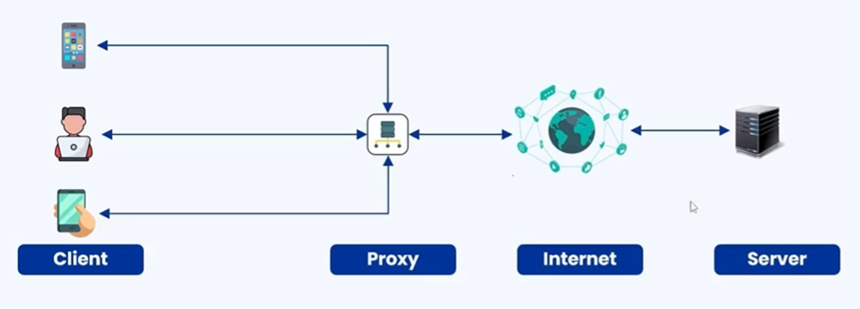
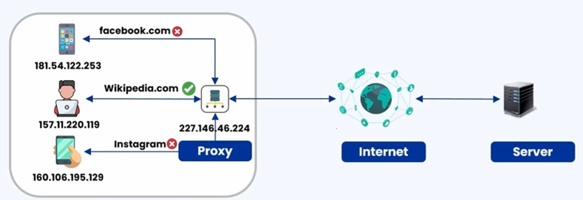
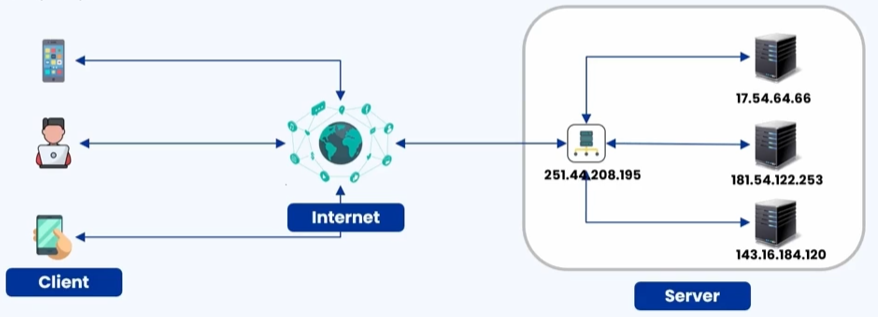

### 🔷🔶🔷 Chapter 9: Proxy

---

### 🔷🔶🔷 What is a Proxy? — An Informal Understanding

    🔹 A proxy is like a middleman that does something for you.

    🔹 Instead of doing something yourself, you ask the proxy
       to do it on your behalf.

**🟠 Example — The Science Teacher, Alex, and the Library**

    🔹 A science teacher wants to borrow a book from the library,
       but she has too many other things to attend to.

    🔹 She asks Alex, one of her students, to borrow the book
       from the library for her reference.

    🔹 Alex goes to the library, provides his own credentials,
       and borrows the book.

    🔹 The library issues the book to Alex, thinking it is for him.

    🔹 Alex then gives the book to the science teacher —
       her work gets done without her visiting the library herself.

    🔹 Mapping this to roles:
        🔸 Science Teacher -> The Client
        🔸 Alex             -> The Middleman / The Proxy
        🔸 Library          -> The Server

    🔹 Alex is also very helpful in nature — he doesn't just help
       the science teacher, but helps any other teacher borrow
       books from the library as well.

---

### 🔷🔶🔷 What is a Proxy? — Technical Definition

    🔹 A proxy is an intermediary system or service that acts
       as a gateway between a client and a server.

    🔹 It facilitates requests and responses between these two
       entities by:
        🔸 Forwarding requests
        🔸 Modifying requests
        🔸 Providing additional functionalities

**🟠 Illustration**

    🔹 Normally, a client communicates directly with the server
       through the internet.

    🔹 When a proxy is introduced:
        🔸 The client communicates with the proxy.
        🔸 The proxy communicates with the server through the internet.

---

### 🔷🔶🔷 Two Ways to Implement a Proxy

    🔹 A proxy can be implemented in two different ways:

        🔸 1. Forward Proxy
        🔸 2. Reverse Proxy

    🔹 Each has its own position in the network, along with
       its own advantages and disadvantages.

---

### 🔷🔶🔷 1. Forward Proxy

    🔹 A forward proxy is also called a Web Proxy.

    🔹 It is a server that sits in front of a group of client machines.

    🔹 When a client makes a request to a server, the proxy
       intercepts the request and communicates with the web
       server on behalf of the client — like a middleman.

**🟠 Illustration**

    🔹 Entities involved: Clients, Proxy, Internet, Server.

    🔹 The proxy sits in the client's space, in front of the client.

    🔹 Flow:
        🔸 The client makes a request.
        🔸 The proxy intercepts the request.
        🔸 The proxy establishes communication with the server
           through the internet.
        🔸 The proxy sends the client's request to the server.
        🔸 The proxy receives the response from the server.
        🔸 The proxy forwards the response back to the
           respective client that made the request.

---

**🔘 Advantages of Forward Proxy**

    🔹 1. Regulate Internet Access
        🔸 Common in corporate organizations or educational institutions
           connected via WiFi.
        🔸 Attempts to access social media apps like Facebook or
           Instagram may be blocked, while educational sites like
           Wikipedia.com remain accessible.
        🔸 This happens because a forward proxy is acting at that time.
        🔸 Rules can be set in the forward proxy to define which
           websites the client can or cannot visit.

    🔹 2. Provides Anonymity
        🔸 Each client has its own IP address, and the server
           also has its own IP address.
        🔸 Only the IP address of the proxy is exposed to the
           internet and the web server — not the IP address of
           the individual client.
        🔸 This is how a proxy server provides anonymity to its
           clients, by not exposing the client's IP address.

    🔹 3. Allow Access to Geo-Restricted Content
        🔸 On platforms like Netflix or Amazon Prime Video, some
           movies may not be accessible from a particular
           geographical location.
        🔸 A forward proxy situated in a different country can
           be used to access such content.

    🔹 4. Logging
        🔸 The forward proxy logs help keep track of which
           client made what request.
        🔸 Useful for debugging whenever there is a security
           threat or a security breach, to trace where the
           issue actually originated from.

---

**🔘 Disadvantage of Forward Proxy**

    🔹 Latency
        🔸 The time taken to send a request and get a response
           back from the server increases.
        🔸 This is because there is one additional hop the
           client has to pass through — client to proxy, then
           proxy to web server via the internet.
        🔸 This additional hop leads to increased latency.

---

### 🔷🔶🔷 2. Reverse Proxy

    🔹 A reverse proxy is a server that sits in front of one
       or more web servers, intercepting requests from clients.

    🔹 When a client sends a request to the origin server of a
       website, those requests are intercepted by the reverse
       proxy server.

**🟠 Illustration**

    🔹 Entities involved: Client, Internet, Proxy, Server.

    🔹 Unlike the forward proxy (which sits in front of the client),
       the reverse proxy sits in the server's space, in front
       of the server.

    🔹 Flow:
        🔸 The client sends a request to the server via the internet.
        🔸 The reverse proxy intercepts that request.
        🔸 The reverse proxy sends it to the appropriate backend server.

---

**🔘 Advantages of Reverse Proxy**

    🔹 1. Mitigating DDoS Attacks
        🔸 DDoS = Distributed Denial of Service.
        🔸 The reverse proxy mitigates DDoS attacks by implementing
           features like a rate limiter.
        🔸 It can also be configured with a list of blocked IPs,
           preventing those requests from reaching the servers.

    🔹 2. Response Caching
        🔸 Every response from the server has to pass through the proxy.
        🔸 The proxy caches the server's response for a certain time.
        🔸 When a request for the same data is received again, the
           proxy serves it directly from the cache instead of
           contacting the server.
        🔸 This reduces the overall time taken for the response.

    🔹 3. Load Balancing
        🔸 The proxy also works as a load balancer by distributing
           traffic across multiple servers whenever traffic is high.

    🔹 4. Backend Anonymity
        🔸 The reverse proxy hides the IP address of the backend server.
        🔸 It only exposes its own IP address.
        🔸 The client only gets to know the IP address of the proxy,
           not that of the actual backend web servers.

    🔹 5. SSL Termination
        🔸 The proxy is responsible for decrypting the client's request.
        🔸 It is also responsible for encrypting the server's
           response before sending it back to the client.
        🔸 This removes the overhead of encoding/decoding from
           the server, letting servers focus on their actual task —
           this logic is handled by the proxy instead.

    🔹 6. Logging
        🔸 Keeps track of all requests and responses between
           various clients and servers.
        🔸 Whenever there is a security breach, the reverse
           proxy logs can be reviewed to find the root cause.

---

**🔘 Disadvantage of Reverse Proxy**

    🔹 Single Point of Failure
        🔸 The reverse proxy acts as a single point of contact.
        🔸 If the proxy server fails for any reason, the client
           cannot communicate with any of the web servers.
        🔸 To increase availability, multiple reverse proxies
           would be needed — but this increases the complexity
           of implementation.

---

### 🔷🔶🔷 Reverse Proxy vs Load Balancer

    🔹 One of the most popular interview questions:
       "What is the difference between a reverse proxy and a
       load balancer?"

    🔹 Since a reverse proxy also distributes traffic among
       multiple servers, the two are compared across a few
       key aspects:

**🔘 1. Purpose**

    🔸 Reverse Proxy -> Acts as a gateway to the backend server.
    🔸 Load Balancer -> Its major purpose is to distribute
                        traffic between multiple servers.

**🔘 2. Focus**

    🔸 Reverse Proxy -> Focused on adding security — helps with
                        SSL termination, caching, and routing.
    🔸 Load Balancer -> Focused on high performance — employs
                        different algorithms so application
                        performance is not degraded, and ensures
                        availability and scaling.

**🔘 3. Usage**

    🔸 Reverse Proxy -> Used as a single point of entry for the
                        backend; can be used even with just a
                        single server.
    🔸 Load Balancer -> Majorly used for spreading load, for
                        redundancy and availability — used only
                        when there are multiple servers.

---

### 🔷🔶🔷 Summary — Proxy at a Glance

    🔸 Proxy              ->  An intermediary system/service acting
                              as a gateway between a client and a
                              server, forwarding/modifying requests
                              and responses.

    🔸 Forward Proxy       ->  Sits in front of the client(s).
                              Regulates internet access, provides
                              client anonymity, allows access to
                              geo-restricted content, and enables
                              logging. Main disadvantage: latency.

    🔸 Reverse Proxy       ->  Sits in front of the server(s).
                              Mitigates DDoS attacks, provides
                              response caching, load balancing,
                              backend anonymity, SSL termination,
                              and logging. Main disadvantage:
                              single point of failure.

    🔸 Reverse Proxy vs    ->  Differ in purpose (gateway vs traffic
       Load Balancer          distribution), focus (security vs
                              performance), and usage (single point
                              of entry vs multiple-server redundancy).

    🔹 A proxy — whether forward or reverse — acts as a helpful
       middleman, making communication between clients and
       servers more secure, efficient, and manageable.

---