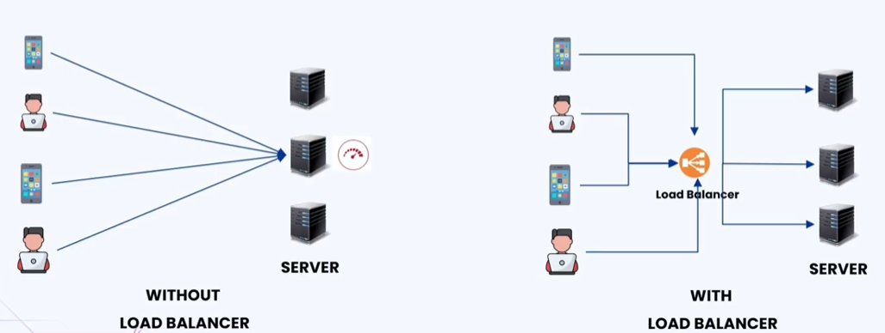
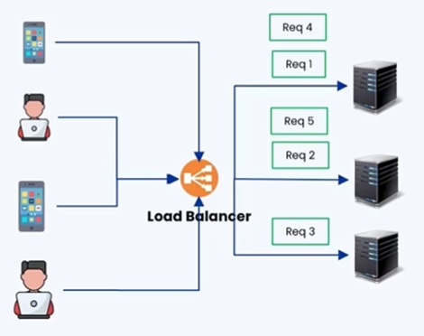
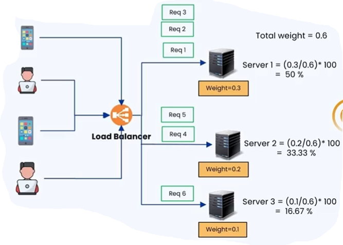
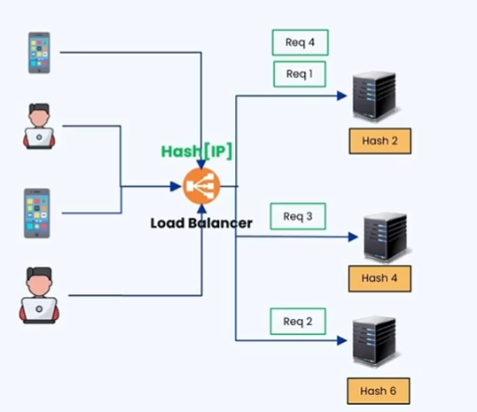
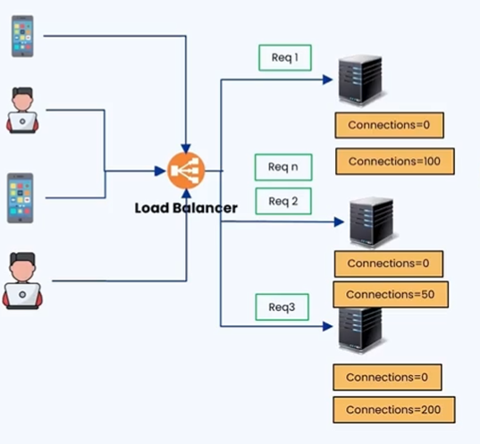
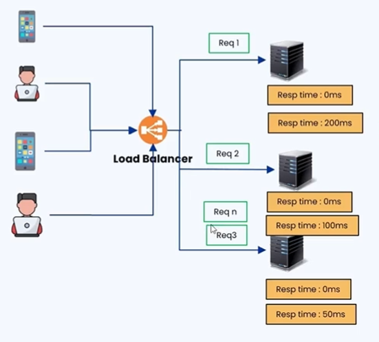
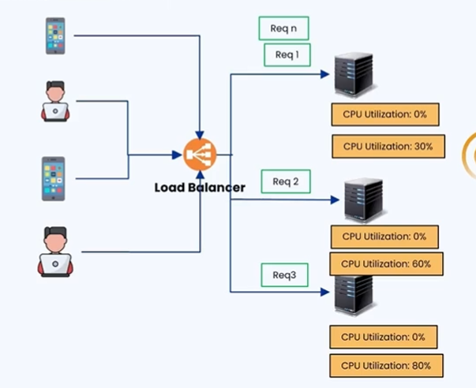
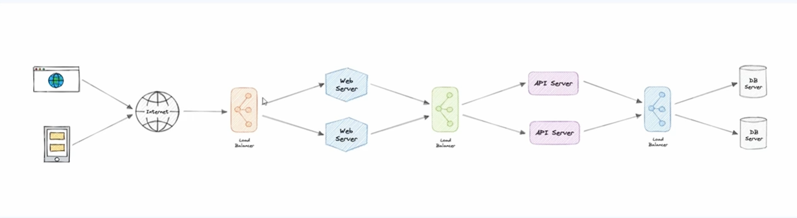

### 🔷🔶🔷 Chapter 10: Load Balancer

---

### 🔷🔶🔷 The Problem — A Scenario Without Load Balancer

    🔹 Assume there are multiple servers, and each of these servers
       is running the same copy of the application.

    🔹 There are also multiple clients or users.

    🔹 Since there is no load balancer, all the clients are making
       multiple requests directly to the same single application server.

    🔹 This creates three major problems:

**🔘 Problem 1 — Availability**

    🔸 Since all client requests are handled by a single server,
       this creates a single point of failure.
    🔸 If the server breaks down for any reason, clients will not
       be able to make any request and get a response.
    🔸 This affects the availability and reliability of the server.

**🔘 Problem 2 — Performance**

    🔸 Since all client requests are handled by a single server,
       there is an overloaded burden on the server even when the
       traffic is small.
    🔸 This leads to an increase in the processing time of each
       request by the server.
    🔸 Hence, the overall performance of the application server
       is affected.

**🔘 Problem 3 — Underutilization of Resources**

    🔸 In this scenario, there are three servers running the same
       copy of the application, but the client request is processed
       by only a single server at any given point of time.
    🔸 The other two servers remain idle, leading to underutilization
       of resources.

    🔹 A load balancer resolves all three of these issues —
       availability, performance, and underutilization of resources.

---

### 🔷🔶🔷 What is a Load Balancer?

    🔹 A load balancer is a networking device or a software
       application that distributes incoming traffic among
       multiple servers.

    🔹 It does this to provide:
        🔸 High availability
        🔸 Efficient utilization of servers
        🔸 High performance

    🔹 The main purpose of a load balancer is to ensure that no
       single server is overburdened with too many requests.

**🟠 Illustration**

    🔹 Again, there are multiple servers running the same copy of
       the application, and multiple clients — but this time a
       load balancer sits in between.

    🔹 All requests from the client first reach the load balancer.

    🔹 The load balancer receives requests from multiple clients
       and distributes them to multiple other servers, based on
       some algorithm (discussed later).

---

### 🔷🔶🔷 How Load Balancer Resolves the Three Issues

    🔹 Availability
        🔸 All application servers receive requests from the client
           through the load balancer simultaneously.
        🔸 If any server fails for some reason, there are other
           healthy and active servers available.
        🔸 The load balancer diverts all incoming traffic to the
           active and healthy servers, ensuring high availability.

    🔹 Performance
        🔸 No single server is burdened with all incoming requests.
        🔸 Traffic is equally distributed across all running servers.
        🔸 Hence, performance is better for the user.

    🔹 Underutilization of Resources
        🔸 All servers run in parallel and process incoming
           requests simultaneously.
        🔸 Hence, there is no underutilization of resources.

---

### 🔷🔶🔷 Types of Load Balancers

    🔹 There are several types of load balancers:

        🔸 1. Hardware Load Balancers
        🔸 2. Software Load Balancers
        🔸 3. L4 Load Balancers (Transport Layer Load Balancers)
        🔸 4. L7 Load Balancers (Application Layer Load Balancers)
        🔸 5. Global Server Load Balancers (GSLB)

---

**🔘 1. Hardware Load Balancers**

    🔹 Specifically designed hardware components that act as load
       balancers in on-premise servers.

    🔹 On-premise servers are in-house hardware servers.

    🔹 Hardware load balancers distribute the traffic among
       multiple hardware servers.

    🔹 Used in large scale enterprises.

    🔹 Advantages:
        🔸 High performance
        🔸 Highly reliable

    🔹 Disadvantages:
        🔸 Being a physical, dedicated hardware component, it
           tends to be more expensive.
        🔸 The number of ports is limited — there is a limit on
           the number of servers that can be added, making it
           difficult to scale up.
        🔸 Since it is dedicated hardware, it requires periodic
           maintenance.

---

**🔘 2. Software Load Balancers**

    🔹 A software solution for load balancing, deployed on a
       general purpose server.

    🔹 It can run on any server that supports the software.

    🔹 The principle remains the same — it distributes incoming
       traffic to multiple other application servers.

    🔹 Advantages:
        🔸 Highly flexible — just install the software on any
           server and configure the application servers where
           traffic should be routed.
        🔸 Easier to scale.
        🔸 Since it just needs to be deployed as a software
           application on a general purpose server, maintenance
           cost is less, making it cost effective.

    🔹 Disadvantage:
        🔸 Potentially lower performance compared to hardware
           load balancers, since it runs as software on a
           general purpose server rather than a dedicated
           physical component.

    🔹 Examples: NGINX, Traefik.

---

**🔘 3. L4 Load Balancer (Transport Layer Load Balancer)**

    🔹 Gets its name from operating at Layer 4 of the OSI model,
       which at the receiver's end is the Transport Layer.

    🔹 Since it operates at the transport layer, only the IP
       address and port number of the incoming request are
       visible to the load balancer.

    🔹 Routing is based on the IP address and port number of
       the incoming request.

    🔹 Data sent along with the request — such as data in headers
       or cookies — is not visible at the transport layer.

    🔹 Hence, complex routing mechanisms cannot be implemented
       in L4 load balancers.

    🔹 Advantage:
        🔸 Very high performance with lower latency, since routing
           is based only on IP address and port number.

    🔹 Disadvantage:
        🔸 Since the request data is not visible at this layer,
           complex logic for routing requests based on that data
           is not available.

---

**🔘 4. L7 Load Balancer (Application Layer Load Balancer)**

    🔹 Operates at Layer 7, the Application Layer of the OSI
       model at the receiver's end.

    🔹 Since it operates at the application layer, the data in
       cookies or headers of the request is visible to the
       load balancer.

    🔹 Using that data, complex routing and filtering options
       can be implemented.

    🔹 Supports features like:
        🔸 Content based routing
        🔸 Caching
        🔸 Compression
        🔸 Application specific optimization

    🔹 Disadvantage:
        🔸 Latency is more compared to the L4 / transport layer
           load balancer.

---

**🔘 5. Global Server Load Balancer (GSLB)**

    🔹 Can be a hardware or a software load balancer.

    🔹 Aims to distribute traffic to servers present in different
       geographical locations.

    🔹 Advantages:
        🔸 Routes incoming requests to the closest or the most
           responsive servers.
        🔸 Provides disaster recovery.

    🔹 Example scenario:
        🔸 Assume multiple servers are located in different
           geographical areas.
        🔸 If the server present in North America fails due to
           a natural calamity like an earthquake or tornado,
           the GSLB can route all incoming requests to servers
           present in South America or Africa.

---

### 🔷🔶🔷 Load Balancing Algorithms

    🔹 There are six major algorithms used in load balancers:

        🔸 1. Round Robin
        🔸 2. Weighted Round Robin
        🔸 3. Source IP Hash
        🔸 4. Least Connection Method
        🔸 5. Least Response Time Method
        🔸 6. Resource Based Algorithm

    🔹 The first three algorithms are categorized under
       Static Load Balancing Algorithms:
        🔸 The load distribution logic does not change based on
           server conditions.

    🔹 The next three algorithms are categorized under
       Dynamic Load Balancing Algorithms:
        🔸 The load distribution logic changes according to the
           condition of the servers.

---

**🔘 1. Round Robin Algorithm** (Static)

    🔹 The simplest of all the algorithms.

    🔹 Requests are distributed across servers in a sequential,
       rotational, or cyclic manner.

**🟠 Illustration**

    🔹 There are servers, users, and a load balancer implementing
       the round robin algorithm.

    🔹 Flow:
        🔸 The first request is sent to the first server.
        🔸 The second request is sent to the second server.
        🔸 The third request is sent to the third server.
        🔸 The fourth request is sent back to the first server,
           since the algorithm distributes load in a cyclic manner.
        🔸 The fifth request goes to server two, and so on.

    🔹 Used in scenarios where:
        🔸 Servers are of similar configuration (same processor,
           same RAM, etc.).
        🔸 Workloads are evenly distributed, such as certain websites.

    🔹 Advantages:
        🔸 Simplicity — easy to implement and understand.
        🔸 Fairness — each server gets an equal share of the load.

    🔹 Disadvantage:
        🔸 Does not work well in scenarios where servers have
           different capacities or configurations, since the
           same load is given to low-configuration servers as
           well as high-configuration ones.

---

**🔘 2. Weighted Round Robin Algorithm** (Static)

    🔹 Each server is provided with a weighted score based on
       its configuration.

    🔹 Requests are distributed based on this weighted score, in
       a cyclic manner similar to round robin — but each server
       receives a number of requests proportional to its weight.

**🟠 Illustration**

    🔹 There are servers, clients, and a load balancer between them.

    🔹 Weighted score assigned based on configuration:
        🔸 Server 1 (higher configuration) -> weight 0.3
        🔸 Server 2 -> weight 0.2
        🔸 Server 3 (lower configuration) -> weight 0.1

    🔹 Total weight = sum of all weighted scores = 0.6

    🔹 Capacity of each server = (its weighted score / total weight) × 100
        🔸 Server 1: 0.3 / 0.6 × 100 = 50%
        🔸 Server 2: 0.2 / 0.6 × 100 = 33.33%
        🔸 Server 3: 0.1 / 0.6 × 100 = 16.67%

    🔹 Example — for 6 incoming requests:
        🔸 Server 1 gets 50% -> 3 requests
        🔸 Server 2 gets 33% -> 2 requests
        🔸 Server 3 gets 16% -> 1 request

    🔹 Used when:
        🔸 Servers have different capacities or performance levels.
        🔸 Maximizing resource utilization across all servers is needed.

    🔹 Advantages:
        🔸 Considers server capacity — accounts for different
           capacities by assigning weights and distributing load
           accordingly.
        🔸 Ensures flexibility to handle varying workloads effectively.

    🔹 Disadvantages:
        🔸 More complex than round robin algorithm.
        🔸 Requires periodic maintenance to adjust weights as
           server capacity changes.

---

**🔘 3. Source IP Hash Algorithm** (Static)

    🔹 Incoming requests are distributed among servers based on
       the hash value of the source IP address.

**🟠 Illustration**

    🔹 There are servers, clients, and a load balancer implementing
       the source IP hash algorithm.

    🔹 Each server is assigned a hash value:
        🔸 Server 1 -> hash value 2
        🔸 Server 2 -> hash value 4
        🔸 Server 3 -> hash value 6

    🔹 Flow:
        🔸 Request 1 -> hash function applied on its IP -> hash
           value 2 -> sent to Server 1.
        🔸 Request 2 -> hash value 6 -> sent to Server 3.
        🔸 Request 3 -> hash value 4 -> sent to Server 2.
        🔸 Request 4 -> hash value 2 -> sent to Server 1 again.

    🔹 This ensures requests from the same source IP address are
       consistently directed to the same server.

    🔹 Use cases:
        🔸 Applications needing session consistency, where the
           same user must connect to the same server throughout
           a session.
        🔸 Real world example: banking applications, where a
           user must always connect to the same server to
           complete a transaction.
        🔸 Users from a specific region connecting to a dedicated
           server for better performance or compliance related
           concerns.

    🔹 Advantages:
        🔸 Consistency — same source IP always goes to the same
           server, maintaining session state.
        🔸 Predictability — useful when connection persistence
           is critical for the application.

    🔹 Disadvantage:
        🔸 Might cause uneven load distribution if certain source
           IPs are more active — e.g. thousands of requests from
           one IP could overload a single server, even though
           other servers are available to process the same requests.

---

**🔘 4. Least Connection Method Algorithm** (Dynamic)

    🔹 The load balancer assigns the new request to the server
       with the fewest active connections.

    🔹 The idea is to distribute incoming workload in a way that
       minimizes the current load on each server, aiming for a
       balanced distribution of connections across all resources.

**🟠 Illustration**

    🔹 There are servers, a client, and a load balancer implementing
       the least connection method.

    🔹 Initially, when servers just start up, the number of
       connections on each server is zero.

    🔹 Multiple requests are made; the load balancer initially
       distributes requests randomly to different servers.

    🔹 After some time:
        🔸 Server 1 is processing 100 connections.
        🔸 Server 2 is processing 50 connections.
        🔸 Server 3 is processing 200 connections.

    🔹 When the Nth request comes in, the load balancer checks
       which server has the least active connections — Server 2,
       with only 50 — and sends the request there.

    🔹 Ideal use case:
        🔸 Applications where some requests take longer to
           process than others.
        🔸 When some connections stay active longer, ensuring new
           requests go to the server with fewer active connections.

    🔹 Advantages:
        🔸 Balanced load distribution — distributes traffic to
           the server with fewest active connections, preventing
           overload.
        🔸 Dynamic — adapts to changing server workloads.

    🔹 Disadvantage:
        🔸 Does not consider the individual capacity of the
           servers — e.g. the server with the least connections
           might also have the lowest configuration, but it
           still gets the new request.

---

**🔘 5. Least Response Time Method Algorithm** (Dynamic)

    🔹 Directs new incoming requests to the server with the
       quickest response time.

    🔹 The load balancer considers the historical performance of
       each server to decide where to route incoming requests.

**🟠 Illustration**

    🔹 There are servers, clients, and a load balancer implementing
       the least response time method.

    🔹 Initially, when servers start up, response time is 0
       milliseconds since the application has just started.

    🔹 Requests are initially distributed randomly to available servers.

    🔹 After processing N number of requests, the load balancer
       calculates the average response time of each server:
        🔸 Server 1 -> 200 ms
        🔸 Server 2 -> 100 ms
        🔸 Server 3 -> 50 ms

    🔹 When the Nth request comes in, it is sent to Server 3,
       since it has the least response time (50 ms).

    🔹 Response time is periodically recalculated so traffic is
       distributed accordingly.

    🔹 Ideal use case:
        🔸 Applications with heavy and fluctuating user traffic,
           where response time matters — typically e-commerce
           sites and streaming websites, for good user experience.

    🔹 Advantages:
        🔸 Optimized performance — directs traffic to the server
           with quickest response time, optimizing overall
           system performance.
        🔸 Dynamic — adapts to changing server responsiveness
           over time.

    🔹 Disadvantages:
        🔸 Since it uses historic performance data, it might not
           reflect current server capabilities (e.g. a server
           that was slow in the past might now be quicker) —
           such biases can occur.
        🔸 Difficult to implement — there is overhead on the
           load balancer to track requests and response times,
           and continuously update the average response time of
           each server.

---

**🔘 6. Resource Based Algorithm** (Dynamic)

    🔹 Distributes incoming requests based on the current
       resource availability of each server.

    🔹 The load balancer considers CPU usage, memory, and other
       utilizations of the server.

    🔹 It evaluates the resource health of each server to decide
       where new requests should go.

**🟠 Illustration**

    🔹 There are servers, clients/users, and a load balancer
       implementing the resource based algorithm.

    🔹 Initially, when the server is just up and running, CPU
       utilization is 0%.

    🔹 Requests are initially distributed randomly to available servers.

    🔹 After processing N number of requests, the load balancer
       periodically checks CPU utilization:
        🔸 Server 1 -> 30% CPU utilization
        🔸 Server 2 -> 60% CPU utilization
        🔸 Server 3 -> 80% CPU utilization

    🔹 When the Nth request arrives, it is sent to Server 1,
       since it has the least CPU utilization.

    🔹 Use case:
        🔸 Typically implemented in applications that perform
           CPU intensive or memory heavy tasks.

    🔹 Advantages:
        🔸 Resource optimization — balances workload based on
           real time resource data, improving system efficiency.
        🔸 Dynamically adapts to the current state of each
           server's resources.

    🔹 Disadvantage:
        🔸 Complex implementation — the load balancer has to
           continuously monitor server resources, which adds
           complexity and overhead.

---

### 🔷🔶🔷 Benefits of Using a Load Balancer

    🔹 1. Improved Performance
        🔸 Without a load balancer, a single overburdened server
           responds slowly, degrading performance.
        🔸 With a load balancer, traffic is distributed across
           multiple servers, avoiding performance degradation
           and providing a better user experience.

    🔹 2. Increased Scalability
        🔸 A server can easily be added whenever traffic is high,
           and removed if traffic is low, without much effort.
        🔸 This makes system designs with load balancers very scalable.

    🔹 3. Efficiently Manages Failure
        🔸 Ensures there is no single point of failure.
        🔸 Makes sure incoming requests are always sent to
           healthy and active servers, ensuring high availability.

    🔹 4. Optimal Resource Utilization
        🔸 Ensures all resources are optimally utilized by
           distributing incoming traffic across multiple servers.

---

### 🔷🔶🔷 Where Can Load Balancers Be Placed?

    🔹 Rule of thumb: Load balancers can be placed wherever there
       are redundant components.

    🔹 Examples:
        🔸 Multiple web servers -> place a load balancer in front
           of them.
        🔸 Multiple API servers -> place a load balancer in front
           of them.
        🔸 Multiple DB (database) servers -> place a load
           balancer in front of them as well.

    🔹 In short: wherever there are multiple servers of the same
       type (redundant components), a load balancer can be
       placed in front of them.

---

### 🔷🔶🔷 Summary — Load Balancer at a Glance

    🔸 Without Load       ->  Causes issues of availability,
       Balancer               performance, and underutilization
                              of resources due to a single
                              server handling all requests.

    🔸 Load Balancer      ->  A networking device or software
                              application that distributes
                              incoming traffic among servers for
                              high availability, efficient
                              utilization, and high performance.

    🔸 Types              ->  Hardware, Software, L4 (Transport
                              Layer), L7 (Application Layer),
                              and Global Server Load Balancer (GSLB).

    🔸 Static Algorithms  ->  Round Robin, Weighted Round Robin,
                              Source IP Hash — distribution logic
                              does not change with server conditions.

    🔸 Dynamic Algorithms ->  Least Connection Method, Least
                              Response Time Method, Resource
                              Based Algorithm — distribution
                              logic changes according to server
                              conditions.

    🔸 Benefits           ->  Improved performance, increased
                              scalability, efficient failure
                              management, and optimal resource
                              utilization.

    🔸 Placement          ->  Wherever there are redundant
                              components — web servers, API
                              servers, or DB servers.

    🔹 A load balancer ensures that traffic is distributed
       intelligently across multiple servers, making systems
       more available, performant, and scalable.

---