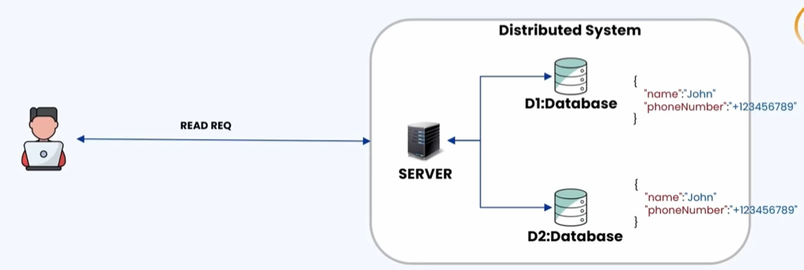
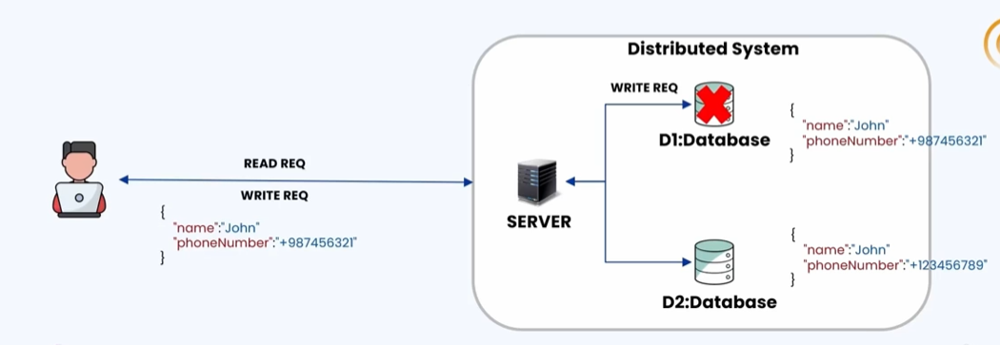
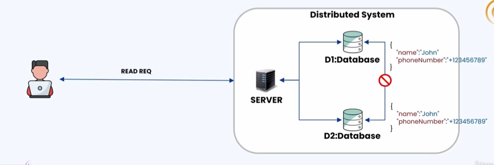
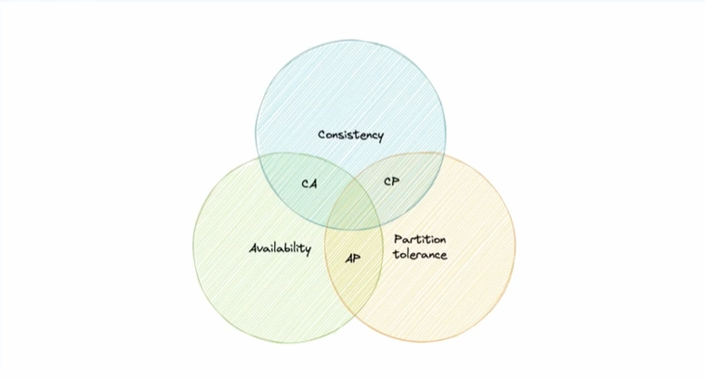
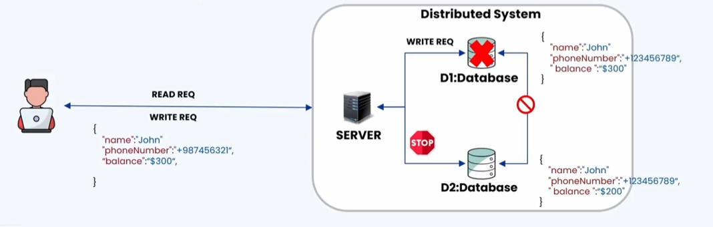
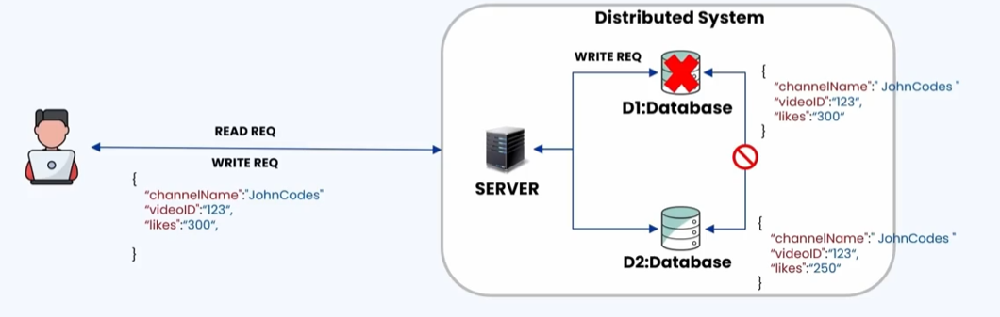
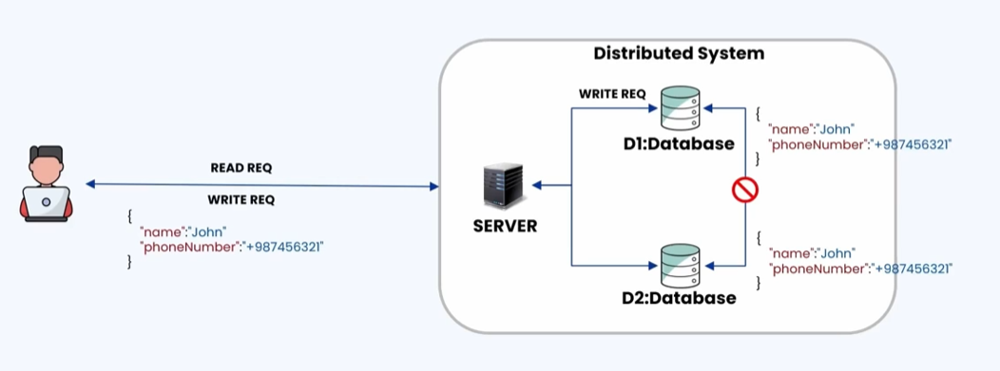

### 🔷🔶🔷 Chapter 1: CAP Theorem

---

### 🔷🔶🔷 Introduction

    🔹 This chapter marks the start of the second section of the
       course — the Practitioner's Section.

    🔹 In this section, the focus is on designing a database.

    🔹 The first chapter of this section is the CAP Theorem.

    🔹 Before understanding CAP Theorem, it is crucial to
       understand four important concepts:

        🔸 1. Distributed Systems
        🔸 2. Consistency
        🔸 3. Availability
        🔸 4. Partition Tolerance

    🔹 Consistency, Availability, and Partition Tolerance are the
       pillars of CAP Theorem — CAP stands for Consistency,
       Availability, and Partition Tolerance.

---

### 🔷🔶🔷 1. Distributed System

    🔹 A distributed system is like a team of computers working together.

    🔹 Instead of one computer processing the user request, the
       request is divided into multiple subtasks, and each task
       is handled by a different computer in the distributed system.

    🔹 This helps in sharing the workload of the user request.

    🔹 Each computer in the distributed system performs a specialized task.

    🔹 A computer in a distributed system is called a Node.

    🔹 Nodes can be of any type:
        🔸 A server node
        🔸 A database node
        🔸 A routing node
        🔸 Or any other processing component

    🔹 These nodes need not be at the same location — they can be
       at different geographical areas.

    🔹 In summary: a distributed system is a collection of
       independent nodes that appear to the user as a single
       coherent system.

**🟠 Real-Life Analogy**

    🔹 Assume an event is being organized in a school or college.

    🔹 One team distributes invitations, another handles
       decoration, another takes care of food, and so on.

    🔹 Each team works independently on individual tasks, but
       together they collectively make the event successful.

    🔹 Similarly, there are multiple nodes specialized in their
       own tasks in a distributed system, but from the user's
       perspective, the complete setup looks like a single
       coherent system.

    🔹 Nodes in a distributed system are interlinked with each
       other over a network so communication can take place.

    🔹 These systems collaborate and communicate over a network
       to achieve a common goal.

**🟠 Illustration**

    🔹 Consider a distributed system with three nodes: one server
       node, and two database nodes (D1 and D2).

    🔹 Roles:
        🔸 Server -> Responsible for receiving the user request
           and giving out the response.
        🔸 D1 and D2 -> Used for storing the data.

    🔹 All three nodes are connected with each other over a network.

    🔹 To the user, this looks like a single interface.

    🔹 Flow:
        🔸 The server receives the request from the user.
        🔸 To process the request, the server makes use of the
           data present in either D1 or D2.
        🔸 It fetches the data, processes the request, and gives
           the response back to the user.

---

### 🔷🔶🔷 2. Consistency

    🔹 Consistency means that all client requests see the same
       data at the same time, no matter which node the request
       is connected to.

    🔹 Consistency can also be defined as: every read request
       receives the most recent write, or an error.

**🟠 Illustration**

    🔹 Same distributed system: server, D1 database, D2 database
       — both databases have the same data.

    🔹 Read scenario:
        🔸 Whenever the user makes a request, the server can
           fetch data from either D1 or D2.
        🔸 Since both are consistent with the same data, fetching
           from either gives the same consistent result.

    🔹 Write scenario:
        🔸 The user makes a write request to update data.
        🔸 The server sends the write request to D1 — the data in
           D1 is updated.
        🔸 Before D1 and D2 synchronize, another user sends a
           read request.
        🔸 The server has two options:
            - Fetch the latest data from D1 and give it as a
              response, OR
            - Throw an error.
        🔸 It cannot fetch the data from D2, since that data is
           not synchronized and is old/stale data.
        🔸 In a highly consistent system, only the latest data
           should be given to the user, or an error — old/stale
           data should never be given.
        🔸 Once synchronization happens, D2 is also updated with
           the latest data.
        🔸 After that, any new read request can be served from
           either D1 or D2, since both now have the latest data.

    🔹 To achieve consistency: whenever data is written to one
       node, it must always be instantly forwarded or replicated
       across all nodes in the system, to ensure consistency is
       always maintained.

---

### 🔷🔶🔷 3. Availability

    🔹 Availability states that for every request — whether a
       read or a write request — a response is received, even
       if some nodes are down.

    🔹 Availability does not guarantee that the response contains
       the most recent data, but it always guarantees that a
       response is given to the user — never an error response.

**🟠 Illustration**

    🔹 Same distributed system, both databases containing the
       same data.

    🔹 Flow:
        🔸 The user makes a write request; the server sends it to D1.
        🔸 The data in D1 is updated.
        🔸 Before D1 can synchronize the new data with D2, D1
           becomes unavailable or unresponsive (goes down).
        🔸 D2 still has the old data.
        🔸 In parallel, if the user makes a read request, the
           server uses D2 and sends the old data to the user.

    🔹 If importance is given to availability, this behavior is
       accepted — the system must never give an error response,
       even if the data returned is old.

**🟠 Consistency vs Availability**

    🔹 Consistency -> Will give an error if it cannot fetch the
       latest data, but will never give old data.

    🔹 Availability -> Might give old or stale data, but will
       never give an error — because availability means the
       server is always responsive.

---

### 🔷🔶🔷 4. Partition Tolerance

    🔹 Partition tolerance is defined as the system's ability to
       continue functioning even when there is a network partition.

    🔹 A Network Partition is when the connection between two
       nodes in the distributed system breaks down or stops functioning.

**🟠 Illustration**

    🔹 Same distributed system as before.

    🔹 Assume a network partition occurs — some nodes in the
       distributed system cannot communicate with others due to
       network failure.

    🔹 In this case, assume there is a network failure between D1
       and D2, and they are unable to communicate with each
       other — but the distributed system as a whole is still responsive.

    🔹 Flow:
        🔸 If the user makes a read request, the server can still
           talk to D1 or D2 to process it.
        🔸 A write request can be updated to either D1 or D2, but
           there won't be any synchronization while the partition lasts.
        🔸 When the network recovers from the partition, the
           databases communicate with each other and ensure data
           is updated in both — this is called Eventual Consistency.

    🔹 Even when there is a break or a partition in the system,
       if the distributed system is still responding, we say the
       distributed system is Partition Tolerant.

---

### 🔷🔶🔷 What is CAP Theorem?

    🔹 CAP Theorem states that in a distributed system, out of
       the three capabilities — Consistency, Availability, and
       Partition Tolerance — only two can be achieved,
       especially during a network partition.

    🔹 All three (consistency, availability, and partition
       tolerance) will be present in the system all the time, but
       during a network partition, only two of the three
       capabilities can be ensured.

**🟠 Visualizing CAP Theorem**

    🔹 Consistency, Availability, and Partition Tolerance overlap
       with each other.

    🔹 CAP Theorem states that only two of the three can be
       achieved during a network partition:

        🔸 Consistency + Availability (CA)
        🔸 Consistency + Partition Tolerance (CP)
        🔸 Availability + Partition Tolerance (AP)

    🔹 But never all three — Consistency, Availability, and
       Partition Tolerance — simultaneously during a network
       failure or network partition.

    🔹 In the real world, partition tolerance should always be
       considered, because there is a high chance of network breakdown.

    🔹 In the real world, if there is a network failure, it is
       almost impossible to achieve both consistency and
       availability at the same time.

    🔹 So the preferred priorities should be either:
        🔸 Availability and Partition Tolerance (AP), OR
        🔸 Consistency and Partition Tolerance (CP)

    🔹 Not Consistency and Availability (CA) — more focus should
       be given to CP or AP systems.

---

### 🔷🔶🔷 CP Systems (Consistency + Partition Tolerance)

    🔹 CP systems guarantee consistency and can handle network
       partitions, but may sacrifice availability during
       partition events.

    🔹 In CP systems, consistency is chosen over availability —
       used for applications where having the latest data plays
       an important role.

    🔹 A typical example of a CP system: Banking applications.

**🟠 Illustration**

    🔹 Distributed system with a server, D1 database, and D2
       database — both containing similar data (e.g. John's
       phone number and bank balance).

    🔹 Read request (no partition):
        🔸 The server can fetch data from either D1 or D2, since
           both contain the same, consistent data.

    🔹 With a network partition:
        🔸 There is no communication between D1 and D2.
        🔸 The user deposits $100 into the account (total should
           be $300) — a write request is sent to the server.
        🔸 The server sends the write request to D1 — D1 is
           updated from $200 to $300.
        🔸 This is not reflected in D2, since synchronization is
           broken due to the partition.

    🔹 Subsequent read request (e.g. checking balance or
       withdrawing money):
        🔸 The server cannot use D2, since it has stale/old data.
        🔸 The server should always use D1, which has the most
           recent write/most updated data.
        🔸 Using D2's data would give the user improper or
           inconsistent data, which is not useful.

    🔹 To ensure consistency: the server stops sending requests
       to D2 during the network partition, and only fetches data
       from D1 (which has the latest data) — but availability is affected.

    🔹 If D1 (containing the latest data) becomes unresponsive:
        🔸 Even though D2 is available, the server should NOT use
           D2, since it contains stale data.
        🔸 Instead, the server should give an error response.
        🔸 It is critical to give an error response instead of a
           stale/old response from D2, because in banking
           transactions, having the latest data is more important
           than having some data.
        🔸 Hence, it's okay for the server to give an error
           response instead of an old response.

    🔹 This is how consistency is preferred over availability in
       CP systems.

---

### 🔷🔶🔷 AP Systems (Availability + Partition Tolerance)

    🔹 AP systems ensure availability and function during
       network partitions, but might return outdated or
       inconsistent data.

    🔹 Availability is chosen over consistency — used for
       applications where having the latest data does not play
       an important role.

**🟠 Illustration**

    🔹 Same distributed system, same data present in both
       databases — this time, data about a YouTube channel
       (channel name, video ID, and number of likes).

    🔹 Read request (no partition):
        🔸 The server can choose between D1 or D2, since data is
           the same in both.

    🔹 With a network partition:
        🔸 There is no communication or synchronization between
           D1 and D2.
        🔸 A video is liked by multiple people — a new write
           request comes in to increase the number of likes from
           250 to 300.
        🔸 The server sends this request to D1 — D1 is updated.
        🔸 The same update is not replicated in D2, due to the
           network partition.

    🔹 Assume D1 (containing the latest data) becomes unavailable:
        🔸 A new read request for the same video comes in.
        🔸 The server uses D2's data instead of giving an error response.
        🔸 When a user wants to watch a video, the number of
           likes doesn't matter — if the server gives an error,
           the user won't be able to watch the video at all.
        🔸 Giving old/stale data (fewer likes shown) is okay,
           because the user can still watch the video — the user
           may not care about the exact like count.
        🔸 It is not preferred to make the video unavailable just
           because the like count isn't updated.

    🔹 In such cases, availability is chosen over consistency.

---

### 🔷🔶🔷 CA Systems (Consistency + Availability)

    🔹 CA stands for Consistency + Availability systems.

    🔹 CA systems ensure consistent data and remain available —
       as long as there are no network partitions.

    🔹 But in the real world, there are high chances of network
       partitions — hence CA systems cannot be achieved in the real world.

**🟠 Why CA Systems Cannot Be Achieved — Illustration**

    🔹 Same example: a server and two database nodes (D1, D2),
       each having the same data.

    🔹 Without a network partition:
        🔸 The server sends a read/write request to D1; the data
           in D1 is updated.
        🔸 D1 synchronizes with D2, and D2 is also updated.

    🔹 Now assume a network partition occurs before D1 and D2 can
       synchronize a new write:
        🔸 The new write request will NOT be reflected in D2
           because of the network partition.
        🔸 The data in D1 and D2 will now be different — meaning
           there is inconsistency.

    🔹 With this inconsistency, based on the use case, a choice
       must be made between consistency or availability:
        🔸 Choosing consistency -> stop sending requests to D2
           during the network partition.
        🔸 Choosing availability -> use either D1 or D2 to
           process requests, but there will be stale/old data responses.

    🔹 Conclusion: In the real world, there is no CA system
       during a network partition — a choice must always be made
       between consistency or availability.

---

### 🔷🔶🔷 Why All Three (C, A, P) Cannot Be Guaranteed Simultaneously

    🔹 CAP Theorem states that in a distributed system, only two
       of the three desired characteristics — consistency,
       availability, and partition tolerance — can be delivered,
       especially during a network partition.

**🟠 Recap Illustration**

    🔹 Distributed system with a server and two database nodes
       (D1, D2), both containing the same data.

    🔹 A read request (no partition) can use either D1 or D2.

    🔹 Assume a network partition occurs, and there is no
       synchronization between D1 and D2.

    🔹 A write request can be sent to either D1 or D2, but not both.
        🔸 Assume the server sends the (write) request to D1 —
           the data in D1 is updated to the latest data (e.g. a
           change in phone number).
        🔸 This update is not present in D2 due to the network
           partition — D2 still has the old data.

    🔹 When a new read request comes in, the server must be
       configured to prioritize either consistency or availability:

        🔸 Choosing Consistency:
            - All requests to D2 should be stopped, since its
              data is old.
            - All read requests should go only to D1, where the
              updated data is available — this ensures consistency.
            - But if D1 fails or becomes unavailable, the server
              should return an error, since D2's stale data
              cannot be used (consistency is prioritized).

        🔸 Choosing Availability:
            - Precise consistency must be sacrificed.
            - If a new read request comes in and D1 is
              unavailable, the server can send the request to D2
              and fetch the old data.
            - This is preferred when the goal is a highly
              available system, not a strictly consistent one.

    🔹 These problems arise only during a network partition, not
       all the time — this is why all three capabilities
       (consistency, availability, and partition tolerance)
       cannot be guaranteed simultaneously during a network partition.

---

### 🔷🔶🔷 Summary — CAP Theorem at a Glance

    🔸 Distributed System  ->  A collection of independent nodes,
                              interlinked over a network, that
                              appear to the user as a single
                              coherent system.

    🔸 Consistency         ->  Every read request receives the
                              most recent write, or an error —
                              never stale data.

    🔸 Availability        ->  Every request receives a response,
                              even if some nodes are down —
                              possibly with old data, but never
                              an error.

    🔸 Partition Tolerance ->  The system's ability to continue
                              functioning even when there is a
                              network partition (broken
                              connection between nodes).

    🔸 CAP Theorem         ->  Out of consistency, availability,
                              and partition tolerance, only two
                              can be achieved simultaneously,
                              especially during a network partition.

    🔸 CP Systems          ->  Prioritize Consistency + Partition
                              Tolerance; may sacrifice
                              availability (e.g. banking applications).

    🔸 AP Systems          ->  Prioritize Availability + Partition
                              Tolerance; may return outdated data
                              (e.g. YouTube likes count).

    🔸 CA Systems          ->  Prioritize Consistency +
                              Availability; not achievable in the
                              real world since network partitions
                              are always a possibility.

    🔹 Choosing between consistency and availability ultimately
       depends on the specific use case, while partition
       tolerance must always be accounted for in real-world
       distributed systems.

---