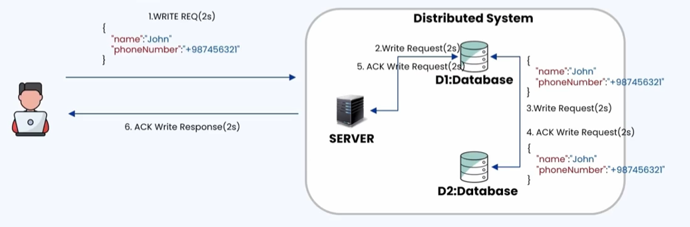
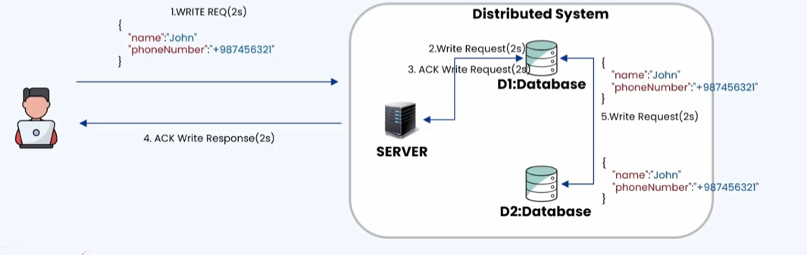
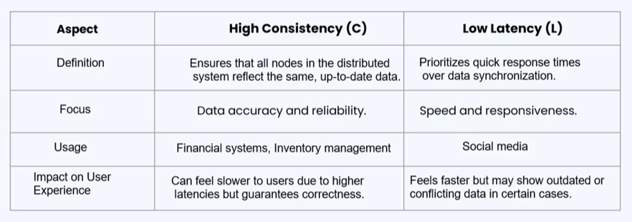

### 🔷🔶🔷 Chapter 2: PACELC Theorem

---

### 🔷🔶🔷 Introduction

    🔹 In the previous chapter, CAP Theorem was covered.

    🔹 In this chapter, we look into the PACELC Theorem.

    🔹 CAP stands for Consistency, Availability, and Partition Tolerance.

    🔹 PACELC stands for Partition tolerance, Availability,
       Consistency, Else, Latency, and Consistency.

    🔹 PACELC Theorem states:
        🔸 Whenever there is a Partition, you have to choose
           between Availability and Consistency.
        🔸 Else, when there is no partition of the network, you
           have to choose between Latency and Consistency.

    🔹 There is always a trade-off.

---

### 🔷🔶🔷 PACELC as an Extension of CAP Theorem

    🔹 PACELC Theorem is an extension of CAP Theorem.

    🔹 CAP Theorem states that in case of network partitioning,
       one has to choose between availability and consistency.

    🔹 But what if there is no network partition? PACELC answers
       this — in the absence of a network partition, one has to
       choose between latency and consistency.

    🔹 So there is always a trade-off, one way or another.

**🟠 Flow Diagram Concept**

    🔹 If there is a network partition -> Yes:
        🔸 Decide between Availability or Consistency.
        🔸 This part was already covered under CAP Theorem in
           the previous chapter.

    🔹 If there is no network partition (everything working as
       expected):
        🔸 Decide between achieving Consistency or reducing Latency.

---

### 🔷🔶🔷 What is Latency?

    🔹 Latency is the time taken for the server to process a
       request and give a response back to the user.

    🔹 As much as possible, latency should be kept low.

    🔹 Question: If we maintain low latency, will it ensure
       consistency?
        🔸 Let's examine what happens when opting for High
           Consistency vs Low Latency (High Consistency and
           High Latency go together, as we will see below).

---

### 🔷🔶🔷 High Consistency (and its Trade-off with Latency)

    🔹 If a system is designed with high consistency, it means
       more latency is being added.

    🔹 The time taken for a request to complete and for the
       server to respond is going to be more, because the system
       has to ensure all nodes have the same data in the
       distributed network.

    🔹 High consistency ensures Strong Consistency.

    🔹 Strong Consistency means that all replicas or nodes in the
       distributed system are updated instantly and have the
       same view of the data.

    🔹 Whenever a read request is received by any of the
       databases, the database will give the same data.

**🟠 Illustration**

    🔹 A distributed system with three nodes: the server node,
       D1 database, and D2 database — both D1 and D2 have the same data.

    🔹 The user makes a write request with new/updated data (in
       this case, a phone number).

    🔹 Flow and time taken (example numbers, for understanding):
        🔸 User's request reaches the server -> 2 seconds
        🔸 Server sends the write request to D1 database -> 2 seconds
        🔸 D1 database is updated with the new data.
        🔸 D1 database immediately synchronizes with D2 database
           -> 2 seconds
        🔸 D2 database updates its own data and sends an
           acknowledgement back to D1 -> 2 seconds
        🔸 D1 database acknowledges the server about the
           successful write -> 2 seconds
        🔸 Server responds to the user with a "write successful"
           acknowledgement -> 2 seconds

    🔹 Total time taken in this example = 12 seconds (2+2+2+2+2+2).

    🔹 Note: This is just an illustrative example — in real time
       it won't take 12 seconds. The entire transaction would
       typically be around 2 to 3 seconds, or 5 to 6 seconds for
       huge data. If it's taking more than that, something needs
       to change. For this example, assume the entire transaction
       takes around 12 seconds.

    🔹 This ensures Strong Consistency — whenever there is an
       update or addition of data, that data is reflected in all
       the databases.

    🔹 Any new request (to D1 or D2) will get the same response,
       since both databases immediately get updated and have the
       same state/view of data.

**🟠 What Happens if Synchronization Fails?**

    🔹 If synchronization between D1 database and D2 database
       fails for some reason:
        🔸 D1 database sends an error response to the server.
        🔸 The server sends an error response back to the user.
        🔸 The updated data in D1 database is also reverted,
           since it failed to synchronize with D2 database.
        🔸 The entire response to the user is an error response.
        🔸 The user/client can then retry writing the data again.

    🔹 Key point: Whenever there is an update or addition of
       data, the distributed system makes sure all databases are
       updated with the same data. If one node fails, the entire
       transaction is considered a failure. This ensures high consistency.

**🟠 Major Drawback of High Consistency**

    🔹 Latency is more, because there are a number of hops involved:
        🔸 User -> Server
        🔸 Server -> D1 database
        🔸 D1 database -> D2 database (synchronization + acknowledgement)
        🔸 Acknowledgement passed back to the user

    🔹 Since there are many hops, the time taken (latency) is high.

---

### 🔷🔶🔷 Low Latency (and its Trade-off with Consistency)

    🔹 If low latency is chosen over consistency, faster
       responses are prioritized over consistency.

    🔹 The user gets the response sooner, but consistency has to
       be compromised to a smaller extent.

    🔹 This type of system ensures Eventual Consistency.

    🔹 Eventual Consistency means that the data might not be
       consistent immediately, but eventually becomes consistent.

    🔹 Reads in the system are still possible, but they may not
       give the correct/latest response due to inconsistencies
       that exist temporarily.

**🟠 Illustration**

    🔹 Same distributed system: server, D1 database, D2 database
       — both starting with the same data.

    🔹 The user makes a write request.

    🔹 Flow and time taken (example numbers):
        🔸 Request reaches the server -> 2 seconds
        🔸 Server sends the write request to D1 database -> 2 seconds
        🔸 D1 database is updated with the new data, and
           immediately gives the response back to the server
           (without waiting for D2 to sync).
        🔸 Server gives the acknowledgement back to the user -> 2
           seconds (acknowledgement from D1 to server) + 2
           seconds (server to user)

    🔹 Total time taken in this example = 8 seconds — compared to
       around 12 seconds in the high consistency example. The
       user gets the response faster.

    🔹 Eventually (after responding to the user), D1 database
       synchronizes with D2 database, and D2's data is updated too.

**🟠 Drawbacks of Low Latency / Eventual Consistency**

    🔹 There is a time delay between the synchronization of D1
       database and D2 database.

    🔹 If a new read request comes in during this delay:
        🔸 If sent to D1 database -> the user gets the new/latest data.
        🔸 If sent to D2 database -> there's a chance the user
           gets the old data.

    🔹 Another drawback: if the synchronization between D1
       database and D2 database fails for some reason:
        🔸 The server will not get to know about it.
        🔸 The user won't be able to track whether the write was
           successfully propagated to all the nodes.

---

### 🔷🔶🔷 High Consistency vs Low Latency — Key Differences

---

### 🔷🔶🔷 Summary — PACELC Theorem at a Glance

    🔸 CAP Theorem        ->  Tells us about the trade-offs when
                             there IS a network partition —
                             choose between Availability and
                             Consistency.

    🔸 PACELC Theorem     ->  Extends CAP Theorem to also tell us
                             about the trade-offs when there is
                             NO network partition — choose
                             between Latency and Consistency.

    🔸 High Consistency   ->  All nodes reflect the same,
       System                up-to-date data (strong
                             consistency); ensures data accuracy
                             but comes with higher latency —
                             used in financial/stock market/
                             insurance/inventory systems.

    🔸 Low Latency        ->  Prioritizes fast responses
       System                (eventual consistency); data
                             becomes consistent eventually, but
                             reads may briefly return outdated
                             data — used in social media/gaming applications.

    🔹 PACELC Theorem, along with CAP Theorem, highlights that
       distributed systems always require trade-offs — whether
       during a network partition (Availability vs Consistency)
       or during normal operation (Latency vs Consistency) —
       based on the specific use case.

---