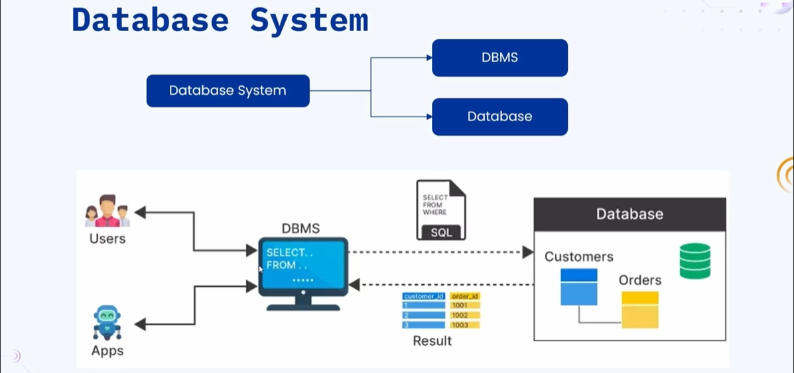
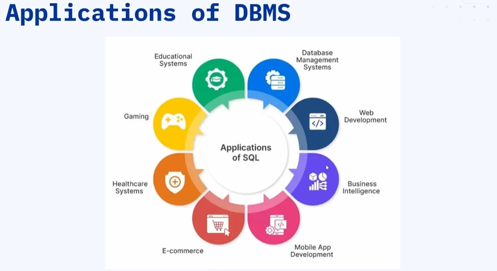

### 🔷🔶🔷 Chapter 3: Database and DBMS

---

### 🔷🔶🔷 What is Data?

    🔹 Data is defined as raw and unorganized facts or figures.

    🔹 Data can be:
        🔸 Numbers
        🔸 Words
        🔸 Pictures
        🔸 Videos
        🔸 Sounds

    🔹 By itself, data has no context or meaning.

**🟠 Understanding with an Example**

    🔹 List of names: John, Aisha, Rahul, Emily
        🔸 Are these names of people? Animals? Places?
        🔸 We cannot tell — it is just raw data.

    🔹 List of ages: 12, 13, 11, 12
        🔸 Whose ages are these? We cannot relate it to anything.

    🔹 List of marks: 85, 90, 78, 92
        🔸 In which subject? For which student?
        🔸 No meaning without context.

    🔹 This is why data is called raw, unorganized facts and figures —
       it does not make sense on its own.

---

### 🔷🔶🔷 What is Information?

    🔹 Information is processed and structured data that has
       meaning and context.

    🔹 When data is analyzed, organized, and presented in a
       meaningful way — data becomes useful information.

**🟠 Example — Data Becoming Information**

    🔹 Raw data: John | 12 | 85 | Mathematics
    🔹 Information: "A student named John, aged 12, scored 85 in Mathematics."

    🔹 Raw data: Aisha | 13 | 90 | English
    🔹 Information: "A student named Aisha, aged 13, scored 90 in English."

    🔹 The same data — organized and given context — becomes
       understandable and useful for everyone.

**🟠 Real-World Example — Amazon**

    🔹 Amazon has massive amounts of data:
        🔸 Product data
        🔸 User data
        🔸 Order history
        🔸 Payment history

    🔹 If this data were displayed in a raw, unorganized way —
       it would be impossible to shop efficiently.

    🔹 Amazon organizes and presents this data in a user-friendly manner —
       turning raw data into useful information that helps users shop.

    🔹 Conclusion: Having data alone is not enough —
       you must organize and give it meaning.

---

### 🔷🔶🔷 Data vs Information — Quick Comparison

    🔸 Data        ->  Raw, unorganized facts and figures
    🔸 Information ->  Processed, structured data with meaning and context
    🔸 Example     ->  "85" is data | "John scored 85 in Maths" is information

---

### 🔷🔶🔷 What is a Database?

    🔹 A Database is a tool that organizes and stores data in a
       structured way.

    🔹 It provides:
        🔸 Efficient storage of data
        🔸 Easy retrieval of data
        🔸 Simple management of data

    🔹 Think of a database as a digital filing cabinet —
       where data is stored in a structured, organized manner.

**🟠 Analogy — Mobile Phone Gallery**

    🔹 When you take a photo on your phone, it is stored in the Gallery.

    🔹 Whenever you want to access those photos, you open the Gallery app.

    🔹 In the same way:
        🔸 A Database stores all types of data in a structured way
        🔸 Whenever you need the data, you retrieve it from the database

**🟠 How Data is Stored in a Database**

    🔹 In SQL (Relational) databases, data is stored in the form of Tables:
        🔸 Columns  ->  Represent what the data is about (field names)
        🔸 Rows     ->  Contain the actual data values

    🔹 Example Table — Student Records:

        | ID  | Name  | Age | Subject     | Marks |
        |-----|-------|-----|-------------|-------|
        | 1   | John  | 12  | Mathematics | 85    |
        | 2   | Aisha | 13  | English     | 90    |
        | 3   | Rahul | 11  | Science     | 78    |

**🟠 Real-World Examples of Database Usage**

    🔹 Online Shopping (Amazon):
        🔸 Stores product details, prices, customer data,
           payment history, order records

    🔹 Social Media (Instagram, Facebook, Twitter):
        🔸 Stores posts, comments, user profiles, likes, followers

    🔹 Healthcare Systems:
        🔸 Stores patient records, doctor details, treatment history

    🔹 Educational Institutions:
        🔸 Stores student records, teacher data, exam results

    🔹 Gaming Industry:
        🔸 Stores player records, scores, achievements

    🔹 In today's world, every application — directly or indirectly —
       uses a database to store and manage data.

---

### 🔷🔶🔷 What is a DBMS?

    🔹 DBMS stands for Database Management System.

    🔹 It is a software that helps you store, organize, and manage
       data in a database.

    🔹 DBMS serves as an interface between the database and its users.

    🔹 Important:
        🔸 DBMS is NOT the database itself
        🔸 DBMS is a tool/software used to interact with the database

    🔹 With simple queries (SQL), you can fetch exactly the data
       you need — without manual effort.

**🟠 Popular DBMS Software**

    🔹 Relational (SQL) DBMS:
        🔸 MySQL
        🔸 PostgreSQL
        🔸 Microsoft SQL Server
        🔸 Oracle Database
        🔸 SQLite

    🔹 Non-Relational (NoSQL) DBMS:
        🔸 MongoDB
        🔸 Cassandra
        🔸 Redis
        🔸 DynamoDB

---

### 🔷🔶🔷 Why Was DBMS Introduced? — The Problem Without DBMS

**🟠 The Problem — Storing Data Without DBMS**

    🔹 Imagine storing 500+ contacts (name, email, phone, address)
       in a Notepad file.

    🔹 A friend asks for your contacts — you make a copy and share it.
    🔹 Another friend asks — you make another copy and share.

    🔹 This leads to three major problems:

        🔘 Problem 1 — Data Redundancy:
            🔸 The same data is duplicated across multiple files
            🔸 Multiple copies exist in different locations
            🔸 Wastes storage and creates confusion

        🔘 Problem 2 — Data Inconsistency:
            🔸 A friend updates their phone number in your file
            🔸 But your friends who have older copies still have
               the old phone number
            🔸 Different people have different versions of the same data
            🔸 Some have stale (outdated) data, some have current data

        🔘 Problem 3 — Security Issues:
            🔸 If you share your file, you cannot control what
               others do with it
            🔸 A friend who was supposed to only view data
               starts editing it
            🔸 No access control — no way to assign
               read-only vs edit permissions

        🔘 Problem 4 — Manual Effort:
            🔸 If you want to share only name and phone number
               (not email or address) for 500 contacts —
               you have to manually pick and copy each entry
            🔸 Extremely time-consuming and error-prone

    🔹 DBMS was introduced to solve ALL of these problems.

---

### 🔷🔶🔷 What is a Database System?

    🔹 A Database System is the combination of:
        🔸 DBMS (the software / management tool)
        🔸 Database (the actual storage of data)

    🔹 Together, DBMS + Database = Database System

    🔹 Often, the combination is simply referred to as "the database"
       in common usage.

---

### 🔷🔶🔷 How a Database System Works — Workflow

    🔹 Step 1:
        🔸 The user or application wants to access data.

    🔹 Step 2:
        🔸 The user writes an SQL query in the DBMS.

    🔹 Step 3:
        🔸 The DBMS processes the query and fetches the
           relevant data from the database.

    🔹 Step 4:
        🔸 The database contains multiple tables storing
           different types of data.
        🔸 Based on the query, the DBMS retrieves data
           from the appropriate table(s).

    🔹 Step 5:
        🔸 The DBMS returns the retrieved data as a response
           to the user or application.

    🔹 Flow:
        User / Application  ->  DBMS  ->  Database  ->  DBMS  ->  User / Application

---

### 🔷🔶🔷 Applications of DBMS

**🔘 1. Web and Application Development**

    🔹 E-commerce (Amazon, Flipkart)
    🔹 Social media (Instagram, Facebook)
    🔹 Video streaming (YouTube, Netflix)
    🔹 Any application today — directly or indirectly — uses DBMS.

**🔘 2. Business Intelligence**

    🔹 All operational data of a business is stored in databases.
    🔹 Business decisions are made based on analytics derived from this data.

**🔘 3. Mobile Applications**

    🔹 Mobile apps store user preferences, history, and settings
       in local or cloud databases.

**🔘 4. E-Commerce**

    🔹 Stores product details, seller information, buyer details,
       payment records, and order history.

**🔘 5. Healthcare Systems**

    🔹 Stores hospital records, patient information, doctor details,
       and treatment history.

**🔘 6. Gaming Industry**

    🔹 Tracks player records, scores, achievements, and game history.

**🔘 7. Educational Institutions**

    🔹 Manages student records, teacher data, exam results,
       and attendance data.

---

### 🔷🔶🔷 Advantages of DBMS

**🔘 1. Controls Data Redundancy**

    🔹 DBMS ensures data is stored in one central place.
    🔹 Eliminates duplication of the same data across multiple locations.
    🔹 Reduces confusion and saves storage.

**🔘 2. Data Privacy and Access Control**

    🔹 DBMS allows assigning users with specific permissions and privileges:
        🔸 Some users get read-only access
        🔸 Some users get read and write access
        🔸 Only authorized users can view or modify specific data

**🔘 3. Data Integrity**

    🔹 Ensures reliability and accuracy of data.
    🔹 When you query for specific data, DBMS returns only
       the relevant, accurate records.
    🔹 Inaccurate or irrelevant data is not returned to the user.

**🔘 4. Backup and Recovery**

    🔹 DBMS is designed to replicate data automatically.
    🔹 If primary data is lost due to failure, a backup is always
       available for recovery.
    🔹 Prevents permanent data loss.

**🔘 5. Data Sharing**

    🔹 DBMS supports remote sharing of data.
    🔹 Data is accessible across different geographical locations
       and for multiple users simultaneously.

**🔘 6. Data Consistency**

    🔹 When a record in the database is updated, any user querying
       that record will always get the most updated version.
    🔹 All users accessing the same record see the same updated data —
       regardless of who made the query.

**🔘 7. Data Security**

    🔹 Prevents unauthorized users from accessing the data.
    🔹 Ensures only users with the right privileges and permissions
       can view or modify specific data.

---

### 🔷🔶🔷 Disadvantages of DBMS

**🔘 1. Cost of Software and Hardware**

    🔹 Commercial DBMS software comes with licensing costs.
    🔹 A powerful hardware infrastructure is required to install
       and run the DBMS efficiently.
    🔹 Both initial and ongoing costs can be significant.

**🔘 2. Performance Varies with Data Size**

    🔹 As the size of data increases over time, performance may degrade.
    🔹 Queries written to the database must be optimized and efficient
       to maintain acceptable performance.

**🔘 3. Complexity of Use**

    🔹 Users must know SQL or another querying language to
       fetch data from the database.
    🔹 Designing and managing a database schema requires expertise.
    🔹 There is a learning curve for new users.

**🔘 4. System Failure Risk**

    🔹 Like any software or physical component, DBMS is prone to failures.
    🔹 If the database system fails completely:
        🔸 Data may be lost if replication and backups are not in place
        🔸 In today's world, data is extremely valuable —
           its loss can have serious consequences

---

### 🔷🔶🔷 Summary

    🔹 Data:
        🔸 Raw, unorganized facts and figures with no meaning on their own.

    🔹 Information:
        🔸 Processed and structured data with meaning and context.

    🔹 Database:
        🔸 A digital tool that organizes and stores data in a structured way.
        🔸 Think of it as a digital filing cabinet.

    🔹 DBMS (Database Management System):
        🔸 Software that acts as an interface between the user and the database.
        🔸 Allows users to store, retrieve, and manage data using queries (SQL).
        🔸 Popular DBMS: MySQL, PostgreSQL, MongoDB, Oracle

    🔹 Database System:
        🔸 DBMS + Database = Database System

    🔹 Why DBMS?
        🔸 Solves problems of: Data Redundancy, Data Inconsistency,
           Security Issues, and Manual Effort

    🔹 Advantages:
        🔸 Controls redundancy, Access control, Data integrity,
           Backup & recovery, Data sharing, Consistency, Security

    🔹 Disadvantages:
        🔸 High cost, Performance issues with large data,
           Complexity of use, Risk of system failure

---