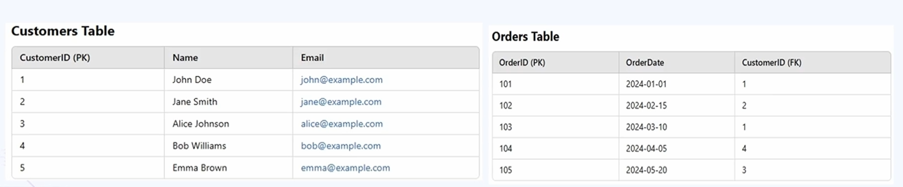
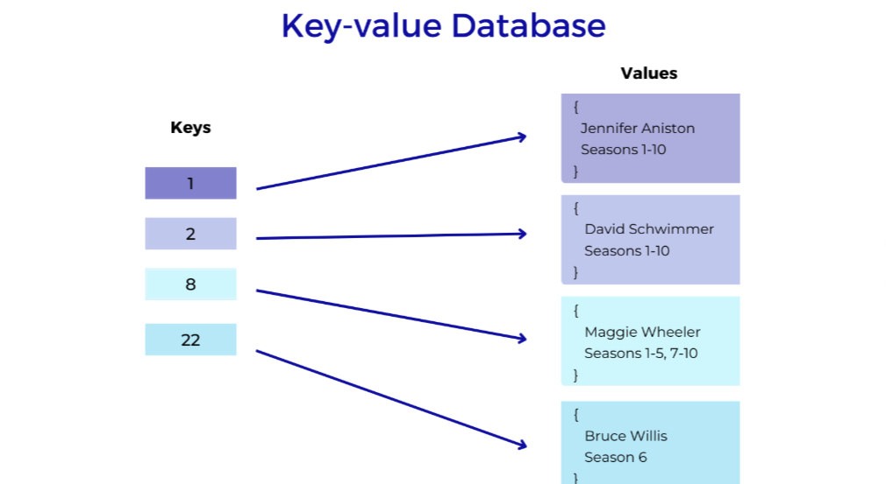
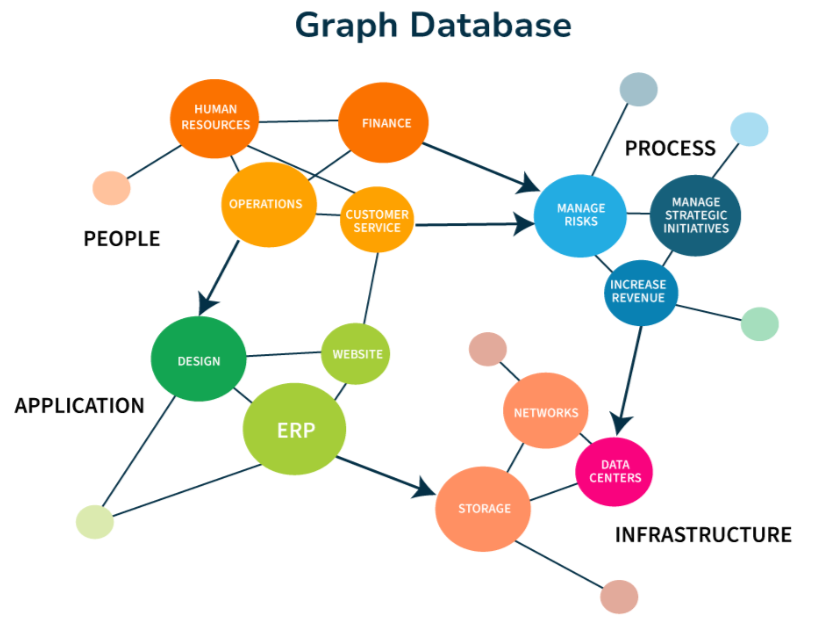
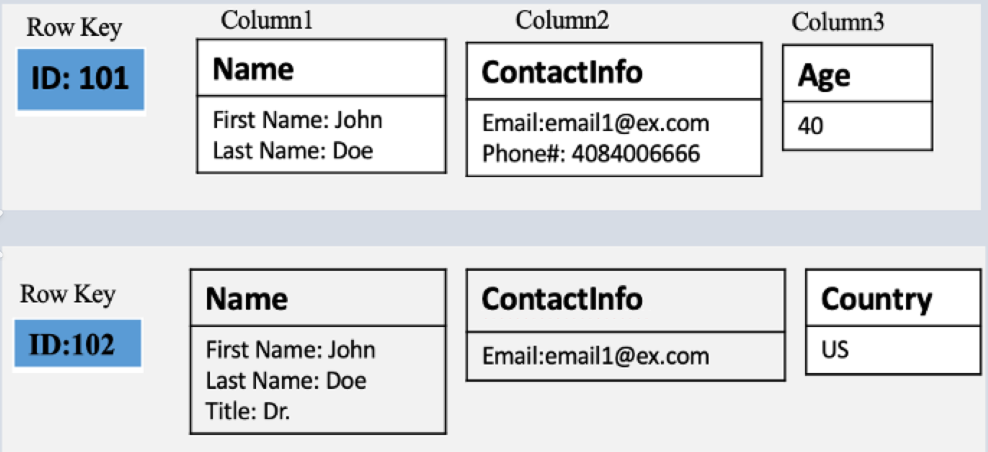
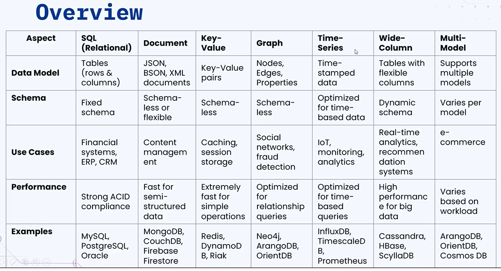

### 🔷🔶🔷 Chapter 4: SQL & NoSQL Databases

---

### 🔷🔶🔷 Introduction — Classification of Databases

    🔹 At a very high level, databases can be classified into:

        🔸 1. SQL Databases (Relational Databases)
        🔸 2. NoSQL Databases

    🔹 NoSQL databases have multiple sub-types:

        🔸 Document Database
        🔸 Key-Value Store
        🔸 Graph Database
        🔸 Time Series Database
        🔸 Wide Column Database
        🔸 Multi-Model Database

    🔹 Each type of database is suited for a specific use case.

---

### 🔷🔶🔷 1. SQL / Relational Databases

    🔹 SQL stands for Structured Query Language.

    🔹 In this type of database, data is organized in tables with
       predefined schemas.

    🔹 Schema means the data is arranged in rows and columns.

    🔹 Each table represents an entity:
        🔸 Example: Customer entity -> "customers" table.
        🔸 Example: Order entity -> "orders" table.

    🔹 Each row of the table represents a unique record.

    🔹 Each column represents a specific attribute of that record.
        🔸 Example: In the customers table, each row is a unique
           record (a specific customer's data), and each column
           name tells which attribute is being referred to (e.g.
           "Bob Williams" represents the name attribute of that record).

**🟠 Why SQL Databases Are Called "Relational" Databases**

    🔹 SQL databases are called relational databases because
       tables can be linked with each other using keys.

    🔹 Example:
        🔸 In the customers table, "customer ID" is the Primary Key.
        🔸 In the orders table, "customer ID" is the Foreign Key.
        🔸 Using the combination of primary key and foreign key,
           a relationship can be drawn between the two tables.
        🔸 Example: Customer ID 1 (John Doe) has two orders
           placed — order numbers 101 and 103 — found by
           matching customer ID 1 in the orders table.

    🔹 What is a Primary Key?
        🔸 A unique identifier for each record in a table.
        🔸 Example: In the customers table, each record has a
           unique primary key — none of the keys repeat. Same
           for "order ID" in the orders table.

    🔹 What is a Foreign Key?
        🔸 A reference to the primary key in another table,
           establishing a relation between the tables.
        🔸 Example: "customer ID" in the orders table is a
           foreign key, referencing the primary key "customer ID"
           in the customers table — this is how the relationship
           between the two tables is drawn.

**🟠 Examples of Relational Databases**

    🔹 There are many examples, but the most popular ones are:
        🔸 MySQL
        🔸 PostgreSQL
        🔸 Oracle Database

**🟠 Advantages of SQL / Relational Databases**

    🔹 1. Strong Consistency
        🔸 Strongly consistent with ACID properties (to be
           covered in upcoming videos).

    🔹 2. Powerful Queries
        🔸 You can write complex and advanced queries to search
           data in the database.
        🔸 You can use JOINs to get data from multiple different
           tables with a single query.
        🔸 As long as efficient and powerful queries are written,
           system performance will be very high.

    🔹 3. Mature Ecosystem
        🔸 SQL/relational databases have been in the market for a
           long time, so a mature ecosystem already exists.
        🔸 Extensive tools, documentation, and community support
           are available.

**🟠 Use Cases of SQL / Relational Databases**

    🔹 Complex organizations or financial institutions.

    🔹 E-commerce platforms like Amazon, Flipkart, or any
       e-commerce platform, where orders, customers, products,
       and other related details need to be managed.

---

### 🔷🔶🔷 NoSQL Databases

    🔹 We now look at the different types of NoSQL databases,
       starting with document databases.

---

### 🔷🔶🔷 2. Document Databases

    🔹 Data is stored in document-like structures such as JSON or XML.

    🔹 Each document can have its own unique structure.

    🔹 Note: In SQL databases, each entry in a row is called a
       "record." In document databases, each entry is called a "document."

**🟠 Structure**

    🔹 If using JSON, each document starts with an opening curly
       bracket and ends with a closing curly bracket.

    🔹 Inside the brackets, each piece of data has a property key
       and its value.
        🔸 Example: property key = "order id", value = "5001".

    🔹 A property value can be nested or an embedded document.
        🔸 Example: "user" can be a nested/embedded document with
           its own properties.

    🔹 A property value can also be an array of documents.
        🔸 Example: "products" can be an array of documents.

    🔹 This structure allows storing complex data, which is not
       possible in SQL/relational databases.

**🟠 Examples of Document Databases**

    🔹 MongoDB, CouchDB, Amazon DocumentDB.

**🟠 Advantages of Document Databases**

    🔹 1. Highly Flexible Schema
        🔸 Easy to modify the structure of the data.

    🔹 2. Supports Nested Data
        🔸 Supports complex data types like arrays and embedded documents.
        🔸 Example: "user" as a nested document; "products" as an
           array of objects.
        🔸 Arrays can also be arrays of numbers or arrays of
           strings — this is not supported in SQL databases.

**🟠 Use Cases of Document Databases**

    🔹 Content Management Systems, such as blogging or news
       websites — where different sections/categories of the same
       application require their own unique properties.

    🔹 E-commerce applications — where multiple product categories
       exist, and each category has different product attributes.

    🔹 Mobile and IoT applications — where the properties or
       captured data are of different types.

---

### 🔷🔶🔷 3. Key-Value Databases

    🔹 The simplest type of database — data is stored as key and
       value pairs.

    🔹 Key should be unique; value can be anything — a string,
       JSON, or blob.

    🔹 Also called a Key-Value Store.

**🟠 Characteristics**

    🔹 Does not support complex querying — you just pass the key
       and get the value, that's it.

    🔹 You cannot filter queries, cannot join entries.

    🔹 Does not support data relationships like SQL databases.

    🔹 Does not give strong consistency.

    🔹 Typically used for caching or storing temporary data —
       especially in browser storage, to store cookies or
       temporary values that won't have heavy user impact.

**🟠 Examples of Key-Value Databases**

    🔹 Redis, browser storage.

**🟠 Advantages of Key-Value Databases**

    🔹 Very fast — since no complex queries or logic are involved,
       it is extremely fast to retrieve data.

    🔹 Very simple to use.

    🔹 This is why it is highly used for caching or managing
       sessions in browsers.

**🟠 Use Cases of Key-Value Databases**

    🔹 Caching (already covered in detail in the caching chapter).

    🔹 Session management in web applications — user-related
       information stored in local or session storage using
       key-value stores.

---

### 🔷🔶🔷 4. Graph Databases

    🔹 Highly used whenever there is a high degree of
       relationship or connection between different types of data.

    🔹 A graph database stores data as Nodes and the relationships
       between different data as Edges — making them ideal for
       connected data.

**🟠 Use Case Context**

    🔹 Highly used in social networking applications, where
       there is high connection between different types of data,
       as well as connections between the same type of data.

    🔹 Example: On Instagram or Facebook —
        🔸 There is a connection between the same type of data
           (you and your friend both have profiles).
        🔸 There is also a relationship between your data and
           your friend's data (mutual friends, likes, dislikes, etc.).

    🔹 Such connections can easily be made using graph databases.

**🟠 Examples of Graph Databases**

    🔹 Neo4j, Amazon Neptune — Neo4j is widely used everywhere.

**🟠 Advantages of Graph Databases**

    🔹 Highly efficient when it comes to handling relationships
       between different types of data, and also the same type of data.

    🔹 Helps in querying complex relationships faster.

    🔹 Provides high flexibility in interconnecting different
       types of data.

    🔹 Very good performance when handling complex queries
       involving multiple relationships.

**🟠 Use Cases of Graph Databases**

    🔹 Social media applications — likes, comments, mutual
       friends, friend recommendations, post recommendations,
       and features like Instagram Reels recommendations.

    🔹 Fraud detection — identifying suspicious patterns in
       financial transactions.

    🔹 Recommendation engines — e.g. when you search for a
       product, you get suggestions of similar products in a
       marketplace, or in Google search.

**🟠 Illustration — Nodes and Edges**

    🔹 The actual data is stored inside a node as a record.

    🔹 Example: three records of three different people.

    🔹 Edges tell us the relationship — e.g. "from" user ID 123
       "to" user ID 456, with the relationship "friend" — meaning
       user 123 and user 456 are friends.

    🔹 User ID 123 can have another edge, e.g. "from" 123 "to"
       789, again with relationship "friend" — meaning user 123
       and user 789 are also friends.

    🔹 This is how data and relationships are represented using
       nodes and edges.

---

### 🔷🔶🔷 5. Time Series Databases

    🔹 Optimized for handling timestamped data, such as logs,
       metrics, and events.

    🔹 Each record has a timestamp property, and queries are
       optimized to search based on this timestamp.

    🔹 Very helpful when using logs and metrics for analytics.

**🟠 Examples of Time Series Databases**

    🔹 InfluxDB, Prometheus, TimescaleDB.

**🟠 Advantages of Time Series Databases**

    🔹 Highly efficient when it comes to time-based queries.

    🔹 Comes with inbuilt compression mechanisms for compressing
       high frequency data.

    🔹 Very ideal and efficient for real-time monitoring
       applications, where time is of the essence.

**🟠 Use Cases of Time Series Databases**

    🔹 IoT devices — where data is received continuously from
       sensor applications.
        🔸 Example: a weather satellite continuously sending data
           to analyze climatic conditions in a geographical area.

    🔹 Real-time analytics dashboards, such as Grafana.

    🔹 Stock market and crypto trading applications — where data
       changes within a matter of seconds, and querying such data
       is very crucial.

---

### 🔷🔶🔷 6. Wide Column Databases

    🔹 A type of NoSQL database that stores data in tables, just
       like relational databases, but with much more flexibility.

    🔹 The flexibility: each row can have a different set of columns.

    🔹 In SQL databases, data is also arranged in rows and
       columns, but the columns are fixed. In wide column
       databases, the columns can differ per row.

**🟠 Illustration**

    🔹 Example: Row A, Row B, Row C might each have a different
       number of columns:
        🔸 Row A might have only 2 columns.
        🔸 Row B might have only 1 column.
        🔸 Row C might have 3 columns.

    🔹 Another representation:
        🔸 Row key "user 123" might have 3 columns of data.
        🔸 Row key "user 456" might have only 2 columns of data.

    🔹 Wide column databases are highly flexible when it comes to
       the number of columns storing data.

**🟠 Examples of Wide Column Databases**

    🔹 Apache Cassandra, HBase, ScyllaDB.

**🟠 Advantages of Wide Column Databases**

    🔹 Highly Scalable — can handle massive amounts of data
       across distributed clusters.

    🔹 Highly Flexible — a row doesn't need to follow a fixed
       schema like in SQL databases; it can have any number of
       columns and store any type of data.

    🔹 Highly Efficient for Analytics — optimized for big data
       workloads and analyzing big data.

**🟠 Use Cases of Wide Column Databases**

    🔹 Real-time analytics, wherever large amounts of data are involved.

    🔹 Recommendation engines — in combination with graph
       databases when the data volume is huge (graph databases
       alone are also used for recommendation engines, but a
       combination is used for very large datasets).

    🔹 Data warehousing — storing large amounts of data for
       archiving and other purposes.

---

### 🔷🔶🔷 7. Multi-Model Databases

    🔹 As the name suggests, this is a combination of different
       types of databases.

    🔹 Multi-model databases support multiple data models —
       Example: Document, Graph, Key-Value — within a single backend.

    🔹 If a use case requires a combination of these data models,
       multi-model databases are the way to go.

**🟠 Illustration**

    🔹 Sample structure in a multi-model database:
        🔸 Document-style data — property key and value.
        🔸 Graph-type data — nodes and edges, drawing
           relationships between nodes.
        🔸 Key-value model — for session storage or caching mechanisms.

    🔹 All these types of data exist together within a single database.

**🟠 Examples of Multi-Model Databases**

    🔹 ArangoDB, OrientDB, Cosmos DB.

**🟠 Advantages of Multi-Model Databases**

    🔹 Highly Flexible — combines the strengths of different data
       models present in the market.

    🔹 Simplified Architecture — a single database can be used
       for storing different types of data.

    🔹 Cost Effectiveness — a single database can be maintained
       for different data models, instead of separate databases
       for different types of data models, reducing cost.

**🟠 Use Cases of Multi-Model Databases**

    🔹 E-commerce applications:
        🔸 DocumentDB model to store product details of different categories.
        🔸 Graph DB model for recommendations (e.g. searching for
           a product and getting recommendations for other products).

    🔹 Data integration platforms — performing ETL (Extract,
       Transform, Load) related operations: extracting data from
       various data models, transforming the data, etc. — all
       made easier using multi-model databases.

---

### 🔷🔶🔷 Database Comparison Table

---

### 🔷🔶🔷 Summary — SQL & NoSQL Databases at a Glance

    🔸 SQL / Relational      ->  Data organized in tables with
       Databases                predefined schema; rows =
                                records, columns = attributes;
                                tables linked via primary/foreign
                                keys. Strong consistency (ACID),
                                powerful queries (joins), mature
                                ecosystem. E.g. MySQL, PostgreSQL,
                                Oracle. Used in financial
                                institutions, e-commerce platforms.

    🔸 Document Databases    ->  Data stored as documents (JSON/XML)
                                with flexible, nested schemas;
                                supports arrays and embedded
                                documents. E.g. MongoDB, CouchDB,
                                Amazon DocumentDB. Used in CMS,
                                e-commerce, mobile/IoT apps.

    🔸 Key-Value Databases   ->  Simplest NoSQL type — unique key
                                mapped to any value; no complex
                                querying or relationships; very
                                fast. E.g. Redis, browser storage.
                                Used for caching, session management.

    🔸 Graph Databases       ->  Data stored as nodes and
                                relationships as edges; ideal for
                                connected data. E.g. Neo4j, Amazon
                                Neptune. Used in social media,
                                fraud detection, recommendation engines.

    🔸 Time Series Databases ->  Optimized for timestamped data
                                like logs, metrics, and events;
                                built-in compression. E.g.
                                InfluxDB, Prometheus, TimescaleDB.
                                Used in IoT, real-time dashboards,
                                stock/crypto trading.

    🔸 Wide Column Databases ->  Table-like structure but each row
                                can have a different set of
                                columns; highly scalable and
                                flexible. E.g. Apache Cassandra,
                                HBase, ScyllaDB. Used in real-time
                                analytics, recommendation engines,
                                data warehousing.

    🔸 Multi-Model Databases ->  Combines multiple data models
                                (document, graph, key-value, etc.)
                                in a single backend; flexible,
                                simplified, and cost-effective.
                                E.g. ArangoDB, OrientDB, Cosmos DB.
                                Used in e-commerce, data
                                integration/ETL platforms.

    🔹 Choosing between SQL and the various types of NoSQL
       databases ultimately depends on the specific use case —
       the structure of the data, the relationships involved, the
       consistency requirements, and the scale of the application.

---