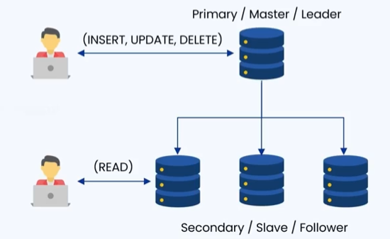
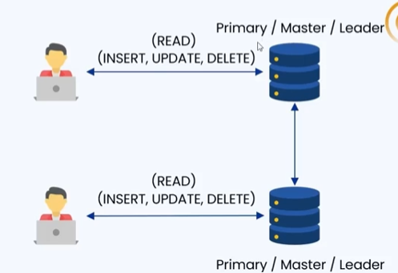
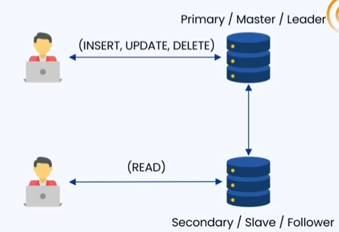
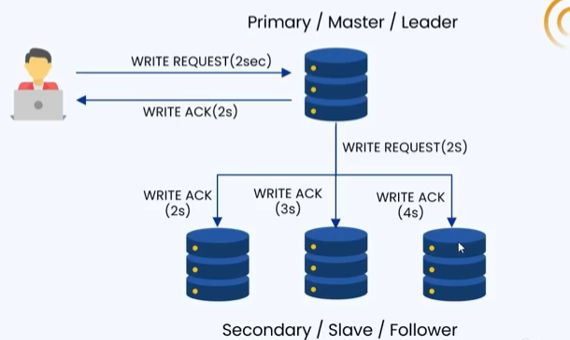
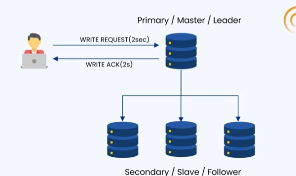
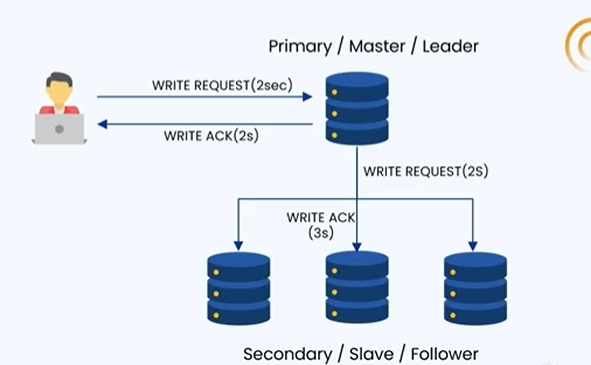

### 🔷🔶🔷 Chapter 5: Database Replication

---

### 🔷🔶🔷 Introduction — What is Database Replication?

    🔹 First, understand the general term "replication" — it
       means making a copy of the original. The copy of the
       original is called a Replica.

    🔹 Applying this to databases:

    🔹 Database Replication is the process of copying and
       maintaining database records across multiple nodes.

    🔹 There is a Source Database — the Master Database — where
       all the database records are stored, and the same data is
       replicated (copied) into multiple other databases.

---

### 🔷🔶🔷 Advantages of Database Replication

**🔘 1. Availability**

    🔸 Having multiple copies of the data across nodes improves availability.

**🔘 2. Fault Tolerance**

    🔸 Assume there is some kind of fault in the application — it
       can be a network fault, data corruption, or any other type
       of fault.
    🔸 If one database is not working due to a fault, we can
       always rely on the backup (the replica database) to fetch
       the data.

**🔘 3. Performance Optimization**

    🔸 Example: Assume the original database is present somewhere
       in North America, and the user is present in India.
    🔸 When the user queries the database, it takes 5 seconds for
       the data to reach the user — because the distance between
       the database and the user is too long.
    🔸 Now assume there is a replicated database somewhere in Europe.
    🔸 The original database stores all its data in the
       replication database as well.
    🔸 When the user makes the query again, the data is fetched
       from the replicated (nearer) database instead — this time
       it takes only 2 seconds.
    🔸 This is because the replicated database is much nearer to
       the user compared to the original database, which is far away.
    🔸 This is how replica databases help optimize application performance.

---

### 🔷🔶🔷 Types of Implementing Replication

    🔹 There are three types of implementing database replication:

        🔸 1. Master-Slave Replication
        🔸 2. Master-Master Replication
        🔸 3. Snapshot Replication

---

### 🔷🔶🔷 1. Master-Slave Replication

    🔹 There is a Master database — also called the Primary or
       the Leader.

    🔹 There is a Slave database — also called the Secondary or
       the Follower.

    🔹 The primary/master database handles all write requests
       (insert, update, or delete).

    🔹 Once data is updated in the master database, the same data
       is synchronously or asynchronously replicated to the
       secondary database.

    🔹 The secondary database is responsible for serving all read
       requests — there is no updating of data in the secondary
       database, it only serves read requests.

**🔘 Advantages of Master-Slave Replication**

    🔸 1. Improved Performance
        - All read requests are handled by the secondary
          database, so the master doesn't need to worry about
          serving read requests.
        - Similarly, all write requests are handled by the
          master, so the slave doesn't need to worry about
          handling write requests.
        - This separation of concerns allows each to perform
          their individual responsibilities more efficiently.

    🔸 2. High Availability
        - If the master fails for any reason, one of the slaves
          can be promoted as the master and take over without
          causing any downtime.

    🔸 3. Scalability
        - Useful when the application is read-intensive (e.g. a
          social media application, where read requests are
          higher than write requests).
        - Additional slave/secondary databases can be added to
          handle high volumes of read requests.

**🔘 Disadvantages of Master-Slave Replication**

    🔸 1. Replication Lag
        - Whenever data is written, the newly updated data might
          not be immediately reflected in the secondary database.
        - There is some latency between master and slave, causing
          them to be temporarily inconsistent with each other.
        - If a read request comes in before replication completes,
          the data might not be found, or stale data may be served.

    🔸 2. Writes Are Limited to One Node
        - All write operations are handled by the master alone.
        - If there is a huge number of write requests, this can
          create a bottleneck for the master to process all
          incoming write requests.

---

### 🔷🔶🔷 2. Master-Master Replication

    🔹 Multiple databases are assigned as primary master/leader.

    🔹 There is no concept of slave or secondary databases.

    🔹 Both read and write operations are handled by both
       databases, and the data is synchronized with each other.

    🔹 Example:
        🔸 If Database 1 receives a write request, it stores the
           data and replicates it with Database 2.
        🔸 Similarly, if Database 2 receives a write request, it
           stores/updates the data, then replicates it with Database 1.
        🔸 Both databases also process read requests.

**🔘 Advantages of Master-Master Replication**

    🔸 1. Load Balancing
        - If one database is busy performing an operation, the
          request will be sent to the other database — providing
          a kind of load balancing between multiple databases.

    🔸 2. High Availability
        - If one master fails for some reason, the other master
          can always process the request.

    🔸 3. Automatic Failover
        - Since both are master databases, if one fails, there's
          no need to manually promote a slave to master — the
          other database (already a master) continues to process
          user queries automatically.

**🔘 Disadvantages of Master-Master Replication**

    🔸 1. Data Conflicts
        - If the same record in the database is updated multiple
          times, the update operation is sent to both databases,
          and keeping them in sync with each other might be difficult.

    🔸 2. Latency Issues
        - Whenever there is replication of data between the two
          masters, synchronization of updated data might take
          longer than expected, which could lead to data inconsistencies.

---

### 🔷🔶🔷 3. Snapshot Replication

    🔹 As with master-slave, there is a minimum of two databases:
       a primary, and a secondary/slave database.

    🔹 The primary database handles all write requests.

    🔹 The secondary database handles all read requests.

    🔹 Unlike master-slave/master-master (where data updates in
       the secondary database happen whenever the record in the
       primary is updated), in snapshot replication, replication
       happens periodically — a snapshot of all the data present
       in the primary database is taken and stored in the
       secondary database.

**🔘 Advantages of Snapshot Replication**

    🔸 Simple to implement — no need to track small/incremental changes.
    🔸 All records are taken as a snapshot from the primary
       database and stored in the secondary database.
    🔸 Ideal for scenarios where the data does not change frequently.

**🔘 Disadvantages of Snapshot Replication**

    🔸 High Bandwidth Consumption
        - Since a complete copy of all records in the master
          database is taken, the amount of bandwidth consumed in
          the network is very high — a full data set is copied every time.

    🔸 Not Suitable for High Transaction Databases
        - Not appropriate for databases where data keeps updating frequently.

    🔸 Stale Data Risk
        - Since snapshots are taken periodically, there are
          chances of stale data being present in the secondary
          database before a new snapshot is added.
        - Changes made to the data between snapshots won't be
          immediately reflected in the replicas.

---

### 🔷🔶🔷 Methods of Database Replication

    🔹 Beyond the types of replication, there are also different
       approaches/methods for replicating data between databases:

        🔸 1. Synchronous Replication
        🔸 2. Asynchronous Replication
        🔸 3. Semi-Synchronous Replication

---

### 🔷🔶🔷 1. Synchronous Replication

    🔹 The primary database awaits acknowledgement from replicas
       before committing a transaction.

**🟠 Illustration**

    🔹 There is a primary database and multiple secondary databases.

    🔹 Example flow (illustrative timings):
        🔸 User's write request reaches the database -> 2 seconds
        🔸 The primary database processes and updates/inserts the record.
        🔸 The primary database forwards the write request to the
           secondary databases -> 2 seconds
        🔸 Each secondary database processes the request and
           sends an acknowledgement:
            - Secondary 1 -> 2 seconds
            - Secondary 2 -> 3 seconds
            - Secondary 3 -> 4 seconds
        🔸 Since these happen in parallel, the primary waits for
           the slowest one -> 4 seconds
        🔸 The primary database only sends its acknowledgement
           back to the user after ALL three secondary databases
           have acknowledged.
        🔸 Total so far: 2 (initial) + 2 (forward) + 4 (slowest
           secondary ack) = 8 seconds
        🔸 Plus 2 more seconds for the user to receive the actual
           acknowledgement from the primary database.
        🔸 Total transaction time = 10 seconds.

    🔹 Conclusion: Latency is very high, but data is consistent
       across all databases.

**🔘 Advantages of Synchronous Replication**

    🔸 1. Ensures Strong Consistency — data is the same across
       all databases, with no inconsistency.
    🔸 2. Ensures High Availability — even if the master fails,
       there are multiple secondary databases that can take up
       the role of master when required.
    🔸 3. Instant Failover — a seamless switch between primary
       and secondary replicas is possible.

**🔘 Disadvantages of Synchronous Replication**

    🔸 1. High Latency — for a write request to be successful,
       ALL replicas must process the request and send an
       acknowledgement before the final acknowledgement is sent
       to the user, introducing significant delay.
    🔸 2. Performance Overhead — a lot of network traffic is
       generated, since every node must process the write request
       and send an acknowledgement — but this ensures strong consistency.

---

### 🔷🔶🔷 2. Asynchronous Replication

    🔹 Data is returned to the primary server first, and then
       replicated to the secondary servers later.

    🔹 The primary server does NOT wait for an acknowledgement
       from the secondary servers.

**🟠 Illustration**

    🔹 There is a primary/master database along with secondary/slave databases.

    🔹 Flow:
        🔸 The user makes a write request.
        🔸 The primary database processes the request (updates or
           inserts the data) and immediately sends the
           acknowledgement back to the user.
        🔸 Only after acknowledging the user does the primary
           database send the write request to the secondary databases.
        🔸 The primary database does NOT wait for acknowledgement
           from the secondary databases.

    🔹 In this example, the total time taken is only 4 seconds —
       compared to 10 seconds in the synchronous replication example.

    🔹 This improves performance but may lead to data loss in
       case of failure.

    🔹 Major drawback: The user (or the primary database) will
       not know if there was a failure in processing the write
       request by the secondary/slave databases — leading to
       potential data inconsistencies.

**🔘 Advantages of Asynchronous Replication**

    🔸 1. High Performance and Low Latency — the primary server
       does not wait for replica confirmation, making it much faster.
    🔸 2. Increased Scalability — suitable for databases present
       in different geographical areas, where immediate
       synchronization is impractical.

**🔘 Disadvantages of Asynchronous Replication**

    🔸 1. Loss of Data — if a secondary database fails to process
       the write request, it will have stale/old data or no data
       at all. If the primary database then fails, the new data
       might be lost forever — data loss is a real risk.
    🔸 2. Eventual Consistency (Not Strong Consistency) — there
       might be inconsistent data until the write request is
       successfully processed by the secondary databases.

---

### 🔷🔶🔷 3. Semi-Synchronous Replication

    🔹 A hybrid between synchronous and asynchronous replication.

    🔹 There is a primary/master database and multiple
       secondary/slave databases.

    🔹 The primary database waits for acknowledgement from ONE
       (or a configurable number) of the secondary databases
       before sending an acknowledgement to the user.

**🟠 Illustration**

    🔹 The user makes a write request.

    🔹 The primary database processes the request (insert/update),
       and forwards the write request to the secondary databases.

    🔹 The primary database waits for an acknowledgement from
       ONE of the secondary databases (e.g. Secondary Database 2
       sends the acknowledgement).

    🔹 As soon as that one acknowledgement is received, the
       primary database immediately sends the acknowledgement
       back to the user — it does NOT wait for all secondary
       databases.

    🔹 The number of secondary databases to wait for (1 or more)
       can be configured according to requirements.

**🔘 Advantages of Semi-Synchronous Replication**

    🔸 1. Better Performance — faster than full synchronous
       replication, since it only waits for one replica to
       acknowledge.
    🔸 2. Automatic Failover Support — if the primary database
       server crashes, a confirmed secondary database server can
       take its place.

**🔘 Disadvantages of Semi-Synchronous Replication**

    🔸 1. Risk of Minor Data Loss — if both the primary database
       and the (already-synced) secondary database fail
       simultaneously, the other databases might have old/stale
       data, resulting in possible data loss. This rarely happens
       and has a low probability.
    🔸 2. Performance Overhead (Comparative) — more network
       traffic and processing power is required, since the
       primary database waits for at least one secondary
       database's acknowledgement — though performance is still
       better than fully synchronous replication.
    🔸 3. Replication Lag Can Still Occur — the other databases
       that haven't yet acknowledged the write request may take
       more time to process it. If a new read request comes in
       during this time, a not-yet-acknowledged secondary database
       might still give out old data. Again, this probability is very low.

---

### 🔷🔶🔷 Summary — Database Replication at a Glance

    🔸 Database Replication ->  The process of copying and
                               maintaining database records
                               across multiple nodes, using a
                               source/master database and one or
                               more replicas.

    🔸 Advantages           ->  Availability, fault tolerance,
                               and performance optimization
                               (serving data from a
                               geographically nearer replica).

    🔸 Master-Slave         ->  One master handles writes, one or
       Replication              more slaves handle reads.
                               Improves performance, high
                               availability, scalability — but
                               has replication lag and a
                               single-node write bottleneck.

    🔸 Master-Master        ->  Multiple databases act as
       Replication              masters, handling both reads and
                               writes, synchronized with each
                               other. Provides load balancing,
                               high availability, and automatic
                               failover — but risks data
                               conflicts and latency issues.

    🔸 Snapshot Replication ->  Periodic full snapshots of the
                               primary database are copied to the
                               secondary database. Simple to
                               implement, ideal for infrequently
                               changing data — but high bandwidth
                               usage, not suited for high
                               transaction databases, and risk of
                               stale data between snapshots.

    🔸 Synchronous          ->  Primary waits for acknowledgement
       Replication              from ALL replicas before
                               confirming to the user. Strong
                               consistency, high availability,
                               instant failover — but high
                               latency and performance overhead.

    🔸 Asynchronous         ->  Primary acknowledges the user
       Replication              immediately, then replicates to
                               secondaries later without waiting.
                               High performance, low latency,
                               scalable — but risk of data loss
                               and only eventual consistency.

    🔸 Semi-Synchronous     ->  Primary waits for acknowledgement
       Replication              from just one (or a configurable
                               number of) secondary database(s)
                               before confirming to the user. A
                               balance between performance and
                               consistency — better performance
                               than synchronous, with a small
                               risk of data loss and possible
                               replication lag.

    🔹 Choosing the right type and method of database replication
       depends on the specific trade-offs a system needs to make
       between consistency, availability, and performance.

---