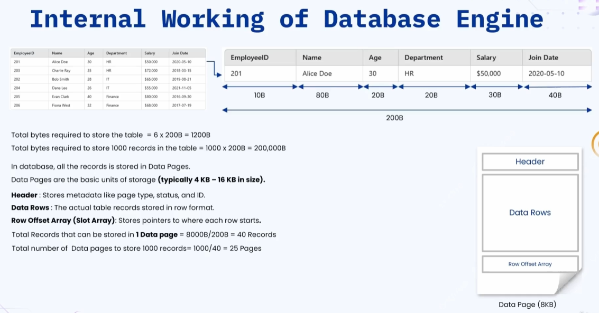
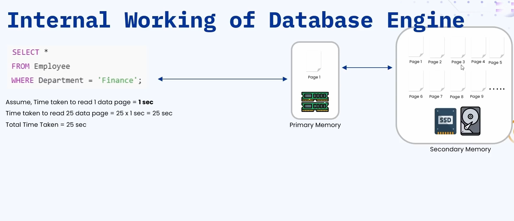
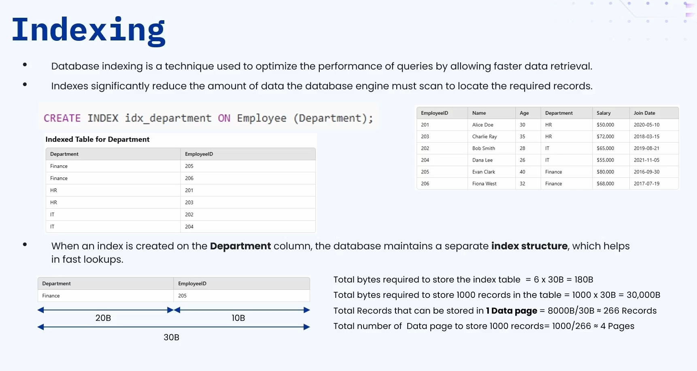
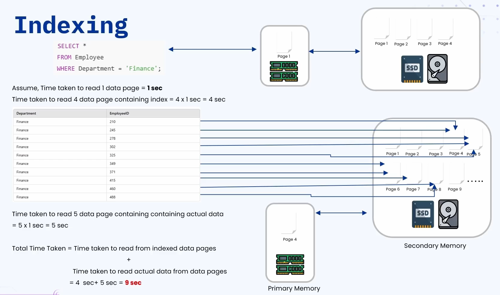

### 🔷🔶🔷 Chapter 6: Database Indexing

---

### 🔷🔶🔷 Introduction — What is an Index in the Real World?

    🔹 Consider a Class 6 Science textbook.

    🔹 The textbook has an Index Page — a list of topics covered,
       along with the page number where each topic starts.

    🔹 Example: To read about "Precious Water", the index tells
       you to go directly to page number 62.

    🔹 Now imagine a scenario where page numbers are NOT present
       in the index — only a list of topics.

    🔹 If you want to study "Weather and Seasons," how would you
       find it?
        🔸 You'd have to sequentially start from the first page
           and go through each page one after the other, checking
           if the page heading matches the topic you want.

    🔹 The Problem: This approach is very time consuming.

    🔹 If index page numbers ARE given, it becomes much easier to
       find the topic of choice.

    🔹 So an index helps in getting information faster — this is
       the same principle behind database indexing.

---

### 🔷🔶🔷 Database Concepts — Understanding Memory & Data Pages

**🟠 Example — The Employee Table**

    🔹 Consider an employee table with multiple columns
       representing different attributes, containing 6 records
       (for this example).

**🟠 Memory Consumption of a Single Record**

    🔹 The table has six columns, and their memory usage is:
        🔸 Employee ID  -> 10 bytes
        🔸 Name         -> 80 bytes
        🔸 Age          -> 20 bytes
        🔸 Department   -> 20 bytes
        🔸 Salary       -> 30 bytes
        🔸 Join Date    -> 40 bytes

    🔹 A single record in the table takes around 200 bytes of memory.

**🟠 Memory Consumption of the Full Table**

    🔹 With 6 records: 6 × 200 bytes = 1200 bytes.

    🔹 In the real world, tables have hundreds or thousands of
       records — assume the employee table has 1000 records.

    🔹 Total memory utilization = 1000 × 200 bytes = 200,000
       bytes -> i.e. 200 KB of storage needed for 1000 records.

**🟠 What is a Data Page?**

    🔹 All records are stored in Data Pages.

    🔹 Data Page = the basic unit of storage in the database.

    🔹 Typical data page size: 4 KB to 16 KB.

    🔹 In MySQL or PostgreSQL, the typical data page size is 8 KB.

    🔹 A data page contains three sections:

        🔸 1. Header
            - Stores metadata information like page type, status, and ID.

        🔸 2. Data Rows
            - Actually stores the data — all the records of the
              table are stored here.

        🔸 3. Row Offset Array
            - An array of pointers pointing to the different
              records in the data rows.
            - Tells us where in memory each record starts.

**🟠 How Many Records Fit in a Data Page?**

    🔹 A data page typically holds up to 8 KB (8000 bytes) of data.

    🔹 Calculation: Total records per data page = 8000 bytes ÷
       200 bytes (size of each record) = 40 records per data page.

    🔹 To store 1000 records: 1000 ÷ 40 = 25 data pages required.

    🔹 These 25 data pages are stored in the secondary memory of
       the system (SSD or HDD).

    🔹 Whenever data needs to be read, the database engine loads
       the required data page(s) into primary memory, extracts
       the queried record, and returns it to the user.

---

### 🔷🔶🔷 Querying Without an Index

**🟠 Query Using the Primary Key**

    🔹 Example query:
        🔸 SELECT * FROM employee WHERE employee_id = 220

    🔹 Since this query uses the primary key (employee ID) as a filter:
        🔸 The database engine knows exactly which data page
           contains the record with employee_id = 220 (e.g. Data
           Page 6).
        🔸 The database engine directly loads Page 6 into primary
           memory, retrieves the exact record, and returns it to
           the user.

**🟠 Query NOT Using the Primary Key**

    🔹 Example query:
        🔸 SELECT * FROM employee WHERE department = 'finance'

    🔹 Since this query does NOT use the primary key attribute,
       the process is different:
        🔸 The database engine has to load ALL the data pages,
           one after the other, into primary memory.
        🔸 It scans through each page, extracting records where
           department = 'finance', and stores them in an output buffer.
        🔸 Page 1 is loaded, all 40 records scanned, matches
           extracted; then Page 2, and so on, through all 25 pages.
        🔸 Once all 25 pages have been read and data collected in
           the output buffer, that data is returned as the response.

**🟠 Time Taken Without Indexing**

    🔹 Assume it takes 1 second to read each data page.

    🔹 With 25 data pages: total time = 25 seconds.

    🔹 25 seconds is a very long time to get the data — this is
       where indexing helps.

---

### 🔷🔶🔷 What is Database Indexing?

    🔹 Database Indexing is a technique used to optimize the
       performance of queries by allowing faster data retrieval.

    🔹 Indexing significantly reduces the amount of data the
       database engine must scan to locate the required records.

---

### 🔷🔶🔷 Understanding Indexing With an Example

**🟠 Creating an Index**

    🔹 Take the same employee table, and create an index on the
       department column (since queries filter using the
       department attribute).

    🔹 Command structure:
        🔸 CREATE INDEX id_department ON employee (department)
        🔸 (CREATE keyword + INDEX keyword + index name, e.g.
           "id_department", followed by the table name "employee"
           and the column to index, "department".)

    🔹 As soon as this command runs, the database engine creates
       a new (indexed) table containing two columns:
        🔸 1. Department (the indexed column)
        🔸 2. Employee ID (the primary key of the employee table)

    🔹 This new indexed table is sorted by the department column.

**🟠 Memory Occupied by the Indexed Table**

    🔹 The indexed table has 2 columns:
        🔸 Department  -> 20 bytes per record
        🔸 Employee ID -> 10 bytes per record

    🔹 Each record in the indexed table = 30 bytes total.

    🔹 Assuming 1000 records (matching the employee table):
        🔸 Total memory = 1000 × 30 bytes = 30,000 bytes.

**🟠 Data Pages Required for the Indexed Table**

    🔹 Records per data page = 8000 bytes ÷ 30 bytes = 266 records
       per data page.

    🔹 Compare: In the original employee table, each data page
       held only 40 records — but the indexed table holds 266
       records per page, since each indexed record is much
       smaller (30 bytes vs 200 bytes).

    🔹 To hold 1000 records of the indexed table: around 4 data
       pages are required (1000 ÷ 266 ≈ 4).

---

### 🔷🔶🔷 How the Database Engine Uses the Index

    🔹 Take the same query:
        🔸 SELECT * FROM employee WHERE department = 'finance'

    🔹 The database engine knows there is an index table for the
       department column, so it refers to the index table FIRST.

    🔹 Step 1 — Reading the Index Table:
        🔸 All records of the index table are stored in 4 data pages.
        🔸 The database engine loads all 4 data pages into primary
           memory, one after the other, sequentially.
        🔸 It retrieves all records matching department = 'finance'
           and stores them in an output buffer (this is an
           intermittent/internal result, not the final output).
        🔸 Assuming 1 second per data page: 4 data pages = 4
           seconds to complete this step.

    🔹 Step 2 — Reading the Actual Employee Table:
        🔸 From the intermittent result, the database engine
           knows exactly which primary keys (employee IDs) it
           needs to retrieve.
        🔸 It also knows exactly which data pages of the original
           employee table (out of the 25 total pages) contain
           those primary keys — e.g. Page 4, Page 5, Page 6, Page
           7, and Page 8.
        🔸 Only those specific pages are loaded into primary memory.
        🔸 Assuming 1 second per data page, and 5 pages needed:
           total = 5 seconds.

**🟠 Total Time Taken With Indexing**

    🔹 Total time = Time to read indexed data pages + Time to
       read actual data pages
        🔸 = 4 seconds + 5 seconds = 9 seconds.

    🔹 Comparison:
        🔸 Without Indexing -> 25 seconds
        🔸 With Indexing    -> 9 seconds

    🔹 Hence, indexing helps in retrieving data much faster.

---

### 🔷🔶🔷 When to Use and When to Avoid Indexing

**🟠 When to Use Indexing**

    🔹 When columns are frequently used in WHERE, JOIN, ORDER BY,
       or GROUP BY clauses.
        🔸 Wherever these clauses are used in a query, indexing
           can be applied on the relevant columns.

    🔹 When there is a large number of records in the table.

**🟠 When to Avoid Indexing**

    🔹 When the table is small (contains few records).
        🔸 Whenever an index is created, the database engine
           creates an additional indexing table, which also
           occupies space.
        🔸 If there are only a few hundred records, creating an
           indexed table would be a waste of space — indexing
           becomes unnecessary overhead.

    🔹 When the cardinality of the column is low.
        🔸 Cardinality = the number of different values a column
           can store.
        🔸 Example: A column/attribute that only takes Boolean
           values (true/false) has low cardinality ("true"
           cardinality is low, meaning very few distinct values) —
           in such cases, indexing should be avoided.
        🔸 Contrast: In the employee table, the "department"
           column can have many different values (IT, finance,
           HR, development, testing, etc.) — high cardinality — so
           indexing is worthwhile here.

---

### 🔷🔶🔷 Summary — Database Indexing at a Glance

    🔸 Index (Real World)  ->  Like a textbook's index page — a
                              reference that helps locate
                              information faster, instead of
                              scanning page by page.

    🔸 Data Page           ->  The basic unit of database storage
                              (typically 4–16 KB, 8 KB in
                              MySQL/PostgreSQL) — containing a
                              Header, Data Rows, and a Row Offset Array.

    🔸 Query Without Index ->  If filtering on a non-primary-key
                              column, the database engine must
                              scan ALL data pages sequentially —
                              slow for large tables (e.g. 25
                              seconds for 25 pages).

    🔸 Query With Primary  ->  The database engine directly
       Key                     identifies and loads only the
                              relevant data page — very fast.

    🔸 Database Indexing   ->  A technique that creates a smaller,
                              sorted lookup table (mapping the
                              indexed column to primary keys),
                              drastically reducing how much data
                              must be scanned to find matching
                              records.

    🔸 How It Works        ->  The engine first scans the (much
                              smaller) index table to find
                              matching primary keys, then loads
                              only the specific data pages of the
                              main table that contain those keys
                              — combined time is much lower (e.g.
                              9 seconds instead of 25 seconds).

    🔸 When to Use         ->  Columns frequently used in WHERE,
                              JOIN, ORDER BY, or GROUP BY clauses;
                              tables with a large number of records.

    🔸 When to Avoid       ->  Small tables (few records); columns
                              with low cardinality (few distinct values).

    🔹 Indexing significantly improves query performance by
       reducing the amount of data the database engine needs to
       scan — but it should be applied thoughtfully, since it
       comes with its own storage overhead.

---