### 🔷🔶🔷 Chapter 7: Normalization & Denormalization

---

### 🔷🔶🔷 Introduction — Revising Keys in DBMS

    🔹 Before understanding normalization, it helps to revise
       four important types of keys in DBMS:

        🔸 1. Primary Key
        🔸 2. Composite Key
        🔸 3. Foreign Key
        🔸 4. Super Key (and Candidate Key)

---

### 🔷🔶🔷 1. Primary Key

    🔹 A Primary Key is a unique identifier for each record in a table.

    🔹 To retrieve the data of a specific record, its primary key should be used.

    🔹 Analogy: Just like a student ID or university registration number uniquely identifies a particular student.

    🔹 No two rows/records should have the same primary key.

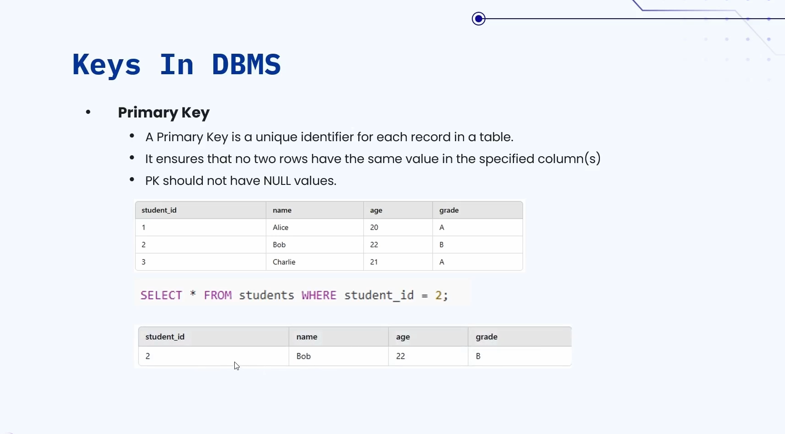

**🟠 Illustration**

    🔹 A student table with columns: Student ID (primary key), Name, Age, Grade.

    🔹 Query: SELECT * FROM students WHERE student_id = 2

    🔹 Output: Only ONE row is returned — because the primary key
       (student_id = 2) is unique, and only one student has that ID.

---

### 🔷🔶🔷 2. Composite Key

    🔹 A Composite Key is a key that consists of two or more
       columns, used to uniquely identify a record in a table.

    🔹 It ensures that no two rows have the same combination of
       values in the specified columns.

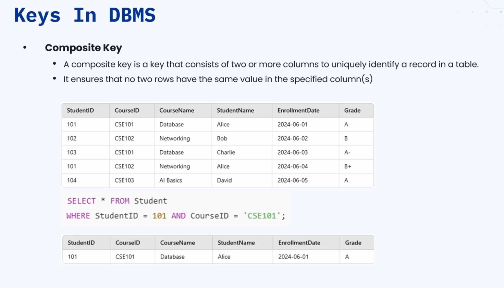

**🟠 Illustration**

    🔹 A table with columns: student ID, course ID, course name,
       student name, enrollment date, and grade.

    🔹 Goal: Retrieve Alice's database course grade and enrollment date.

    🔹 Using only student ID won't work:
        🔸 Query: SELECT * FROM student_table WHERE student_id = 101
        🔸 This returns TWO records (since the same student can
           be enrolled in multiple courses).

    🔹 Instead, combine student ID and course ID:
        🔸 Query: SELECT * FROM student_table WHERE student_id =
           101 AND course_id = 'CSC101'
        🔸 This returns exactly ONE record, as expected.

    🔹 The combination of student ID and course ID here forms the
       Composite Key.

---

### 🔷🔶🔷 3. Foreign Key

    🔹 A Foreign Key is a column in one table that establishes a
       relationship with a primary key in another table.

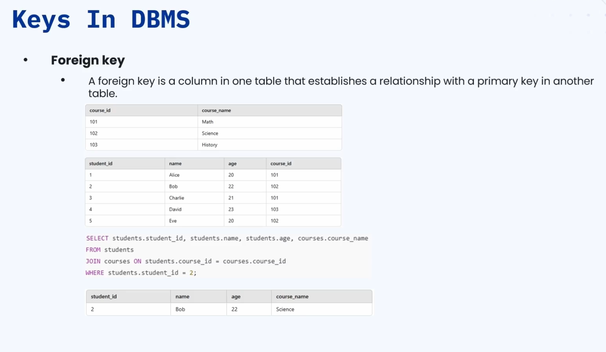

**🟠 Illustration**

    🔹 A course table: course ID (primary key), course name.

    🔹 A student table: student ID (primary key), course ID
       (foreign key, referencing the course table).

    🔹 Using the foreign key, a relationship between the tables can be traced:
        🔸 Example: Student Bob's course ID is looked up (say, 1
           or 2), then matched against the course table's primary
           key to find the course name — e.g. "Science".
        🔸 Conclusion: Bob is taking the course Science.

    🔹 Usually, the foreign key of one table is the primary key of another table.

    🔹 This is how a foreign key + primary key combination helps
       establish relationships between different tables (e.g. a
       query joining student and course tables to get Bob's
       course details).

---

### 🔷🔶🔷 4. Super Key & Candidate Key

**🟠 Super Key**

    🔹 A Super Key is a set of one or more columns that can
       uniquely identify a row in a table.

    🔹 A super key contains a primary key, and can also contain
       extra attributes — these extra attributes may or may not
       be required while uniquely querying a record.

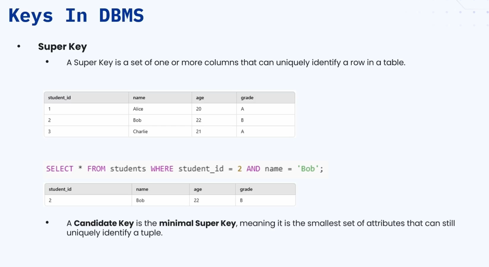

**🟠 Illustration**

    🔹 A student table: student ID, name, age, grade.

    🔹 Query: SELECT * FROM students WHERE student_id = 2 AND name = 'Bob'
        🔸 The "name = Bob" part could be omitted, since
           student_id = 2 is already unique — but adding extra
           attributes can still help, especially with large
           datasets or multi-attribute queries.

**🟠 Candidate Key**

    🔹 A Candidate Key is similar to a super key — it is the
       smallest set of attributes that can uniquely identify a
       row in a table.

    🔹 Note: For practical/real-time understanding in this
       course, candidate key and super key can be treated as similar.

---

### 🔷🔶🔷 Database Anomalies

    🔹 When designing a database, poorly structured tables can
       lead to anomalies, which cause:
        🔸 Data inconsistencies
        🔸 Redundancy of data
        🔸 Integrity issues

    🔹 There are three major types of anomalies:

        🔸 1. Insertion Anomaly
        🔸 2. Update Anomaly
        🔸 3. Deletion Anomaly

---

**🔘 1. Insertion Anomaly**

    🔹 Happens when we cannot insert data into a table without
       having unnecessary or incomplete data, due to poor design.

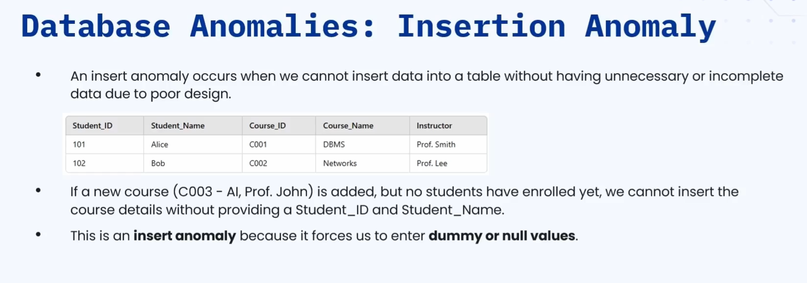

**🟠 Illustration**

    🔹 A table with student details along with course details the
       student is enrolled in (belongs to a university).

    🔹 The university wants to add a new course: course ID C003,
       course name AI, instructor Professor John — but no
       students are enrolled yet (it's a brand new course).

    🔹 Problem: The new course cannot be inserted without also
       providing student ID and student name — but there is no
       enrolled student.

    🔹 To insert the course, null or empty strings must be used
       in place of student ID and student name — which is a poor
       way of inserting data.

    🔹 This is a typical case of Insertion Anomaly — forced to add
       dummy/null values along with factual values.

---

**🔘 2. Update Anomaly**

    🔹 Occurs when updating a single piece of data requires
       multiple updates across multiple rows, due to data redundancy.

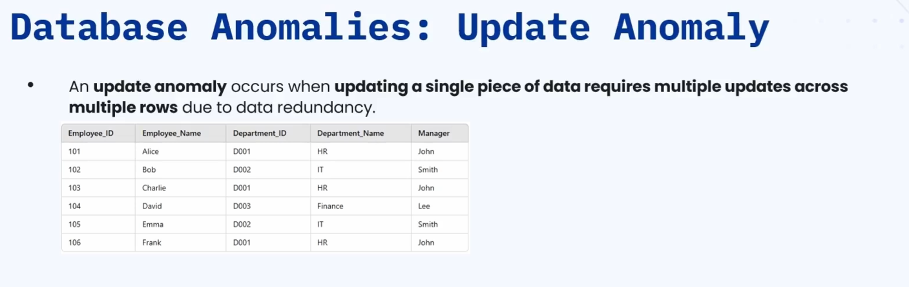

**🟠 Illustration**

    🔹 A table where, for the HR department, John is listed as
       the manager — and there are two employees (Alice and
       Frank) in HR.

    🔹 John leaves the company, and Michael takes over as HR manager.

    🔹 It is NOT sufficient to update just one row — ALL rows
       where an HR department employee's row lists John as
       manager must be updated to Michael.

    🔹 With only a few records, this is manageable — but in a
       large organization with thousands of records, updating all
       of them is time-consuming and error-prone.

    🔹 This is a typical case of Update Anomaly.

---

**🔘 3. Deletion Anomaly**

    🔹 Occurs when deletion of some data requires (or
       unintentionally causes) deletion of other, unrelated data as well.

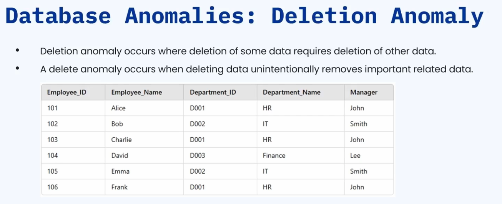

**🟠 Illustration**

    🔹 A table with employee details, department details, and the
       department's manager.

    🔹 The organization wants to remove the HR department
       altogether — this requires deleting the rows containing HR
       department data (say, row 1 and row 6).

    🔹 Problem: Since employee details and department details are
       stored in the same record, deleting the department details
       also unintentionally deletes the associated employee details.

    🔹 This is a typical case of Deletion Anomaly.

---

### 🔷🔶🔷 Normalization

    🔹 To eliminate all these anomalies, we apply Normalization —
       which organizes data into structured forms known as Normal Forms.

    🔹 There are several types/levels of normalization in DBMS:

        🔸 1. First Normal Form (1NF)
        🔸 2. Second Normal Form (2NF)
        🔸 3. Third Normal Form (3NF)
        🔸 4. Boyce-Codd Normal Form (BCNF)

---

### 🔷🔶🔷 1. First Normal Form (1NF)

    🔹 For a table to be in 1NF, it must follow two rules:

        🔸 Rule 1: Each column should contain only atomic (indivisible) values.
        🔸 Rule 2: Each row should have a unique identifier — a
           primary key or a composite key.

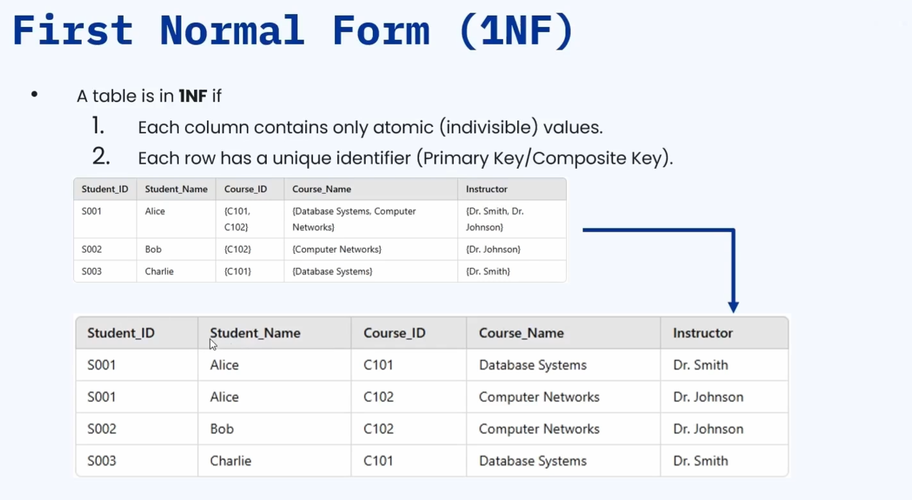

**🟠 Illustration**

    🔹 A table with columns: student ID, student name, course ID,
       course name, instructor.

    🔹 For student Alice, the course ID, course name, and
       instructor fields contain an ARRAY of values (multiple
       courses in one cell) — this violates Rule 1 (values must
       be atomic).

    🔹 Fix: Divide the record into multiple records — one row per
       course (e.g. one row for course C101 - Database Systems,
       another for C102 - Computer Networks).

    🔹 After this split:
        🔸 No column contains an array of values -> Rule 1 satisfied.
        🔸 Each record can be uniquely identified using the
           combination of student ID + course ID (since student
           ID alone repeats across multiple rows) -> Rule 2 satisfied.

    🔹 Since both rules are satisfied, this table is now in First
       Normal Form.

---

### 🔷🔶🔷 2. Second Normal Form (2NF)

    🔹 For a table to be in 2NF, it must follow two rules:

        🔸 Rule 1: It should already be in 1NF.
        🔸 Rule 2: The table should not have any Partial Dependencies.

    🔹 Partial Dependency: A non-key column must depend on the
       WHOLE (composite) key, not just part of it.

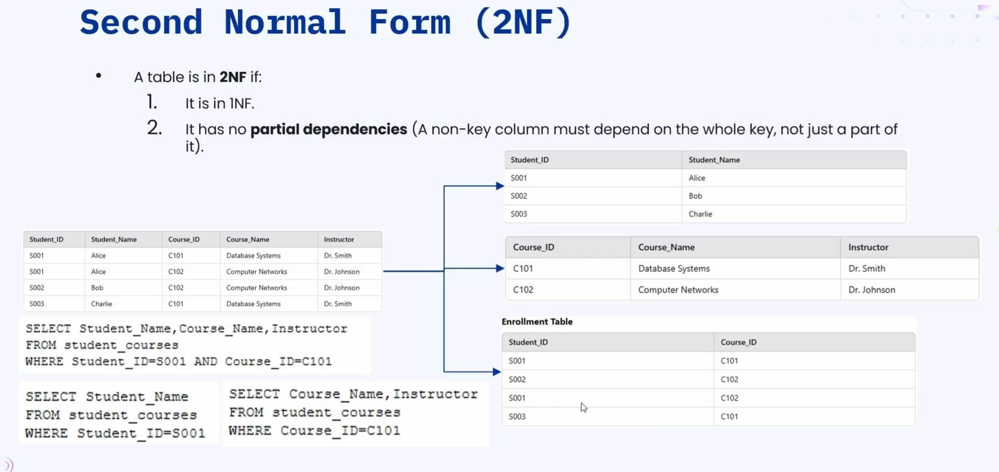

**🟠 Illustration**

    🔹 A table with student details and course details (from the
       1NF example) — using a composite key of student ID + course ID.

    🔹 Query to get student name, course name, and instructor for
       one record: requires BOTH student ID and course ID.

    🔹 But: Can student name be retrieved using ONLY student ID?
        🔸 Yes: SELECT student_name FROM student_courses WHERE
           student_id = 'S001'
        🔸 Student name depends only on student ID, not course ID.

    🔹 Can course name and instructor be retrieved using ONLY course ID?
        🔸 Yes: SELECT course_name, instructor FROM
           student_courses WHERE course_id = 'C101'
        🔸 Course name and instructor depend only on course ID,
           not student ID.

    🔹 This means:
        🔸 Course name and instructor are partially dependent on
           the composite key (only depend on course ID).
        🔸 Student name is partially dependent on the composite
           key (only depends on student ID).

    🔹 This violates the 2NF rule — hence the table is NOT in
       Second Normal Form.

**🟠 Fixing the Table for 2NF**

    🔹 Divide the table into multiple tables:
        🔸 Table 1: Student details (student ID, student name) —
           student name is fully dependent on student ID.
        🔸 Table 2: Course details (course ID, course name,
           instructor) — course name and instructor are fully
           dependent on course ID.
        🔸 Table 3: Enrollment table — used only for mapping the
           relationship between students and courses; it has no
           primary key, so it doesn't need to be normalized.

    🔹 Tables 1 and 2 now follow Second Normal Form.

---

### 🔷🔶🔷 3. Third Normal Form (3NF)

**🟠 Understanding Transitive Dependency First**

    🔹 A Transitive Dependency is an indirect relation between
       attributes in a database.

    🔹 It occurs when a non-prime attribute is functionally
       dependent on another non-prime attribute, through an
       intermediate attribute.

    🔹 Rule: If A determines B, and B determines C, then A
       determines C — this is a transitive functional dependency.

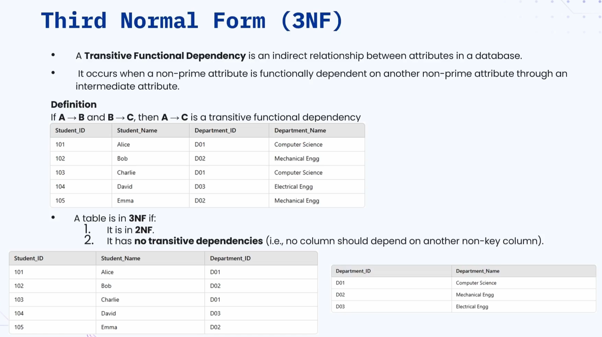

**🟠 Illustration**

    🔹 A table with student and department details — student IDs
       are unique, department IDs repeat.

    🔹 Student ID determines Department ID:
        🔸 SELECT department_id FROM student_table WHERE
           student_id = 101

    🔹 Department ID determines Department Name.

    🔹 So: Student ID -> Department ID -> Department Name (A
       determines B, B determines C, hence A determines C).

    🔹 This is confirmed directly too:
        🔸 SELECT department_name FROM student_table WHERE
           student_id = 101
        🔸 This gives the department name directly using student
           ID — confirming the transitive dependency.

**🟠 Third Normal Form Rules**

    🔹 For a table to be in 3NF:

        🔸 Rule 1: It should already be in 2NF.
        🔸 Rule 2: It should NOT have any transitive dependencies.

**🟠 Fixing the Table for 3NF**

    🔹 Break the table into two tables:
        🔸 Table 1: Student details, with department ID as a
           foreign key.
        🔸 Table 2: Department details (department ID, department name).

    🔹 There is no transitive dependency within a single table —
       though there are entity relationships (the department
       table's primary key is used as a foreign key in the
       student table).

    🔹 These new tables now follow Third Normal Form.

---

### 🔷🔶🔷 4. Boyce-Codd Normal Form (BCNF)

    🔹 BCNF is almost never used in practice, but is good to know.

    🔹 BCNF is a slightly stronger version of the Third Normal
       Form — it addresses certain anomalies not handled by 3NF
       as originally defined.

    🔹 BCNF is also known as "3.5 Normal Form," since it's
       slightly stronger than 3NF.

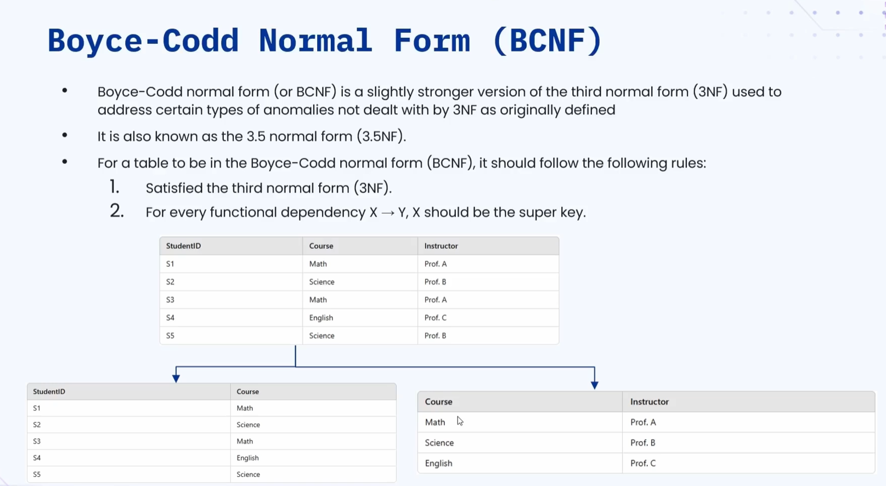

**🟠 Rules for BCNF**

    🔹 Rule 1: The table must satisfy all conditions of 3NF.

    🔹 Rule 2: For every functional dependency X -> Y (X
       determines Y), X should be a Super Key.
        🔸 That means X should be a primary key, or a primary key
           along with some other attributes.

**🟠 Illustration**

    🔹 A table with student ID, course, and instructor.
        🔸 Student S1 -> course Math -> instructor Professor A
        🔸 Student S2 -> course Science -> instructor Professor B

    🔹 Student ID determines course and instructor — this is
       fine, since student ID is the primary key (also a super key).

    🔹 Observation: For each course, there is only ONE instructor
       (e.g. Math -> Professor A always; Science -> Professor B always).

    🔹 This means: Course (a non-key attribute) determines
       Instructor (also a non-key attribute).

    🔹 This VIOLATES the second BCNF rule, because "course" is
       NOT a super key, yet it is still determining another
       attribute (instructor).

**🟠 Fixing the Table for BCNF**

    🔹 Split the table into:
        🔸 Table 1: Student-Course mapping (student ID as primary key).
        🔸 Table 2: Course-Instructor mapping (course as primary key).

    🔹 These two newly created tables are now in BCNF.

    🔹 Note: In actual industry implementation, normalization
       typically goes up to Third Normal Form (3NF) — anything
       beyond that (like BCNF) is very rarely used in organizations.

---

### 🔷🔶🔷 Denormalization

    🔹 Normalization removes data inconsistencies, duplicate/
       redundant data, and resolves anomalies.

    🔹 But in the practical world, we cannot always normalize the
       data — sometimes duplicate or redundant data is desired,
       so the application runs faster. In such scenarios, we go
       with Denormalization.

**🟠 What is Denormalization?**

    🔹 Denormalization is the process of introducing redundancy
       into a database by combining tables or adding redundant
       data, to improve read performance — at the cost of
       potential write inconsistencies.

    🔹 Example use case: An analytics dashboard application that
       reads millions of records — the time consumed for read
       operations would be very large without denormalization.

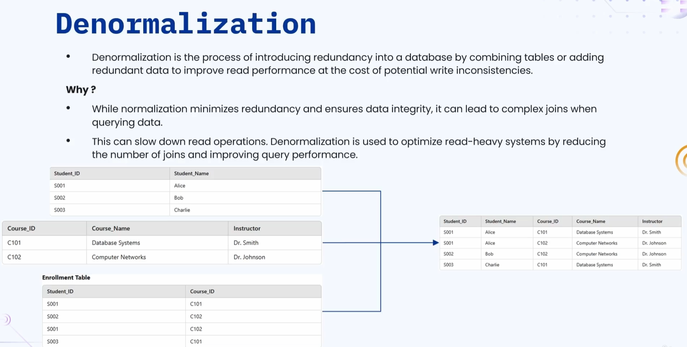

**🟠 Why Go With Denormalization?**

    🔹 Normalization minimizes redundancy and ensures data
       integrity, but it can lead to complex JOINs when querying data.

    🔹 As seen during normalization, records get broken into
       multiple tables — joining data across all these tables
       requires complex queries.

    🔹 In the real world — with tables containing thousands of
       records, data distributed across multiple tables, and
       database servers in different locations — the network
       communication and complexity involved in running JOIN
       queries significantly delays read operations.

    🔹 In such scenarios, Denormalization is used to optimize
       read-heavy systems by reducing the number of joins and
       improving query performance.

**🟠 Illustration**

    🔹 Three tables: student table, course table, and enrollment
       table (mapping students to courses).

    🔹 Writing a query to join data from all three tables is complex.

    🔹 Instead, all three tables are combined into a single table.

    🔹 Writing a query against this single, combined table becomes easy.

**🟠 Advantages and Disadvantages of Denormalization**

    🔹 Disadvantage: Introduces anomalies (the same anomalies
       normalization was meant to remove).

    🔹 Advantage: Read operations become faster.

**🟠 When to Use Denormalization**

    🔹 When read performance is more critical than write consistency.

    🔹 Typically used in read-heavy applications, such as
       reporting dashboards or data analytics.

**🟠 How Denormalization Helps**

    🔹 It significantly reduces the number of database joins,
       which improves performance.

    🔹 This is common in NoSQL databases, where denormalization
       is a standard practice for achieving scalability.

    🔹 Remember: Denormalization comes with a lot of
       disadvantages (introduces anomalies) — it should only be
       used if the consequences are acceptable for the use case.

---

### 🔷🔶🔷 Summary — Normalization & Denormalization at a Glance

    🔸 Primary Key         ->  Uniquely identifies each record in a table.

    🔸 Composite Key       ->  Combination of two or more columns
                              used to uniquely identify a record.

    🔸 Foreign Key         ->  A column referencing the primary
                              key of another table, establishing
                              a relationship.

    🔸 Super Key /         ->  A set of one or more columns
       Candidate Key           (including the primary key) that
                              can uniquely identify a row;
                              candidate key is the smallest such set.

    🔸 Anomalies           ->  Insertion Anomaly (forced to insert
                              null/dummy data), Update Anomaly
                              (single update requires many row
                              updates), and Deletion Anomaly
                              (deleting data unintentionally
                              removes unrelated data) — all
                              caused by poor table design.

    🔸 1NF                 ->  Atomic column values + unique row
                              identifier (primary/composite key).

    🔸 2NF                 ->  Must be in 1NF + no partial
                              dependencies (non-key columns must
                              depend on the WHOLE composite key).

    🔸 3NF                 ->  Must be in 2NF + no transitive
                              dependencies (A -> B -> C should not exist).

    🔸 BCNF                ->  Must satisfy 3NF + every functional
                              dependency X -> Y must have X as a
                              super key; rarely used in practice.

    🔸 Denormalization     ->  Intentionally introducing
                              redundancy (combining tables/adding
                              redundant data) to improve read
                              performance, at the cost of write
                              consistency and reintroduced
                              anomalies — used in read-heavy
                              systems like analytics dashboards
                              and common in NoSQL databases.

    🔹 In practice, database design typically normalizes up to
       Third Normal Form, and applies denormalization selectively
       wherever read performance outweighs the need for strict
       write consistency.

---