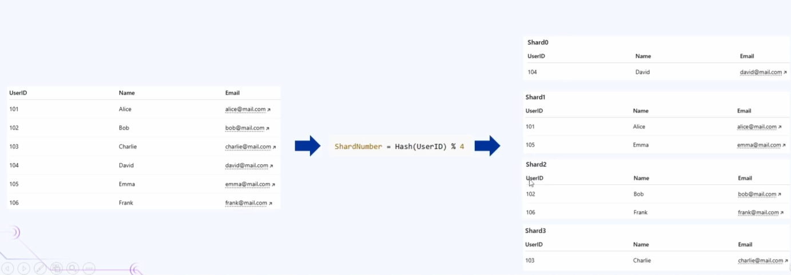
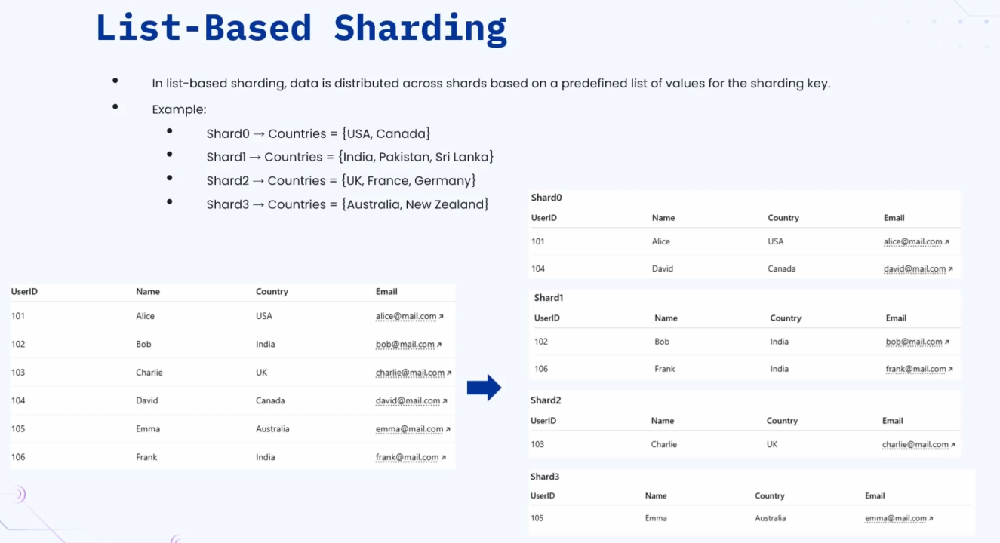
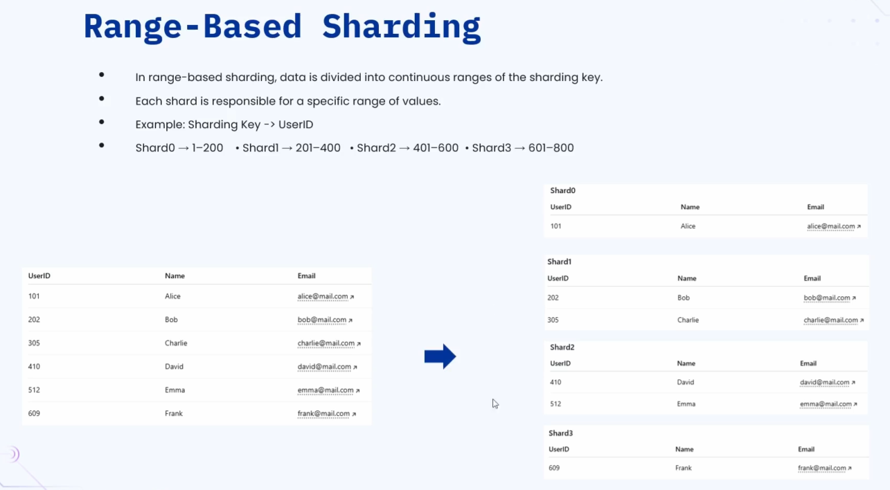
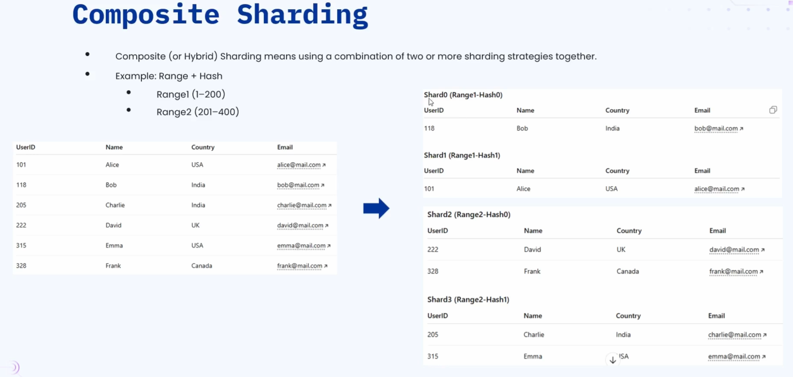

### 🔷🔶🔷 Chapter 8: Database Partitioning & Sharding

---

### 🔷🔶🔷 What is Database Partitioning?

    🔹 Database Partitioning is the process of splitting a large database
       or table into smaller, more manageable pieces.

    🔹 A bigger table is divided into smaller tables to improve
       manageability, performance, and availability.

**🟠 Why Do We Need Database Partitioning?**

    🔹 Better Manageability:
        🔸 Smaller tables are easier to manage than one massive table.

    🔹 Better Performance:
        🔸 Querying a smaller table is much faster than querying
           a huge table with millions of rows.

    🔹 Better Availability:
        🔸 If you have one big database and it fails — all data
           becomes inaccessible.
        🔸 If data is split into multiple tables/databases and one
           fails — data in the others is still accessible.

---

### 🔷🔶🔷 Types of Database Partitioning

    🔹 There are two types of database partitioning:
        🔸 Horizontal Partitioning  ->  Divide data by ROWS
        🔸 Vertical Partitioning    ->  Divide data by COLUMNS

---

**🔘 1. Horizontal Partitioning**

    🔹 The table data is divided horizontally — row by row.

    🔹 Data is split based on the range of values defined by
       a Partition Key.

    🔹 Each partition contains a subset of rows from the original table.

    🔹 Also known as Database Sharding.

**🟠 Example — Employee Table**

    🔹 Original Table:
        | EmpID | Name    | Department | Salary |
        |-------|---------|------------|--------|
        | 101   | John    | HR         | 50000  |
        | 102   | Aisha   | Finance    | 60000  |
        | 103   | Rahul   | IT         | 70000  |
        | 104   | Emily   | HR         | 55000  |
        | 105   | David   | Finance    | 65000  |

    🔹 Partition Key: Department

    🔹 After Horizontal Partitioning:

        Partition 1 — HR Table:
        | EmpID | Name  | Department | Salary |
        |-------|-------|------------|--------|
        | 101   | John  | HR         | 50000  |
        | 104   | Emily | HR         | 55000  |

        Partition 2 — Finance Table:
        | EmpID | Name  | Department | Salary |
        |-------|-------|------------|--------|
        | 102   | Aisha | Finance    | 60000  |
        | 105   | David | Finance    | 65000  |

        Partition 3 — IT Table:
        | EmpID | Name  | Department | Salary |
        |-------|-------|------------|--------|
        | 103   | Rahul | IT         | 70000  |

    🔹 The data is split row-wise based on the Department column.

---

**🔘 2. Vertical Partitioning**

    🔹 The table data is divided vertically — column by column.

    🔹 Attributes (columns) are split into different tables,
       usually keeping a common key (like a Primary Key) to link them.

**🟠 Example — Employee Table**

    🔹 Original Table:
        | EmpID | Name  | Department | Salary |

    🔹 After Vertical Partitioning:

        Table 1 — Basic Info:
        | EmpID | Name  | Department |

        Table 2 — Salary Info:
        | EmpID | Salary |

    🔹 Common Key: EmpID (links both tables together)

    🔹 This is useful when some columns are accessed frequently
       and others are not — reducing the data read per query.

---

### 🔷🔶🔷 Horizontal vs Vertical Partitioning

    🔸 Horizontal  ->  Divides data by ROWS
                       Each partition has all columns but different rows
    🔸 Vertical    ->  Divides data by COLUMNS
                       Each partition has all rows but different columns
    🔸 Common Key  ->  Not needed in horizontal (same schema)
                       Required in vertical (to join tables)

---

### 🔷🔶🔷 What is Database Sharding?

    🔹 Database Sharding is a database architectural pattern based on
       horizontal partitioning.

    🔹 It is the practice of splitting one large table's rows into
       multiple different tables or database instances.

    🔹 Each individual partition is called a Shard.

    🔹 Each shard can be a completely separate database instance
       running on its own server.

    🔹 Together, all shards hold the complete data of the original table.

**🟠 Why Sharding Instead of Scaling Up Vertically?**

    🔹 When millions of requests hit the database, performance degrades.

    🔹 One option: Add more CPU or RAM to the existing database server
       (Vertical Scaling) — but this is very costly.

    🔹 Better option: Add more machines with sharding (Horizontal Scaling)
        🔸 Cheaper to add more servers than to upgrade one powerful server
        🔸 More feasible to scale horizontally
        🔸 Sharding is required when a single server cannot handle the scale

---

### 🔷🔶🔷 Types of Sharding

    🔹 There are four types of sharding strategies:
        🔸 Hash Based Sharding
        🔸 List Based Sharding
        🔸 Range Based Sharding
        🔸 Composite Sharding

---

**🔘 1. Hash Based Sharding**

    🔹 Data is distributed across multiple shards using a
       Hash Function applied to a Sharding Key.

    🔹 Instead of storing all data in one server, data is divided
       into multiple database servers based on a hashing algorithm.

**🟠 How Hash Based Sharding Works**

    🔘 Step 1 — Select the Sharding Key:
        🔸 Choose an attribute that uniquely identifies each record.
        🔸 Example: User ID (uniquely identifies each user)

    🔘 Step 2 — Apply the Hash Function:
        🔸 The hash function takes the sharding key as input
        🔸 Returns a hash value of integer type
        🔸 Formula: hash_value = hash_algorithm(user_id)

    🔘 Step 3 — Apply Modulo Operation:
        🔸 Perform modulo on the hash value with the number of shards (N)
        🔸 Formula: shard_number = hash_value % N
        🔸 N = total number of shards you want to create
            (N=4 means data is split into 4 shards)

    🔘 Step 4 — Route Data to the Shard:
        🔸 Store the data in the shard corresponding to the
           calculated shard_number

**🟠 Example**

    🔹 Original Table: UserID | Name | Email
    🔹 Sharding Key: UserID  |  N = 4 shards

    🔹 Shard 0: Records where hash(UserID) % 4 = 0
    🔹 Shard 1: Records where hash(UserID) % 4 = 1
    🔹 Shard 2: Records where hash(UserID) % 4 = 2
    🔹 Shard 3: Records where hash(UserID) % 4 = 3

    🔹 Note: Data order within shards is not sequential —
       it depends on the hash output, which appears random.

    🔹 To query a user:
        🔸 Apply the same hash formula to the UserID
        🔸 Calculate the shard number
        🔸 Query only that specific shard — not all shards

**🟠 Advantages of Hash Based Sharding**

    🔹 Even Data Distribution:
        🔸 Hashing splits records evenly across all shards
        🔸 No single shard is overburdened with data

    🔹 Faster Lookups:
        🔸 For a given UserID, the hash value is always the same
        🔸 You always know exactly which shard to query
        🔸 No need to scan all shards for a specific record

    🔹 Scalable Reads and Writes:
        🔸 Data is distributed — both reading and writing
           is efficient and high-performance

**🟠 Disadvantages of Hash Based Sharding**

    🔹 Resharding is Difficult:
        🔸 If you want to change from 4 shards to 7 shards,
           you must change N in the formula
        🔸 The shard numbers for existing data will change
           (same hash value, but modulo with 7 gives a different result)
        🔸 All existing data must be reorganized and redistributed
        🔸 This is a heavy, complex, and costly operation

    🔹 Poor Performance for Range Queries:
        🔸 Data is not stored sequentially — it is random across shards
        🔸 A query like "find all users with ID between 100 and 200"
           must scan ALL shards and then filter the results
        🔸 Very inefficient for range-based operations

---

**🔘 2. List Based Sharding**

    🔹 Data is distributed across multiple shards based on a
       predefined list of values for the sharding key.

    🔹 Each shard is assigned a specific list of values —
       records matching those values go into that shard.

**🟠 Example**

    🔹 Original Table: UserID | Name | Country | Email
    🔹 Sharding Key: Country

    🔹 Shard 0 -> Countries: USA, Canada
    🔹 Shard 1 -> Countries: India, Pakistan, Sri Lanka
    🔹 Shard 2 -> Countries: UK, France, Germany
    🔹 Shard 3 -> Countries: Australia, New Zealand

    🔹 After Sharding:
        🔸 Shard 0 contains all users from USA and Canada
        🔸 Shard 1 contains all users from India, Pakistan, Sri Lanka
        🔸 Shard 2 contains all users from UK, France, Germany
        🔸 Shard 3 contains all users from Australia and New Zealand

**🟠 Advantages of List Based Sharding**

    🔹 Flexibility:
        🔸 You decide exactly which data goes into which shard
        🔸 Full control over data distribution

    🔹 Logical Grouping:
        🔸 Data is grouped based on meaningful business logic
        🔸 Example: Users from the same region are in the same shard
        🔸 Useful for region-specific querying or compliance requirements

**🟠 Disadvantages of List Based Sharding**

    🔹 Manual Effort:
        🔸 The list must be manually defined and maintained
        🔸 Any additions or changes require manual intervention

    🔹 Rebalancing is Hard:
        🔸 If a particular shard grows too large (e.g., 50 million users
           from India), it must be split — which is a heavy operation

    🔹 Risk of Hotspots:
        🔸 If a large number of records belong to one list value,
           that shard becomes overloaded compared to others
        🔸 This imbalance is called a Hotspot

---

**🔘 3. Range Based Sharding**

    🔹 Data is divided into contiguous (continuous) rangesof the sharding key.

    🔹 Each shard is responsible for a specific range of values.

**🟠 Example**

    🔹 Original Table: UserID | Name | Email
    🔹 Sharding Key: UserID

    🔹 Shard 0 -> UserID: 1 to 200
    🔹 Shard 1 -> UserID: 201 to 400
    🔹 Shard 2 -> UserID: 401 to 600
    🔹 Shard 3 -> UserID: 601 to 800

    🔹 After Sharding:
        🔸 Shard 0: Records with UserID 101, 150, 199 (all within 1–200)
        🔸 Shard 1: Records with UserID 202, 305 (within 201–400)
        🔸 Shard 2: Records with UserID 410, 512 (within 401–600)
        🔸 Shard 3: Records with UserID 650 (within 601–800)

**🟠 Advantages of Range Based Sharding**

    🔹 Easy to Implement and Understand:
        🔸 No hashing algorithm or predefined list required
        🔸 Simply define ranges and route data accordingly

    🔹 Efficient Range Queries:
        🔸 Querying "all users with ID between 200 and 400" is very fast
        🔸 You know exactly which shard to hit — no need to scan all shards
        🔸 Unlike hash based sharding, range queries are highly efficient here

    🔹 Natural Data Ordering:
        🔸 Data is stored in sequential order within each shard
        🔸 Data locality is maintained
        🔸 Especially helpful for time-series data or sequential IDs

**🟠 Disadvantages of Range Based Sharding**

    🔹 Manual Rebalancing:
        🔸 When a range fills up, you must redefine the ranges
           and move data accordingly
        🔸 This is a very heavy and disruptive operation

    🔹 Risk of Hotspots:
        🔸 Data is inserted sequentially — at any given time,
           all new writes go to one specific shard (the current range)
        🔸 While one shard is being loaded, others remain idle
        🔸 Creates an uneven load distribution (hotspot)

---

**🔘 4. Composite Sharding**

    🔹 Composite sharding combines two or more sharding strategies together.

    🔹 Example: Range Based Sharding + Hash Based Sharding

    🔹 Useful when a single sharding strategy cannot meet all requirements.

**🟠 How Composite Sharding Works — Example**

    🔹 Step 1 — Define Ranges:
        🔸 Range 1: UserID 1 to 200
        🔸 Range 2: UserID 201 to 400

    🔹 Step 2 — Apply Hashing Within Each Range:
        🔸 Range 1 (1–200) is further split between Shard 0 and Shard 1
           based on hash(UserID) % 2
        🔸 Range 2 (201–400) is further split between Shard 2 and Shard 3
           based on hash(UserID) % 2

    🔹 Result:
        🔸 Shard 0 and Shard 1: UserIDs 1–200 (split by hash)
        🔸 Shard 2 and Shard 3: UserIDs 201–400 (split by hash)

    🔹 This means:
        🔸 First, data is divided by range
        🔸 Then within that range, the hash decides the exact shard

**🟠 Advantages of Composite Sharding**

    🔹 Avoids Hotspots:
        🔸 No single shard is overburdened with data
        🔸 Load is distributed more evenly

    🔹 Flexibility:
        🔸 Combines the strengths of multiple sharding strategies
        🔸 Can be tailored to specific business requirements

**🟠 Disadvantages of Composite Sharding**

    🔹 Increased Complexity:
        🔸 Implementing and maintaining multiple sharding strategies
           together is significantly more complex

    🔹 Difficult Query Routing:
        🔸 To retrieve a specific record, multiple rules must be applied
        🔸 More steps = more time = less efficient compared to
           single-strategy sharding

---

### 🔷🔶🔷 Sharding Types — Quick Comparison

    🔸 Hash Based:
        Basis     ->  Hash function on sharding key
        Strength  ->  Even distribution, fast point lookups
        Weakness  ->  Resharding is hard, poor range query performance

    🔸 List Based:
        Basis     ->  Predefined list of values
        Strength  ->  Flexible, logical grouping
        Weakness  ->  Manual effort, risk of hotspots

    🔸 Range Based:
        Basis     ->  Contiguous ranges of sharding key values
        Strength  ->  Easy to implement, efficient range queries
        Weakness  ->  Hotspots during sequential inserts, manual rebalancing

    🔸 Composite:
        Basis     ->  Combination of two or more strategies
        Strength  ->  Avoids hotspots, highly flexible
        Weakness  ->  High complexity, difficult query routing

---

### 🔷🔶🔷 Overall Advantages of Database Sharding

**🔘 1. Horizontal Scalability**

    🔹 Instead of upgrading a single powerful server (vertical scaling),
       you add more shards and more servers.
    🔹 Scales the database system horizontally to handle massive growth.

**🔘 2. Improved Performance**

    🔹 Queries only hit the specific shard containing the relevant data —
       not the entire database.
    🔹 Smaller data per shard = faster query response times.
    🔹 Both read and write throughput improve significantly.

**🔘 3. Handles Large Volumes of Data**

    🔹 A single machine has limits — storage, CPU, and memory.
    🔹 Sharding overcomes these limits by distributing data
       across multiple servers.
    🔹 Can efficiently handle terabytes or even petabytes of data.

**🔘 4. Better Maintainability**

    🔹 Smaller individual shards are easier to:
        🔸 Back up
        🔸 Migrate
        🔸 Maintain and monitor
    🔹 Far easier to manage than one massive monolithic database.

---

### 🔷🔶🔷 Important Concepts to Know

**🟠 What is a Shard?**

    🔹 A shard is an individual partition of a sharded database.
    🔹 Each shard contains a subset of the total data.
    🔹 Each shard can run as a completely independent database instance
       on its own server.
    🔹 All shards together hold the complete dataset.

**🟠 What is a Sharding Key?**

    🔹 A sharding key is the attribute (column) used to determine
       which shard a record belongs to.
    🔹 Choosing the right sharding key is critical:
        🔸 A good key ensures even distribution of data
        🔸 A bad key can create hotspots (one shard overloaded)
    🔹 Common sharding keys: UserID, OrderID, Region, Timestamp

**🟠 What is a Hotspot?**

    🔹 A hotspot occurs when one shard receives a disproportionately
       large amount of data or traffic compared to other shards.
    🔹 This defeats the purpose of sharding — one server is still
       overloaded while others are underutilized.
    🔹 Caused by poor sharding key selection or uneven data distribution.

**🟠 What is Resharding?**

    🔹 Resharding is the process of changing the number of shards
       or redistributing data across shards.
    🔹 Required when:
        🔸 A shard grows too large
        🔸 The number of shards needs to increase
    🔹 Resharding is a very costly and complex operation —
       especially in hash based sharding where all existing
       data must be reorganized.

---

### 🔷🔶🔷 Summary

    🔹 Database Partitioning:
        🔸 Splitting a large database/table into smaller pieces
        🔸 Horizontal -> Divide by ROWS (also called Sharding)
        🔸 Vertical   -> Divide by COLUMNS (using a common key)

    🔹 Database Sharding:
        🔸 A horizontal partitioning pattern
        🔸 Each partition = a Shard (separate database instance)
        🔸 Used when a single server cannot handle the scale
        🔸 Cheaper and more feasible than vertical scaling

    🔹 Types of Sharding:
        🔸 Hash Based   ->  Hash function + modulo; even distribution;
                            poor for range queries; resharding is hard
        🔸 List Based   ->  Predefined list of values; flexible;
                            manual effort; risk of hotspots
        🔸 Range Based  ->  Contiguous ranges; easy to implement;
                            great for range queries; hotspot risk on inserts
        🔸 Composite    ->  Combines 2+ strategies; avoids hotspots;
                            higher complexity

    🔹 Key Concepts:
        🔸 Sharding Key  ->  Attribute used to decide shard placement
        🔸 Hotspot       ->  One shard overloaded with data/traffic
        🔸 Resharding    ->  Reorganizing data when shard count changes

    🔹 Advantages of Sharding:
        🔸 Horizontal scalability
        🔸 Improved query performance
        🔸 Handles large volumes of data (TB/PB scale)
        🔸 Better maintainability of smaller shards

---