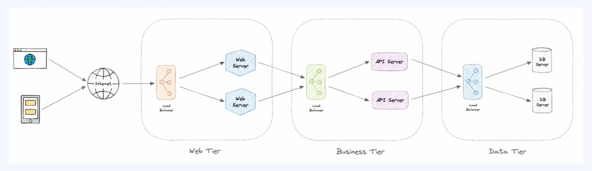
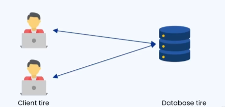

### 🔷🔶🔷 Chapter 1: N-Tier Architecture

---

### 🔷🔶🔷 Introduction — What is N-Tier Architecture?

    🔹 N-Tier Architecture is also known as Multitier Architecture.

    🔹 It is a software design pattern that structures an
       application into multiple layers, also called multiple tiers.

    🔹 If we take an application as a whole, it can be structured
       into:
        🔸 Presentation Layer
        🔸 Web Tier Layer
        🔸 Business Tier Layer
        🔸 Data Tier Layer

    🔹 Each of these tiers is responsible for a specific function,
       and interacts with adjacent layers to achieve modularity,
       scalability, and maintainability.

    🔹 Each tier communicates with another tier to process the
       user's request and give a response.

    🔹 The "N" in N-Tier represents the number of tiers — it can be:
        🔸 Single tier
        🔸 Two tier
        🔸 Three tier
        🔸 More than three tiers -> called Multi-Tier Architecture

---

### 🔷🔶🔷 The Common Tiers in N-Tier Architecture

---

**🔘 1. Presentation Tier (Client Layer)**

    🔹 Consists of the user interface of the application.

    🔹 This is the layer where the user interacts with the
       application via UI elements — buttons, forms, or plain
       text displayed to the user for navigation.

    🔹 Main role: To provide a user interface to the end user.

    🔹 Technologies used: HTML, CSS, JavaScript, and popular
       frameworks like React, Angular, and Vue.

    🔹 Functionalities:
        🔸 Displaying data to the user.
        🔸 Capturing user inputs and sending them to the business layer.
        🔸 Enhancing user experience through UI and UX improvements.

---

**🔘 2. Web Tier**

    🔹 Role: To handle incoming HTTP requests, and ensure the
       interaction between the user and the application is smooth
       and secure.

    🔹 Technologies used: NGINX servers and Apache servers.

    🔹 Main functionalities:
        🔸 Handling incoming HTTP and HTTPS requests from the
           client, and routing them to the appropriate application server.
        🔸 Managing URL mappings, authentication, and session management.
        🔸 Implementing SSL and TLS encryption.
        🔸 Implementing firewall rules and major access control.

---

**🔘 3. Business Logic Tier (Application Layer)**

    🔹 Role: To process the data given by the user, apply
       business rules and logic to that data, and give an
       appropriate response back to the user.

    🔹 Technologies used: Any technical language — JavaScript,
       Java, .NET, Python, C#, or others.

    🔹 Main functionalities:
        🔸 Handling complex calculations.
        🔸 Performing data validation.
        🔸 Performing authorization checks and other business
           specific operations on data before presenting it back to the user.
        🔸 Communicating with the data layer to fetch or update
           information as requested by the user.

**🟠 Examples**

    🔹 In an e-commerce application like Amazon.com:
        🔸 Calculating the shipping cost of an order based on the
           user's address -> handled by the application/business
           logic layer.
        🔸 Calculating a discount for a specific user based on
           their buying/purchasing pattern -> this logic also
           resides in the business logic layer.

    🔹 All logic and business-related decisions should be
       implemented in the business logic layer.

---

**🔘 4. Data Access Layer (Persistence Layer)**

    🔹 Role: To manage data storage, and retrieve data when
       requested by the user.

    🔹 Technologies used: Database technologies like MySQL,
       PostgreSQL, MongoDB, or any other DBMS.

    🔹 Functionalities:
        🔸 Storing the data.
        🔸 Retrieving data as requested by the user, another
           application, or the business logic layer.
        🔸 Securing the data and maintaining data integrity.

---

### 🔷🔶🔷 How These Tiers Fit Into Real-World Architectures

    🔹 In practice, there are two commonly used architecture patterns:

        🔸 1. Two-Tier Architecture
        🔸 2. Three-Tier Architecture

---

### 🔷🔶🔷 1. Two-Tier Architecture

    🔹 As the name suggests, applications built using two-tier
       architecture contain two distinct layers:
        🔸 The Client Layer (Presentation Layer)
        🔸 The Database Tier (Data Layer)

    🔹 In this type of application:
        🔸 The business logic is embedded within the presentation layer.
        🔸 The presentation layer communicates directly with the
           database layer to retrieve or store data.

    🔹 This type of architecture is commonly used in small-scale
       applications, where direct communication between the
       client and the database is sufficient.

**🔘 Advantages of Two-Tier Architecture**

    🔸 1. Simple and Fast
        - Direct communication between client and database
          reduces latency — the time between request and response is less.

    🔸 2. Easy to Develop, Deploy, and Debug
        - These applications are easy to develop and deploy, and
          debugging is also quite easy.

    🔸 3. Lower Cost
        - Since there are only two layers, the number of
          resources required (servers, load balancers, etc.) is
          less compared to multi-tier architecture.

**🔘 Disadvantages of Two-Tier Architecture**

    🔸 1. Scalability
        - As the number of users increases, application
          performance degrades, since load balancing options in
          the presentation layer are limited.

    🔸 2. Risk of Security
        - Since the presentation layer (front end) directly
          accesses the database layer, there is limited
          authorization and authentication mechanism, making it
          more prone to attacks.

    🔸 3. Difficult to Maintain Business Logic
        - Since the business logic is embedded in the
          presentation layer, even a small change in business
          logic requires the entire presentation layer to be redeployed.
        - Similarly, any changes in UI components require the
          business logic to be redeployed, since both are tightly coupled.
        - This becomes a hindrance to maintaining such applications.

---

### 🔷🔶🔷 2. Three-Tier Architecture

    🔹 As the name suggests, applications built using three-tier
       architecture have three separate layers:
        🔸 The Client Tier (Presentation Layer)
        🔸 The Application Tier (Business Logic Layer)
        🔸 The Database Layer

    🔹 Roles:
        🔸 The client tier / presentation layer provides the user interface.
        🔸 All requests are processed by the business logic layer.
        🔸 All data requested by the user is stored in the database layer.

    🔹 Each layer in this type of architecture has its own
       predefined functions to process the user request.

    🔹 This type of architecture ensures scalability,
       maintainability, and security of the application.

**🔘 Advantages of Three-Tier Architecture**

    🔸 1. Scalability
        - Each layer can be scaled independently.
        - If there are more incoming requests, the number of
          servers allotted for the application/business logic
          tier can be increased, so the application performs
          faster and more efficiently.

    🔸 2. Maintainability
        - Since the business logic is not coupled with the
          presentation layer, updates can be made to the business
          logic layer without affecting the presentation layer, and vice versa.
        - It becomes easier to modify or update one layer without
          affecting the other layers.

    🔸 3. Security
        - All sensitive operations, like authentication and
          authorization, are handled by the protected backend
          (the business logic layer).

    🔸 4. Reusability
        - Business logic and the database can be reused across
          multiple client interfaces.
        - There doesn't need to be only one presentation layer —
          the presentation layers of different applications can
          interact with the same business logic, since the
          presentation layer and the business logic layer are not tightly coupled.

**🔘 Disadvantages of Three-Tier Architecture**

    🔸 1. Complexity
        - Additional infrastructure is required to maintain the
          business logic layer, increasing the complexity of
          connecting and maintaining the different layers so the
          user request can be handled smoothly and securely.
        - Some time delays are introduced while communicating
          between different layers, increasing latency.

    🔸 2. Additional Cost
        - Since more infrastructure is required for a three-tier
          architecture, there is additional cost compared to
          two-tier architecture.

---

### 🔷🔶🔷 Summary — N-Tier Architecture at a Glance

    🔸 N-Tier Architecture ->  A software design pattern that
                              structures an application into
                              multiple layers/tiers (presentation,
                              web, business, data), each
                              responsible for a specific function,
                              to achieve modularity, scalability,
                              and maintainability.

    🔸 Presentation Tier   ->  User interface layer — HTML, CSS,
                              JavaScript, React, Angular, Vue;
                              displays data, captures input,
                              improves UX.

    🔸 Web Tier            ->  Handles HTTP/HTTPS requests, URL
                              mapping, authentication, session
                              management, SSL/TLS, and firewall
                              rules — e.g. NGINX, Apache.

    🔸 Business Logic Tier ->  Processes data, applies business
                              rules, performs validation and
                              authorization — e.g. JavaScript,
                              Java, .NET, Python, C#.

    🔸 Data Access Tier    ->  Manages data storage and retrieval,
                              and ensures data security/integrity
                              — e.g. MySQL, PostgreSQL, MongoDB.

    🔸 Two-Tier            ->  Presentation layer (with embedded
       Architecture             business logic) talks directly to
                              the database layer. Simple, fast,
                              cheap — but poor scalability,
                              security risk, and hard to maintain
                              business logic. Used for small-scale applications.

    🔸 Three-Tier          ->  Separate presentation, business
       Architecture             logic, and database layers.
                              Scalable, maintainable, secure, and
                              reusable — but more complex and
                              costly, with slightly higher latency.

    🔹 Choosing between two-tier and three-tier (or more) N-Tier
       architecture depends on the scale, security, and
       maintainability requirements of the application.

---