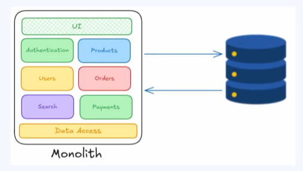
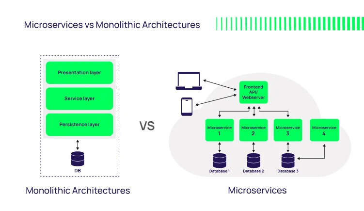
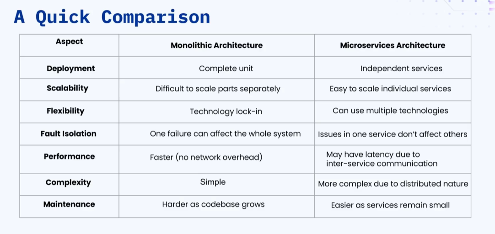

### 🔷🔶🔷 Chapter 2: Monolith and Microservices Architecture

---

### 🔷🔶🔷 Introduction — What Does "Monolith" Mean?

    🔹 "Mono" means single, "Lith" means stone -> Monolith = single stone.

    🔹 Real-world example: There are ancient single-stone
       structures — for example, a temple in India that is
       entirely carved out of a single stone. This is a classic
       example of a monolithic structure.

    🔹 A structure carved out of a single stone is called a
       Monolithic Structure.

---

### 🔷🔶🔷 What is Monolithic Architecture?

    🔹 Monolithic Architecture is a traditional software
       development approach where an entire application is built
       as a single, unified unit.

**🟠 Illustration**

    🔹 Example: An e-commerce application.

    🔹 All the services provided by the application — such as
       authentication, product management, user management,
       order services, search services, and different payment
       services — are all present in the same application.

    🔹 Not only the services, but ALL components — the user
       interface, business logic, and data access layers — are
       present in the same code base, in the same application.

    🔹 This application is deployed as a single executable unit,
       or a single package.

    🔹 All these services perform inter-process communication to
       process the user request.

    🔹 In some cases, the UI component/presentation layer can be
       a separate application, but all the services and important
       components remain part of the same application.

    🔹 In short: if all components are built in the same code
       base and the same application, that is a Monolithic Architecture.

---

### 🔷🔶🔷 Key Characteristics of Monolithic Architecture

**🔘 1. Single Code Base**

    🔸 All the services of the application — authentication
       service, product service, user service, order service, and
       so on — are present in the same code base, inside the same
       application.

**🔘 2. Tightly Coupled Services**

    🔸 If one service is not working as expected, or has bugs or
       errors, the ENTIRE application is going to go down —
       the entire application stops working.
    🔸 Hence, it is crucial that a monolithic application has no
       bugs or errors.
    🔸 If changes are made to one service (e.g. the
       authentication service), the ENTIRE application needs to
       be redeployed — even though other services are not
       affected — because it is a single application.

**🔘 3. Shared Memory**

    🔸 Since the application contains multiple services, all
       these services share the same primary memory of the
       server, because it is deployed as a single unit.
    🔸 If there are a lot of users using the application, memory
       usage will be very high.

**🔘 4. Centralized Database**

    🔸 All the services make use of the same centralized database.
    🔸 If the database goes down or becomes unavailable for any
       reason, ALL of the services will stop working altogether.

---

### 🔷🔶🔷 Advantages of Monolithic Architecture

**🔘 1. Simplicity in Development**

    🔸 Since all components — UI, business logic layer (different
       services), and data access layer — are all present in a
       single code base, development is straightforward.
    🔸 There is no complexity involved, and no need to manage
       complex inter-service communications like in microservices.

**🔘 2. Faster Deployment**

    🔸 Deployment is simple — the entire application is packaged
       and deployed as a single application at once.
    🔸 There is no need to coordinate multiple services, and no
       need to allocate multiple hardware for deployment.
    🔸 Only a single hardware/server is sufficient — making
       updates and deployments easier.

**🔘 3. Performance Efficiency**

    🔸 Communication between different services happens within
       the same process — making it faster compared to the
       network costs present in microservices.
    🔸 There's no need to make external network calls or call
       external APIs for different services — all services are
       hosted on the same server.
    🔸 This makes inter-process communication always faster,
       leading to a performance-efficient application.

**🔘 4. Easy Monitoring and Testing**

    🔸 A single application to monitor, plus a centralized
       database, allows for centralized logging and error
       tracking — making debugging easier.
    🔸 Testing is straightforward, since everything runs within
       the same system, eliminating the need for complex service
       dependency management.

---

### 🔷🔶🔷 Disadvantages of Monolithic Architecture

**🔘 1. Scalability Challenges**

    🔸 Example: If the application becomes popular and more
       vendors want to add more products, dedicated resources
       would be needed just for the product service.
    🔸 But in a monolithic application, resources cannot be
       allocated to a single service — the hardware for the
       COMPLETE server hosting the complete application must be
       upgraded.
    🔸 Hence, scaling a specific service becomes a challenge.

**🔘 2. Growing Code Base is Hard to Manage**

    🔸 As the application becomes larger, the code base grows,
       making it difficult to manage and make changes to
       individual services.
    🔸 Even changes to specific services require the entire
       application to be redeployed, which might impact other services.
    🔸 Development for large applications built on monolithic
       architecture becomes challenging.

**🔘 3. Limited Flexibility in Technology Stack**

    🔸 Since everything is unified, switching technologies for a
       specific component is difficult.
    🔸 Example: If the entire application is built in Java, but
       the payments and orders services (which have a lot of
       transactions/requests) need a more performance-efficient
       language like Golang or Rust — this is NOT possible.
    🔸 Since it is a monolith application, a single language must
       be used to develop the entire application.

---

### 🔷🔶🔷 What is Microservices Architecture?

    🔹 Microservices Architecture is a software development
       approach where an application is built as a collection of
       small, independent services.

**🟠 Illustration**

    🔹 In a monolith, all services are in a single application.

    🔹 In microservices, each service is deployed as a separate
       application, in a separate server:
        🔸 Product -> independent application, independent server.
        🔸 Order -> independent application, independent server.
        🔸 User, Analytics, and other services -> each is a
           separate independent application, deployed on separate servers.

    🔹 Communication between different microservices happens
       through Application Programming Interfaces (APIs).

    🔹 Each microservice is designed to perform a specific
       business functionality:
        🔸 Order service -> handles all order related operations.
        🔸 Product service -> handles all product related operations.
        🔸 User service -> handles all user related activities.

    🔹 Each service can be independently developed, independently
       deployed, and scaled independently.

---

### 🔷🔶🔷 Key Characteristics of Microservices Architecture

**🔘 1. Independently Deployed**

    🔸 Each service can be independently developed, updated, and deployed.
    🔸 Deploying a single service does not affect the other services.

**🔘 2. Decentralized Data Management**

    🔸 In a monolith, there is a single database used by all services.
    🔸 In microservices, each microservice has its own database —
       and these can be different types of databases.
    🔸 Example:
        - Product microservice -> Object storage
        - Authentication microservice -> Document DB
        - User microservice -> Relational database
    🔸 Each independent service maintains its own database,
       making database management decentralized.

**🔘 3. Technology Diversity**

    🔸 Each microservice can be developed using a different technology stack.
    🔸 Example:
        - Analytics service -> Rust
        - User microservice -> Java
        - Product microservice -> Golang
    🔸 Diverse technology stacks can be used according to the
       requirement of each independent service.

**🔘 4. Scalability and Fault Tolerance**

    🔸 Example: In an e-commerce application during a sale, the
       number of orders (and thus traffic on the order
       microservice) increases.
    🔸 To handle this, additional servers can be added ONLY to the
       order service — there's no need to add servers to other services.
    🔸 Only the microservices experiencing high traffic can be
       scaled, making individual services highly scalable.

**🔘 5. API-Based Communication**

    🔸 Communication between different services happens through APIs.
    🔸 This can be through REST protocol, gRPC, WebSocket, etc.
    🔸 The key point: communication between microservices always
       happens through APIs.

---

### 🔷🔶🔷 Advantages of Microservices Architecture

**🔘 1. Loosely Coupled Services**

    🔸 Making changes to one service does not affect the other services.

**🔘 2. Independent Deployment**

    🔸 A single service can be updated and deployed independently
       without affecting other services.
    🔸 Other services are unaffected by the redeployment of a
       single service.

**🔘 3. Agility for Multiple Development Teams**

    🔸 Highly agile for large teams — work can be distributed
       across individual teams.
    🔸 Example: Team 1 works on authentication service, Team 2 on
       product service, Team 3 on user service, and so on.

**🔘 4. Improved Fault Tolerance**

    🔸 Failure of one service does not bring down the entire application.
    🔸 Other services can still function even if one microservice
       fails — making the architecture highly fault tolerant.

**🔘 5. Data Isolation**

    🔸 Since each microservice maintains its own database, there
       is decentralization and isolation of data.

**🔘 6. High Scalability**

    🔸 The capacity of a single service can be increased without
       affecting other services.
    🔸 This makes scalability very high, without incurring a large cost.

**🔘 7. No Long-Term Technology Lock-In**

    🔸 Eliminates any long-term commitment to a particular technology stack.
    🔸 Example: The product service can be developed today in
       Java, but the technology stack can independently be
       changed later (e.g. to Golang) without affecting other services.

---

### 🔷🔶🔷 Disadvantages of Microservices Architecture

**🔘 1. Complexity**

    🔸 Individual microservices deployed on separate servers must
       be maintained.
    🔸 Requires writing deployment scripts, maintaining individual
       servers, and maintaining separate databases.
    🔸 The overall complexity of the architecture increases.

**🔘 2. Difficult Testing**

    🔸 Individual services must be tested, AND how each individual
       service behaves with other services must also be tested.
    🔸 This makes testing significantly harder.

**🔘 3. Expensive to Maintain**

    🔸 Requires deploying separate servers and separate databases
       for each service.
    🔸 The cost of maintaining all these databases and servers increases.
    🔸 Additionally, load balancers and API gateways need to be
       added for each server, further increasing the cost of
       maintaining this type of architecture.

**🔘 4. Inter-Service Communication Challenges**

    🔸 Requires accounting for service discovery, service mesh,
       and how individual services talk to each other.
    🔸 All these become challenges — to be covered in separate
       videos related to inter-service communication (service
       discovery and service mesh).

---

### 🔷🔶🔷 Monolithic vs Microservices — Quick Comparison

**🔘 1. Deployment**

    🔸 Monolithic -> Deployed as a whole unit; all services
       packaged into a single application, deployed as one complete unit.
    🔸 Microservices -> Each service is an independent
       application; each service can be deployed independently.

**🔘 2. Scalability**

    🔸 Monolithic -> Cannot individually scale a single service.
    🔸 Microservices -> Since independently deployed, a specific
       service can be scaled independently.

**🔘 3. Flexibility**

    🔸 Monolithic -> NOT flexible in technology — has a
       technology lock-in; changing the technology of a single
       service requires changing the technology stack of all services.
    🔸 Microservices -> Multiple different technologies can be
       used for different services — highly flexible.

**🔘 4. Fault Tolerance**

    🔸 Monolithic -> If the application fails, ALL services in
       the application fail — very low fault tolerance.
    🔸 Microservices -> Since services are independently deployed,
       if one service fails, the other services are still up and running.

**🔘 5. Performance**

    🔸 Monolithic -> All services are in the same application, so
       communication between services is very fast — it does not
       happen over a network, but inside the same server.
    🔸 Microservices -> Different services are deployed on
       different servers, so communication happens over the
       network, introducing latency — performance is lower
       compared to monolithic architecture.

**🔘 6. Complexity**

    🔸 Monolithic -> Easy to deploy, since it is a single application.
    🔸 Microservices -> Complexity increases, since different
       servers must be maintained for different services.

**🔘 7. Maintenance**

    🔸 Monolithic -> Harder to maintain as the application grows.
    🔸 Microservices -> Easier to maintain individual services as
       the application grows.

---

### 🔷🔶🔷 Which Architecture Should Be Used?

    🔹 The answer depends on the use case.

    🔹 If starting small and needing fast development with less
       complexity -> Monolithic Architecture is the better choice.

    🔹 If the application is expected to become very large in the
       future, and needs to be maintained across different teams
       -> Microservices Architecture is the better solution in
       the long run.

    🔹 Usually, startups or companies starting a new project
       first begin with Monolithic Architecture, and as the
       project grows, they shift to Microservices Architecture.

    🔹 Business goals, team expertise, and project requirements
       should all be considered while deciding between monolith
       or microservices architecture.

---

### 🔷🔶🔷 Summary — Monolith & Microservices at a Glance

    🔸 Monolithic          ->  Entire application built as a
       Architecture             single unified unit — single code
                              base, tightly coupled services,
                              shared memory, centralized database.
                              Simple, fast to deploy, performant,
                              easy to monitor/test — but hard to
                              scale specific services, hard to
                              manage as it grows, and locked into
                              a single technology stack.

    🔸 Microservices       ->  Application built as a collection
       Architecture             of small, independent services —
                              independently deployed, decentralized
                              data, technology diversity, granular
                              scalability, API-based communication.
                              Loosely coupled, independently
                              deployable, agile for large teams,
                              fault tolerant, highly scalable, no
                              tech lock-in — but complex, harder
                              to test, expensive to maintain, and
                              introduces inter-service
                              communication challenges.

    🔸 Choosing Between    ->  Depends on the use case — monolith
       the Two                  for starting small/fast with less
                              complexity; microservices for large
                              applications maintained by multiple
                              teams over the long run. Most
                              startups begin with monolith and
                              transition to microservices as they grow.

    🔹 There is no universally "better" architecture — the right
       choice depends on business goals, team expertise, and
       project requirements.

---