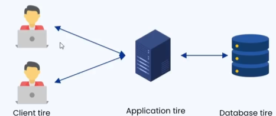
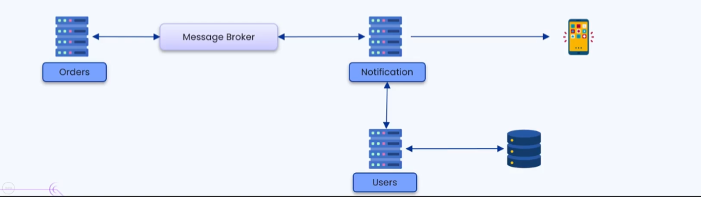
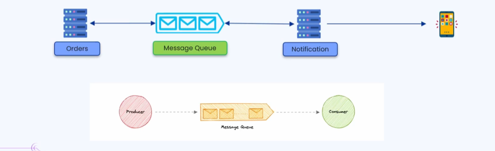
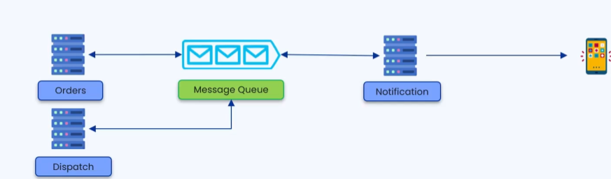
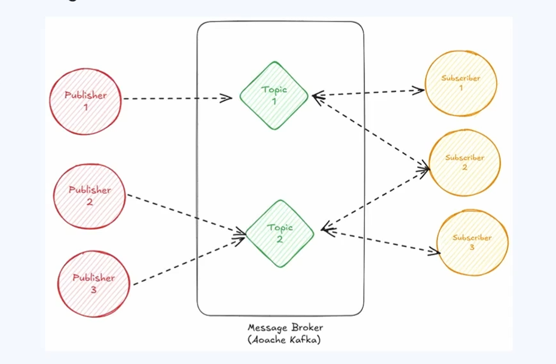
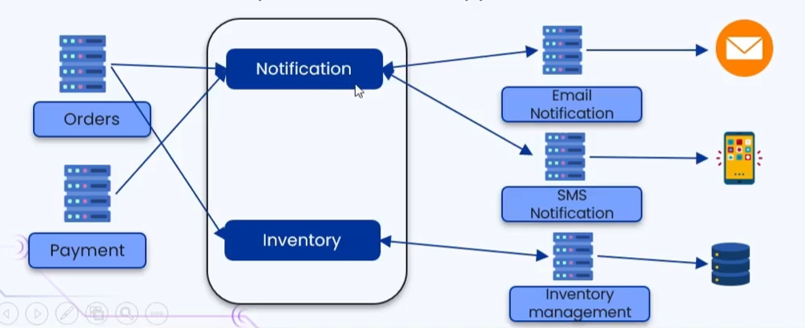

### 🔷🔶🔷 Chapter 3: Message Brokers

---

### 🔷🔶🔷 Introduction — Why Message Brokers?

    🔹 Before understanding Message Brokers, we need to understand
       how communication happens between microservices in a
       distributed system.

    🔹 Example: An e-commerce application with multiple microservices:
        🔸 Order Service       -> used for placing the order
        🔸 Notification Service -> used for sending notifications
                                   about an order to the user
        🔸 User Service        -> used for fetching user data
                                   from the database

    🔹 Each of these services is an individual microservice,
       deployed on a separate, individual server.

---

### 🔷🔶🔷 Synchronous Communication — The Problem

    🔹 In a basic setup (without a message broker), all services
       communicate **synchronously**.

    🔹 Synchronous Communication -> One service sends a request
       and then waits (blocks) until it receives a response from
       the other service before it can proceed.

    🔹 Because each service depends on a response from another
       service before it can continue, the services are said to
       be **tightly coupled**.

**🟠 Example Flow (Synchronous)**

    🔹 A user places an order successfully.
    🔹 Order Service sends a request payload to Notification Service,
       and waits for a response.
    🔹 Notification Service calls User Service to fetch user
       details (email/phone number).
    🔹 User Service returns the user data to Notification Service.
    🔹 Notification Service sends the notification to the user.
    🔹 Notification Service sends a success response back to
       Order Service.
    🔹 Only after this entire chain completes does Order Service
       move on to its next task.

**🔘 Issues With Synchronous, Tightly Coupled Communication**

    🔸 1. Increased Latency
        - The total time taken to process a request and return a
          response is high, since every downstream service in the
          chain must finish before the caller can proceed.
        - If any one service (e.g., User Service) is slow, the
          entire request chain slows down.

    🔸 2. System Overload & Performance Degradation
        - With only a handful of requests, CPU utilization stays
          low even with the added latency.
        - At real-world scale (thousands of concurrent requests),
          services spend more time waiting, CPU utilization rises,
          and overall server performance degrades.

    🔸 3. Data Loss and Poor Error Handling
        - Example: The order is placed successfully, but while
          notifying the user, User Service fails/errors out.
        - Notification Service returns a failure response to
          Order Service, and the notification is never sent.
        - The order was placed correctly, but the user has no
          confirmation and is left confused — the message is lost
          forever, and the failure of one downstream service
          breaks the entire chain.
        - Result: a poor user experience caused by a single point
          of failure.

---

### 🔷🔶🔷 What Is a Message Broker?

    🔹 A **Message Broker** is a software service/component
       introduced between microservices to make their
       communication **asynchronous** instead of synchronous.

    🔹 It is deployed on its own separate server and does not
       share resources with any of the other microservices.

    🔹 Role: To receive messages from a sender, and take on the
       responsibility of reliably delivering them to the intended
       receiver(s) — including handling retries on failure.

**🟠 Example Flow (With a Message Broker)**

    🔹 Order Service sends its message to the Message Broker and
       immediately moves on to process other requests — it does
       **not** wait for a response.
    🔹 The Message Broker takes responsibility for delivering the
       message to Notification Service and ensuring it gets a
       successful response.
    🔹 Since Order Service is no longer waiting on Notification
       Service, the two services are now **loosely coupled**.

**🔘 How Message Brokers Solve the Synchronous Problems**

    🔸 1. Reduced Latency & Better Performance
        - Order Service doesn't block while waiting for a
          response; it can immediately process other requests.
        - Since services spend less time waiting, CPU utilization
          drops and overall server performance improves.

    🔸 2. Reliable Error Handling (No Data Loss)
        - If Notification Service fails to get user data (e.g.,
          User Service is down), it returns a failure message to
          the Message Broker instead of the request being lost.
        - Based on user-defined configuration, the Message Broker
          **retries** delivering the same message (e.g., retry 5
          times, retry every fixed interval) until it succeeds.
        - This retry/error-handling responsibility is offloaded
          from Order Service entirely onto the Message Broker.

---

### 🔷🔶🔷 Types of Message Brokers

    🔹 There are two major models of message brokers:
        🔸 1. Point-to-Point Model -> Message Queues
        🔸 2. Publish-Subscribe Model -> Pub/Sub

---

### 🔷🔶🔷 1. Point-to-Point Model (Message Queues)

    🔹 A **Message Queue** is a form of service-to-service
       communication that facilitates asynchronous communication
       between exactly one sender and one receiver.

    🔹 Terminology:
        🔸 **Producer** -> the service that sends/produces
           messages into the queue (e.g., Order Service).
        🔸 **Consumer** -> the service that reads/consumes
           messages from the queue (e.g., Notification Service).

    🔹 Flow:
        🔸 The Producer places messages into the Message Queue.
        🔸 The Message Queue stores the messages until they are
           picked up.
        🔸 The Consumer reads (consumes) the message from the queue.
        🔸 Once a message has been successfully consumed, the
           Message Queue deletes it from the queue.

**🔘 Key Characteristics**

    🔸 1. One Producer — One Consumer
        - A message placed in the queue is delivered to only
          **one** consumer; it cannot be delivered to multiple
          consumers.

    🔸 2. Processed Only Once
        - Once a message has been successfully delivered and
          consumed, it is removed from the queue and cannot be
          re-sent, even if requested again.

**🔘 Features of Message Queues**

    🔸 1. FIFO (First In, First Out)
        - The oldest message in the queue is processed before
          any newer messages.

    🔸 2. Ordering
        - Messages are generally delivered in the same order in
          which they were sent.
        - Example: An "order placed" message must always reach
          the user before a "dispatched" message for the same
          order — otherwise the user experience is confusing.
          The queue preserves this sequence.

    🔸 3. Scheduling
        - Producers can produce messages at any time, but the
          queue can be configured to deliver them on a
          predefined schedule if needed.

    🔸 4. At-Least-Once Delivery
        - If delivery to the consumer fails, the message queue
          retries later (based on configuration) to guarantee the
          message is delivered at least once.

    🔸 5. Exactly-Once Processing (No Duplication)
        - Alongside guaranteeing delivery, the queue also ensures
          messages aren't duplicated, so each message is
          effectively processed only once.

**🔘 Real-World Examples**

    🔸 Tools: AWS Simple Queue Service (SQS), RabbitMQ
    🔸 Use cases: SMS services, notification services, inventory
       management services.

---

### 🔷🔶🔷 2. Publish-Subscribe Model (Pub/Sub)

    🔹 The **Pub/Sub Model** is also a form of asynchronous
       service-to-service communication, but unlike message
       queues, it supports **multiple consumers** per message.

    🔹 Core Concepts:
        🔸 **Topic** -> a named channel that messages are
           published to.
        🔸 **Publisher** -> a service that publishes/sends
           messages to a specific topic. A topic can have
           multiple publishers.
        🔸 **Subscriber (Consumer)** -> a service that subscribes
           to one or more topics to receive the messages
           published to them.

    🔹 Example Setup:
        🔸 Subscriber 1 subscribes to Topic 1 only -> receives
           only Topic 1 messages.
        🔸 Subscriber 2 subscribes to Topic 1 and Topic 2 ->
           receives messages from both topics.
        🔸 Subscriber 3 subscribes to Topic 2 only -> receives
           only Topic 2 messages.
        🔸 Topic 2 can have multiple publishers (e.g., Publisher 2
           and Publisher 3) sending messages to it.

    🔹 Key Difference from Message Queues:
        🔸 In a message queue, a message goes to exactly **one**
           consumer.
        🔸 In Pub/Sub, a single message published to a topic can
           be delivered to **multiple** subscribers at once.

**🟠 Example: E-Commerce Application Using Pub/Sub**

    🔹 Microservices: Order Service, Payment Service, Email
       Notification Service, SMS Notification Service, Inventory
       Management Service.

    🔹 Message Broker Topics: Notification Topic, Inventory Topic.

    🔹 Subscriptions:
        🔸 Email Notification Service & SMS Notification Service
           -> subscribe to the Notification Topic.
        🔸 Inventory Management Service -> subscribes to the
           Inventory Topic.

    🔹 Flow:
        🔸 When an order is placed, Order Service publishes a
           message to both the Notification Topic and the
           Inventory Topic.
        🔸 The Notification Topic message is picked up by both
           Email and SMS Notification Services, which each send
           out their respective notification.
        🔸 The Inventory Topic message is picked up by the
           Inventory Management Service, which updates stock
           (e.g., decreases quantity by one, or marks the product
           unavailable if it was the last unit).
        🔸 Similarly, when a payment is successfully processed,
           Payment Service publishes a message to the
           Notification Topic, which is broadcast to both Email
           and SMS Notification Services.

**🔘 Features of Pub/Sub Model**

    🔸 1. Loose Coupling
        - Publishers and subscribers do not need to know about
          each other directly; the broker mediates all communication.

    🔸 2. Asynchronous Messaging
        - The publisher sends a message and moves on to its next
          task without waiting for an immediate response from
          any subscriber.

    🔸 3. One-to-Many Communication
        - A single message from one publisher can be delivered to
          multiple subscribers in a single publish action — this
          is the defining feature of Pub/Sub.

    🔸 4. Filtering and Routing
        - Subscribers can subscribe to only the specific topics
          relevant to them (e.g., only "sports" or only "finance"
          updates), so they receive just the updates they care about.

**🔘 Real-World Examples**

    🔸 Most popular tool: Apache Kafka
    🔸 Use cases: Broadcasting systems (sending notifications to
       multiple devices at once), video streaming services,
       content delivery networks (CDNs).

---

### 🔷🔶🔷 Message Queue vs Pub/Sub — Quick Comparison

    🔸 Communication Style -> Both are asynchronous.

    🔸 Consumers per Message
        - Message Queue: exactly one consumer.
        - Pub/Sub: one or many subscribers.

    🔸 Coupling
        - Message Queue: producer and consumer are decoupled from
          direct dependency, but still communicate 1:1.
        - Pub/Sub: publishers and subscribers are fully decoupled
          — they don't need to know about each other at all.

    🔸 Message Lifecycle
        - Message Queue: message is deleted once consumed by its
          single consumer.
        - Pub/Sub: message is delivered to every current
          subscriber of the topic it was published to.

    🔸 Typical Tools
        - Message Queue: AWS SQS, RabbitMQ.
        - Pub/Sub: Apache Kafka.

    🔸 Typical Use Cases
        - Message Queue: SMS services, notifications, inventory
          management (single, definite handler per task).
        - Pub/Sub: broadcasting, video streaming, CDNs (many
          interested parties per event).

---

### 🔷🔶🔷 Summary — Message Brokers at a Glance

    🔸 Synchronous Communication -> Sender waits for the receiver's
                                    response before proceeding;
                                    leads to tight coupling between
                                    services.

    🔸 Problems of Synchronous
       Communication              -> Increased latency, system
                                    overload/performance
                                    degradation under high load,
                                    and data loss with poor error
                                    handling on downstream failures.

    🔸 Message Broker             -> A separately deployed
                                    software service that sits
                                    between microservices, making
                                    their communication
                                    asynchronous, loosely coupled,
                                    and reliable (via retries).

    🔸 Point-to-Point Model
       (Message Queue)            -> One producer, one consumer;
                                    FIFO order, guaranteed
                                    ordering, scheduling support,
                                    at-least-once delivery, and
                                    no duplication. E.g., AWS SQS,
                                    RabbitMQ.

    🔸 Publish-Subscribe Model
       (Pub/Sub)                  -> Multiple publishers and
                                    multiple subscribers organized
                                    around topics; supports
                                    one-to-many delivery, loose
                                    coupling, and topic-based
                                    filtering/routing. E.g.,
                                    Apache Kafka.

    🔹 Choosing between a Message Queue and a Pub/Sub model
       depends on whether a message needs to reach exactly one
       consumer (task-style processing) or needs to be broadcast
       to multiple interested subscribers at once (event-style
       broadcasting).

---