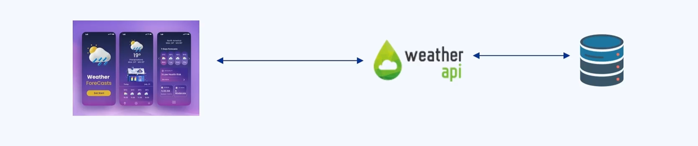
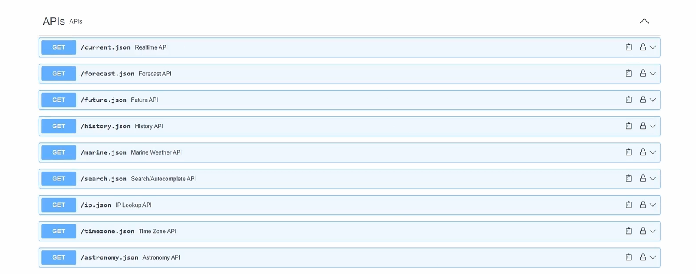
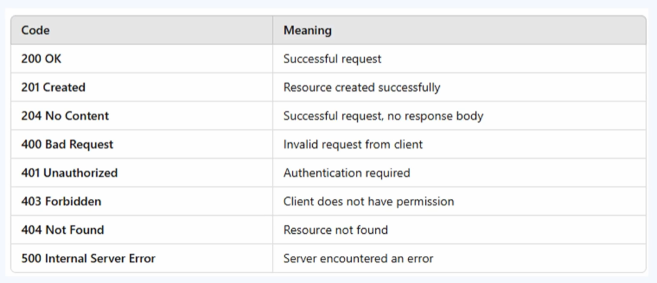

### 🔷🔶🔷 Chapter 4: API — Application Programming Interface

---

### 🔷🔶🔷 Introduction — The Problem API Solves

    🔹 In a distributed environment (like microservices),
       different services need to communicate with each other to
       perform a specific task.

**🟠 Example — Order Service & Payment Service**

    🔹 Take an e-commerce application with two microservices:
        🔸 Order Service
        🔸 Payment Service — which offers functions like: Process
           Payment, Get Payment Status, Initiate Refund, Get
           Refund Status, Cancel Payment, and others.

    🔹 Three key questions arise:

        🔸 1. How are the two microservices communicating with each other?
        🔸 2. How does the Order Service get to know all the
           functions present in the Payment Service (e.g. Process
           Payment, Get Payment Status, Get Refund Status)?
        🔸 3. How does the Order Service know the parameters or
           request payload that needs to be sent to each of these functions?

    🔹 The answer to all these questions is: The API.

---

### 🔷🔶🔷 What is an API?

    🔹 API stands for Application Programming Interface.

    🔹 An API is a set of rules and protocols that allows
       different software applications to communicate with each other.

    🔹 In a microservice environment:
        🔸 Order Service is a software application, deployed on a separate server.
        🔸 Payment Service is a different microservice — a
           software application deployed independently of the order service.
        🔸 The API facilitates communication between these
           different services.

    🔹 The API defines:
        🔸 How requests should be made.
        🔸 What the expected response is, if the request is made
           according to the defined rules.

    🔹 It is the responsibility of the API to define the request
       and response structure, so different systems can exchange
       data efficiently.

    🔹 In this example, the API defines to the Order Service what
       request parameters need to be sent, so the Payment Service
       can process the request and respond accordingly.

---

### 🔷🔶🔷 Understanding API With a Non-Technical Analogy — The Restaurant

    🔹 Imagine going to a restaurant for lunch.

    🔹 You don't walk directly into the kitchen and place your
       order with the chef.

    🔹 Instead:
        🔸 You sit at a table and wait for the waiter.
        🔸 The waiter gives you a menu of available dishes.
        🔸 You choose a dish FROM that menu and place the order
           with the waiter (you cannot invent your own dish and
           ask the waiter to have it prepared).
        🔸 The waiter takes your order to the kitchen and gives
           it to the chef.
        🔸 The chef prepares the dish and gives it to the waiter.
        🔸 The waiter serves you the dish.

    🔹 Mapping this to API terms:
        🔸 You -> The Client
        🔸 The Waiter -> The API
        🔸 The Chef (in the kitchen) -> The Server

    🔹 It is the responsibility of the waiter (the API) to receive
       the request from the client and deliver the proper response.

---

### 🔷🔶🔷 How Does an API Work?

    🔹 Taking the same example: Order Service and Payment
       Service, communicating via an API in between.

**🟠 URI — Uniform Resource Identifier**

    🔹 The Order Service needs to find the URI of the API — the
       Uniform Resource Identifier, used to communicate with the API.

    🔹 Example: If the payment service runs on a local machine on
       a particular port, that address forms the URI of the API.

    🔹 Another example: A weather application API — to know the
       weather condition of a particular location, a request is
       sent to that API's URI.

    🔹 The URI is the location where the API accepts requests and
       returns responses. Using the respective URI of a specific
       API, we can communicate with the backend servers.

**🟠 Flow of an API Request**

    🔹 Step 1: The client (e.g. Order Service) makes a request to the API.

    🔹 Step 2: The API sends that request to the server.

    🔹 Step 3: The server processes the request and gives the
       response back to the API.

    🔹 Step 4: The API transfers that response data back to the client.

    🔹 The API acts as a middleman between the two services,
       facilitating communication.

**🟠 Client and Server**

    🔹 Client -> The service making a request.

    🔹 Server -> The service processing the request and giving out a response.

    🔹 Important: The client need NOT only be a microservice — it
       can be anything making a request:
        🔸 A device making a request to the server.
        🔸 A web application making a request to the server.
        🔸 Anything that makes a request to the server becomes the client.

    🔹 Communication between the client and the server always
       happens via the API.

---

### 🔷🔶🔷 Real-Time Example — Using a Weather API

    🔹 Scenario: Building a web application that needs weather
       condition data for different geographical areas.

    🔹 It's not feasible to launch satellites to collect this
       data personally.

    🔹 Instead, the data already collected by other organizations
       — such as a dedicated Weather API — can be used.

    🔹 The application communicates with the Weather API to get
       the weather condition of a particular location, and
       displays it to the user.

    🔹 To make this communication happen, the Weather API
       provides a set of rules and protocols to follow — typically
       documented via Swagger Documentation (or similar API
       documentation tools).

**🟠 Exploring the Swagger Documentation**

    🔹 The documentation shows the Base URL — the URI of the API
       — the location where client requests should be sent.

    🔹 The Weather API offers multiple services/functions, such as:
        🔸 Get current weather conditions.
        🔸 Get the forecast of weather conditions for a specific region.
        🔸 Get past/history weather conditions for a specific region.

**🟠 Making a Request Using Postman (as the Client)**

    🔹 Postman is used here as the client, instead of building an
       actual weather application.

    🔹 Step 1: Copy the Base URL from the documentation into Postman.

    🔹 Step 2: Set the request type to HTTP, since this is a web request.

    🔹 Step 3: Choose the endpoint — for current weather
       conditions, the endpoint is "/current".

    🔹 Step 4: Add the required parameter:
        🔸 Key: "q"
        🔸 Value: Can be a US zip code, UK postal code, Canada
           postal code, IP address, latitude/longitude, or city name.
        🔸 Example: q = "London"

    🔹 Step 5: Since this API is authenticated, an API key must
       also be passed (obtained from the account/dashboard).
        🔸 Note: API keys should never be exposed to external
           users in real-world/production use.

    🔹 Step 6: Send the request.

**🟠 Response**

    🔹 The API server processes the request and returns a response.

    🔹 Example response for London: weather condition = "Clear",
       along with other details like wind speed (km), wind
       degree, and other weather-related data.

**🟠 Trying Another Endpoint — Forecast**

    🔹 Instead of "/current", use the "/forecast" endpoint.

    🔹 Required parameters:
        🔸 q = "London" (same as before)
        🔸 days = number of days of forecast needed (ranges from
           1 to 14, in this API's case)

    🔹 Example: days = 5 -> requesting a 5-day forecast.

    🔹 Sending this request returns the forecast for the next 5
       days (Day 1 through Day 5).

    🔹 This demonstrates how an API is used to establish
       communication between two services/applications.

---

### 🔷🔶🔷 More Real-World Examples of API Usage

    🔹 Uber uses the Google Maps API to get the location of a
       particular car/driver.

    🔹 E-commerce applications use third-party payment gateway
       APIs, such as the PayPal API, to process payments.

    🔹 Digital marketing companies use the WhatsApp API (or other
       SMS service provider APIs) to send bulk messages and
       promote their business.

**🟠 Public vs Private APIs**

    🔹 All the examples above (Google Maps, PayPal, WhatsApp) are
       Public APIs — these typically charge a small fee for
       consuming their data/services.

    🔹 When it comes to communication between microservices
       within one's own organization, those APIs are Private APIs
       — since the organization develops and owns them, they are
       free to use internally.

---

### 🔷🔶🔷 Additional Core API Concepts

    🔹 The following concepts extend the fundamentals above and
       are commonly essential for a complete understanding of APIs.

**🔘 HTTP Methods (Verbs)**

    🔹 When APIs communicate over HTTP (the most common case),
       requests use specific HTTP methods that indicate the
       action to be performed:

        🔸 GET     -> Retrieve data from the server (e.g. get
                      current weather, get an order's details).
        🔸 POST    -> Send new data to the server to create a
                      resource (e.g. place a new order, process a payment).
        🔸 PUT     -> Update/replace an existing resource entirely.
        🔸 PATCH   -> Partially update an existing resource.
        🔸 DELETE  -> Remove a resource from the server.

**🔘 Common HTTP Status Codes**

    🔹 The server's response includes a status code indicating
       the result of the request:

        🔸 2xx (Success)
            - 200 OK -> Request succeeded.
            - 201 Created -> A new resource was successfully created.

        🔸 3xx (Redirection)
            - 301 Moved Permanently -> Resource has a new permanent URL.

        🔸 4xx (Client Errors)
            - 400 Bad Request -> Malformed request from the client.
            - 401 Unauthorized -> Authentication is missing or invalid.
            - 403 Forbidden -> Client is authenticated but not
              allowed to access the resource.
            - 404 Not Found -> The requested resource doesn't exist.

        🔸 5xx (Server Errors)
            - 500 Internal Server Error -> A generic server-side failure.
            - 503 Service Unavailable -> The server is temporarily
              unable to handle the request.

**🔘 Structure of an API Request**

    🔹 A typical API request consists of:

        🔸 Endpoint / URI -> The address the request is sent to
           (e.g. base URL + "/current").
        🔸 HTTP Method -> GET, POST, PUT, PATCH, DELETE, etc.
        🔸 Headers -> Metadata about the request, such as content
           type (e.g. application/json) or authentication tokens/API keys.
        🔸 Query Parameters -> Key-value pairs appended to the URL
           (e.g. "?q=London&days=5"), often used with GET requests.
        🔸 Request Body / Payload -> The actual data being sent
           (commonly used with POST, PUT, and PATCH requests),
           usually formatted as JSON or XML.

**🔘 Structure of an API Response**

    🔹 A typical API response consists of:

        🔸 Status Code -> Indicates success or failure (as listed above).
        🔸 Headers -> Metadata about the response.
        🔸 Response Body -> The actual data returned by the
           server, typically in JSON or XML format.

**🔘 API Authentication Methods**

    🔹 Since many APIs are not open to everyone, authentication
       mechanisms are used to identify and authorize the client:

        🔸 API Keys -> A unique key passed with each request
           (as seen in the weather API example) to identify the
           calling application.
        🔸 Basic Authentication -> Username and password sent
           with the request (usually encoded, not encrypted).
        🔸 OAuth / OAuth 2.0 -> A token-based authorization
           framework, widely used for secure, delegated access
           (e.g. "Login with Google").
        🔸 JWT (JSON Web Tokens) -> A compact, signed token
           containing claims about the user/client, often used
           for stateless authentication.

**🔘 Common Types/Styles of APIs**

    🔹 REST (Representational State Transfer)
        🔸 The most widely used API style; uses standard HTTP
           methods and is typically stateless, with resources
           identified by URIs.

    🔹 SOAP (Simple Object Access Protocol)
        🔸 A more rigid, XML-based protocol with strict standards;
           commonly used in enterprise and legacy systems (e.g.
           banking, telecom).

    🔹 GraphQL
        🔸 A query language for APIs that allows clients to
           request exactly the data they need, in a single
           request, rather than fetching fixed data structures
           from multiple endpoints.

    🔹 gRPC (Google Remote Procedure Call)
        🔸 A high-performance framework using Protocol Buffers,
           commonly used for fast, efficient communication between
           internal microservices.

**🔘 API Gateway (Brief Note)**

    🔹 In a microservices architecture with many APIs, an API
       Gateway is often used as a single entry point for clients.

    🔹 It can handle routing requests to the appropriate
       microservice, authentication, rate limiting, and load
       balancing — reducing the complexity a client would
       otherwise face when talking to many individual services directly.

---

### 🔷🔶🔷 Summary — API at a Glance

    🔸 API                 ->  A set of rules and protocols that
                              allows different software
                              applications to communicate with
                              each other — defining how requests
                              should be made and what response to expect.

    🔸 Restaurant Analogy  ->  Client = You (making the order);
                              API = The Waiter (relays request and
                              response); Server = The Chef
                              (fulfills the actual request).

    🔸 URI                 ->  The Uniform Resource Identifier —
                              the address/location where the API
                              accepts requests and returns responses.

    🔸 Client & Server     ->  Client = anything that makes a
                              request (a device, web app, or
                              another microservice); Server =
                              whatever processes the request and
                              returns a response. Communication
                              always happens via the API.

    🔸 Real-World Examples ->  Weather APIs, Google Maps API
                              (used by Uber), PayPal API (used by
                              e-commerce apps), WhatsApp API (used
                              for bulk messaging).

    🔸 Public vs Private   ->  Public APIs (e.g. Google Maps,
       APIs                    PayPal, WhatsApp) usually charge a
                              fee; private APIs are used
                              internally within an organization's
                              own microservices, and are free to
                              use internally.

    🔸 HTTP Methods        ->  GET, POST, PUT, PATCH, DELETE —
                              define the type of action the
                              request performs.

    🔸 Status Codes        ->  2xx (success), 3xx (redirection),
                              4xx (client error), 5xx (server
                              error) — indicate the outcome of a request.

    🔸 Request/Response    ->  Requests include endpoint, method,
       Structure                headers, query parameters, and
                              body; responses include status code,
                              headers, and response body.

    🔸 Authentication      ->  API Keys, Basic Auth, OAuth/OAuth
       Methods                  2.0, and JWT are common ways to
                              secure and authorize API access.

    🔸 API Styles          ->  REST (most common, HTTP-based),
                              SOAP (rigid, XML-based, enterprise
                              use), GraphQL (flexible, client
                              specifies exactly what data it
                              needs), gRPC (high-performance,
                              used for internal microservice communication).

    🔸 API Gateway         ->  A single entry point in a
                              microservices architecture that
                              handles routing, authentication, rate
                              limiting, and load balancing for
                              client requests.

    🔹 APIs are the backbone of modern distributed systems —
       enabling different applications, services, and
       microservices to communicate reliably, securely, and
       efficiently with one another.

---