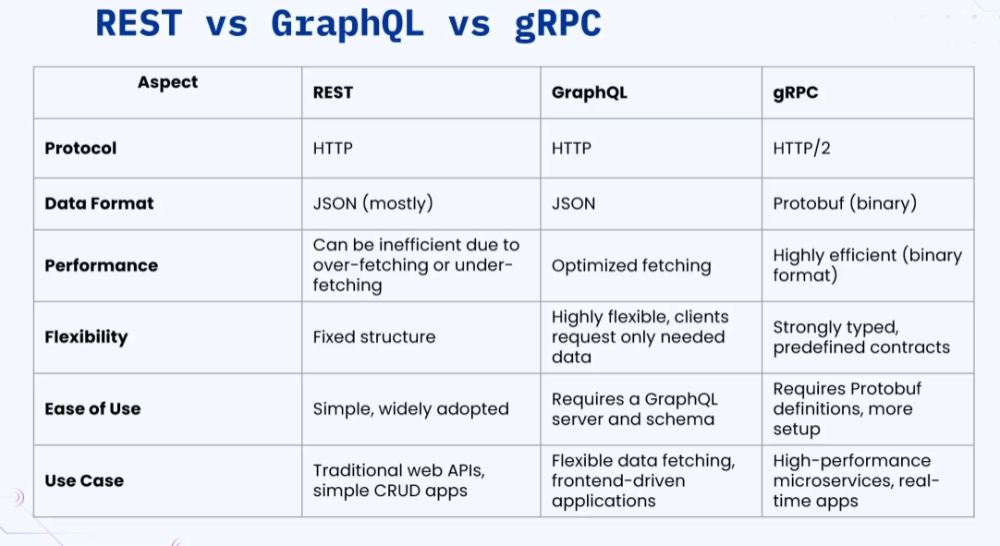

### 🔷🔶🔷 Chapter 5: REST, GraphQL, and gRPC

---

### 🔷🔶🔷 Introduction — API Implementation Technologies

    🔹 In the previous chapter, we learned what an API is.

    🔹 In this chapter, we look into the different technologies
       used to implement an API.

    🔹 The most popular technologies for designing an API are:
        🔸 REST
        🔸 GraphQL
        🔸 gRPC
        🔸 Long Polling
        🔸 WebSockets
        🔸 Server-Sent Events (SSE)

    🔹 This chapter covers REST, GraphQL, and gRPC. Long Polling,
       WebSockets, and Server-Sent Events are covered in the next
       chapter.

---

### 🔷🔶🔷 1. REST (Representational State Transfer)

    🔹 REST stands for **Re**presentational **S**tate **T**ransfer.

    🔹 It is an **architectural style** for designing networked
       applications — not a protocol or a strict standard — that
       defines a set of rules/constraints for building web services.

---

### 🔷🔶🔷 Key Principles of REST

**🔘 1. Client-Server Architecture**

    🔹 There must be a client that makes a request, and a server
       that processes the request and returns a response.

    🔹 This communication happens over a network (typically HTTP).

**🔘 2. Statelessness**

    🔹 Each request from the client must contain **all** the
       information necessary for the server to process it.

    🔹 The server does **not** store any client/session state
       between requests — every request is treated as a brand
       new request.

**🟠 Example (from the demo)**

    🔹 Server: A Node.js user-management application running at
       `http://localhost:3000`.
    🔹 Client: Postman.
    🔹 Request: `GET http://localhost:3000/users` with Basic Auth
       credentials (username: `John`, password: `John123$`)
       returns 10,000 user records.
    🔹 If the same request is repeated **without** credentials
       (assuming the server "remembers" the earlier request), it
       fails with:

```json
{
  "status": 401,
  "message": "Unauthorized"
}
```

    🔹 This proves REST APIs are stateless — the server never
       remembers previous requests, so credentials (or any
       required info) must be sent with **every single request**.

**🔘 3. Uniform Interface**

    🔹 A consistent, standardized way to interact with resources.

    🔹 Achieved using standard HTTP methods: `GET`, `POST`, `PUT`,
       `PATCH`, `DELETE`.

    🔹 Data is exchanged in standard formats, most commonly JSON
       (or XML).

**🔘 4. Layered System**

    🔹 A RESTful system can be composed of multiple layers (e.g.,
       an authentication server, a security/API gateway layer, in
       front of the actual application server).

    🔹 The client only talks to a base URL/endpoint and does not
       need to know which underlying server actually generates
       the response.

---

### 🔷🔶🔷 Components of a RESTful API

**🔘 1. Resource and its URI**

    🔹 A **Resource** is any piece of information or data the
       client is requesting from the server (an object, data set,
       or service accessible over the network).

    🔹 Each resource has an associated **URI** (Uniform Resource
       Identifier) — the endpoint used to access it.

    🔹 Example:
        🔸 Base URL: `https://api.example.com`
        🔸 Resource (all users): `GET /users`
        🔸 Resource (a specific user): `GET /users/2`

**🔘 2. HTTP Methods**

    🔹 `GET` -> Read/retrieve a resource.
    🔹 `POST` -> Create a new resource.
    🔹 `PUT` -> Update/replace a resource (typically full update).
    🔹 `PATCH` -> Partially update a resource (only specific fields).
    🔹 `DELETE` -> Remove a resource.

**🟠 Practical Walkthrough (from the demo)**

    🔹 `GET /users` -> returns all users.
    🔹 `GET /users/505` -> returns a single user record, status `200 OK`.
    🔹 `GET /users/15555` -> user doesn't exist yet:

```json
{
  "status": 404,
  "message": "User not found"
}
```

    🔹 `POST /users` -> create a new user with ID `15555`:

```json
// Request body
{
  "id": 15555,
  "name": "Rick Williams",
  "email": "rick2025@gmail.com",
  "phone": "9876543210",
  "address": "123 Random Street",
  "gender": "male",
  "department": "finance"
}
```

```json
// Response
{
  "status": 201,
  "message": "User created"
}
```

    🔹 `PUT /users/15555` -> full update (multiple fields at once):

```json
// Request body
{
  "name": "Rick Williams",
  "email": "rick2020@gmail.com",
  "phone": "+91-9876543210",
  "address": "123 Random Street",
  "gender": "male",
  "department": "Finance Manager"
}
```

```json
// Response
{
  "status": 200,
  "message": "User updated"
}
```

    🔹 `PATCH /users/15555` -> partial update (only phone number):

```json
// Request body
{
  "phone": "9999999999"
}
```

```json
// Response
{
  "status": 200,
  "message": "User updated"
}
```

    🔹 `DELETE /users/15555` -> deletes the resource:

```json
// Response
{
  "status": 200
}
```

    🔹 A subsequent `GET /users/15555` after deletion returns:

```json
{
  "status": 404,
  "message": "User not found"
}
```

**🔘 3. HTTP Status Codes**

    🔹 Status codes indicate the result of a request. Commonly
       used codes seen in the demo:
        🔸 `200 OK` -> Request succeeded (GET, PUT, PATCH, DELETE).
        🔸 `201 Created` -> A new resource was successfully created (POST).
        🔸 `401 Unauthorized` -> Missing/invalid authentication credentials.
        🔸 `404 Not Found` -> The requested resource does not exist.

    🔹 📝 Homework (as suggested in the video): Look up the full
       list of HTTP status codes and understand each category:
        🔸 `1xx` -> Informational
        🔸 `2xx` -> Success
        🔸 `3xx` -> Redirection
        🔸 `4xx` -> Client Error
        🔸 `5xx` -> Server Error

---

### 🔷🔶🔷 2. GraphQL

    🔹 GraphQL is a **query language for APIs** (and a runtime for
       executing those queries against your data).

    🔹 GraphQL prioritizes giving the client **exactly** the data
       it requests — no more, no less.

    🔹 Developed by **Facebook**, and open-sourced in **2015**.

    🔹 Goal: Make APIs faster, more flexible, and more
       developer-friendly.

---

### 🔷🔶🔷 Key Concepts of GraphQL

**🔘 1. Schema**

    🔹 A GraphQL **Schema** defines the structure of the API — its
       types, queries, and mutations.

    🔹 It acts as a **contract** between the client and the
       server, defining exactly what data shape to expect.

**🟠 Example Schema**

```graphql
type User {
  ID: ID!
  name: String!
  email: String!
}

type Query {
  getUser(ID: ID!): User
}
```

    🔹 `!` -> means the field is **non-nullable** (cannot be empty/null).
    🔹 `ID` (capitalized) -> indicates this field is unique and
       may act as a primary key.
    🔹 Under `Query`, `getUser` is defined as a method that
       accepts an `ID` and returns a `User`.

**🔘 2. Queries**

    🔹 The client uses **queries** to request data from a GraphQL
       endpoint — conceptually similar to querying a database.

**🟠 Example Query**

```graphql
query {
  getUser(ID: 123) {
    name
    email
  }
}
```

```json
// Response
{
  "data": {
    "getUser": {
      "name": "Rick Williams",
      "email": "rick2020@gmail.com"
    }
  }
}
```

    🔹 Notice only `name` and `email` were requested and returned
       — `id`, `phone`, `address`, etc. are excluded entirely.

**🔘 3. Resolvers**

    🔹 A **Resolver** is a function that contains the actual logic
       to fetch/compute the data for a given query or field.

    🔹 The schema only declares *what* queries exist (e.g.,
       `getUser(ID)`); the resolver defines *how* the data is
       actually retrieved.

    🔹 In simple terms: a resolver is to GraphQL what a
       **controller method** is to a REST API — the backend
       handler for a specific request.

**🟠 Practical Demo — Over-fetching vs Exact Fetching**

    🔹 Query requesting **all fields** for all users:

```graphql
query {
  getUsers {
    id
    name
    email
    phone
    address
    gender
    department
  }
}
```

        🔸 Result: 10,000 records returned, ~1.36 MB of data transferred.

    🔹 Query requesting **only** `name` and `email` (e.g., to send
       a bulk email notification):

```graphql
query {
  getUsers {
    name
    email
  }
}
```

        🔸 Result: 10,000 records returned, only ~452.63 KB of
           data transferred.

    🔹 This demonstrates GraphQL's core advantage: **no
       over-fetching or under-fetching** — the client controls
       exactly which fields come back, directly reducing network
       load and response time.

---

### 🔷🔶🔷 Advantages of GraphQL

    🔸 1. Precise Data Fetching
        - No over-fetching or under-fetching; clients get exactly
          the fields they ask for, reducing network burden and
          improving response time.

    🔸 2. Single Endpoint
        - Unlike REST (which typically needs a different endpoint
          per resource), GraphQL exposes a **single endpoint**
          (commonly `/graphql`) that handles all queries based on
          the schema.

    🔸 3. Strongly Typed Schema
        - The schema clearly defines available fields, types, and
          queries, so the client always knows what to expect —
          which also helps with client-side error handling.

---

### 🔷🔶🔷 Disadvantages of GraphQL

    🔸 1. Increased Backend Complexity
        - Requires specialized knowledge to design the schema,
          implement resolvers, and optimize performance.

    🔸 2. Overkill for Simple APIs
        - For simple CRUD-only applications, plain REST is often
          sufficient; introducing GraphQL adds unnecessary
          engineering overhead.

---

### 🔷🔶🔷 When to Use / Avoid GraphQL

**🔘 Use GraphQL When:**

    🔸 Building large, complex applications (social media,
       e-commerce) with millions of requests, where minimizing
       network load matters.
    🔸 Building mobile applications, where bandwidth is limited
       and data usage needs to be minimized.
    🔸 Working in microservice-based architectures with many
       inter-service calls, to reduce network load.

**🔘 Avoid GraphQL When:**

    🔸 The application only needs simple CRUD operations — the
       added engineering complexity isn't worth it.
    🔸 The application requires heavy HTTP-level caching (GraphQL,
       using a single endpoint, doesn't play well with standard
       HTTP caching).
    🔸 The application is performance-critical and involves deeply
       nested subqueries (which can degrade performance).

---

### 🔷🔶🔷 3. gRPC (Google Remote Procedure Call)

    🔹 gRPC is an **open-source RPC framework developed by
       Google**.

    🔹 It enables highly efficient communication **between
       services** — it is not designed for typical browser/web
       client-to-server communication, but for
       service-to-service communication, especially within a
       microservice architecture.

---

### 🔷🔶🔷 Key Features of gRPC

**🔘 1. Uses HTTP/2**

    🔹 REST and GraphQL typically use **HTTP/1.1**; gRPC uses
       **HTTP/2**.

    🔹 HTTP/2 brings three major advantages, all leveraged by gRPC:

        🔸 **Multiplexing** — In HTTP/1.1, a client opens a
           connection, sends one request, waits for the response,
           then closes the connection. In HTTP/2, once a
           connection is established, **multiple requests and
           responses can be sent over the same connection
           simultaneously**.
        🔸 **Header Compression** — Request/response headers are
           compressed, reducing payload size and bandwidth usage.
        🔸 **Server-Initiated Multiple Responses** — The server
           can push multiple responses to the client without the
           client having to make multiple separate requests.

**🔘 2. Uses Protocol Buffers (Protobuf)**

    🔹 REST and GraphQL exchange data as JSON or XML (human-readable,
       text-based, relatively large formats).

    🔹 gRPC serializes data using **Protocol Buffers (Protobuf)**
       — a compact **binary** format.

    🔹 Because Protobuf messages are binary and much smaller/faster
       to serialize and deserialize than JSON/XML, gRPC
       communication is significantly faster and more efficient.

**🟠 Example: Simple `.proto` Definition**

```protobuf
syntax = "proto3";

message User {
  int32 id = 1;
  string name = 2;
  string email = 3;
}

message UserRequest {
  int32 id = 1;
}

service UserService {
  rpc GetUser (UserRequest) returns (User);
}
```

---

### 🔷🔶🔷 Practical Performance Comparison: gRPC vs REST

    🔹 Both a gRPC server and a REST server (Node.js) were set up
       to fetch the same 10,000 user records.

    🔹 **gRPC client** (`node grpc-client.js`) results across
       multiple runs: approximately **26–35 ms**, averaging
       around **~28 ms** to fetch 10,000 records.

    🔹 **REST client** (`node rest-client.js`) results across
       multiple runs: approximately **70–100 ms**, averaging
       around **~70–90 ms** to fetch the same 10,000 records.

    🔹 Conclusion: gRPC was roughly **2–3x faster** than REST for
       the same operation in this demo — and this gap would widen
       significantly at millions of requests/records in production.

---

### 🔷🔶🔷 When to Use gRPC

    🔸 Microservice-to-microservice communication in a distributed
       architecture, where inter-service calls need to be fast
       and efficient.
    🔸 Performance-critical systems that need high-performing APIs.
    🔸 Real-time streaming applications (e.g., live score updates
       for a football or cricket match), since gRPC supports
       **bidirectional streaming**.
    🔸 Polyglot systems, where different services are built in
       different programming languages — gRPC (via Protobuf/IDL)
       provides a uniform contract/interface across languages.

---

### 🔷🔶🔷 When Not to Use gRPC

    🔸 When the client is a **web browser** — gRPC is not natively
       supported in browsers; using it requires third-party
       plugins/proxies (e.g., grpc-web), which add
       deserialization overhead and extra latency.
    🔸 When the API response needs to be **human-readable**
       (JSON/XML) — since gRPC uses binary Protobuf, debugging
       and manual inspection are harder.
    🔸 When the application only performs **simple CRUD
       operations** — implementing gRPC requires specialized
       skills, which isn't justified for simple use cases.

---

### 🔷🔶🔷 Comparison Table — REST vs GraphQL vs gRPC


<p align="center">

</p>

---

### 🔷🔶🔷 Which One Should You Use?

    🔹 There is **no single "best"** API technology among REST,
       GraphQL, and gRPC.

    🔹 The right choice depends on:
        🔸 The specific use case.
        🔸 Performance requirements.
        🔸 The expertise/skillset of the implementing team.

    🔹 All these factors should be weighed together before
       deciding which technology to adopt for a given system.

---

### 🔷🔶🔷 Summary — REST, GraphQL, and gRPC at a Glance

    🔸 REST                 ->  An architectural style using
                               client-server communication,
                               statelessness, a uniform interface
                               (HTTP methods), and a layered
                               system. Built around resources,
                               URIs, HTTP methods (GET/POST/PUT/
                               PATCH/DELETE), and HTTP status
                               codes. Simple, widely adopted, but
                               prone to over-fetching/under-fetching.

    🔸 GraphQL              ->  A query language for APIs (by
                               Facebook, 2015) built around a
                               strongly typed schema, client-defined
                               queries, and resolver functions.
                               Exposes a single endpoint, fetches
                               exactly the requested fields (no
                               over/under-fetching), but adds
                               backend complexity — best suited
                               for large, complex, or bandwidth-
                               sensitive applications.

    🔸 gRPC                 ->  A high-performance, open-source RPC
                               framework by Google, built on
                               HTTP/2 (multiplexing, header
                               compression, multiple responses)
                               and Protocol Buffers (binary
                               serialization). Extremely fast and
                               efficient for service-to-service
                               communication, but not suited for
                               browser clients or human-readable
                               debugging needs.

    🔸 Choosing Between
       Them                 ->  No universal winner — the decision
                               depends on use case, required
                               performance, data flexibility
                               needs, and the team's technical
                               expertise.

---