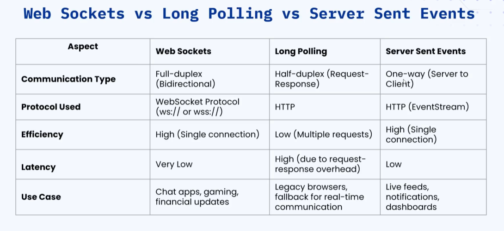

### 🔷🔶🔷 Chapter 6: WebSockets, Long Polling, and Server-Sent Events

---

### 🔷🔶🔷 Introduction — The Problem With Traditional Client-Server Communication

    🔹 Traditionally, applications are built around the classic
       **client-server model**.

    🔹 In this model, the **client is always the initiator** of
       any transaction:
        🔸 The client sends a request to the server.
        🔸 The server processes the request and sends back a response.

    🔹 The core limitation: the server has **no independent
       mechanism to push data to the client**.

    🔹 Even if new/updated data becomes available on the server,
       it cannot be sent to the client on its own — the client
       must repeatedly make a new request to check for and fetch
       any updated data.

    🔹 To solve this "server can't push data" problem, three
       technologies were introduced:
        🔸 1. WebSockets
        🔸 2. Long Polling
        🔸 3. Server-Sent Events (SSE)

---

### 🔷🔶🔷 1. WebSockets

    🔹 WebSockets provide **full-duplex** communication between a
       client and a server over a **single, long-lived connection**.

    🔹 **Full-Duplex Communication** -> Bidirectional communication
       where the client can send data to the server, and the
       server can send data to the client, **simultaneously**, at
       any time — unlike a strict request-response cycle.

    🔹 Key Difference from HTTP:
        🔸 HTTP follows a strict **request-response model** — the
           client must send a request before the server can send
           any response; without a request, there is no response.
        🔸 WebSockets only need **one initial request** (to open
           the connection). After that, both the client and
           server can freely exchange multiple messages in real
           time, in either direction, without needing a new
           request for each message.

    🔹 Because the connection stays open and data can flow
       instantly in both directions, WebSockets offer very low
       (or virtually no) latency for ongoing data exchange.

    🔹 **Common Use Cases:** Chat applications, live notifications,
       real-time gaming, financial/stock market applications where
       data changes very frequently.

---

### 🔷🔶🔷 How WebSockets Work

    🔹 **Step 1 — Handshake Request**
        🔸 The client sends an HTTP request to the server asking
           to open a communication channel.
        🔸 This special request is called the **handshake
           request** — it is used to upgrade the connection from
           the HTTP protocol to the WebSocket protocol.

    🔹 **Step 2 — Handshake Acknowledgement**
        🔸 The server acknowledges the WebSocket handshake and
           responds with **HTTP status code `101 Switching
           Protocols`**, confirming that the protocol is being
           upgraded from HTTP to WebSocket.

    🔹 **Step 3 — Connection Established**
        🔸 Once the client receives this acknowledgement, the
           WebSocket connection is officially opened between the
           client and the server.
        🔸 Both sides can now send data to each other in real
           time, in any direction, without waiting for a request/
           response cycle each time.

    🔹 **Step 4 — Closing the Connection**
        🔸 After some time, either the client or the server can
           close the connection.
        🔸 Closing the connection marks the end of the WebSocket
           communication session.

**🟠 Example: WebSocket Handshake (Illustrative)**

```json
// Client Handshake Request Headers
{
  "method": "GET",
  "url": "/chat",
  "headers": {
    "Upgrade": "websocket",
    "Connection": "Upgrade",
    "Sec-WebSocket-Key": "dGhlIHNhbXBsZSBub25jZQ==",
    "Sec-WebSocket-Version": "13"
  }
}
```

```json
// Server Handshake Response
{
  "status": 101,
  "statusText": "Switching Protocols",
  "headers": {
    "Upgrade": "websocket",
    "Connection": "Upgrade",
    "Sec-WebSocket-Accept": "s3pPLMBiTxaQ9kYGzzhZRbK+xOo="
  }
}
```

```json
// After connection is open, either side can send frames like:
{
  "event": "new_message",
  "data": {
    "user": "Rick",
    "message": "Hey, are you online?",
    "timestamp": "2026-07-17T10:15:00Z"
  }
}
```

---

### 🔷🔶🔷 2. Long Polling

    🔹 Long Polling is also built on the traditional client-server
       communication model — the client still has to make the
       request.

    🔹 The key difference: the server does **not** immediately
       process and respond to the request. Instead, it **holds the
       request open** until new data becomes available (or a
       timeout occurs).

    🔹 Because the request is held open (potentially for a long
       time), this technique introduces significant **latency**.

    🔹 Once the server finally responds, the client processes that
       response and **immediately sends another request**,
       creating a continuous request-hold-response loop.

---

### 🔷🔶🔷 How Long Polling Works

    🔹 **Step 1** — The client sends an HTTP request to the server.

    🔹 **Step 2** — The server holds the request open until either:
        🔸 New data becomes available, or
        🔸 A timeout occurs.

    🔹 **Step 3** — Once new data is available, the server
       processes the request and sends back a response.

    🔹 **Step 4** — The client receives and processes the
       response, then **immediately sends a new request** to the
       server, repeating the entire cycle.

    🔹 This loop continues indefinitely as long as the client
       keeps requesting and the server keeps having new data to
       provide.

**🟠 Example: Long Polling Cycle (Illustrative)**

```json
// Request 1
{
  "method": "GET",
  "url": "/updates?lastEventId=1042"
}
```

```json
// Server holds this request open... eventually responds:
{
  "status": 200,
  "data": {
    "eventId": 1043,
    "message": "New order placed"
  }
}
```

```json
// Client immediately sends Request 2
{
  "method": "GET",
  "url": "/updates?lastEventId=1043"
}
```

    🔹 ⚠️ **Real-World Note:** Long polling is **rarely used** in
       modern applications because of the high latency and
       increased burden it places on network/server resources.
       It is covered here mainly because it is a common interview
       topic and a useful historical fallback technique to
       understand.

---

### 🔷🔶🔷 3. Server-Sent Events (SSE)

    🔹 Server-Sent Events (**SSE**) is a technology that allows a
       server to **push updates to the client over a single HTTP
       connection**.

    🔹 Key Difference from WebSockets:
        🔸 WebSockets -> Two-way (bidirectional) communication;
           both client and server can send data to each other.
        🔸 SSE -> **One-way (unidirectional)** communication; only
           the server sends data to the client. The client cannot
           send data back to the server over this same connection.

    🔹 The client makes **only one request** to open the
       connection. After that, the server pushes data to the
       client over that same connection whenever new data becomes
       available.

    🔹 **Common Use Cases:** Real-time notification systems,
       applications that publish live news updates, sports score
       updates.

---

### 🔷🔶🔷 How Server-Sent Events Work

    🔹 **Step 1** — The client sends a request to the server
       asking to open the connection.

    🔹 **Step 2** — The server opens the connection, and it
       remains open until either the client or the server
       terminates it.

    🔹 **Step 3** — While the connection is open, the server
       pushes data to the client any time new data becomes available.

    🔹 **Step 4** — Once all data has been sent (or the source of
       updates ends), the server terminates the connection. After
       the connection is closed, the server can no longer send any
       further data to the client.

**🟠 Example: SSE Response Stream (Illustrative)**

```
// Client opens the connection with a single request:
GET /live-scores HTTP/1.1
Accept: text/event-stream
```

```
// Server keeps pushing events over the same open connection:
event: score_update
data: {"match": "IND vs AUS", "score": "245/4", "over": "38.2"}

event: score_update
data: {"match": "IND vs AUS", "score": "251/4", "over": "39.0"}

event: match_end
data: {"match": "IND vs AUS", "result": "India won by 6 wickets"}
```

    🔹 Notice the response uses the `text/event-stream` content
       type — a lightweight, HTTP-native format designed
       specifically for one-way server push, where each event can
       carry a JSON payload in its `data` field.

---

### 🔷🔶🔷 Comparison — WebSockets vs Long Polling vs Server-Sent Events


<p align="center">

</p>

---

### 🔷🔶🔷 Summary — WebSockets, Long Polling, and SSE at a Glance

    🔸 The Core Problem     ->  In the traditional client-server
                               model, the server cannot push
                               updated data to the client on its
                               own — the client must always
                               initiate a request first.

    🔸 WebSockets           ->  Full-duplex, bidirectional
                               communication over a single,
                               long-lived connection. Starts with
                               an HTTP handshake request, upgraded
                               via status code `101`, after which
                               both sides exchange data freely
                               until either side closes the
                               connection. Very low latency, very
                               high efficiency. Ideal for chat,
                               gaming, and real-time financial apps.

    🔸 Long Polling         ->  Client repeatedly sends requests;
                               the server holds each request open
                               until new data is available (or a
                               timeout), then responds — after
                               which the client immediately sends
                               another request. High latency, low
                               efficiency. Rarely used today;
                               mainly relevant for legacy systems
                               and interview knowledge.

    🔸 Server-Sent Events
       (SSE)                ->  One-way, server-to-client push
                               over a single HTTP connection using
                               the `event-stream` format. Client
                               opens the connection once; server
                               pushes data whenever it's available,
                               then eventually closes the
                               connection. Low latency, high
                               efficiency. Ideal for live
                               notifications, dashboards, news, and
                               score updates.

    🔹 Choosing between WebSockets, Long Polling, and SSE depends
       on whether the application needs **two-way** real-time
       communication (WebSockets), a **simple fallback** for
       pseudo real-time updates (Long Polling), or **one-way**
       server-to-client live updates (SSE).

---