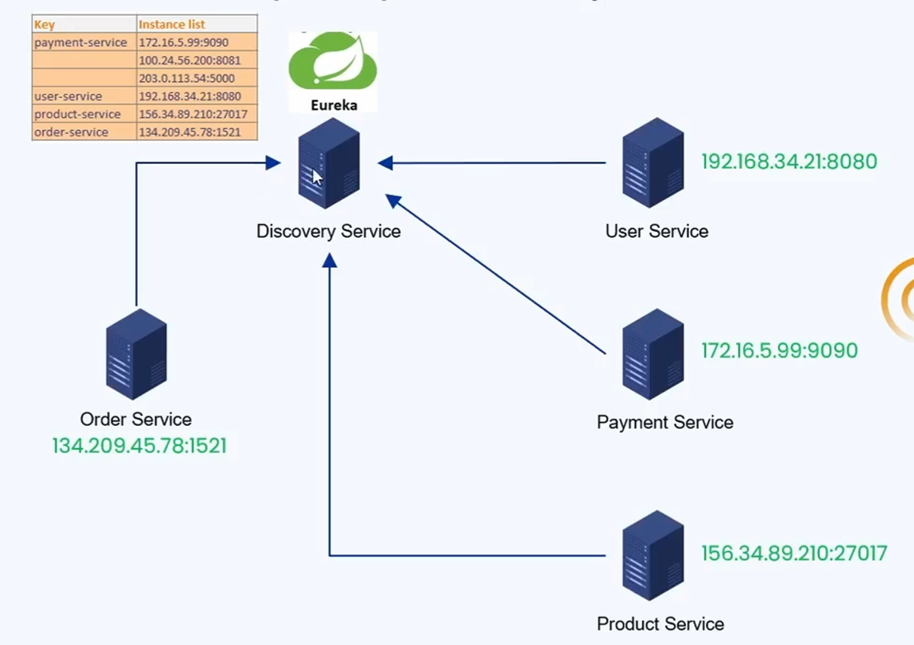
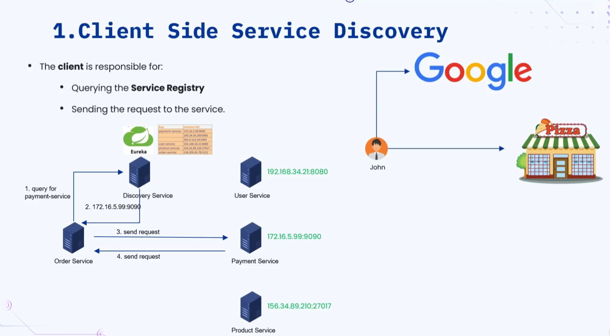
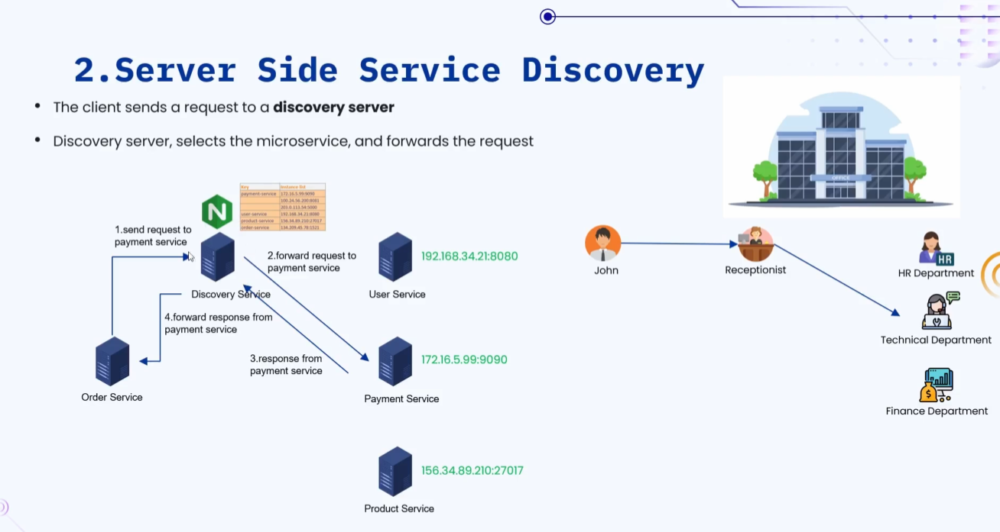

### 🔷🔶🔷 Chapter 7: Service Discovery

---

### 🔷🔶🔷 Introduction — Why is Service Discovery Needed?

**🟠 Communication in a Monolith Application**

    🔹 In a monolith application, all services are present in the
       same application.

    🔹 Communication between services happens through simple
       function calls.

    🔹 Example: If the order service has to talk to the payment
       service, the order service simply calls functions exposed
       by the payment service within the same application.

**🟠 Communication in a Microservices Architecture**

    🔹 In microservices, the scenario is different — communication
       between different services happens through an API call
       over a network.

    🔹 Example: An e-commerce application with multiple
       microservices — Order Service, User Service, Payment
       Service, and Product Service.

    🔹 If the Order Service wants to communicate with the Payment
       Service, it needs to know the ADDRESS (IP address) of the
       Payment Service.

    🔹 Here, the Order Service is the client, and the Payment
       Service is the server — to make an API call, the client
       must know the server's address.

    🔹 Similarly, if the Order Service wants to talk to the User
       Service or Product Service, it needs to know THEIR
       addresses too.

**🟠 The Question — How Does the Order Service Get These Addresses?**

    🔹 The simplest approach: hard-code the addresses of other
       microservices directly inside the Order Service.

    🔹 Example: Hard-code the Payment Service's address inside
       the Order Service, so it can make API calls to it.

    🔹 This works — but it comes with several challenges.

---

### 🔷🔶🔷 Problems With Hard-Coding Addresses

    🔹 1. Dynamically Changing IP Addresses
        🔸 The IP address of the Payment Service can change
           dynamically.
        🔸 Every time it changes, the Order Service would need to
           be updated and redeployed — again and again.

    🔹 2. Multiple Instances (Scaling)
        🔸 If there is high traffic on the Payment Service, it
           will be scaled up — resulting in multiple instances of
           the Payment Service.
        🔸 Each instance will have a different address.
        🔸 How would the Order Service know the IP addresses of
           all these different instances? This becomes a real challenge.

    🔹 3. Manual Reconfiguration and Redeployment
        🔸 Hard-coding requires manual reconfiguration of
           addresses in the Order Service, and redeployment every
           time an address changes — a significant headache.

    🔹 4. Different Environments
        🔸 Applications typically move through multiple
           environments — Dev, Staging, and Production.
        🔸 The address of each individual microservice is likely
           to be different in each environment.
        🔸 Hard-coding addresses makes it impractical to manage
           this across environments.

    🔹 Conclusion: Hard-coding the addresses of microservices is
       NOT a recommended or good approach.

---

### 🔷🔶🔷 What is Service Discovery?

    🔹 Service Discovery is the process that enables microservices
       to find and communicate with each other dynamically,
       without hard-coding addresses.

**🟠 Illustration**

    🔹 Along with all the e-commerce microservices, there is one
       more microservice: the Discovery Service.

    🔹 A popular service discovery library used to build a
       discovery service is Eureka.

    🔹 Flow:
        🔸 All microservices REGISTER themselves with the discovery service.
        🔸 The discovery service keeps a record of all registered
           microservices, along with their addresses and port numbers.
        🔸 Whenever the Order Service wants to communicate with
           the Payment Service, it first QUERIES the discovery
           service, asking for the Payment Service's address.
        🔸 The discovery service responds with the Payment
           Service's address (if available in its records).
        🔸 Once the Order Service receives the address, it makes
           an API call directly to the Payment Service using that address.

    🔹 Whenever the Payment Service's address changes, it updates
       the discovery service with the new address.

    🔹 The discovery service updates its record for that specific
       service, ensuring only the latest addresses are available.

    🔹 If there are multiple instances of the Payment Service, ALL
       their addresses are registered and updated with the
       discovery service (e.g. 3 different addresses for 3
       instances of the payment service).

    🔹 This is how Service Discovery eliminates the need for
       hard-coding addresses in client microservices.

---

### 🔷🔶🔷 Components of Service Discovery

---

**🔘 1. Service Registry**

    🔹 This is the "discovery service" itself — a centralized
       server for storing all available microservices along with
       their addresses, names, ports, and other metadata.

    🔹 It must be Highly Available and support Fast Lookup:
        🔸 Highly Available -> If this server goes down,
           communication between different microservices cannot happen.
        🔸 Fast Lookup -> Since every service-to-service call may
           depend on it, lookups need to be quick to avoid adding latency.

    🔹 Examples of Service Registry tools: Eureka, Zookeeper, Consul.

---

**🔘 2. Service Registration**

    🔹 All microservices must register themselves with the
       discovery service when they start up, or when they are updated.

    🔹 This ensures client services can query and get the address
       of other microservices reliably.

---

**🔘 3. Service Health Checks**

    🔹 The discovery service periodically checks the health of
       registered microservices.

    🔹 It sends out a heartbeat signal and checks if it gets the
       right response from the microservices.

    🔹 This validates whether a registered microservice is up and running.

    🔹 If a microservice is unhealthy or down, the discovery
       service removes its entry from its records — ensuring no
       API calls are made to an unhealthy microservice.

---

### 🔷🔶🔷 Patterns of Service Discovery

    🔹 There are two main types/patterns of service discovery:

        🔸 1. Client-Side Service Discovery
        🔸 2. Server-Side Service Discovery

---

### 🔷🔶🔷 1. Client-Side Service Discovery

**🟠 Analogy — Ordering a Pizza**

    🔹 John wants to order a pizza, but doesn't have the phone
       number of the pizza place.

    🔹 John goes to Google, searches for the phone number, gets
       it, and then calls the pizza place himself to place the order.

    🔹 Who is doing all the work? John — he searches for the
       number AND makes the call.

    🔹 Mapping this to the pattern:
        🔸 John -> The Client
        🔸 Google -> The Discovery Server
        🔸 The Pizza Place -> The Microservice

**🟠 Technical Explanation**

    🔹 The client is responsible for BOTH:
        🔸 Querying the service registry for the address, AND
        🔸 Sending the request to the service directly.

**🟠 Illustration**

    🔹 All microservices register with the discovery service (as before).

    🔹 Flow:
        🔸 The Order Service queries the discovery service for
           the Payment Service's address.
        🔸 The discovery service returns the Payment Service's address.
        🔸 The Order Service then makes a request DIRECTLY to the
           Payment Service using that address.
        🔸 The Payment Service processes the request and responds
           directly to the Order Service.

**🟠 Disadvantage**

    🔹 The Order Service has to make TWO API calls:
        🔸 One to the discovery service (to get the address).
        🔸 One to the Payment Service (to make the actual request).

**🟠 Example**

    🔹 Eureka Server is an example of client-side service discovery.

---

### 🔷🔶🔷 2. Server-Side Service Discovery

**🟠 Analogy — Calling a Big Organization**

    🔹 A large institution has multiple departments — HR,
       Technical, Finance.

    🔹 John wants to talk to the Technical department, but only
       has the phone number of the organization's receptionist.

    🔹 John calls the receptionist.

    🔹 The receptionist does NOT give John the Technical
       department's number to call separately — instead, the
       receptionist FORWARDS the call directly to the Technical department.

    🔹 Mapping this to the pattern:
        🔸 John -> The Client
        🔸 The Receptionist -> The Discovery Server
        🔸 The Technical Department -> The Microservice

    🔹 Who sends the request to the Technical department? The
       receptionist (the discovery service) — NOT John directly.

**🟠 Technical Explanation**

    🔹 The client sends a request to the discovery server.

    🔹 The discovery server then selects the appropriate
       microservice and FORWARDS the request to it.

**🟠 Illustration**

    🔹 All microservices register with the discovery service (as before).

    🔹 Flow:
        🔸 The Order Service sends a request to the Discovery Service.
        🔸 The Discovery Service determines the address of the
           Payment Service, and forwards the request to it.
        🔸 The Payment Service processes the request and gives the
           response back to the Discovery Service.
        🔸 The Discovery Service forwards the response from the
           Payment Service back to the Order Service.

    🔹 Here, the Order Service makes only ONE API call — to the
       discovery service — instead of two.

**🟠 Example**

    🔹 NGINX is an example of a tool used for this type of discovery service.

**🟠 Advantage**

    🔹 The client service need not make two API calls — it makes
       only one API call.

**🟠 Disadvantage**

    🔹 There is an additional hop involved: instead of the Order
       Service talking directly to the Payment Service, the
       request goes: Order Service -> Discovery Service -> Payment
       Service -> Discovery Service -> Order Service.

    🔹 This additional hop increases latency.

---

### 🔷🔶🔷 Additional Concepts — Extending Service Discovery

    🔹 The following concepts add further depth and completeness
       to the fundamentals covered above.

**🔘 Service Registration Patterns**

    🔹 Self-Registration Pattern
        🔸 The service instance itself is responsible for
           registering and deregistering with the service
           registry (e.g. on startup and shutdown), and for
           periodically sending heartbeats to indicate it's alive.
        🔸 Simple to implement, but couples the service code to
           the registry's API.
        🔸 Example: Eureka clients often use self-registration.

    🔹 Third-Party Registration Pattern
        🔸 A separate system component (often called a
           "registrar") handles registration on behalf of the
           service instances, typically by monitoring the
           deployment environment (e.g. detecting when new
           containers start or stop).
        🔸 Decouples the service code from the registry, but adds
           an extra moving part to the system.
        🔸 Example: Some container orchestration platforms
           register/deregister services on behalf of containers automatically.

**🔘 Popular Service Discovery Tools**

    🔹 Eureka — A widely used service registry from Netflix's
       open-source ecosystem, commonly used with client-side
       discovery in Spring-based microservices.

    🔹 Consul — A service mesh solution by HashiCorp that provides
       service discovery, health checking, and a key-value store.

    🔹 Zookeeper — A distributed coordination service (originally
       from Apache Hadoop's ecosystem), also used for service
       discovery, though more general-purpose in nature.

    🔹 etcd — A distributed, reliable key-value store, often used
       by Kubernetes internally to store cluster state, including
       service information.

**🔘 DNS-Based Service Discovery**

    🔹 Another common approach is using DNS (Domain Name System)
       for service discovery — each service is given a DNS name,
       and DNS resolution returns the current IP address(es) of
       healthy instances.

    🔹 This is widely used in container orchestration platforms
       like Kubernetes, where each service gets a stable internal
       DNS name, and the underlying IP addresses of pods behind
       it can change dynamically without affecting how other
       services address it.

**🔘 Service Discovery in Kubernetes (Real-World Context)**

    🔹 Kubernetes has built-in service discovery — when a
       "Service" object is created for a set of pods, Kubernetes
       automatically assigns it a stable DNS name and virtual IP,
       and load-balances requests to the healthy pod instances
       behind it.

    🔹 This is a practical, widely-used real-world example of
       server-side-style service discovery, abstracting away the
       need for a separate discovery service like Eureka in
       Kubernetes-native environments.

---

### 🔷🔶🔷 Summary — Service Discovery at a Glance

    🔸 The Problem         ->  In microservices, communication
                              happens over the network via API
                              calls, requiring the client service
                              to know the server service's
                              address — hard-coding these
                              addresses is impractical due to
                              dynamic IPs, scaling (multiple
                              instances), and multiple deployment environments.

    🔸 Service Discovery   ->  The process that enables
                              microservices to dynamically find
                              and communicate with each other,
                              without hard-coding addresses — via
                              a centralized Discovery Service (e.g. Eureka).

    🔸 Service Registry    ->  The centralized, highly available
                              server storing all microservices'
                              addresses, names, ports, and
                              metadata (e.g. Eureka, Zookeeper, Consul).

    🔸 Service             ->  Microservices register themselves
       Registration            with the discovery service on
                              startup/update, so other services
                              can look them up.

    🔸 Service Health      ->  The discovery service periodically
       Checks                   sends heartbeat signals to
                              registered microservices, removing
                              unhealthy/down services from its
                              records to prevent failed API calls.

    🔸 Client-Side         ->  The client queries the discovery
       Discovery                server for the address, then
                              makes the request directly to the
                              service itself — 2 API calls total.
                              E.g. Eureka. (Analogy: John searches
                              Google, then calls the pizza place himself.)

    🔸 Server-Side         ->  The client sends the request to the
       Discovery                discovery server, which looks up
                              the address and forwards the request
                              on the client's behalf — 1 API call
                              for the client, but an added hop
                              increases latency. E.g. NGINX.
                              (Analogy: John calls the
                              receptionist, who forwards the call
                              to the technical department.)

    🔸 Registration        ->  Self-Registration (service
       Patterns                  registers itself) vs Third-Party
                              Registration (a separate registrar
                              component handles registration on
                              the service's behalf).

    🔸 DNS-Based           ->  An alternative discovery approach
       Discovery                 using DNS names resolved to
                              current healthy IPs — widely used in
                              container orchestration platforms
                              like Kubernetes.

    🔹 Service discovery is a foundational building block of
       microservices architecture — without it, dynamically
       scaling, updating, and relocating services across
       environments would require constant manual reconfiguration
       of every dependent service.

---