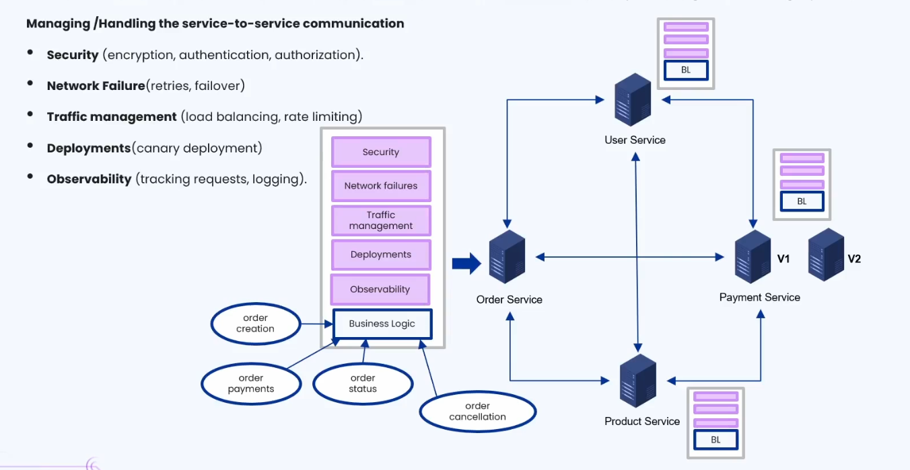
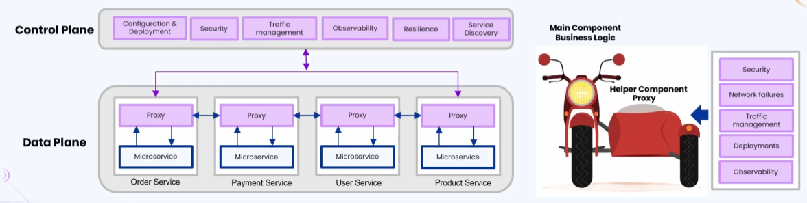
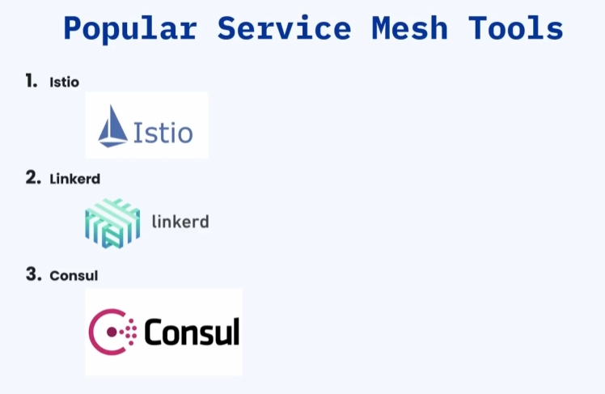

### 🔷🔶🔷 Chapter 8: Service Mesh

---

### 🔷🔶🔷 Introduction — The Problem Service Mesh Solves

    🔹 In a microservices architecture, each microservice
       communicates with other microservices over the network via
       API calls.

    🔹 Each microservice contains business logic specific to it.

**🟠 Example — Order Service Business Logic**

    🔹 The Order Service business logic can include: order
       creation, order payments, order status, and order cancellation.

    🔹 This business logic is built by the software developer.

**🟠 Is Business Logic Alone Enough?**

    🔹 Question: Is it sufficient to only build the business logic
       and deploy it, for a microservice to properly communicate
       with other microservices?

    🔹 Answer: No — several other aspects of microservice
       communication must also be managed.

---

### 🔷🔶🔷 The Five Aspects of Service-to-Service Communication

---

**🔘 1. Security**

    🔹 Each service must implement Authentication and Authorization:
        🔸 Services should not be callable by just anyone — only
           by authorized entities.
        🔸 Each microservice should implement authentication and
           authorization to maintain the security of individual services.

    🔹 Encryption:
        🔸 As data passes from one microservice to another, no
           hacker should be able to intercept and read that data.
        🔸 Hence, encryption of data in transit is also a
           necessary part of security.

    🔹 So, along with business logic, the developer must also
       implement security: authentication, authorization, and encryption.

---

**🔘 2. Handling Network Failures**

    🔹 Example: The Order Service calls the Payment Service, but
       the Payment Service is down — the request fails. A few
       minutes later, the Payment Service is back up.

    🔹 The Order Service should be able to RETRY the request.

    🔹 The developer must implement logic for handling network
       failures, such as retrying failed requests.

---

**🔘 3. Traffic Management**

    🔹 Load Balancing:
        🔸 Each microservice should implement load balancing logic.
        🔸 Example: If traffic on the Payment Service is very
           high, it is scaled up by deploying multiple servers —
           a mechanism for load balancing between those servers is needed.

    🔹 Rate Limiting:
        🔸 Rate limiting strategies must be applied so the Payment
           Service is not bombarded with too many invalid requests.

    🔹 Again, the job of implementing traffic management falls on the developer.

---

**🔘 4. Deployments**

    🔹 The developer must handle different deployment strategies,
       such as Canary Deployment and Blue-Green Deployment.

**🟠 Example — Canary Deployment**

    🔹 The Payment Service is running on version v1.

    🔹 A new version, v2, is available with lots of new features.

    🔹 Since it's unclear how users will react to the new
       features, both v1 and v2 are kept running simultaneously,
       and traffic is gradually shifted:
        🔸 Start: Route 90% of traffic to v1, 10% to v2.
        🔸 If things look good: Route 50% to v1, 50% to v2.
        🔸 If everything remains consistent and users like the
           new features: Finally route 100% of traffic to v2.

    🔹 This gradual traffic-shifting strategy is called Canary Deployment.

    🔹 Implementing this logic to handle canary deployments again
       falls on the developer.

---

**🔘 5. Observability**

    🔹 Observability covers all the logging mechanisms across the
       entire microservices architecture.

    🔹 It helps with Request Tracking:
        🔸 Which service sent a request to which other service?
        🔸 How many times was a request sent from one service to another?
        🔸 Were all requests successfully handled?
        🔸 How many failures occurred?
        🔸 How many retries of the request happened?

    🔹 All this tracking and logging is handled by observability logic.

    🔹 Again, the responsibility of observability falls on the developer.

---

### 🔷🔶🔷 The Core Problem — Duplication Across Services

    🔹 The developer is not only responsible for developing
       business logic, but also ALL of the above network-related
       features — for EVERY service (Order, Product, Payment,
       User, etc.), not just one.

    🔹 Key Observation:
        🔸 Business Logic is very specific to each individual
           service — Order Service's business logic is completely
           different from Payment Service's, which is different
           from User Service's, and so on.
        🔸 BUT the other network functions — security, handling
           network failures, traffic management, deployments, and
           observability — are COMMON across ALL services. Every
           service needs these, in largely the same way.

    🔹 Question: How can these common communication-handling
       features be abstracted away from the business logic (so
       they don't need to be re-implemented in every single service)?

    🔹 The Solution: Service Mesh.

---

### 🔷🔶🔷 What is a Service Mesh?

    🔹 A Service Mesh is a dedicated infrastructure layer that
       manages service-to-service communication.

    🔹 In a microservice environment, the service mesh is NOT part
       of the application code — instead, it runs alongside the
       services, usually as a Sidecar Proxy.

---

### 🔷🔶🔷 Understanding the Sidecar Pattern

**🟠 What is a Sidecar?**

    🔹 Real-world analogy: A motorcycle with a sidecar attached.

    🔹 A motorcycle alone can accommodate only two people. If a
       third person wants to join, the sidecar accommodates them.

    🔹 The sidecar is a HELPER component that accommodates an
       additional passenger, while the main component (the
       motorcycle) does the actual driving.

**🟠 Applying This to Microservices**

    🔹 Main Component -> The Business Logic (the actual logic
       specific to that microservice).

    🔹 Helper Component (Sidecar/Proxy) -> Takes care of security,
       network failures, traffic management, deployments, and observability.

    🔹 In a service mesh, this helper component is a Proxy that
       runs alongside each microservice, handling all the common
       communication concerns.

---

### 🔷🔶🔷 The Two Planes of Service Mesh

---

**🔘 1. Control Plane**

    🔹 Acts as the central management and configuration layer of the service mesh.

    🔹 All configurations related to:
        🔸 Security
        🔸 Deployment
        🔸 Traffic Management
        🔸 Observability
        🔸 Resilience
        🔸 Service Discovery

        ...are done in the control plane.

    🔹 The control plane manages the proxies according to the
       configurations made by the user in the control plane.

---

**🔘 2. Data Plane**

    🔹 Made up of the microservices, along with their sidecar proxies.

    🔹 The proxy actually implements:
        🔸 Traffic routing
        🔸 Load balancing
        🔸 Retries
        🔸 Timeouts
        🔸 Encryption
        🔸 Monitoring
        🔸 And other communication-related actions.

    🔹 The relationship: Configuration is made in the control
       plane -> the control plane delegates that configuration to
       all the proxies -> the proxy takes action based on the
       configuration dictated by the control plane.

**🟠 Example — Updating Retry Logic**

    🔹 If the retry logic is currently set to 1 retry, and you
       want to increase it to 2 retries:
        🔸 You change the traffic management configuration in the control plane.
        🔸 The control plane updates the relevant proxy with the
           new retry configuration.

    🔹 To manage communication between services, you always update
       configurations in the control plane — it is the control
       plane's responsibility to implement those configurations in the proxies.

---

### 🔷🔶🔷 How Communication Flows Through a Service Mesh

    🔹 Whenever one microservice wants to talk to another, the
       request goes THROUGH the proxy — not directly.

**🟠 Illustration**

    🔹 Example: Order Service wants to communicate with User Service.

    🔹 Flow:
        🔸 Order Service sends a request to its own (Order) proxy.
        🔸 The Order proxy talks to the User microservice's proxy.
        🔸 The User proxy talks to the actual User Service, which
           processes the request and gives a response back to the User proxy.
        🔸 The User proxy forwards that response back to the
           Order proxy.
        🔸 The Order proxy delivers the response to the Order microservice.

    🔹 So, communication between different microservices happens
       THROUGH their respective proxies.

**🟠 Major Advantage**

    🔹 There's no need to implement the different aspects of
       communication in each individual service.

    🔹 You just configure it in the control plane, and the control
       plane takes care of implementing those configurations
       across all the proxies.

    🔹 The developer need not worry about the different aspects of
       communication — they can concentrate purely on the business logic.

---

### 🔷🔶🔷 Popular Service Mesh Tools

    🔹 Istio -> The first and most popular service mesh tool,
       widely used in big corporations and enterprises.

    🔹 Linkerd -> Another popular service mesh tool.

    🔹 Consul -> Also popular and widely used for implementing service mesh.

---

### 🔷🔶🔷 Advantages / Benefits of Service Mesh

    🔹 1. Developer Focuses on Business Logic Instead of Networking
        🔸 The service mesh implements all networking aspects
           through configuration files.
        🔸 The developer need not worry about service-to-service
           communication — they can work only on business logic.

    🔹 2. Consistency
        🔸 Ensures that all configurations set by the user are
           consistently applied across ALL microservices —
           security, logging, retries, and all other aspects.

    🔹 3. Better Observability
        🔸 Very helpful during failures or debugging.

    🔹 4. Increased Security
        🔸 Security doesn't need to be individually managed for
           each microservice — it's taken care of by the service
           mesh as a whole.

    🔹 5. Progressive Deployment Support
        🔸 Supports both Canary Deployment and Blue-Green Deployment.

    🔹 6. Service Discovery
        🔸 The service mesh also takes care of service discovery,
           in addition to other communication concerns.

**🟠 In Short**

    🔹 A service mesh is the invisible layer that makes
       microservices communication secure, reliable, and
       observable — without the developer writing any extra code.

---

### 🔷🔶🔷 Disadvantages / Challenges of Service Mesh

    🔹 1. Increased Complexity
        🔸 Adds another layer to the overall system that needs to be managed.

    🔹 2. Performance Overhead
        🔸 Since communication now goes through the proxy, the
           proxy adds a bit of latency to communication between microservices.

    🔹 3. Learning Curve
        🔸 There is a learning curve to configure and use tools
           like Istio — some knowledge of how the tool works is
           required first.

    🔹 4. Increased Resource Utilization
        🔸 Since proxies are deployed alongside the business
           logic (as sidecars for every service instance), CPU and
           memory usage increases.

---

### 🔷🔶🔷 Additional Concepts — Extending Service Mesh Understanding

    🔹 The following points build on the fundamentals above for a
       more complete picture.

**🔘 mTLS (Mutual TLS)**

    🔹 A common security mechanism implemented by service meshes
       is mTLS (Mutual Transport Layer Security).

    🔹 Unlike regular TLS (where only the server proves its
       identity to the client), mTLS requires BOTH the client and
       the server to authenticate each other using certificates.

    🔹 This is commonly used by service meshes (like Istio) to
       automatically encrypt and authenticate all service-to-
       service traffic within the mesh, without any code changes
       in the services themselves.

**🔘 Service Mesh vs API Gateway**

    🔹 It's useful to distinguish between a Service Mesh and an
       API Gateway, since both deal with traffic management but
       serve different purposes:

        🔸 API Gateway -> Manages "North-South" traffic — i.e.
           traffic entering the system from OUTSIDE (from external
           clients into the microservices architecture). Handles
           things like client authentication, rate limiting for
           external consumers, and routing external requests to
           the right service.

        🔸 Service Mesh -> Manages "East-West" traffic — i.e.
           traffic BETWEEN microservices INSIDE the system. Handles
           service-to-service security, retries, load balancing,
           and observability.

    🔹 In many real-world architectures, both are used together —
       an API Gateway at the edge of the system, and a Service
       Mesh handling internal service-to-service communication.

**🔘 Sidecar Injection**

    🔹 In practice (e.g. in Kubernetes), sidecar proxies are often
       automatically "injected" alongside each service's container
       when it's deployed — this is called Sidecar Injection.

    🔹 This means developers don't need to manually add the proxy
       to their deployment configuration — the service mesh
       platform handles it automatically based on configuration/policy.

---

### 🔷🔶🔷 Summary — Service Mesh at a Glance

    🔸 The Problem         ->  In microservices, every service
                              needs to handle common
                              communication concerns (security,
                              network failure handling, traffic
                              management, deployments,
                              observability) in addition to its
                              own unique business logic —
                              duplicating this common logic across
                              every service is wasteful and error-prone.

    🔸 Service Mesh        ->  A dedicated infrastructure layer
                              that manages service-to-service
                              communication, running alongside
                              services (not as part of the
                              application code) — typically via sidecar proxies.

    🔸 Sidecar Pattern     ->  A helper "proxy" component runs
                              alongside the main business logic
                              component of each service, handling
                              all the common communication concerns.

    🔸 Control Plane       ->  The centralized management/
                              configuration layer — where security,
                              deployment, traffic management,
                              observability, resilience, and
                              service discovery settings are configured.

    🔸 Data Plane          ->  Made up of the microservices and
                              their sidecar proxies — the proxies
                              actually implement routing, load
                              balancing, retries, timeouts,
                              encryption, and monitoring, based on
                              control plane configuration.

    🔸 Communication Flow  ->  Service-to-service communication
                              always goes through the proxies (not
                              directly), enabling the mesh to
                              apply configured policies transparently.

    🔸 Popular Tools       ->  Istio (most popular, enterprise-
                              grade), Linkerd, Consul.

    🔸 Advantages          ->  Developers focus purely on business
                              logic; consistent policy enforcement
                              across all services; better
                              observability; increased security;
                              progressive deployment support
                              (canary/blue-green); built-in service discovery.

    🔸 Disadvantages       ->  Increased system complexity,
                              performance overhead (added latency
                              via proxy hops), a learning curve for
                              tools like Istio, and increased
                              resource utilization (CPU/memory)
                              due to sidecar proxies.

    🔸 Service Mesh vs     ->  Service Mesh handles "East-West"
       API Gateway              (internal, service-to-service)
                              traffic; API Gateway handles
                              "North-South" (external client to
                              system) traffic — often used together.

    🔹 In short, a service mesh is the invisible layer that makes
       microservice communication secure, reliable, and
       observable — without requiring developers to write any
       extra networking code themselves.

---