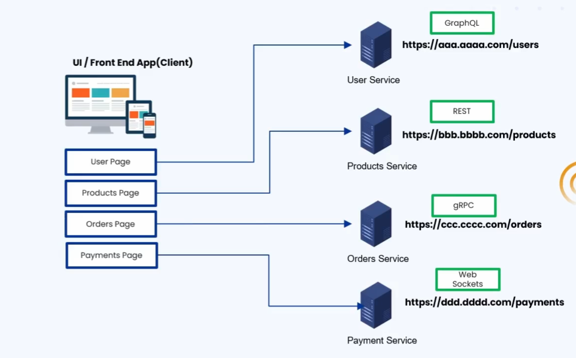
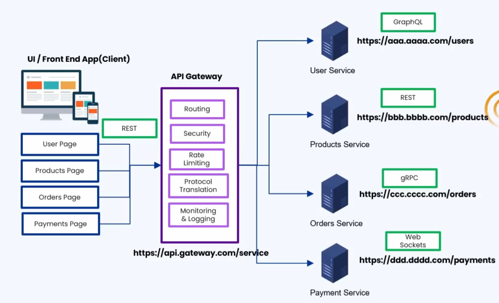

### 🔷🔶🔷 Chapter 9: API Gateway

---

### 🔷🔶🔷 Introduction — Challenges Without an API Gateway

    🔹 Consider an e-commerce microservice architecture with:
        🔸 User Service
        🔸 Product Service
        🔸 Order Service
        🔸 Payment Service

    🔹 All these microservices form the backend of the system.

    🔹 A front-end application is needed for users to interact
       with the e-commerce application — with pages like:
        🔸 User Page -> manage user settings.
        🔸 Products Page -> display products for sale.
        🔸 Orders Page -> place and confirm orders.
        🔸 Payments Page -> make payments.

    🔹 Each page talks to its respective microservice — the
       front-end is the Client, and the microservices are the Servers.

    🔹 To enable this communication, the front-end (client) needs
       to know the ADDRESS of each microservice — and since each
       microservice is deployed separately on a separate server,
       these addresses are all different.

---

### 🔷🔶🔷 Challenges of NOT Using an API Gateway

---

**🔘 1. Hard-Coded Addresses and Tight Coupling**

    🔹 All the addresses of each microservice must be hard-coded
       into the front-end client application.

    🔹 Without configuring these addresses, the connection between
       the front end and the backend microservices cannot be established.

    🔹 This introduces Tight Coupling:
        🔸 If any microservice's address changes for any reason,
           the front-end application must be reconfigured AND redeployed.
        🔸 Hence, the client and the backend services become
           tightly coupled to each other.

---

**🔘 2. Duplicated Security Logic**

    🔹 Each page makes a request to its respective microservice.

    🔹 To enforce security, EACH microservice must authenticate
       and authorize incoming requests independently.

    🔹 This means the authentication and authorization mechanism
       is duplicated across EVERY service — creating overhead,
       since the same mechanism is repeated everywhere.

---

**🔘 3. Protocol Translation Challenge**

    🔹 Different microservices may implement different
       communication protocols. Example:
        🔸 User Service -> GraphQL
        🔸 Product Service -> REST
        🔸 Order Service -> gRPC
        🔸 Payment Service -> WebSockets

    🔹 This means the client (front-end) must implement logic for
       EACH of these different protocols, depending on which
       service it's talking to:
        🔸 User page -> must implement GraphQL.
        🔸 Product page -> must implement REST.
        🔸 Orders page -> must implement gRPC.
        🔸 Payments page -> must implement WebSockets.

    🔹 Disadvantage: The front-end/client application must
       implement logic for handling multiple different protocols
       — a significant overhead.

---

**🔘 4. Duplicated Monitoring and Logging**

    🔹 Each service must independently duplicate its own
       monitoring and logging mechanisms — to check incoming
       requests, verify successful processing, and so on.

    🔹 Again, the overhead of implementing monitoring and logging
       falls on EVERY individual microservice.

---

### 🔷🔶🔷 What is an API Gateway?

    🔹 An API Gateway is a server or service that acts as a
       Single Entry Point for client requests to access multiple
       backend services in a microservice architecture.

**🟠 Illustration**

    🔹 Same e-commerce microservice architecture, with a front-end
       client application — but now an API Gateway sits BETWEEN
       the client and the backend servers.

---

### 🔷🔶🔷 Core Responsibilities of an API Gateway

---

**🔘 1. Routing**

    🔹 The API Gateway itself has ONE address.

    🔹 ALL client requests are sent to the API Gateway using this
       single address — instead of configuring different
       addresses for different microservices.

    🔹 Different microservices are accessed using the same base
       URL of the API Gateway, appended with different path parameters:
        🔸 To reach the User Service: base_URL + "/users"
        🔸 To reach the Order Service: base_URL + "/orders"

    🔹 The client is configured with only ONE address — the API
       Gateway's address. The API Gateway takes the responsibility
       of routing the request to the appropriate microservice.

    🔹 This DECOUPLES the client from the microservices:
        🔸 If a microservice's address changes, only the API
           Gateway needs to be updated with the new address.
        🔸 The client/front-end application need not worry about
           updating anything, since it always points to the API Gateway.

    🔹 This ensures flexibility, by decoupling the client from the microservices.

---

**🔘 2. Security**

    🔹 With an API Gateway, authentication and authorization logic
       does NOT need to be implemented in each service individually.

    🔹 It is implemented ONCE, in the API Gateway.

    🔹 The API Gateway authenticates and authorizes incoming
       requests before routing them.

    🔹 The overhead of implementing security logic in every
       individual service is removed — it now lives in the API Gateway.

    🔹 Similarly, Rate Limiting can be implemented in the API
       Gateway, instead of in individual microservices.

---

**🔘 3. Protocol Translation (Request & Response Transformation)**

    🔹 As seen in the challenges, different microservices can
       implement different communication protocols (GraphQL,
       REST, gRPC, WebSocket).

    🔹 Without an API gateway, ALL of this protocol-handling logic
       would need to live on the client side.

    🔹 With an API Gateway:
        🔸 The client only needs to communicate using ONE protocol
           (e.g. REST).
        🔸 The API Gateway takes responsibility for translating
           the incoming REST request into GraphQL, gRPC, or
           WebSocket, as needed for the target microservice.
        🔸 The API Gateway also transforms the response received
           from the microservice back into REST format, before
           returning it to the client.

    🔹 In short: the API Gateway transforms the request and
       response between client and servers, removing the overhead
       of implementing different communication protocols from the
       front-end application.

---

**🔘 4. Monitoring and Logging**

    🔹 The overhead of monitoring and logging is removed from
       individual microservices, and centralized in the API Gateway.

    🔹 Only the API Gateway needs to monitor all incoming requests
       passing through it, and perform all the necessary logging.

---

### 🔷🔶🔷 Popular API Gateway Tools

**🟠 Cloud-Based API Gateways (Fully Managed)**

    🔹 AWS API Gateway
    🔹 Azure API Gateway
    🔹 Google API Gateway

    🔹 These are fully managed services — hence the cost is
       usually a bit higher.

**🟠 Open-Source API Gateways**

    🔹 NGINX
    🔹 Spring Cloud Gateway
    🔹 Netflix's Zuul Gateway

    🔹 These can be implemented and managed independently — hence
       the cost is generally lower.

---

### 🔷🔶🔷 Disadvantages / Challenges of Using an API Gateway

**🔘 1. Single Point of Failure**

    🔸 If the API Gateway server goes down/crashes for any reason,
       the client application will not be able to communicate
       with ANY of the microservices.

**🔘 2. Increased Latency**

    🔸 The request from the client first goes to the API Gateway,
       and from there is forwarded to the respective microservice.
    🔸 This adds an additional hop between the client and the
       server, which can increase latency slightly.

**🔘 3. Complexity in Managing and Configuring**

    🔸 The API Gateway must handle routing, security, rate
       limiting, protocol translation, and monitoring/logging logic.
    🔸 Initial configuration can be difficult, and managing a
       separate service like the API Gateway can be an overhead
       in the long run.
    🔸 However, this is still generally better than implementing
       all this logic separately in every individual microservice.

---

### 🔷🔶🔷 Additional Concepts — Extending API Gateway Understanding

    🔹 The following points build on the fundamentals above for a
       fuller picture.

**🔘 API Gateway vs Service Mesh**

    🔹 As covered in the previous chapter, a Service Mesh manages
       "East-West" traffic — communication BETWEEN microservices
       inside the system.

    🔹 An API Gateway manages "North-South" traffic — communication
       coming from OUTSIDE the system (external clients) INTO the
       microservices architecture.

    🔹 In many real-world architectures, both are used together:
        🔸 The API Gateway sits at the edge, handling external
           client requests, routing, and protocol translation.
        🔸 The Service Mesh handles internal service-to-service
           communication concerns (security, retries, observability, etc.).

**🔘 Backend for Frontend (BFF) Pattern**

    🔹 A related, more specialized pattern is the Backend for
       Frontend (BFF) pattern — where instead of a single, generic
       API Gateway serving ALL client types, separate gateway
       layers are created for different types of clients (e.g. one
       BFF for the web app, another for the mobile app).

    🔹 This allows each client-specific gateway to shape and
       optimize responses exactly for that client's needs (e.g. a
       mobile BFF might return smaller, more compact payloads than
       a web BFF).

**🔘 API Gateway and Load Balancing**

    🔹 Many API Gateway implementations also include (or work
       alongside) load balancing functionality, distributing
       incoming requests across multiple instances of a backend
       microservice — complementing the routing responsibility
       described above.

**🔘 High Availability Considerations**

    🔹 Since the API Gateway is a Single Point of Failure, in
       production systems it is common to deploy MULTIPLE
       instances of the API Gateway behind a load balancer, so
       that the failure of one gateway instance doesn't bring down
       the entire system.

---

### 🔷🔶🔷 Summary — API Gateway at a Glance

    🔸 Without an API   ->  Client must hard-code every
       Gateway                microservice's address (tight
                            coupling), duplicate authentication/
                            authorization logic in every service,
                            implement multiple communication
                            protocols on the client side, and
                            duplicate monitoring/logging in every
                            service.

    🔸 API Gateway      ->  A server/service that acts as a
                            single entry point for client requests
                            to access multiple backend
                            microservices.

    🔸 Routing          ->  Client only needs ONE address (the
                            gateway's); the gateway routes
                            requests to the correct microservice
                            using path-based routing (e.g. /users,
                            /orders) — decoupling the client from
                            individual service addresses.

    🔸 Security         ->  Authentication, authorization, and
                            rate limiting are implemented ONCE, in
                            the gateway — not duplicated across
                            every microservice.

    🔸 Protocol         ->  The gateway translates between the
       Translation           client's single protocol (e.g. REST)
                            and each microservice's own protocol
                            (GraphQL, gRPC, WebSocket, etc.),
                            transforming both requests and responses.

    🔸 Monitoring &     ->  Centralized in the gateway, instead of
       Logging               being duplicated across every microservice.

    🔸 Popular Tools    ->  Cloud-based: AWS API Gateway, Azure
                            API Gateway, Google API Gateway
                            (fully managed, higher cost).
                            Open-source: NGINX, Spring Cloud
                            Gateway, Netflix Zuul (self-managed,
                            lower cost).

    🔸 Disadvantages    ->  Single point of failure, increased
                            latency (extra network hop), and
                            complexity in managing/configuring the
                            gateway itself.

    🔸 API Gateway vs   ->  API Gateway handles "North-South"
       Service Mesh          (external-to-system) traffic; Service
                            Mesh handles "East-West" (internal,
                            service-to-service) traffic — often
                            used together in production systems.

    🔹 An API Gateway centralizes cross-cutting communication
       concerns — routing, security, protocol translation, and
       observability — away from individual microservices and the
       client, at the cost of introducing a critical, centralized
       component that must be made highly available.

---