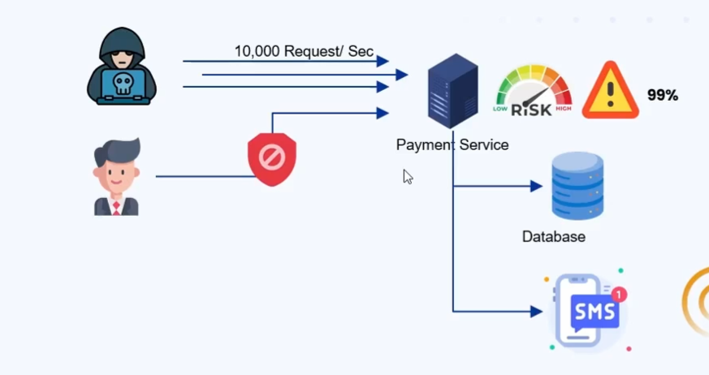
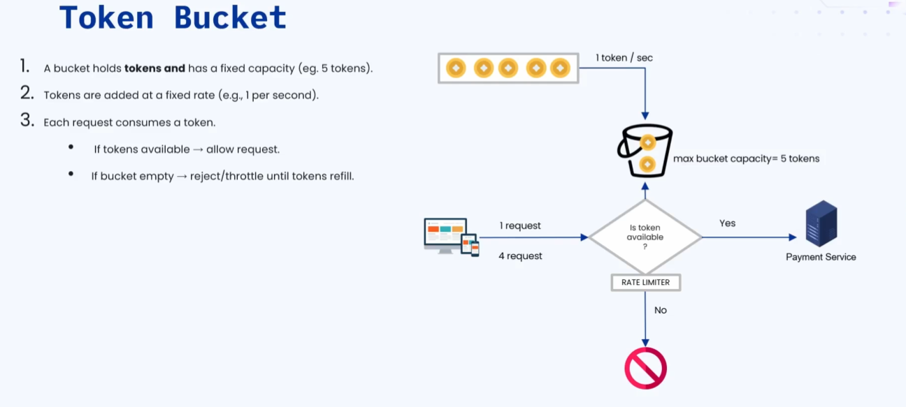
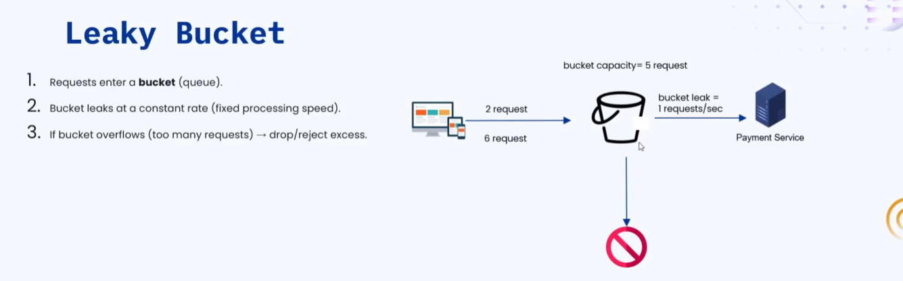
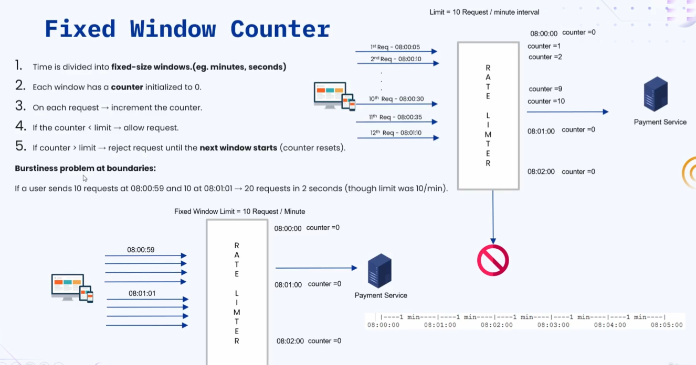
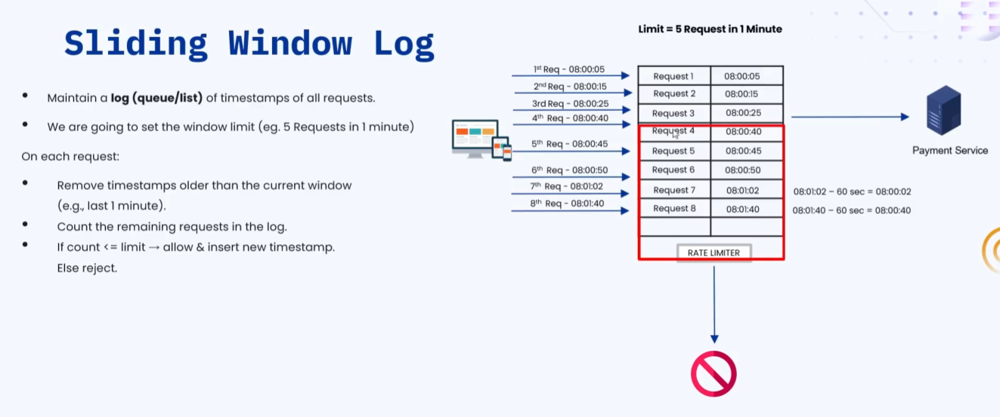
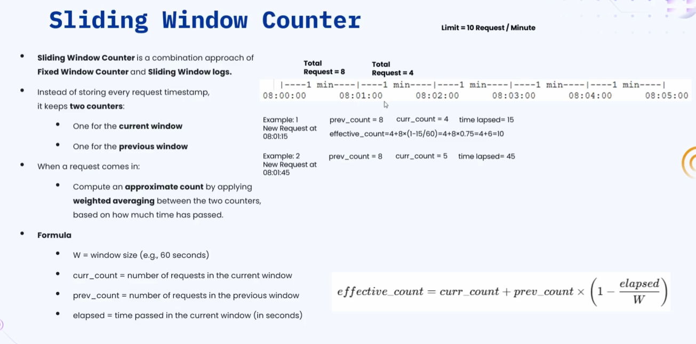

### 🔷🔶🔷 Chapter 10: Rate Limiter

---

### 🔷🔶🔷 Introduction — Why is a Rate Limiter Needed?

---

**🔘 1. Protection Against DDoS Attacks**

    🔹 DDoS stands for Distributed Denial of Service.

**🟠 Illustration**

    🔹 Consider a server running the Payment Service.

    🔹 A hacker sends 10,000 requests per second to this Payment Service.

    🔹 The Payment Service tries to process all 10,000 requests —
       CPU utilization becomes very high.

    🔹 Now, a genuine user makes a request — but the Payment
       Service cannot fulfill it, because the server is busy
       processing the hacker's 10,000 requests.

    🔹 The Payment Service ends up DENYING the genuine user's
       request — this is called Denial of Service.

    🔹 This leads to unfair usage of resources — a single user
       (the hacker) monopolizes the entire system, and other
       users cannot get a successful response from the server.

    🔹 To prevent this, a Rate Limiter is used — it fixes the
       number of requests a specific client/user can make, beyond
       which the user cannot make more requests.

---

**🔘 2. Preventing Backend System Exposure**

    🔹 Example: The Payment Service communicates with a database
       to store and retrieve data.

    🔹 If a hacker sends 10,000 requests, the Payment Service also
       ends up making a large number of requests to the database
       — increasing the database's CPU utilization too.

    🔹 This exposes the backend systems (not just the servers) to
       excessive load — which a rate limiter helps prevent.

---

**🔘 3. Cost Control**

    🔹 Example: The Payment Service sends an SMS after a
       successful payment.

    🔹 If a hacker sends 10,000 illegal requests, the Payment
       Service ends up sending 10,000 SMS messages.

    🔹 Sending each SMS has an associated cost — so the overall
       system cost increases significantly.

    🔹 A rate limiter helps control this cost by limiting how many
       requests (and thus downstream actions like SMS sends) can occur.

**🟠 Overall Impact**

    🔹 With all these issues (DDoS vulnerability, backend
       exposure, uncontrolled cost), the quality of service
       provided by the Payment Service degrades.

    🔹 A rate limiter is used to prevent all of this.

---

### 🔷🔶🔷 What is a Rate Limiter?

    🔹 A Rate Limiter is a mechanism or service used to control
       the number of requests or actions a client can perform
       within a given time window.

    🔹 It helps in:
        🔸 Ensuring fairness
        🔸 Preventing resource abuse
        🔸 Avoiding overloading the system
        🔸 Maintaining the stability and performance of the system

---

### 🔷🔶🔷 Rate Limiting Algorithms

    🔹 There are five important rate limiting algorithms:

        🔸 1. Token Bucket Algorithm
        🔸 2. Leaky Bucket Algorithm
        🔸 3. Fixed Window Counter
        🔸 4. Sliding Window Log
        🔸 5. Sliding Window Counter

---

### 🔷🔶🔷 1. Token Bucket Algorithm

    🔹 A bucket holds a fixed amount of tokens.

    🔹 Tokens are added to the bucket at a fixed rate (e.g. 1
       token per second).

    🔹 Whenever a request comes in:
        🔸 If a token is present in the bucket -> the token is
           consumed, and the request is sent to the server.
        🔸 If no tokens are present -> the request is rejected.

**🟠 Illustration**

    🔹 Bucket capacity is set to 5 tokens.

    🔹 Tokens are added at the rate of 1 token per second.

    🔹 After 3 seconds -> 3 tokens in the bucket.

    🔹 After 5 seconds -> 5 tokens in the bucket (bucket is full).

    🔹 After 8 seconds -> still only 5 tokens (the bucket cannot
       exceed its maximum configured capacity of 5).

**🟠 Request Processing Example**

    🔹 Client -> Rate Limiter -> Payment Service (server).

    🔹 When a client makes a request, the rate limiter checks if a
       token is available:
        🔸 If available -> the token is consumed, and the request
           is forwarded to the Payment Service.

    🔹 Example: The bucket has only 2 tokens, but the client sends
       4 requests.
        🔸 The rate limiter checks the bucket -> 2 tokens available.
        🔸 Those 2 tokens are consumed for the first 2 requests.
        🔸 The remaining 2 requests are REJECTED by the rate limiter.

    🔹 As long as there are tokens, requests are processed. If
       there are more requests than available tokens, the excess is rejected.

    🔹 The speed at which requests are sent to the server is
       always maintained by the rate limiter — since tokens are
       added at a fixed rate, and bucket capacity is capped.

---

### 🔷🔶🔷 2. Leaky Bucket Algorithm

    🔹 A bucket exists, and requests enter the bucket directly.

    🔹 There is a "hole" in the bucket — it leaks at a constant
       rate. "Leaking" here means sending the request to the server.

    🔹 The bucket has a fixed capacity — if it overflows (too many
       requests), the excess requests are dropped/rejected.

**🟠 Illustration**

    🔹 Bucket capacity is configured to 5 requests (maximum it can
       hold at any point).

    🔹 Client -> Rate Limiter (Bucket) -> Payment Service (server).

**🟠 Example 1 — 2 Requests Sent**

    🔹 The client sends 2 requests — both are stored in the bucket.

    🔹 From the bucket, only 1 request per second leaks out to the
       Payment Service (leak rate = 1 request/second).

    🔹 It takes 2 seconds for the rate limiter to process (leak
       out) both requests.

**🟠 Example 2 — 6 Requests Sent**

    🔹 The bucket can hold a maximum of 5 requests.

    🔹 So, of the 6 requests sent, 1 request is REJECTED
       (overflow), and the other 5 are stored in the bucket.

    🔹 The 5 stored requests leak out to the server at the rate of
       1 request per second — taking 5 seconds total to send all 5
       requests to the Payment Service.

    🔹 Note: Both the bucket capacity and the leak rate (requests
       per second) are configurable parameters, set according to system needs.

---

### 🔷🔶🔷 3. Fixed Window Counter

    🔹 Time is divided into fixed-size windows (e.g. per minute or
       per second).

    🔹 For each window, a counter is initialized to 0 at the start
       of the window.

    🔹 Whenever a request comes in, the rate limiter increments
       the counter by 1.

    🔹 A limit is also set for the rate limiter.

    🔹 On each request:
        🔸 If counter value < limit -> the request is allowed and
           sent to the server.
        🔸 If counter value >= limit -> the request is rejected,
           until the next window starts (where the counter resets to 0).

**🟠 Illustration**

    🔹 Timeline: 8:00 to 8:05, with each window being 1 minute long.
        🔸 Window 1: 8:00:00 – 8:01:00
        🔸 Window 2: 8:01:00 – 8:02:00
        🔸 Window 3: 8:02:00 – 8:03:00 ... and so on.

    🔹 At the start of each window, the counter resets to 0.

    🔹 Limit set: 10 requests per 1-minute window.

**🟠 Walkthrough**

    🔹 Request 1 at 8:00:05 -> counter (0) < limit (10) -> allowed;
       counter becomes 1.

    🔹 Request 2 at 8:00:10 -> counter (1) < limit (10) -> allowed;
       counter becomes 2.

    🔹 ... this continues; after 9 requests, counter = 9 (still <
       10) — all allowed.

    🔹 Request 10 at 8:00:32 -> counter (9) < limit (10) -> allowed;
       counter becomes 10.

    🔹 Request 11 at 8:00:35 -> counter (10), limit (10) -> counter
       is NOT less than limit -> REJECTED.

    🔹 The client must wait for the NEXT window, where the counter
       resets to 0.

    🔹 Request 12 at 8:01:10 (new window, 8:01) -> counter was
       reset to 0 -> counter (0) < limit (10) -> allowed.

    🔹 The rate limiter processes up to 10 requests per window;
       anything beyond that in the same window is rejected until
       the next window begins.

**🟠 Major Issue — The Burstiness Problem at Boundaries**

    🔹 This is a very important interview topic.

    🔹 Setup: Limit = 10 requests per minute window.
        🔸 Window boundaries: 8:00 – 8:01, 8:01 – 8:02, etc.
        🔸 Counter resets to 0 at the start of each window.

    🔹 Scenario:
        🔸 The client bursts 10 requests at 8:00:59 (end of Window
           1) -> all 10 accepted, since counter starts at 0 and
           reaches 10 (still within window's limit).
        🔸 The client then bursts ANOTHER 10 requests at 8:01:01
           (start of Window 2) -> all 10 accepted too, since the
           counter was reset to 0 at the start of Window 2.

    🔹 The Problem:
        🔸 The time gap between these two bursts is only 2 seconds
           (8:00:59 to 8:01:01).
        🔸 The client effectively made 20 requests within 2
           seconds — even though the limit was defined as only 10
           requests PER MINUTE.

    🔹 This is called the Burstiness Problem at Boundaries — a
       major drawback of the Fixed Window Counter algorithm.

    🔹 To overcome this, we use the Sliding Window Log and Sliding
       Window Counter algorithms.

---

### 🔷🔶🔷 4. Sliding Window Log

    🔹 The rate limiter maintains a log containing the number of
       requests AND the timestamp of when each request arrived.

    🔹 A limit is set for the window — e.g. 5 requests in the last
       1 minute.

    🔹 Whenever a new request comes in:
        🔸 The rate limiter removes older timestamps that fall
           outside the last 1 minute.
        🔸 It counts the number of logs remaining in the current window.
        🔸 If count < limit -> request is sent to the server.
        🔸 If count >= limit -> request is rejected.

**🟠 Illustration**

    🔹 Client -> Rate Limiter (maintaining a log of requests +
       timestamps) -> Payment Service.

    🔹 Limit: 5 requests in the last 1 minute (last 60 seconds).

**🟠 Walkthrough**

    🔹 Request 1 at 8:00:05 -> logged; check last 60s -> count = 1
       < 5 -> sent to server.

    🔹 Request 2 at 8:00:15 -> logged; count = 2 < 5 -> sent to server.

    🔹 Request 3, 4, 5 -> similarly logged and processed; count
       reaches 5, still ≤ 5 -> all sent to server.

    🔹 Request 6 at 8:00:52 -> logged; count in last 60s = 6, which
       is > limit (5) -> REJECTED.

    🔹 Request 7 at 8:01:00 -> logged; window = current timestamp
       minus 60s = 8:00:02; counting logs from 8:00:02 to 8:01:00
       -> 7 logs found -> count (7) > limit (5) -> REJECTED.

    🔹 Request 8 at 8:01:40 -> logged; window = current timestamp
       minus 60s = 8:00:40; counting logs from 8:00:40 to 8:01:40
       -> only 5 logs fall within this window -> count (5) ≤ limit
       (5) -> ALLOWED.

    🔹 The key insight: The window "slides" continuously based on
       the current time — hence the name Sliding Window Log.

    🔹 Since the window slides based on the timestamp (rather than
       being reset at fixed boundaries), this overcomes the
       burstiness problem seen in the Fixed Window Counter.

    🔹 This is the major advantage of the Sliding Window Log algorithm.

---

### 🔷🔶🔷 5. Sliding Window Counter

    🔹 A hybrid approach — combining Fixed Window Counter and
       Sliding Window Log.

    🔹 Instead of maintaining just one counter (like fixed window
       counter), it maintains TWO counters:
        🔸 One for the CURRENT window.
        🔸 One for the PREVIOUS window.

    🔹 Whenever a request comes in, the rate limiter computes an
       Effective (Approximate) Count using a weighted average of
       the two counters, factoring in how much time has elapsed in
       the current window.

**🟠 Formula**

    🔹 Effective Count = Current Count + (Previous Count × (1 −
       (Time Elapsed / Window Size)))

    🔹 Where:
        🔸 Current Count = number of requests received in the current window.
        🔸 Previous Count = total number of requests received in the previous window.
        🔸 Time Elapsed = time passed within the current window, in seconds.

**🟠 Illustration**

    🔹 Timeline: 8:00 to 8:05, each window = 60 seconds.

    🔹 Limit: 10 requests per minute (per 60-second window).

    🔹 Current Window: 8:01 – 8:02.

    🔹 Previous Window (8:00 – 8:01) had 8 total requests (all
       successful, since 8 < limit of 10).

    🔹 In the current window so far: 4 requests have been received.

**🟠 Example 1 — New Request at 8:01:15**

    🔹 Previous Count = 8, Current Count = 4, Time Elapsed = 15 seconds.

    🔹 Effective Count = 4 + (8 × (1 − 15/60)) = 4 + (8 × 0.75) = 4
       + 6 = 10.

    🔹 Is this request processed? Yes — Effective Count (10) ≤
       Limit (10) -> ALLOWED.

**🟠 Example 2 — New Request at 8:01:45**

    🔹 Previous Count = 8, Current Count = 5 (incremented after
       Example 1's request), Time Elapsed = 45 seconds.

    🔹 Effective Count = 5 + (8 × (1 − 45/60)) = 5 + (8 × 0.25) = 5
       + 2 = 7.

    🔹 Is this request processed? Yes — Effective Count (7) ≤
       Limit (10) -> ALLOWED.

    🔹 Observation: The Effective Count changes dynamically based
       on the time elapsed, the current count, and the previous
       count — smoothly blending the two windows.

    🔹 This is why the algorithm is called the Sliding Window
       Counter — it approximates a sliding window's fairness while
       remaining computationally simpler than maintaining a full log.

---

### 🔷🔶🔷 Rate Limiter — Recap Analogy

    🔹 A rate limiter is like a traffic signal for requests.

    🔹 It ensures no single client overwhelms the system.

    🔹 It enforces fairness and protects the infrastructure.

---

### 🔷🔶🔷 Where is a Rate Limiter Implemented?

    🔹 Referring back to the API Gateway architecture diagram: the
       rate limiter is usually implemented within the API Gateway itself.

    🔹 Alternatively, it can be implemented in individual
       services.

    🔹 However, if an API Gateway is already being used, it is
       generally better to implement the rate limiting algorithm
       there, rather than duplicating it across individual services.

---

### 🔷🔶🔷 Summary — Rate Limiter at a Glance

    🔸 Why Rate Limiter   ->  Prevents DDoS attacks and denial of
       is Needed               service to genuine users, prevents
                              backend system exposure (e.g.
                              database overload), and helps
                              control operational costs (e.g.
                              excessive SMS sends).

    🔸 Rate Limiter       ->  A mechanism/service that controls
                              the number of requests or actions a
                              client can perform within a given
                              time window — ensuring fairness,
                              preventing abuse, and maintaining
                              system stability.

    🔸 Token Bucket       ->  Tokens added to a bucket at a fixed
                              rate, up to a max capacity; each
                              request consumes a token if
                              available, else rejected. Maintains
                              a steady, controlled outflow rate.

    🔸 Leaky Bucket       ->  Requests enter a fixed-capacity
                              bucket and "leak" out to the server
                              at a constant rate; overflow requests
                              are dropped.

    🔸 Fixed Window       ->  Time divided into fixed windows, each
       Counter                  with its own counter (reset to 0 at
                              window start); requests allowed
                              while counter < limit. Suffers from
                              the Burstiness Problem at Boundaries
                              (up to 2x the limit can slip through
                              near window edges).

    🔸 Sliding Window     ->  Maintains a log of request
       Log                       timestamps; on each request,
                              counts logs within the trailing
                              (sliding) time window and compares
                              to the limit. Solves the burstiness
                              problem, but requires more memory
                              (storing every timestamp).

    🔸 Sliding Window     ->  A hybrid of fixed window counter and
       Counter                  sliding window log — maintains only
                              two counters (current + previous
                              window) and computes a weighted
                              "effective count" based on time
                              elapsed. Balances accuracy with
                              lower memory overhead.

    🔸 Where              ->  Typically implemented in the API
       Implemented              Gateway (centralizing the logic,
                              consistent with API Gateway's role),
                              though it can also be implemented in
                              individual microservices if needed.

    🔹 Choosing the right rate limiting algorithm involves a
       trade-off between accuracy (how precisely the limit is
       enforced), memory/computation overhead, and how well it
       handles burst traffic at window boundaries.

---