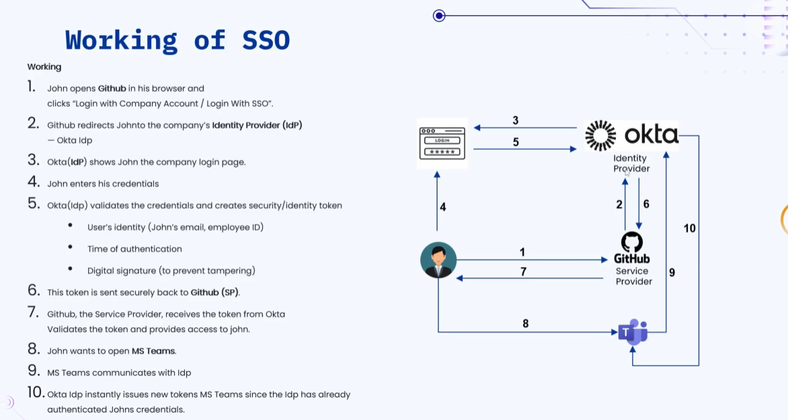
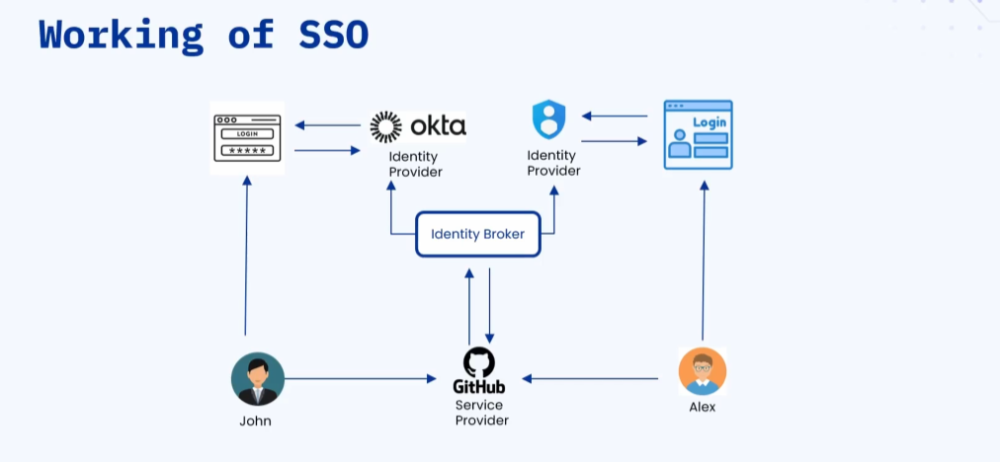

### 🔷🔶🔷 Chapter 11: Single Sign-On (SSO)

---

### 🔷🔶🔷 Introduction — Problems Without SSO

**🟠 Illustration**

    🔹 John is an employee working in an IT organization.

    🔹 In daily activities, employees use multiple tools:
        🔸 JIRA -> for tracking assigned tasks.
        🔸 GitHub -> for committing code and pulling others' code.
        🔸 MS Teams -> for communicating with other employees.
        🔸 ServiceNow -> for ticket tracking.
        🔸 Outlook -> for email communication.
        🔸 ...and potentially many more tools.

**🟠 Problems Faced Without SSO**

    🔹 1. Logging in to Each Tool Separately
        🔸 To use JIRA, you must log in to JIRA separately.
        🔸 To use Teams, you must log in to Teams separately.
        🔸 To use Outlook, you must log in to Outlook separately.
        🔸 Logging into different tools individually is time
           consuming and frustrating.

    🔹 2. Remembering Multiple Passwords
        🔸 Credentials for different tools might all be different.
        🔸 Remembering multiple passwords for different tools is
           frustrating and error-prone.

    🔹 3. Manual Onboarding and Offboarding
        🔸 When a new employee joins, the IT department must
           manually onboard them into EACH tool.
        🔸 If they forget to onboard the employee into even one
           tool, that employee cannot use it at all.
        🔸 Similarly, when an employee LEAVES the company, IT must
           manually offboard them from every tool.
        🔸 If the IT/HR team forgets to offboard the employee from
           even one tool, it leads to a SECURITY BREACH, since a
           former employee retains access.

    🔹 4. Increase in IT Support Requests
        🔸 Example: If an employee forgets the password of one or
           more tools, they must raise an IT support request to reset it.
        🔸 This might be manageable in a small organization, but
           for a large organization with thousands of employees —
           even if just 5% of employees forget a password for 1-2
           tools daily — the number of IT support requests raised
           becomes very high.
        🔸 Forgotten passwords aren't the only cause — there can
           be many other login-related issues too.
        🔸 All of this creates a heavy burden on the IT team.

---

### 🔷🔶🔷 What is Single Sign-On (SSO)?

    🔹 SSO can be defined as an authentication method that lets a
       user log in once and access multiple applications, without
       needing to log in again and again to different applications.

    🔹 This prevents the user from having to log in separately
       into each application — you log in only once, and gain
       access to multiple applications.

**🟠 Real-World Example**

    🔹 In Chrome, when you log in to Gmail, you don't have to
       separately log in to YouTube, Google Drive, or Calendar.

    🔹 Logging into Gmail gives you access to all other Google
       products — this is possible because of Single Sign-On.

---

### 🔷🔶🔷 Key Components of SSO

    🔹 There are three important components of SSO:

        🔸 1. Identity Provider (IDP)
        🔸 2. Service Provider (SP)
        🔸 3. Identity Broker

---

**🔘 1. Identity Provider (IDP)**

    🔹 The main responsibility of the IDP is to authenticate the
       user and provide access to the service provider.

    🔹 The IDP authenticates the user by validating the user's
       username/ID and password.

    🔹 The IDP is the ONLY component that manages user identities
       — no other component in SSO manages user identities.

    🔹 Since the IDP handles authentication, the service provider
       is freed from having to do the authentication process itself.

    🔹 Popular Identity Providers in the market:
        🔸 Okta
        🔸 Azure AD
        🔸 Google Identity

---

**🔘 2. Service Provider (SP)**

    🔹 As the name indicates, a service provider is an application
       or service that the user wants to access.

    🔹 Examples: GitHub, Microsoft Teams, Outlook, JIRA, etc.

    🔹 The service provider does NOT validate user identity itself
       — it only provides the service requested by the user.

    🔹 The service provider TRUSTS the identity provider to verify
       and validate the user.

---

**🔘 3. Identity Broker**

    🔹 Identity Broker is NOT always used — it comes into play
       only when there are MULTIPLE identity providers AND
       multiple service providers that need to be mapped to each other.

    🔹 If there is a single identity provider, an identity broker
       is usually not needed.

    🔹 The Identity Broker acts as a bridge between identity
       providers and service providers.

    🔹 It allows service providers to connect with different
       identity providers, without having to configure each one
       individually.

    🔹 Examples of Identity Brokers: Auth0, Keycloak, AWS Cognito.

---

### 🔷🔶🔷 How SSO Works — Illustration

**🟠 Scenario 1 — Single Identity Provider**

    🔹 John, an employee, wants to access GitHub — GitHub is the
       Service Provider.

    🔹 The company has adopted Okta as the Identity Provider.

**🟠 Step-by-Step Flow**

    🔹 Step 1: John clicks "Login with company account" (or
       "Login with SSO") on GitHub.

    🔹 Step 2: GitHub redirects John to the Identity Provider (Okta).

    🔹 Step 3: The Identity Provider displays the company's login
       page for John.

    🔹 Step 4: John enters his username and credentials.

    🔹 Step 5: Okta (the IDP) validates John's credentials. If
       successful, it creates a Security/Identity Token.

**🟠 What's Inside the Token**

    🔹 The token typically contains:
        🔸 User identity (e.g. John's email and employee ID).
        🔸 Time of authentication (e.g. useful to refresh the
           token or require re-login every 24 hours).
        🔸 A digital signature, to prevent tampering.

    🔹 Step 6: This token is shared with the GitHub Service Provider.

    🔹 Step 7: GitHub validates the token — if valid, GitHub grants
       John access.

**🟠 Accessing a Second Application (Same IDP)**

    🔹 Now John wants to access MS Teams.

    🔹 MS Teams redirects John to the Okta Identity Provider — but
       this time, the IDP does NOT show the login page again.

    🔹 The IDP already knows John has been validated — so it
       directly generates a NEW token and shares it with MS Teams.

    🔹 MS Teams validates this token, and grants John access.

    🔹 This is how John logs in ONCE and accesses multiple tools
       through SSO.

---

### 🔷🔶🔷 Illustration — When Identity Broker is Needed

**🟠 Scenario 2 — Multiple Identity Providers**

    🔹 Two employees, John and Alex, work for two different
       companies — Company A and Company B respectively — that
       are collaborating on a project.

    🔹 Both John and Alex need to access the same GitHub
       repositories — GitHub is the (shared) Service Provider.

    🔹 Company A (John's employer) has adopted Okta as its Identity Provider.

    🔹 Company B (Alex's employer) has adopted Azure AD as its Identity Provider.

    🔹 There are also likely to be multiple OTHER service
       providers involved (Teams, Outlook, JIRA, etc.), each
       needing to work with BOTH identity providers.

**🟠 The Problem**

    🔹 Each service provider (GitHub, Teams, etc.) would need to
       be configured with BOTH identity providers (Okta AND Azure AD).

    🔹 This configuration is tedious, complex, and error-prone,
       especially as the number of identity providers and service
       providers grows.

**🟠 The Solution — Identity Broker**

    🔹 The Identity Broker acts as a bridge between MULTIPLE
       identity providers and MULTIPLE service providers.

    🔹 All service providers register themselves with the identity broker.

    🔹 The identity broker is responsible for:
        🔸 Mapping the user to the correct identity provider.
        🔸 Getting the token from that identity provider.
        🔸 Sending that token to the correct service provider, to
           grant access to the right user.

    🔹 This reduces the complexity of configuring EVERY service
       provider with EVERY identity provider individually.

---

### 🔷🔶🔷 SSO Protocols

    🔹 SSO protocols are used for securely exchanging identity
       information between the different components of SSO — e.g.
       between the Identity Provider and Service Provider, between
       the Identity Provider and Identity Broker, or between the
       Identity Broker and Service Providers.

    🔹 Note: These are covered here only at a high level; deeper
       coverage is left for future/dedicated videos on each protocol.

**🔘 1. SAML (Security Assertion Markup Language)**

    🔹 An XML-based standard, used specifically for AUTHENTICATION
       (not authorization).

    🔹 SAML follows the XML structure — it is an XML document
       containing authentication data.

    🔹 Commonly used in enterprise environments — most likely used
       in typical IT organizations for SSO.

**🔘 2. OAuth 2.0**

    🔹 Commonly referred to simply as "OAuth."

    🔹 OAuth is used for AUTHORIZATION (not authentication — that
       is SAML's role).

    🔹 OAuth follows the JSON format — tokens generated using
       OAuth have a JSON structure.

    🔹 Use case: Whenever you want to give LIMITED ACCESS to a
       resource WITHOUT sharing the password.

    🔹 Common examples of OAuth usage: API calls, and granting app permissions.

**🔘 3. OpenID Connect (OIDC)**

    🔹 A widely used, modern protocol, built on TOP of OAuth 2.0.

    🔹 Also follows the JSON format.

    🔹 Speciality: It provides BOTH authorization AND
       authentication — unlike SAML (authentication only) or OAuth
       (authorization only).

    🔹 If a use case requires both authentication and
       authorization, OpenID Connect can be used instead of
       combining two separate protocols.

    🔹 Has become increasingly popular in recent times — mainly
       used in modern web applications and mobile applications.

---

### 🔷🔶🔷 Advantages of SSO

    🔹 1. Log In Once, Access Multiple Applications
        🔸 Reduces user frustration — no need to log in to
           multiple applications separately.
        🔸 Improves user experience, which in turn increases user
           productivity — users can focus on their actual work
           instead of remembering passwords and repeatedly logging
           in to separate applications.

    🔹 2. Simple User Management
        🔸 Onboarding and offboarding of users across multiple
           applications becomes simpler and easier to handle.

---

### 🔷🔶🔷 Disadvantages of SSO

    🔹 1. Single Point of Failure
        🔸 If the Identity Provider fails for any reason, the user
           will not be able to access ANY of the connected applications.
        🔸 Hence, it must be ensured that the identity provider
           does not fail (i.e. it needs to be highly available).

    🔹 2. Complex to Set Up and Integrate
        🔸 Since there are multiple key components (IDP, SP,
           Identity Broker), all of them need to be configured
           with each other for the system to work.
        🔸 This introduces setup complexity.
        🔸 Since there are multiple components involved, the cost
           of setting up such a system also increases.

    🔹 Note: These disadvantages are generally negligible when
       compared to the advantages — it is usually still better to
       go with SSO wherever the use case fits.

---

### 🔷🔶🔷 Summary — SSO at a Glance

    🔸 Problems Without    ->  Logging in separately to every
       SSO                     tool, remembering multiple
                              passwords, manual (and error-prone)
                              onboarding/offboarding, and
                              increased IT support requests
                              (especially at scale).

    🔸 SSO                 ->  An authentication method that lets
                              a user log in once and access
                              multiple applications without
                              repeatedly logging in — e.g. Google's
                              ecosystem (Gmail login gives access
                              to YouTube, Drive, Calendar, etc.).

    🔸 Identity Provider   ->  Authenticates the user (validates
       (IDP)                    username/password) and manages user
                              identities — e.g. Okta, Azure AD,
                              Google Identity. Only the IDP manages
                              identities.

    🔸 Service Provider    ->  The application/service the user
       (SP)                     wants to access (e.g. GitHub,
                              Teams, Outlook, JIRA) — trusts the
                              IDP for authentication, and only
                              provides the requested service.

    🔸 Identity Broker     ->  A bridge used only when there are
                              MULTIPLE identity providers and
                              service providers; maps users to the
                              correct IDP and relays tokens to the
                              correct SP — e.g. Auth0, Keycloak,
                              AWS Cognito.

    🔸 How SSO Works       ->  User logs in once via the IDP,
                              receiving a signed token (with
                              identity, auth time, and signature);
                              subsequent app access reuses this
                              validated session — the IDP issues
                              new tokens per service without
                              requiring re-login.

    🔸 SAML                ->  XML-based protocol for
                              AUTHENTICATION only; common in enterprise environments.

    🔸 OAuth 2.0           ->  JSON-based protocol for
                              AUTHORIZATION only; used for API
                              calls and app permissions, granting
                              limited access without sharing passwords.

    🔸 OpenID Connect      ->  JSON-based protocol built on OAuth
       (OIDC)                    2.0, providing BOTH authentication
                              AND authorization; popular in modern
                              web/mobile applications.

    🔸 Advantages          ->  Improved user experience and
                              productivity (login once); simpler
                              user management (onboarding/offboarding).

    🔸 Disadvantages       ->  Single point of failure (if IDP
                              fails, access to everything fails);
                              complex and costly to set up and
                              integrate — though generally
                              outweighed by the advantages.

    🔹 SSO significantly simplifies the user experience and
       administrative overhead of accessing multiple applications,
       at the cost of introducing a critical, centralized
       dependency (the identity provider) that must be made highly available.

---
