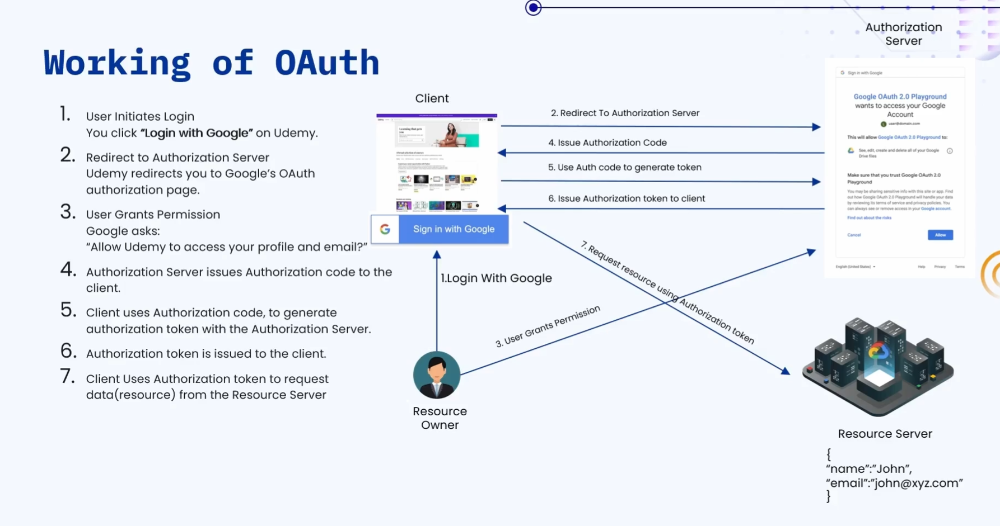

### 🔷🔶🔷 Chapter 12: OAuth

---

### 🔷🔶🔷 Introduction — What is OAuth?

    🔹 In the previous chapter, we learned about Single Sign On (SSO). In this
      chapter, we look into the OAuth framework.

    🔹 You have probably used OAuth in your day to day life many times,
      without even realizing it.

    🔹 OAuth is a secure authorization framework that allows one application or
      service to access a user's resource present in another application or
      service, without giving away the user's password.

    🔹 OAuth can also be defined as a standard that provides consented access
      to a resource on behalf of the user, without ever sharing the user's
      actual credentials.

    🔹 One major thing to remember — OAuth 2.0 is an authorization protocol,
      and NOT an authentication protocol.
        🔸 Authentication is not possible using OAuth.
        🔸 OAuth can only be used for authorization purposes.

---

### 🔷🔶🔷 Real World Example — Udemy and Gmail

    🔹 Let's say a user wants to purchase a course on the Udemy platform.

    🔹 To do that, the user first has to login to Udemy, and only
      then he will be able to purchase the course.

    🔹 To login, the user has two options:
        🔸 1. Sign up with a new account using username, email address, and
          password, to register a fresh account.
        🔸 2. Sign in directly using an existing Gmail, Facebook, or Apple
          account.

    🔹 Let's say the user selects the Gmail account option to login to the
      Udemy platform.

    🔹 Once selected, the user is able to sign in and login to Udemy
      using his Gmail account credentials.

    🔹 Question — does the user need to share his Gmail password with Udemy
      during this process?

    🔹 Answer — No, the user does not share his Gmail password with Udemy at
      any point in this process.

    🔹 Without ever sharing the password, the user is still able to login to
      Udemy successfully using Gmail.

    🔹 This entire mechanism is made possible behind the scenes by the OAuth
      authorization framework.

    🔹 In this example, Udemy is trying to access the client's username and
      email, which actually resides in Gmail.

    🔹 Neither the Gmail servers nor the user ever shares the password with
      Udemy to retrieve this data.

    🔹 Udemy is able to retrieve the username and email address from Gmail
      servers without the password, using OAuth.

---

### 🔷🔶🔷 Key Components of OAuth

    🔹 There are five important components in the OAuth framework.

**🔘 1. Resource Owner**

    🔹 This is the user — that is, you — who owns the data, such
      as username, email address, and other related data.

    🔹 The user is always the owner of their own data in the OAuth
      framework.

**🔘 2. Client Application**

    🔹 This is the application or service that is requesting access to the
      user's resource.

    🔹 In our example, the client application is the Udemy application, which
      wants the user's Gmail data.

**🔘 3. Resource Server**

    🔹 This is the server that holds and stores the actual user resource
      or user data.

    🔹 In simple terms, this is where the requested data is actually
      physically present.

**🔘 4. Authorization Server**

    🔹 The authorization server is responsible for authenticating the user and
      issuing authorization tokens.

**🔘 5. Access Token**

    🔹 Using this access token, the client is able to request data from
      the resource server and retrieve it.

    🔹 The access token provides only limited access to the user's data,
      not full access.

    🔹 Without the access token, the client is not able to retrieve any
      data or resources from the resource server.

    🔹 The access token is a very important and central piece of the
      entire OAuth mechanism.

---

### 🔷🔶🔷 Working of OAuth

    🔹 Let us understand the working of OAuth using the same Udemy and
      Gmail example from earlier.

    🔹 Here, the user is the resource owner, and Udemy is the client
      application in this flow.

    🔹 Along with the resource owner and client, we also have the
      authorization server and Google's resource server.

    🔹 Google's resource server is the place where the actual user data,
      like email and username, is stored.

    🔹 Step 1 — The user wants to login to Udemy, and chooses "Sign
      in with Google" as the login mechanism.

    🔹 Step 2 — When the user clicks "Sign in with Google," he is
      redirected to Google's Authorization Server page.

    🔹 Step 3 — On this page, the user must give consent to allow
      the client to request his data.
        🔸 If already logged in to Gmail, this consent page is shown directly
          to the user.
        🔸 If not logged in, the user must first login to Gmail using
          his actual Google credentials.
        🔸 Important — the user provides credentials to Google, and never
          directly to the Udemy platform.

    🔹 Step 4 — On the consent page, the user can either deny the
      request or allow the request.

    🔹 Step 5 — Assume the user allows the request, giving his consent
      to access his Gmail data.

    🔹 Step 6 — The authorization server then issues an authorization code
      back to the client application.

    🔹 Step 7 — The client uses this authorization code to generate an
      access token with the authorization server.
        🔸 The client sends a "generate token" request to the authorization
          server for this purpose.

    🔹 Step 8 — The authorization server first validates the received
      authorization code for correctness.
        🔸 If the code is correct, an access token is generated and shared
          back with the client application.

    🔹 Step 9 — After receiving the access token, the client makes a
      request to the resource server for user data.

    🔹 Step 10 — The resource server validates the access token received
      from the client application.
        🔸 If the token is correct and valid, the resource server shares
          the requested data with Udemy.

    🔹 This is how the client is able to get the user's data without
      ever asking for the user's password.

    🔹 Without the password, the client is able to retrieve user data
      purely using this OAuth mechanism.

    🔹 This entire flow is made possible together by the five key
      components — resource owner, client, authorization server, resource
      server, and access token.

---

### 🔷🔶🔷 Comparison — SSO vs OAuth

**🔘 1. Purpose**

    🔸 OAuth  ->  Used only for authorization, to allow the client to
                  access data present in the resource server on behalf
                  of the user.
    🔸 SSO    ->  Used for authentication — the user provides username and
                  password, which gets authenticated once, granting access
                  to multiple systems.

**🔘 2. Example**

    🔸 OAuth  ->  Udemy accessing a user's Google profile data, such as
                  the username and email address.
    🔸 SSO    ->  Logging into your company website on your company laptop
                  once, and getting access to multiple tools like GitHub,
                  JIRA, and Teams.

**🔘 3. Type of Token Used**

    🔸 OAuth  ->  Makes use of an access token to access the requested
                  resource from the resource server.
    🔸 SSO    ->  Makes use of security or identity tokens to validate
                  the user across different applications.

**🔘 4. Scope**

    🔸 OAuth  ->  Usually used at the API level, to provide or restrict
                  data access to resources at that layer.
    🔸 SSO    ->  Provides a system-wide identity login — you login once
                  to your system to access multiple different applications
                  or tools.

---

### 🔷🔶🔷 Summary — OAuth at a Glance

    🔸 OAuth                   ->  A secure authorization framework that
                                    allows a client application to access
                                    a user's resource, present in another
                                    service, without ever sharing the
                                    user's password or actual credentials.

    🔸 OAuth vs Authentication ->  OAuth is strictly an authorization
                                    protocol, and it cannot be used for
                                    authenticating users directly.

    🔸 Resource Owner          ->  The user who owns the data, such as
                                    username, email, and other personal
                                    resource information.

    🔸 Client Application      ->  The application or service that is
                                    requesting access to the user's
                                    resource — e.g. Udemy.

    🔸 Resource Server         ->  The server where the actual user data
                                    is physically stored and held —
                                    e.g. Google's servers.

    🔸 Authorization Server    ->  Responsible for authenticating the user
                                    and issuing authorization codes and
                                    access tokens.

    🔸 Access Token            ->  A limited-access token used by the
                                    client to retrieve user data from the
                                    resource server securely.

    🔸 Working of OAuth        ->  User consents on the authorization
                                    server, an authorization code is issued,
                                    exchanged for an access token, and then
                                    used to fetch data from the resource
                                    server.

    🔸 OAuth vs SSO            ->  OAuth handles authorization at the API
                                    level using access tokens, while SSO
                                    handles system-wide authentication using
                                    identity tokens across multiple tools.

    🔹 Choosing between OAuth and SSO depends on whether the goal is
      authorizing data access, or authenticating user identity across
      multiple systems and applications.

---