### 🔷🔶🔷 Chapter 13: Symmetric and Asymmetric Encryption / Decryption

---

### 🔷🔶🔷 Prerequisites — Key Terms to Know Before We Start

    🔹 Plaintext — This is the original, readable data or message before
      any encryption is applied to it.

    🔹 Ciphertext — This is the scrambled, unreadable output produced after
      the plaintext has been encrypted.

    🔹 Key — A piece of secret information used by an algorithm to
      convert plaintext into ciphertext, and back again.

    🔹 Byte — A unit of digital data made up of 8 bits, used
      as the basic unit while processing data in AES.

    🔹 Block — A fixed-size chunk of data, such as 128 bits, that
      is processed together as one unit during encryption.

    🔹 State Matrix — A 4x4 grid of bytes, arranged from the input
      data, on which all AES transformation steps are performed.

    🔹 Round — One complete cycle of transformation steps applied to the
      state matrix, repeated multiple times to strengthen encryption.

    🔹 XOR Operation — A bitwise operation that compares two bits, and
      outputs 1 only when the two bits are different.

    🔹 S-Box — A predefined lookup table used to substitute one byte
      value with another, in a non-linear and secure way.

    🔹 Round Constant (RC) — A predefined value, unique to each round, that
      is XORed into the key expansion process to add randomness.

---

### 🔷🔶🔷 1. What is Symmetric Encryption?

    🔹 Symmetric encryption is a method where a single key is used
      to perform both encryption and decryption of data.

    🔹 The same key is shared between the sender and the receiver,
      and both parties must keep this key secret.

    🔹 Since the underlying mathematical operations are simple, symmetric encryption
      is generally very fast compared to other methods.

    🔹 Examples of symmetric encryption algorithms include AES (Advanced Encryption Standard)
      and DES (Data Encryption Standard).

---

### 🔷🔶🔷 2. What is Asymmetric Encryption?

    🔹 Asymmetric encryption is a method that uses two separate keys —
      a public key and a private key.

    🔹 Typically, the public key is used to encrypt the data, while
      the private key is used to decrypt it.

    🔹 Since asymmetric encryption relies on complex mathematical problems, it is
      generally slower compared to symmetric encryption methods.

    🔹 Examples of asymmetric encryption algorithms include RSA and the Diffie-Hellman
      key exchange method.

---

### 🔷🔶🔷 Comparison — Symmetric vs Asymmetric Encryption

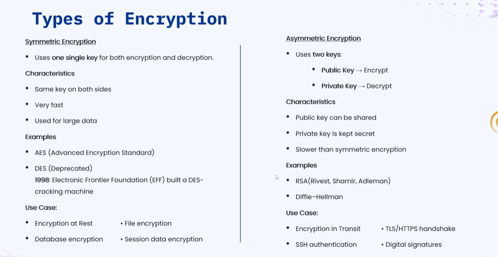

**🔘 1. Number of Keys**

    🔸 Symmetric   ->  Uses a single shared key for both encryption
                       and decryption of the data.
    🔸 Asymmetric  ->  Uses two separate keys — a public key and
                       a private key — for encryption and decryption.

**🔘 2. Speed**

    🔸 Symmetric   ->  Very fast, since the mathematical operations involved
                       are relatively simple and lightweight.
    🔸 Asymmetric  ->  Slower, since it relies on complex mathematical
                       problems to secure the data.

**🔘 3. Examples**

    🔸 Symmetric   ->  AES (Advanced Encryption Standard) and DES (Data
                       Encryption Standard) are common examples.
    🔸 Asymmetric  ->  RSA and the Diffie-Hellman key exchange method
                       are common examples.

---

### 🔷🔶🔷 3. AES Encryption 

    🔹 AES, or Advanced Encryption Standard, is one of the most
      widely used symmetric encryption algorithms today.

    🔹 AES operates on data using fixed-size blocks, and processes these
      blocks through multiple structured rounds of transformation.

**🔘 Sub Topics — AES Block and Key Sizes**

    🔹 AES always encrypts data in fixed blocks of 128 bits,
      which is equal to 16 bytes of data.

    🔹 AES supports three different key sizes, and the number of
      rounds depends on which key size is chosen.
        🔸 128-bit key size  ->  uses 10 rounds of transformation.
        🔸 192-bit key size  ->  uses 12 rounds of transformation.
        🔸 256-bit key size  ->  uses 14 rounds of transformation.

---

### 🔷🔶🔷 Workflow — From Plaintext to Ciphertext

    🔹 Step 1 — The plaintext message is first converted into a
      sequence of individual bytes for processing.

    🔹 Step 2 — These bytes are then arranged into a 4x4
      grid, known as the Input State Matrix.

    🔹 Step 3 — An Initial Transformation is applied, where the plaintext's
      state matrix is combined with the original key.

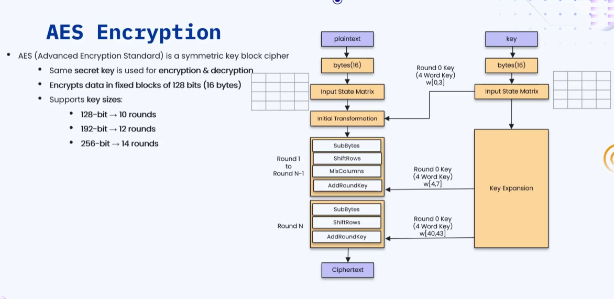

    🔹 Step 4 — From Round 1 up to Round N-1, four
      transformation steps are applied repeatedly, in this order:
        🔸 SubBytes — substituting bytes using the S-Box lookup table.
        🔸 ShiftRows — shifting rows of the state matrix left.
        🔸 MixColumns — mixing each column using a fixed matrix.
        🔸 AddRoundKey — XORing the state matrix with the round key.

    🔹 Step 5 — In the Final Round (Round N), only three steps
      are applied, and MixColumns is intentionally skipped:
        🔸 SubBytes — substituting bytes using the S-Box lookup table.
        🔸 ShiftRows — shifting rows of the state matrix left.
        🔸 AddRoundKey — XORing the state matrix with the final round key.

---

### 🔷🔶🔷 Key Encryption Flow — Preparing the Round Keys

    🔹 Step 1 — The original AES key, which is 16 bytes
      in size, is taken as the starting input.

    🔹 Step 2 — These 16 key bytes are arranged into their
      own 4x4 grid, called the Input State Matrix of the key.

    🔹 Step 3 — A process called Key Expansion is then run on
      this matrix, to generate all the round keys needed.

---

### 🔷🔶🔷 Initial Transformation

    🔹 The original key's state matrix is made up of four columns,
      referred to as the words — W0, W1, W2, and W3.

    🔹 These four words together represent the entire original key, in its
      column-wise form, before any expansion takes place.

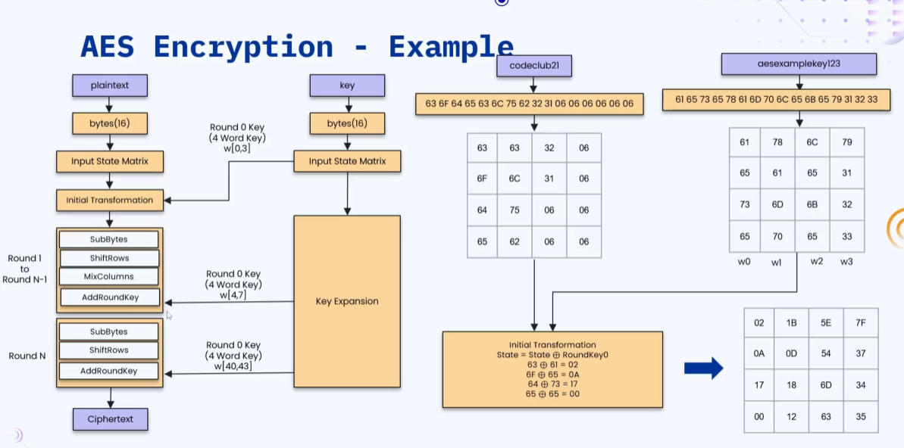

    🔹 The Initial Transformation step performs an XOR operation between the Input
      State Matrix of the plaintext, and the Input State Matrix of
      the key, formed by words W0 to W3.

    🔹 This XOR result becomes the new state, which is then passed
      forward into Round 1 of the encryption process.

---

### 🔷🔶🔷 SubBytes

    🔹 SubBytes is a substitution step, where every byte in the current
      state matrix is replaced with a new byte value.

    🔹 This replacement is done using a special lookup table, known as
      the S-Box, defined within the AES algorithm.

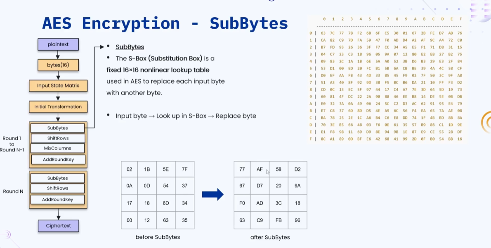

    🔹 The S-Box is a 16x16 non-linear lookup table, designed specifically to
      introduce confusion and strengthen the encryption process.

    🔹 Each byte in the state matrix is mapped to a corresponding
      output byte, by looking up its value inside this S-Box.

---

### 🔷🔶🔷 ShiftRows

    🔹 ShiftRows is a transformation step that cyclically shifts the bytes within
      each row of the state matrix, but only sideways.

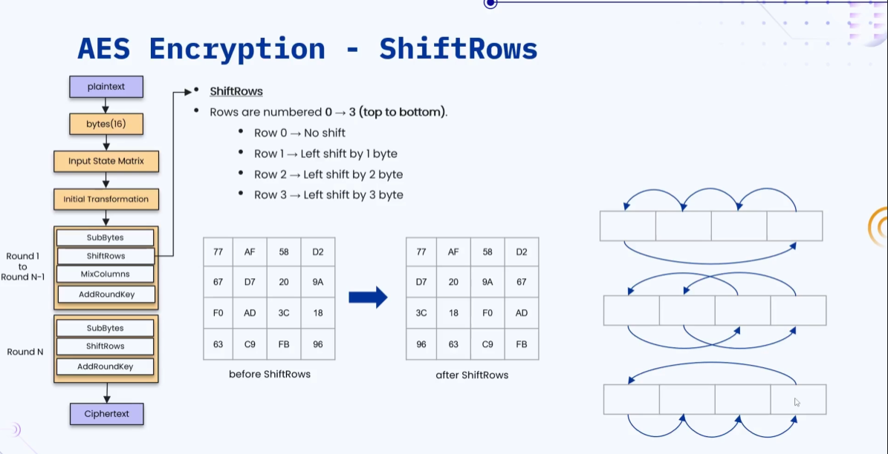

    🔹 Each of the four rows in the state matrix is shifted
      left by a different, specific number of positions.
        🔸 Row 0  ->  No shift is applied to this row at all.
        🔸 Row 1  ->  Left shifted by 1 byte position.
        🔸 Row 2  ->  Left shifted by 2 byte positions.
        🔸 Row 3  ->  Left shifted by 3 byte positions.

    🔹 This shifting spreads the byte values across different columns, adding diffusion
      to the overall encryption process.

---

### 🔷🔶🔷 MixColumns

    🔹 MixColumns is a transformation step that operates on the state matrix,
      one column at a time, rather than by rows.

    🔹 Each column of the state matrix is multiplied by a fixed,
      predefined matrix, using special mathematical field operations.

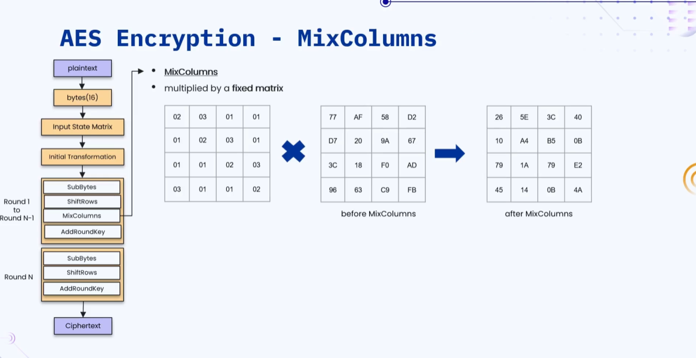

    🔹 This multiplication mixes the bytes within each column together, further increasing
      the diffusion and overall strength of the encryption.

    🔹 Note — this MixColumns step is intentionally skipped during the very
      last round, that is, during Round N of AES.

---

### 🔷🔶🔷 Key Expansion — Generating Round Keys

    🔹 At the start, the words W0, W1, W2, and W3 are
      already available, taken directly from the original key.

    🔹 To move into the next round, four new words — W4, W5,
      W6, and W7 — need to be generated from these.

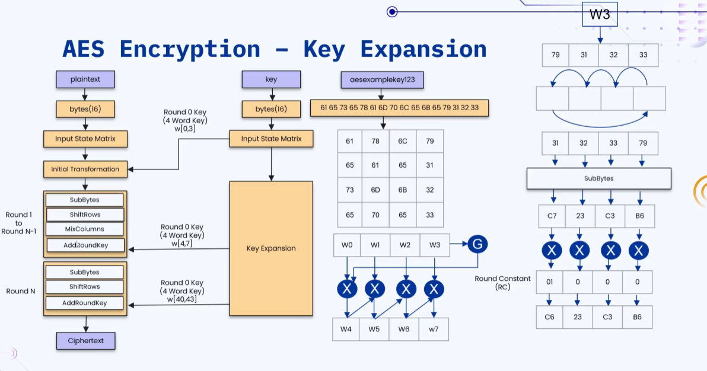

    🔹 To generate W4, the last word W3 first undergoes a series
      of transformation steps, applied one after another.
        🔸 Left Shift by 1 — the bytes inside W3 are rotated left.
        🔸 SubBytes — each byte of the shifted word is substituted using
          the S-Box lookup table.
        🔸 XOR with Round Constant (RC) — the substituted word is then
          XORed with a round-specific constant value.

    🔹 The resulting value from this process is then XORed with W0,
      and this final result becomes the new word, W4.

    🔹 The remaining new words are then generated in a simple chained
      manner, by XORing consecutive words together.
        🔸 W4 XOR W1  ->  produces the next word, W5.
        🔸 W5 XOR W2  ->  produces the next word, W6.
        🔸 W6 XOR W3  ->  produces the next word, W7.

    🔹 These four new words, W4 to W7, together form the round
      key that will be used in the very next round.

    🔹 This entire process repeats itself for every subsequent round, generating
      a fresh set of round keys each time, until the
      final round is reached.

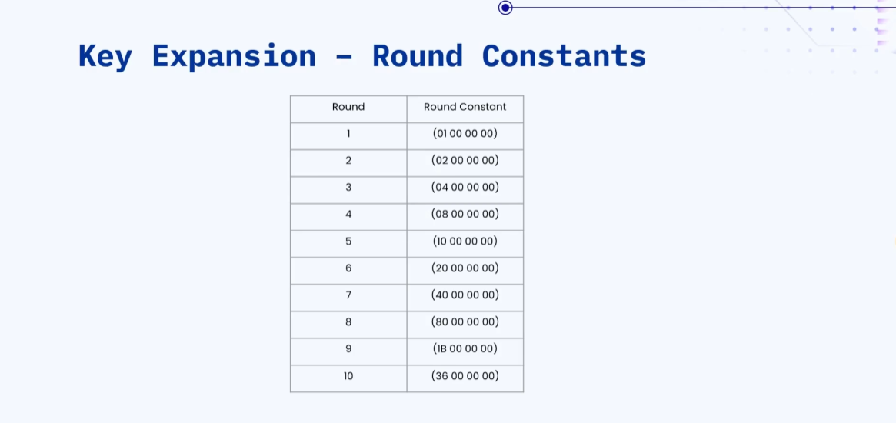

---

---

### 🔷🔶🔷 RSA — Introduction

    🔹 RSA is an asymmetric encryption algorithm, which means it makes use
      of two different keys instead of just one.

    🔹 Asymmetric means:
        🔸 Public Key — used specifically for encrypting the data.
        🔸 Private Key — used specifically for decrypting the data.

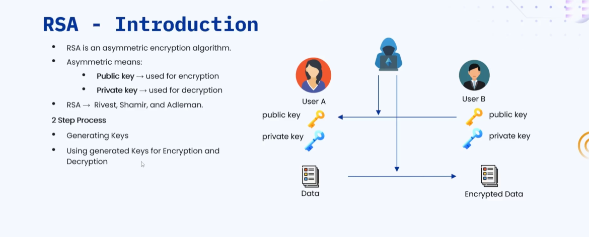

    🔹 RSA gets its name from its three inventors — Rivest, Shamir,
      and Adleman.

    🔹 The entire RSA mechanism works in a 2 step process:
        🔸 Step 1 — Generating the public and private keys.
        🔸 Step 2 — Using these generated keys for encryption and decryption.

**🔘 How It Works — User A and User B**

    🔹 Both User A and User B each generate their own pair
      of keys — a public key and a private key.

    🔹 The public key of each user is openly shared with the
      other user, over the communication channel.

    🔹 The private key, however, is never shared, and is always kept
      securely with its own owner.

    🔹 Even if an attacker intercepts the data being exchanged, they cannot
      decrypt it without access to the correct private key.

    🔹 User A encrypts the data using User B's public key, and
      sends this encrypted data across to User B.

    🔹 Only User B, using their own private key, is able to
      successfully decrypt and read the original data.

---

### 🔷🔶🔷 RSA — Generating Keys

**🔘 Step 1 — Select Two Prime Numbers (P, Q)**

    🔹 The very first step is to select two large prime numbers,
      commonly referred to as P and Q.
        🔸 Real world systems make use of very large primes, typically
          2048 bits or more in size.
        🔸 For this example, we will use two small primes instead
          — 61 and 53 — to keep the math simple.

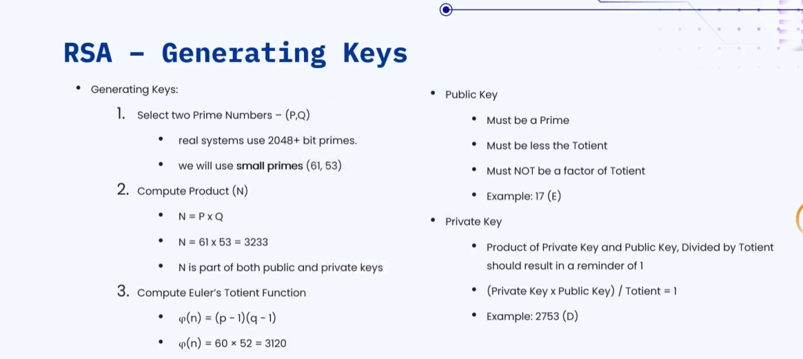

**🔘 Step 2 — Compute the Product (N)**

    🔹 The product N is calculated by simply multiplying the two chosen
      prime numbers, P and Q, together.
        🔸 N = P x Q
        🔸 N = 61 x 53 = 3233
        🔸 This value N becomes a part of both the public key
          and the private key.

**🔘 Step 3 — Compute Euler's Totient Function**

    🔹 Euler's Totient Function, written as φ(n), is calculated using the
      formula (p - 1) multiplied by (q - 1).
        🔸 φ(n) = (p - 1)(q - 1)
        🔸 φ(n) = 60 x 52 = 3120

**🔘 Public Key Rules**

    🔹 The chosen public key value must satisfy a specific set of
      conditions, before it can actually be used.
        🔸 It must be a prime number.
        🔸 It must be less than the computed totient value.
        🔸 It must NOT be a factor of the totient value.
        🔸 Example — the public key (E) is chosen as 17.

**🔘 Private Key Rules**

    🔹 The private key must be chosen such that a specific mathematical
      relationship holds true with the public key and totient.
        🔸 The product of the private key and public key, when
          divided by the totient, should leave a remainder of exactly 1.
        🔸 (Private Key x Public Key) / Totient = 1
        🔸 Example — the private key (D) is chosen as 2753.

---

### 🔷🔶🔷 RSA — Encryption and Decryption

    🔹 For this example, we will use the following key values, generated
      in the previous step.
        🔸 Public Key (E) = 17
        🔸 Private Key (D) = 2753
        🔸 Product (N) = 3233

**🔘 Encryption Flow**

    🔹 Step 1 — We start with the plaintext message, which in
      this example is the word "codeclub21".

    🔹 Step 2 — Each character of the plaintext is converted into
      its corresponding ASCII numeric value.
        🔸 codeclub21 -> 99, 111, 100, 101, 99, 108, 117, 98, 50, 49

    🔹 Step 3 — Each ASCII value is then encrypted using the formula,
      Ciphertext (C) equals M raised to the power E, mod n.
        🔸 C = M^E mod n
        🔸 C = 99^17 mod 3233 = 281

    🔹 Step 4 — This process is repeated for every character, producing
      the full ciphertext array as the final output.
        🔸 [281, 2185, 1773, 1313, 281, 745, 2160, 2570, 538, 2906]

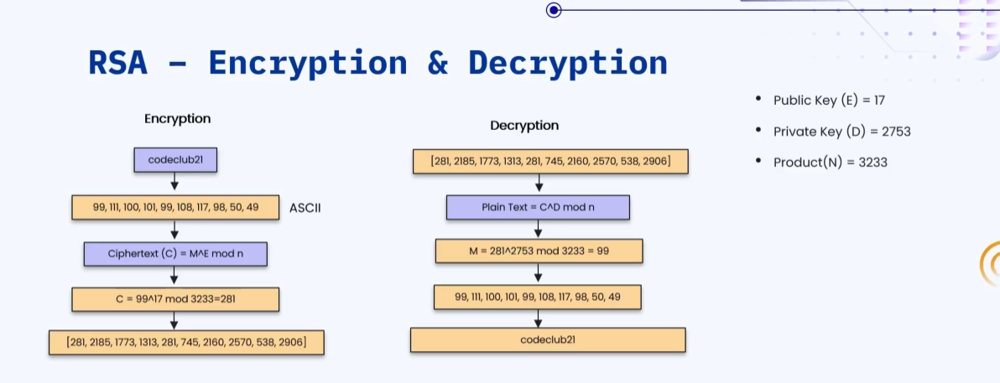

**🔘 Decryption Flow**

    🔹 Step 1 — We start with the received ciphertext array, produced
      earlier by the encryption process.
        🔸 [281, 2185, 1773, 1313, 281, 745, 2160, 2570, 538, 2906]

    🔹 Step 2 — Each ciphertext value is decrypted back using the
      formula, Plain Text equals C raised to the power D, mod n.
        🔸 Plain Text = C^D mod n
        🔸 M = 281^2753 mod 3233 = 99

    🔹 Step 3 — This decryption is repeated for every value, giving
      back the original ASCII numeric sequence.
        🔸 99, 111, 100, 101, 99, 108, 117, 98, 50, 49

    🔹 Step 4 — Finally, these ASCII values are converted back into
      characters, recovering the original plaintext, "codeclub21".

---

### 🔷🔶🔷 RSA — Keys in Real Time

    🔹 In real world systems, RSA keys are not small numbers like
      in our example, but very large encoded values instead.

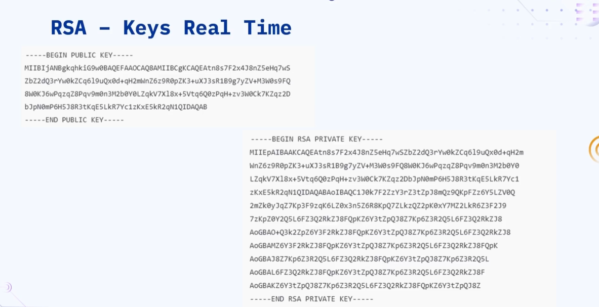

    🔹 These real keys are usually represented in a text format called
      PEM, wrapped between clear header and footer markers.
        🔸 Public keys are wrapped between "BEGIN PUBLIC KEY" and "END
          PUBLIC KEY" markers.
        🔸 Private keys are wrapped between "BEGIN RSA PRIVATE KEY" and
          "END RSA PRIVATE KEY" markers.

    🔹 The actual key content, shown between these markers, is a long
      Base64 encoded block, representing the underlying large numbers.

    🔹 The private key content is always noticeably longer than the public
      key content, since it holds more embedded information.

    🔹 This real world format is exactly what is generated and used
      by systems, browsers, and servers implementing RSA today.

---

### 🔷🔶🔷 RSA — Hybrid Approach

**🔘 Drawbacks of RSA Encryption**

    🔹 Despite being secure, RSA encryption comes with several practical drawbacks
      when used directly for encrypting real data.
        🔸 Very slow ❌ — due to heavy big-integer multiplications involved.
        🔸 Cannot encrypt large data ❌ — RSA is limited in the
          size of data it can directly handle.
        🔸 High CPU cost ❌ — the computations required are resource
          intensive on the system.
        🔸 Limited message size ❌ — restricted by the size of
          the chosen key.
        🔸 Key sharing is easy ✅ — this remains RSA's biggest strength.

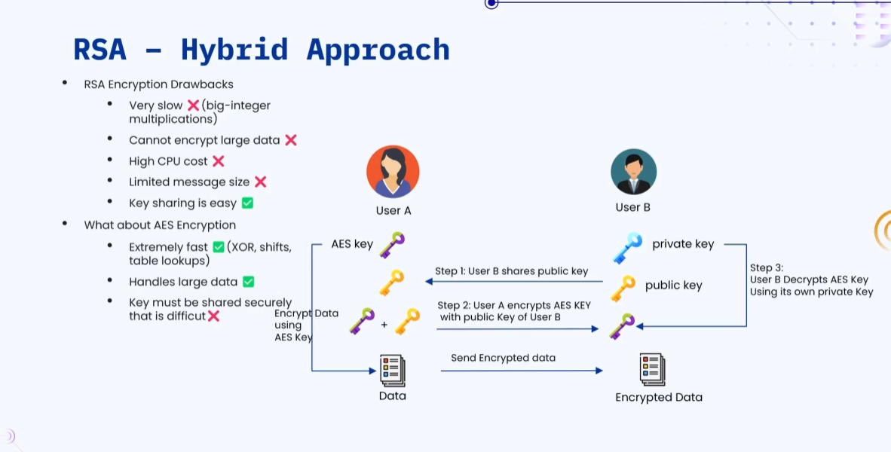

**🔘 What About AES Encryption?**

    🔹 AES, on the other hand, offers a very different set of
      strengths and weaknesses compared to RSA.
        🔸 Extremely fast ✅ — relies on XOR operations, shifts, and
          simple table lookups.
        🔸 Handles large data ✅ — well suited for encrypting large
          volumes of data efficiently.
        🔸 Key must be shared securely ❌ — and doing this
          securely is genuinely difficult.

**🔘 The Hybrid Approach — Combining RSA and AES**

    🔹 To get the best of both worlds, real systems use a
      hybrid approach, combining RSA and AES together.

    🔹 Step 1 — User B shares their public key with User A,
      over the open communication channel.

    🔹 Step 2 — User A encrypts the AES key itself using User
      B's public RSA key, before sending it across.

    🔹 Step 3 — User B receives this encrypted AES key, and decrypts
      it using their own private RSA key.

    🔹 Once both users securely have the same AES key, the actual
      data is encrypted and exchanged using AES, not RSA.

    🔹 This hybrid approach uses RSA only for securely sharing the AES
      key, and uses fast AES for the actual data encryption.

---

### 🔷🔶🔷 Summary — Symmetric and Asymmetric Encryption at a Glance

    🔸 Symmetric Encryption    ->  Uses a single shared key for both
                                    encryption and decryption, and is very fast.
                                    Examples — AES, DES.

    🔸 Asymmetric Encryption   ->  Uses a public and private key pair,
                                    and is slower due to complex math.
                                    Examples — RSA, Diffie-Hellman.

    🔸 AES Block and Key Size  ->  Fixed block size of 128 bits
                                    (16 bytes). Supports 128, 192, and 256
                                    bit keys, using 10, 12, and 14
                                    rounds respectively.

    🔸 Encryption Workflow     ->  Plaintext is converted to bytes, arranged into
                                    a state matrix, passed through an initial
                                    transformation, then through repeated rounds of SubBytes,
                                    ShiftRows, MixColumns, and AddRoundKey, ending with a
                                    final round that skips MixColumns.

    🔸 Key Expansion Flow      ->  The original key bytes are arranged into
                                    a state matrix, and expanded through repeated
                                    rounds to generate a fresh round key
                                    for every stage of encryption.

    🔸 SubBytes                ->  Substitutes each byte using the 16x16
                                    non-linear S-Box lookup table.

    🔸 ShiftRows               ->  Cyclically shifts each row of the state
                                    matrix left, by 0, 1, 2, and
                                    3 positions respectively.

    🔸 MixColumns              ->  Multiplies each column of the state matrix
                                    by a fixed matrix, skipped only in
                                    the final round.

    🔹 Together, these steps — SubBytes, ShiftRows, MixColumns, and AddRoundKey — repeated
      across multiple rounds, are what make AES a strong and
      widely trusted symmetric encryption standard.

    🔸 RSA                    ->  An asymmetric encryption algorithm using a
                                   public key for encryption and a private
                                   key for decryption, named after Rivest,
                                   Shamir, and Adleman.

    🔸 Key Generation          ->  Two primes P and Q are chosen,
                                   their product N and Euler's Totient
                                   φ(n) are computed, and valid public
                                   and private key values are derived
                                   from them.

    🔸 Public Key Rules        ->  Must be prime, less than the
                                   totient, and not a factor of
                                   the totient.

    🔸 Private Key Rule        ->  (Private Key x Public Key) / Totient
                                   must leave a remainder of exactly 1.

    🔸 Encryption Formula      ->  Ciphertext (C) = M^E mod n, applied
                                   to each ASCII value of the plaintext.

    🔸 Decryption Formula      ->  Plain Text (M) = C^D mod n,
                                   applied to each value of the ciphertext.

    🔸 Real World Keys         ->  Represented in PEM format, as long
                                   Base64 encoded blocks, wrapped between
                                   BEGIN and END key markers.

    🔸 RSA Drawbacks           ->  Slow, high CPU cost, and cannot
                                   handle large data efficiently, though key
                                   sharing remains easy.

    🔸 Hybrid Approach         ->  RSA is used only to securely share
                                   an AES key, while the actual bulk
                                   data is encrypted and exchanged using
                                   the much faster AES algorithm.

    🔹 This hybrid model combines RSA's strong key-sharing security with AES's
      speed, and is the approach most commonly used in real
      world secure systems today.

---