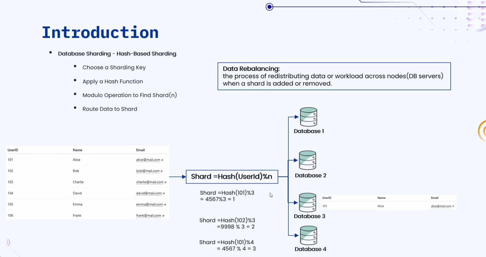
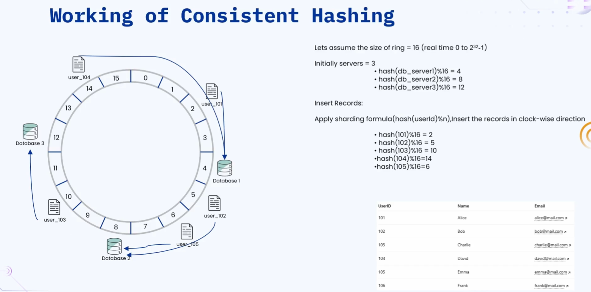
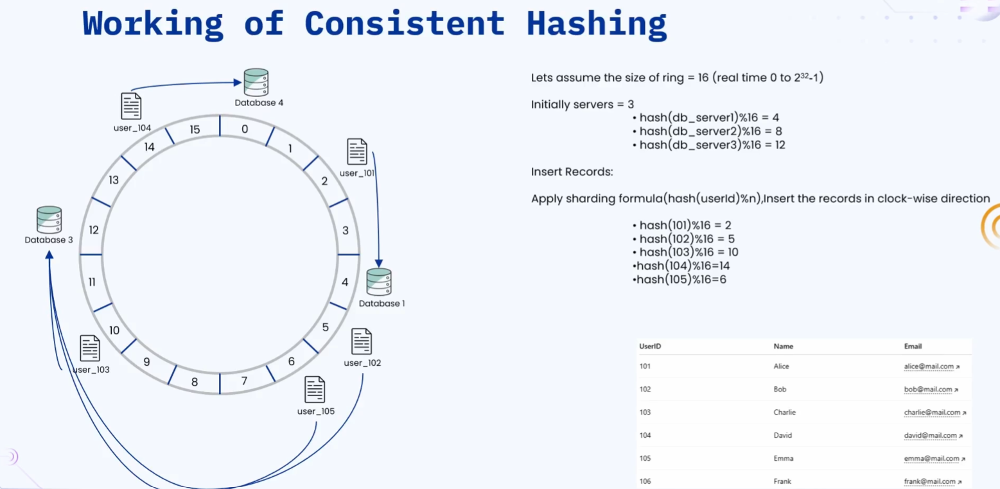
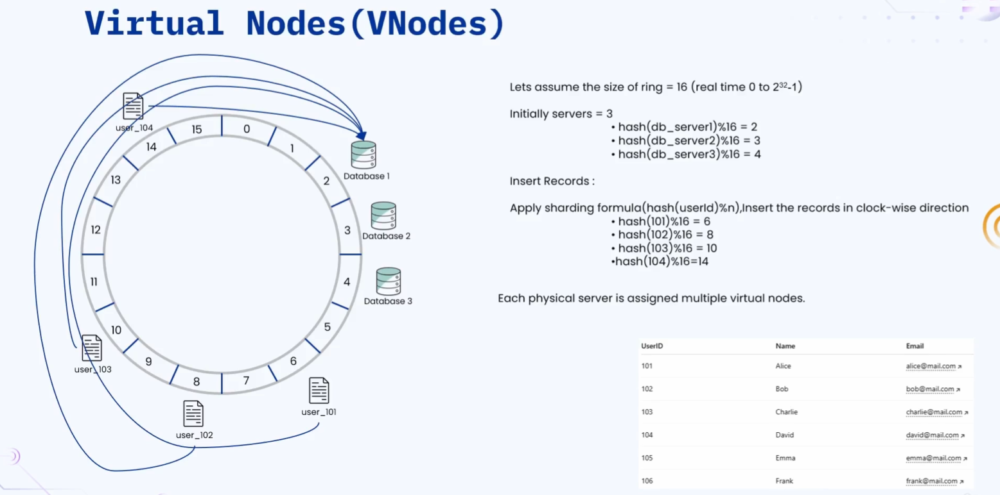

### 🔷🔶🔷 Chapter 14: Consistent Hashing

---

### 🔷🔶🔷 Introduction — Recalling Hash-Based Sharding

    🔹 Before understanding consistent hashing, let's recall Hash
       Based Sharding (a database sharding strategy).

**🟠 The Hash-Based Sharding Formula**

    🔹 Steps:
        🔸 1. Choose a Sharding Key.
        🔸 2. Apply a hash function on the sharding key -> gives a Hash Value.
        🔸 3. Perform Modulus operation with the total number of
           servers (n) -> gives the Shard Number.
        🔸 4. Route and store the data in that specific shard.

**🟠 Illustration — Writing Data**

    🔹 A list of user records (user ID, name, email), and 3
       database shards: Database 1, Database 2, Database 3.

    🔹 n = 3 (total number of database servers).

    🔹 Record — User ID 101:
        🔸 Hash(101) = 4567 (example value)
        🔸 4567 mod 3 = 1 -> Shard Number = 1
        🔸 Stored in Database 1.

    🔹 Record — User ID 102:
        🔸 Hash(102) = 9998 (example value)
        🔸 9998 mod 3 = 2 -> Shard Number = 2
        🔸 Stored in Database 2.

    🔹 This same calculation is repeated for all records, splitting data across the 3 databases.

**🟠 Illustration — Reading Data**

    🔹 To READ a record, the same shard-number calculation must be
       performed first — you need to know WHICH database contains
       the record before you can retrieve it.

    🔹 Example: To read User ID 101's record, the client applies
       the same formula to determine the shard number, then goes
       to that specific database to retrieve the record.

---

### 🔷🔶🔷 The Problem — Adding a New Server

    🔹 As traffic to the application grows, a 4th database server
       is added to handle the additional load.

    🔹 Now assume the client wants to retrieve User ID 101's record again.

    🔹 The system recalculates the shard number using the SAME formula:
        🔸 Hash(101) = 4567 (same as before)
        🔸 But now n = 4 (since a 4th server was added), not 3.
        🔸 4567 mod 4 = 3 (example result) -> Shard Number = 3

    🔹 Problem: Is User ID 101's record actually present in
       Database 3? NO — it's still present in Database 1 (where
       it was originally stored, when n was 3).

    🔹 The user will NOT be able to retrieve the record from
       Database 3, because that's not where it actually is.

    🔹 Why did this happen? Because adding a new server changed
       the value of "n" in the formula — so the modulus operation
       now produces different results for the SAME records.

---

### 🔷🔶🔷 Data Rebalancing

    🔹 To fix this mismatch, Data Rebalancing must be performed.

    🔹 Data Rebalancing is the process of redistributing data
       across different nodes (database servers), whenever a
       shard/node is added or removed.

    🔹 Whenever a database server is added or removed, the shard
       number of EVERY record must be recalculated, and each
       record must be moved from its old shard to its new (correct) shard.

    🔹 Example: User ID 101's record must be moved from Database 1
       to Database 3, since the new calculation now points to shard 3.

**🟠 The Scale Problem**

    🔹 With a small number of records, this rebalancing is simple and fast.

    🔹 But imagine there are 1 million records — ALL 1 million
       records would need their shard number recalculated, and
       many would need to be physically relocated to a new shard.

    🔹 This becomes extremely complicated and time-consuming.

    🔹 To overcome this problem, we use Consistent Hashing.

---

### 🔷🔶🔷 What is Consistent Hashing?

    🔹 Consistent Hashing is a data distribution strategy used to
       evenly distribute data across multiple servers or nodes.

    🔹 It is a technique that MINIMIZES reorganization/rebalancing
       when nodes join or leave the cluster.

    🔹 Important: Consistent hashing does NOT eliminate data
       rebalancing entirely — it just significantly REDUCES the
       number of records that need to be rebalanced.

    🔹 Without consistent hashing: adding/removing a server could
       require rebalancing ALL 1 million records.

    🔹 With consistent hashing: only a SUBSET of records need to
       be rebalanced (e.g. roughly 1/n of the records, where n is
       the total number of servers/nodes) — not the complete total.

**🟠 Where Consistent Hashing is Used**

    🔹 Widely and majorly used in:
        🔸 Distributed caches
        🔸 Distributed databases
        🔸 Load balancers
        🔸 Peer-to-peer systems

---

### 🔷🔶🔷 How Consistent Hashing Works

**🟠 The Hash Ring**

    🔹 In consistent hashing, a "ring" is used, divided into a
       fixed number of equal parts.

    🔹 For explanation purposes, the ring is divided into 16 equal
       parts (positions 0 to 15).

    🔹 In real-world implementations, the number of divisions
       depends on the hash algorithm used — e.g. a 32-bit hash
       algorithm would give 0 to (2^32 − 1) divisions.

**🟠 Step 1 — Placing Database Servers on the Ring**

    🔹 The position of each database server on the ring is
       determined using a hash function.

    🔹 For each server: apply the hash function, then perform
       modulus operation by the ring size (n = 16 in this example).

    🔹 Example placements:
        🔸 Hash(DB Server 1) mod 16 = 4 -> DB Server 1 placed at position 4.
        🔸 Hash(DB Server 2) mod 16 = 8 -> DB Server 2 placed at
           position 8 (this position is also called a "Node").
        🔸 Hash(DB Server 3) mod 16 = 12 -> DB Server 3 placed at position 12.

**🟠 Step 2 — Inserting Records Into the Ring**

    🔹 To store a record, apply the SAME sharding formula: hash
       the sharding key (user ID), then modulus by n — but here, n
       is the TOTAL SIZE OF THE RING (16), NOT the number of servers.

    🔹 After computing the position, traverse the ring in the
       CLOCKWISE direction, and store the record in the FIRST
       database server encountered.

**🟠 Walkthrough**

    🔹 User ID 101 -> position 2 on the ring -> traverse clockwise
       -> first server encountered = Database 1 -> stored in Database 1.

    🔹 User ID 102 -> position 5 -> traverse clockwise -> first
       server encountered = Database 2 -> stored in Database 2.

    🔹 User ID 103 -> position 10 -> traverse clockwise -> first
       server encountered = Database 3 -> stored in Database 3.

    🔹 User ID 104 -> position 14 -> traverse clockwise -> first
       server encountered (wrapping around the ring) = Database 1
       -> stored in Database 1.

    🔹 User ID 105 -> position 6 -> traverse clockwise -> first
       server encountered = Database 2 -> stored in Database 2.

    🔹 This is how all records are inserted across different
       databases using consistent hashing.

---

### 🔷🔶🔷 How Consistent Hashing Solves the Rebalancing Problem

**🟠 Scenario 1 — Removing a Server**

    🔹 Assume Database 2 is removed.

    🔹 Records that were stored in Database 2: User ID 102 and User ID 105.

    🔹 For these two records, the ring is traversed clockwise
       again, and they are inserted into the next database
       encountered — Database 3 (in this example).

    🔹 Question: How many records went through data rebalancing?
        🔸 Only these 2 records (102 and 105).

    🔹 Do the REMAINING records need to be rebalanced? NO — they
       are still correctly present in their existing databases.

    🔹 Compare this to traditional hash-based sharding: removing
       ONE server would have required rebalancing ALL the records.
       With consistent hashing, only a small subset is affected.

**🟠 Scenario 2 — Adding a New Server**

    🔹 A new database server (Database 4) is added at position 0
       of the ring.

    🔹 How many records need to be rebalanced? Only ONE — User ID
       104's record.

    🔹 Previously, User ID 104 was stored in Database 1 (reached
       by wrapping around the ring). Now, traversing clockwise
       from its position, the FIRST server encountered is the
       newly added Database 4.

    🔹 So User ID 104's record is moved to Database 4.

    🔹 Do other records (stored in other databases) need to be
       rebalanced? NO — only this one record needed to move.

**🟠 The Key Advantage**

    🔹 Consistent hashing does NOT avoid rebalancing altogether —
       it just significantly REDUCES the number of records that
       need to be rebalanced, reducing the complexity and time
       taken to rebalance data whenever nodes are added or removed.

---

### 🔷🔶🔷 The Problem With Basic Consistent Hashing — Uneven Distribution

    🔹 There is a disadvantage of basic consistent hashing, which
       is solved using Virtual Nodes.

**🟠 Illustration — The Problem**

    🔹 Same ring, divided into 16 equal parts, with 3 initial servers.

    🔹 Assume the calculated positions are:
        🔸 Database Server 1 -> position 2
        🔸 Database Server 2 -> position 3
        🔸 Database Server 3 -> position 4

    🔹 Notice: These three servers are placed very CLOSE to each
       other on the ring.

**🟠 What Happens When Records Are Inserted**

    🔹 User ID 101 -> position 6 -> traverse clockwise -> first
       server encountered = Database 1 -> stored in Database 1.

    🔹 User ID 102 -> position 8 -> traverse clockwise -> first
       server encountered = Database 1 (again!) -> stored in Database 1.

    🔹 User ID 103 -> position 10 -> traverse clockwise -> first
       server encountered = Database 1 (again!) -> stored in Database 1.

    🔹 User ID 104 -> position 14 -> traverse clockwise -> first
       server encountered = Database 1 (again!) -> stored in Database 1.

**🟠 The Problem**

    🔹 ALL records are getting inserted into a SINGLE database
       (Database 1), because the database servers are all
       positioned too close together on the ring.

    🔹 Data is NOT evenly distributed — it keeps landing in one server.

---

### 🔷🔶🔷 Virtual Nodes — The Solution

    🔹 Each PHYSICAL server is assigned MULTIPLE Virtual Nodes on
       the ring, spread out across different positions.

**🟠 Illustration**

    🔹 Example virtual node assignments:
        🔸 Database 1 -> assigned virtual nodes at position 2 AND position 7.
        🔸 Database 2 -> assigned virtual nodes at position 3 AND position 0.
        🔸 Database 3 -> assigned virtual nodes at position 4 AND position 11.

    🔹 Virtual nodes are created and distributed across the ring
       based on its size, and each physical server is mapped to
       multiple such virtual node positions.

**🟠 Result — Better Distribution**

    🔹 Re-checking the earlier example records with virtual nodes now in place:
        🔸 User ID 104 -> now lands closer to virtual node position
           3 (Database 2's virtual node) when traversing clockwise
           -> stored in Database 2.
        🔸 User ID 103 -> stored in Database 3.
        🔸 User ID 102 -> stored in Database 3.
        🔸 User ID 101 -> stored in Database 1.

    🔹 By assigning each server multiple virtual nodes, records
       get distributed much more evenly across ALL the physical
       database servers — instead of overloading just one.

    🔹 This is the advantage of using virtual nodes — it reduces
       the load imbalance that can occur with basic consistent hashing.

---

### 🔷🔶🔷 Important Note — Beyond Database Sharding

    🔹 In this explanation, database sharding (hash-based sharding)
       was used as the example use case to explain consistent hashing.

    🔹 In the real world, consistent hashing is NOT limited to
       database sharding — it is also applied to distributed
       caches, and many other distributed system use cases.

---

### 🔷🔶🔷 Additional Concepts — Extending Consistent Hashing

    🔹 The following points add further depth for a complete understanding.

**🔘 Comparison — Hash-Based Sharding vs Consistent Hashing**

    🔹 Hash-Based Sharding (Modulus-Based):
        🔸 Simple to implement.
        🔸 Adding/removing a server changes "n" in the formula,
           requiring a massive rebalancing of almost ALL existing records.

    🔹 Consistent Hashing:
        🔸 Slightly more complex to implement (requires maintaining
           a ring and node positions).
        🔸 Adding/removing a server only affects records mapped to
           the AFFECTED portion of the ring, minimizing rebalancing
           to a small subset of records.

**🔘 Properties of a Good Hash Function for Consistent Hashing**

    🔹 Uniformity -> The hash function should distribute keys
       uniformly across the output range, to avoid clustering.

    🔹 Determinism -> The same key must always produce the same
       hash value, so lookups are consistent and repeatable.

    🔹 Speed -> The hash function should be computationally
       efficient, since it's used on every read and write operation.

**🔘 Real-World Systems Using Consistent Hashing**

    🔹 Amazon DynamoDB -> Uses consistent hashing (with virtual
       nodes) to distribute data across storage nodes in its
       distributed key-value store design.

    🔹 Apache Cassandra -> Uses consistent hashing to partition
       data across nodes in the cluster, also employing virtual
       nodes ("vnodes") for better load distribution.

    🔹 Content Delivery Networks (CDNs) -> Use consistent hashing
       to map content/requests to the nearest or most appropriate
       edge server.

    🔹 Memcached / Distributed Caching Systems -> Use consistent
       hashing to decide which cache server should hold a
       particular key, minimizing cache invalidation when cache
       servers are added or removed.

**🔘 Why Virtual Nodes Also Help With Heterogeneous Servers**

    🔹 Beyond fixing uneven distribution, virtual nodes are also
       useful when servers have different capacities (e.g. one
       server has more storage/compute than another).

    🔹 A more powerful server can be assigned MORE virtual nodes
       (positions on the ring) than a weaker server, so it
       naturally receives a proportionally larger share of the
       data/traffic — similar in spirit to the Weighted Round
       Robin load balancing algorithm.

---

### 🔷🔶🔷 Summary — Consistent Hashing at a Glance

    🔸 Hash-Based           ->  hash(key) mod n determines which
       Sharding Formula          shard/server stores a record;
                              simple, but "n" changes whenever a
                              server is added/removed.

    🔸 The Core Problem     ->  When "n" changes (server added or
                              removed), the modulus result changes
                              for almost every record, requiring
                              MASSIVE data rebalancing (potentially
                              all records) to relocate data to its
                              "correct" new shard.

    🔸 Data Rebalancing     ->  The process of redistributing data
                              across nodes when a shard/node is
                              added or removed — necessary, but
                              expensive at scale with plain
                              hash-based sharding.

    🔸 Consistent Hashing   ->  A data distribution strategy that
                              evenly distributes data across
                              servers/nodes while MINIMIZING
                              (not eliminating) the rebalancing
                              needed when nodes join or leave.
                              Widely used in distributed caches,
                              distributed databases, load
                              balancers, and peer-to-peer systems.

    🔸 The Ring             ->  A conceptual ring divided into a
                              fixed number of positions (e.g. 16,
                              or 2^32 for a 32-bit hash); both
                              servers and data keys are hashed
                              onto positions on this ring.

    🔸 Placing Servers      ->  Each server's position on the ring
                              is determined via hash(server) mod
                              ring_size.

    🔸 Storing/Reading      ->  A record's position is determined
       Records                  via hash(key) mod ring_size; the
                              record is stored on the FIRST server
                              encountered while traversing the
                              ring clockwise from that position.

    🔸 Adding/Removing      ->  Only records whose "clockwise
       Servers                   successor" changes need to be
                              rebalanced — typically a small
                              fraction of total records, not all
                              of them.

    🔸 The Uneven           ->  If physical servers happen to be
       Distribution Problem      placed close together on the
                              ring, most records can end up on
                              just ONE server, causing severe load imbalance.

    🔸 Virtual Nodes        ->  Solution: each physical server is
                              assigned MULTIPLE virtual node
                              positions spread across the ring,
                              ensuring a much more even
                              distribution of data/load across all
                              physical servers. Can also be used
                              to give more powerful servers a
                              proportionally larger share of data
                              (more virtual nodes = more load).

    🔹 Consistent hashing (especially combined with virtual nodes)
       is a foundational technique in distributed systems — it
       enables systems to scale up or down dynamically while
       keeping the cost of data movement proportional to the
       change, rather than proportional to the total dataset size.

---