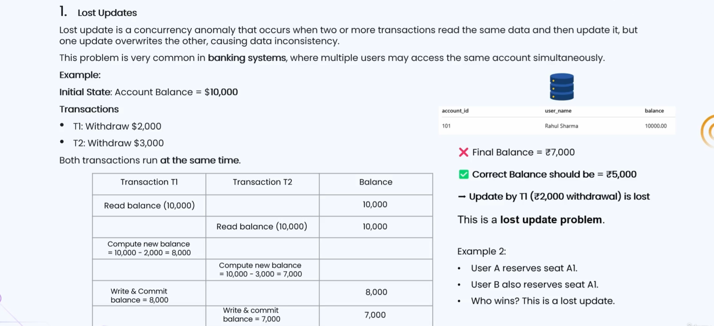
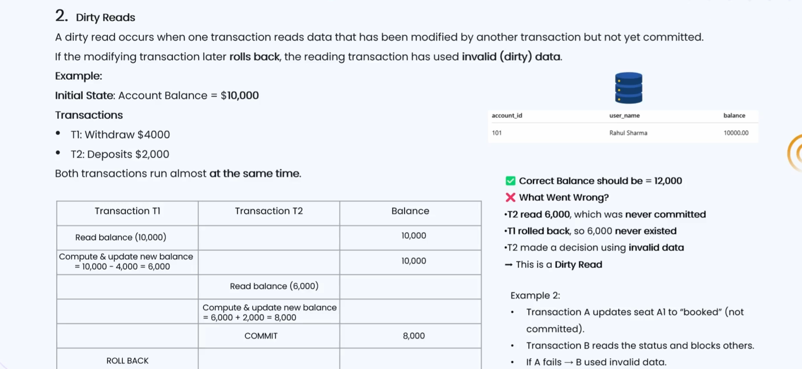
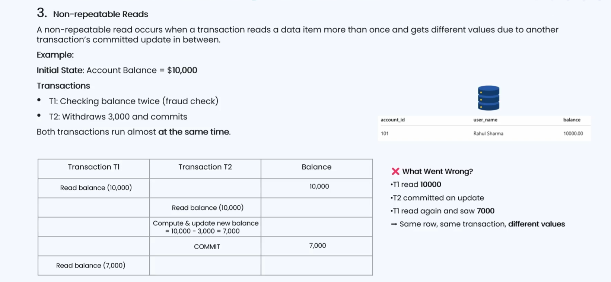
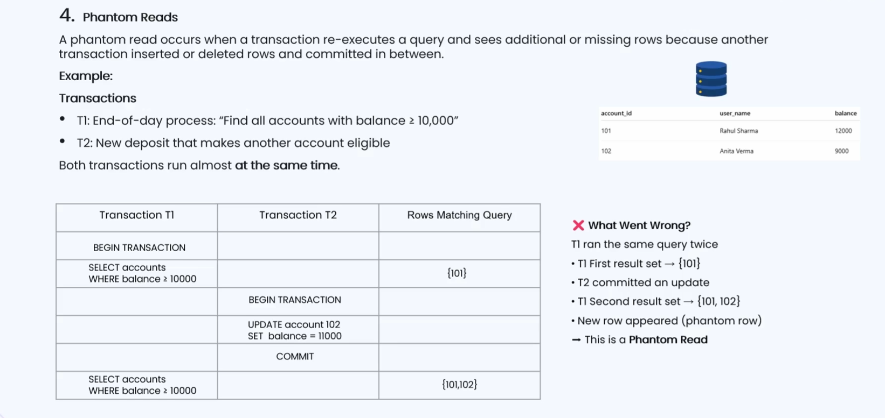
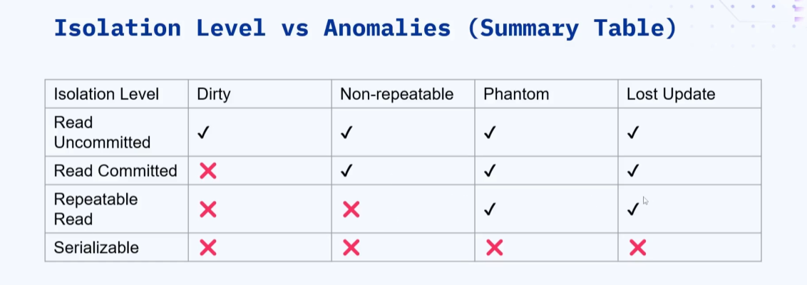
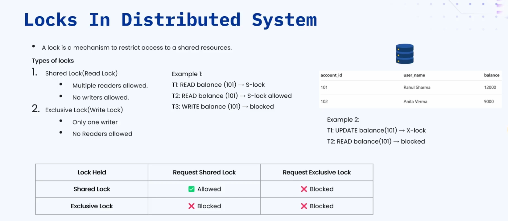
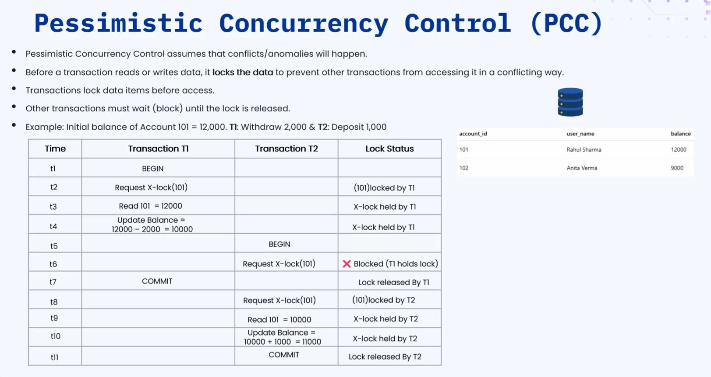
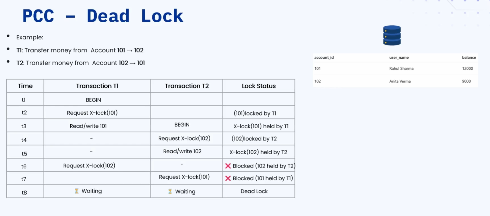
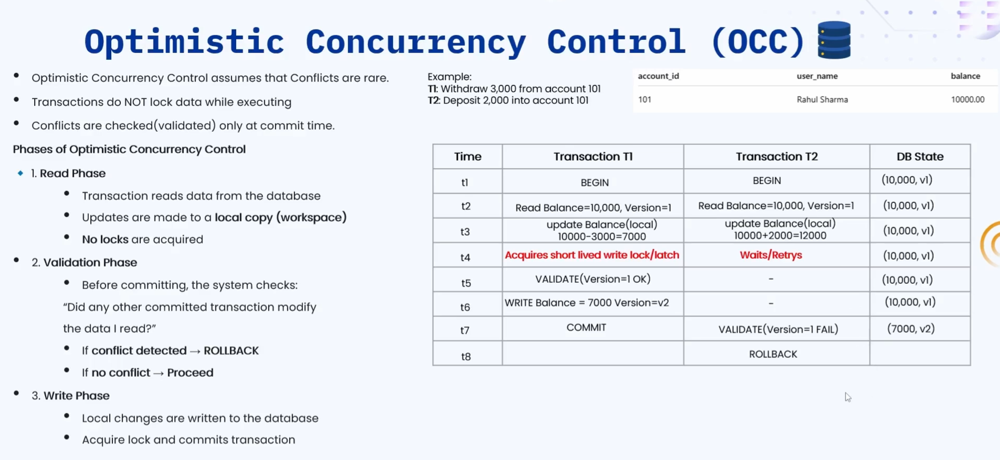

### 🔷🔶🔷 Chapter 15: Concurrency Control and Locks

---

### 🔷🔶🔷 Introduction — Why Concurrency Control is Important

    🔹 Have you ever wondered how two people booking a cab from
      almost the same location are never assigned the same driver?
        🔸 Both users are always assigned different drivers.
        🔸 The reverse is also true — a single driver is never
          assigned to multiple users at the same time.

    🔹 Similarly, when multiple people try to book a seat in an
      aeroplane, the same seat is never allocated to multiple customers.
        🔸 A single seat is always allocated only to a single customer.

    🔹 In the same way, when you perform multiple transactions on your
      bank account, the balance always stays consistent.
        🔸 Even with multiple simultaneous transactions, the account never becomes
          inconsistent, since inconsistency would be a huge loss.

    🔹 All of these real-world scenarios are made possible only because
      of a mechanism known as concurrency control.

---

### 🔷🔶🔷 What is Concurrency Control?

    🔹 Concurrency control is a set of techniques used in databases and
      distributed systems, to ensure that multiple users or systems can
      access the same data at the same time, without causing inconsistencies.

    🔹 The key idea is that multiple users or systems can access the
      same data simultaneously, without ever causing inconsistencies, as long
      as correct concurrency control is applied.

    🔹 Concurrency control ensures three important properties — correctness, consistency,
      and isolation — which are very important in distributed environments.

**🔘 When Should We Think About Concurrency Control?**

    🔹 We should think about concurrency control whenever there are multiple
      users, multiple services, multiple machines, or delays in the network.

**🔘 Why is Concurrency Control Needed?**

    🔹 If there is no concurrency control, multiple transactions manipulating the
      same data will lead to inconsistencies, known as anomalies.

    🔹 There are four major anomalies that can occur without proper
      concurrency control:
        🔸 Lost Updates — one transaction's update overrides another transaction's update.
        🔸 Dirty Reads — reading uncommitted data of one transaction inside
          another transaction.
        🔸 Non-Repeatable Reads — reading the same row twice gives different
          values, because another transaction committed a change in between.
        🔸 Phantom Reads — the same query returns a different number of
          rows, because another transaction inserted or deleted rows in between.

---

### 🔷🔶🔷 Anomaly 1 — Lost Updates

    🔹 Lost update is an anomaly that occurs when two or more
      transactions read the same data and then update it, but one
      update overrides the other, causing data inconsistency.

    🔹 This is a common problem in banking systems, where multiple users
      may access the same account simultaneously.

**🔘 Example — Bank Account Withdrawal**

    🔹 Assume an account with ID 101, belonging to Rahul Sharma, has
      an initial balance of $10,000.

    🔹 Transaction T1 wants to withdraw $2,000, and Transaction T2 wants to
      withdraw $3,000, both running almost at the same time.
        🔸 Both T1 and T2 read the same initial balance of $10,000.
        🔸 T1 computes its new balance as 10,000 - 2,000 = $8,000.
        🔸 T2 computes its new balance as 10,000 - 3,000 = $7,000.
        🔸 T1 commits its computed balance of $8,000 into the database.
        🔸 T2 then commits its computed balance of $7,000, overriding T1's update.

    🔹 The final balance in the database shows $7,000, but the correct
      balance, after withdrawing both $2,000 and $3,000, should be $5,000.

    🔹 What went wrong — both transactions read the same stale balance, and
      T2 never saw what T1 had already committed, so T1's update
      of $8,000 was completely lost.

**🔘 Example — Aeroplane Seat Booking**

    🔹 If User A and User B both try to reserve the same
      seat A1 at almost the same time, whichever transaction commits
      last ends up getting the seat.

    🔹 This is incorrect — ideally, whichever transaction committed first should have
      been allotted the seat, not whoever committed last.

---

### 🔷🔶🔷 Anomaly 2 — Dirty Reads

    🔹 A dirty read occurs when one transaction reads data that has
      been modified by another transaction, but not yet committed.

    🔹 If the modifying transaction later rolls back, the reading transaction ends
      up having used invalid or dirty data.

**🔘 Example — Bank Account Withdrawal and Deposit**

    🔹 Using the same account with an initial balance of $10,000, Transaction
      T1 wants to withdraw $4,000, and Transaction T2 wants to deposit $2,000.
        🔸 T1 reads the balance as $10,000, computes a new local balance
          of $6,000, but does not yet commit it to the database.
        🔸 T2 starts, and due to low isolation, reads T1's uncommitted balance
          of $6,000, instead of the actual committed database value.
        🔸 T2 computes its new balance as 6,000 + 2,000 = $8,000, and
          commits this value directly into the database.
        🔸 T1 then encounters a technical error, and performs a rollback, stopping
          its transaction entirely.

    🔹 The database now shows $8,000, but the correct balance, after T1's
      rollback and T2's deposit, should have been $12,000.

    🔹 What went wrong — T2 read $6,000, a value that was never
      actually committed, and made its decision based on this invalid data.

**🔘 Example — Aeroplane Seat Booking**

    🔹 Transaction A updates seat A1 to "booked" locally, but has not
      yet committed this change into the database.

    🔹 Transaction B reads this uncommitted status, and assumes the seat is
      already booked, blocking all further bookings for that seat.

    🔹 If Transaction A then fails and rolls back, Transaction B still incorrectly
      treats seat A1 as booked, resulting in a lost booking opportunity.

---

### 🔷🔶🔷 Anomaly 3 — Non-Repeatable Reads

    🔹 A non-repeatable read occurs when a transaction reads the same data
      item more than once, and gets different values, because another
      transaction committed an update to that data in between.

    🔹 In simple terms, a transaction executes the same query multiple times,
      and gets a different result each time, because another transaction
      updated the underlying data in the meantime.

**🔘 Example — Fraud Check on Account Balance**

    🔹 Using account ID 101 with an initial balance of $10,000, Transaction
      T1 checks the balance twice for fraud detection, while Transaction T2
      withdraws $3,000 and commits it.
        🔸 T1 reads the balance for the first time, and sees $10,000.
        🔸 T2 reads the balance, computes 10,000 - 3,000 = $7,000, and
          commits this new balance into the database.
        🔸 T1 reads the balance again for the second time, and now
          sees $7,000, instead of the original $10,000 value.

    🔹 T1 executed the exact same query both times, on the same
      row, but received two completely different results, which is not acceptable.

---

### 🔷🔶🔷 Anomaly 4 — Phantom Reads

    🔹 A phantom read occurs when a transaction re-executes a query, and
      sees additional or missing rows, because another transaction inserted
      or deleted rows and committed them in between.

    🔹 Unlike non-repeatable reads, where the values within the same row
      change, phantom reads change the actual number of rows returned.

**🔘 Example — End of Day Reporting Query**

    🔹 Using two accounts, 101 with $12,000, and 102 with $9,000, Transaction
      T1 finds all accounts with balance greater than $10,000, while
      Transaction T2 deposits money into account 102.
        🔸 T1 runs the query, and only account 101 matches, since 102
          currently has only $9,000.
        🔸 T2 deposits money into account 102, raising its balance to $11,000,
          and commits this change into the database.
        🔸 T1 executes the exact same query again, and now both accounts
          101 and 102 match, returning two rows instead of one.

    🔹 A new row appeared between the two executions of the same
      query, purely because another transaction inserted new matching data.

---

### 🔷🔶🔷 Isolation — Understanding Transaction Isolation

    🔹 In simple terms, isolation means being kept separate from others, so
      that one entity's actions are not visible to another entity.

    🔹 Isolation is the "I" in the ACID properties, which stand for
      Atomicity, Consistency, Isolation, and Durability.

    🔹 Isolation levels define how visible the changes made by one transaction
      are to other concurrent transactions running at the same time.
        🔸 If Transaction T2 can see what Transaction T1 is doing, the
          isolation level is considered low.
        🔸 If Transaction T2 cannot see what Transaction T1 is doing, the
          isolation level is considered high.

    🔹 There are four standard isolation levels, and isolation increases as we
      move from the first level to the last level.
        🔸 Read Uncommitted — the lowest level of isolation and consistency.
        🔸 Read Committed
        🔸 Repeatable Read
        🔸 Serializable — the highest level of isolation and consistency.

**🔘 Level 1 — Read Uncommitted**

    🔹 In this level, a transaction can read data written by another
      transaction, even if that data has not yet been committed.

    🔹 Since uncommitted changes are visible across transactions, all four anomalies
      are possible — dirty reads, non-repeatable reads, phantom reads, and lost updates.

    🔹 This isolation level is not recommended, has no real practical use
      case, and is not even supported by many databases today.

**🔘 Level 2 — Read Committed**

    🔹 In this level, a transaction can only read data that has
      already been committed by other transactions.

    🔹 This is the most commonly used isolation level, and it successfully
      prevents dirty reads, though other anomalies remain possible.
        🔸 Non-repeatable reads are possible, and are even preferred in this level.
        🔸 Phantom reads are also possible in this level of isolation.

    🔹 Example use case — in an e-commerce product listing and display page,
      the admin might change the price between the two page loads,
      and we want the most updated, latest price to be shown.

    🔹 Databases supporting read committed isolation include PostgreSQL, SQL Server, and
      Oracle, among most other popular databases available today.

**🔘 Level 3 — Repeatable Read**

    🔹 In this level, rows that have already been read once cannot
      change in value, for the rest of that same transaction.

    🔹 Dirty reads and non-repeatable reads are prevented at this level, but
      phantom reads remain possible.

    🔹 Example use case — placing an order and generating an invoice within
      the same transaction, where the product price must remain the same
      throughout, so the customer isn't billed a different amount.

    🔹 The same databases — PostgreSQL, Oracle, and SQL Server — can be
      configured to support this repeatable read isolation level as well.

**🔘 Level 4 — Serializable**

    🔹 In this level, transactions behave as if they ran one strictly
      after the other, even though they may have started concurrently.

    🔹 This guarantees full consistency, and all four anomalies are prevented —
      dirty reads, non-repeatable reads, phantom reads, and lost updates.

    🔹 Serializable isolation is preferred in banking applications, where multiple transactions
      on the same account must be executed serially, to keep the
      data consistent and fully reliable.

**🔘 Choosing the Right Isolation Level**

    🔹 For banking and payments, where both reads and writes are heavy,
      serializable isolation is the recommended choice.

    🔹 For order processing, where a single transaction performs multiple related
      tasks, repeatable read isolation is the recommended choice.

    🔹 For reporting and analytics, which are read-heavy operations, read committed isolation
      is the recommended and sufficient choice.

**🔘 Recap — Isolation Levels and Allowed Anomalies**

    🔸 Read Uncommitted  ->  All four anomalies are possible — dirty reads,
                              non-repeatable reads, phantom reads, and lost updates.
    🔸 Read Committed    ->  Dirty reads are prevented, but non-repeatable reads
                              and phantom reads are still possible.
    🔸 Repeatable Read   ->  Dirty reads and non-repeatable reads are prevented,
                              but phantom reads are still possible.
    🔸 Serializable      ->  All four anomalies are prevented, offering the
                              highest possible level of isolation.

---

### 🔷🔶🔷 Locks in Distributed Systems

    🔹 A lock is a mechanism used to restrict access to a
      shared resource, when multiple transactions try to use it together.

    🔹 Only the transaction that acquires the lock is able to modify
      or read the data, and other transactions must wait until
      that lock is released before acquiring it themselves.

    🔹 There are two main types of locks used for controlling concurrency.

**🔘 1. Shared Lock (Read Lock)**

    🔹 A shared lock allows multiple transactions to read the same data
      simultaneously, without allowing any of them to update it.

    🔹 No transaction holding only a shared lock is allowed to write
      or manipulate the underlying data in any way.

**🔘 2. Exclusive Lock (Write Lock)**

    🔹 An exclusive lock is exclusive to only one transaction at a
      time, and is required whenever a transaction wants to write data.

    🔹 If one transaction holds an exclusive lock, no other transaction can
      acquire either an exclusive lock or a shared lock on that data.
        🔸 Shared locks can co-exist with other shared locks from different transactions.
        🔸 Exclusive locks cannot co-exist with any other lock, shared or
          exclusive, held by another transaction.

**🔘 Example Scenario 1 — Multiple Readers, One Writer**

    🔹 Transaction T1 wants to read account 101's balance, and successfully
      acquires a shared lock to do so.

    🔹 Transaction T2 also wants to read the same balance, and is
      also allowed to acquire a shared lock alongside T1.

    🔹 Transaction T3 wants to update the same balance, and requests an
      exclusive lock, but is blocked, since T1 and T2 already hold
      shared locks on that same data.

    🔹 Transaction T4 wants to update a different account, 102, and successfully
      acquires an exclusive lock, since no locks exist on that account.

**🔘 Example Scenario 2 — One Writer Blocks a Reader**

    🔹 Transaction T1 acquires an exclusive lock on account 101, in order
      to update its balance.

    🔹 Transaction T2 then tries to read the same balance, and requests
      a shared lock, but is blocked, since T1 already holds an
      exclusive lock on that same data.

    🔹 Only after T1 releases its exclusive lock, can Transaction T2 finally
      acquire the shared lock, and successfully read the balance.

---

### 🔷🔶🔷 Concurrency Control Techniques

    🔹 There are two main approaches used to control concurrency — pessimistic
      concurrency control, and optimistic concurrency control.

---

### 🔷🔶🔷 Pessimistic Concurrency Control (PCC)

    🔹 Pessimistic concurrency control assumes that conflicts and anomalies will happen,
      so a lock is always acquired at the very beginning of
      the transaction, before any read or write takes place.

    🔹 Other transactions are blocked until the first transaction releases its
      lock, especially if that lock is an exclusive lock.

**🔘 Example — Withdraw and Deposit on the Same Account**

    🔹 Account 101 starts with a balance of $12,000, while Transaction T1
      withdraws $2,000, and Transaction T2 deposits $1,000.
        🔸 T1 begins, and successfully acquires an exclusive lock on account 101.
        🔸 T1 reads the balance as $12,000, and updates it locally to
          10,000, after deducting the $2,000 withdrawal.
        🔸 T2 begins, and requests an exclusive lock on the same account,
          but is blocked, since T1 already holds that exclusive lock.
        🔸 T1 commits its updated balance of $10,000, and releases its exclusive lock.
        🔸 T2 then successfully acquires the exclusive lock, reads the balance
          as $10,000, and updates it locally to $11,000 after the deposit.
        🔸 T2 commits its final balance of $11,000, and finally releases the
          exclusive lock, allowing other transactions to proceed.

**🔘 Advantages of Pessimistic Concurrency Control**

    🔹 It ensures strong consistency, is simple in handling conflicts, and works
      well in high-conflict systems like banking or inventory management, where
      the same data is frequently updated by many transactions.

**🔘 Disadvantages of Pessimistic Concurrency Control**

    🔹 Concurrency is reduced, since transactions run one after the other,
      sequentially, rather than truly in parallel.

    🔹 With many pending transactions, later transactions may need to wait a
      long time before they can finally acquire the required lock.

    🔹 The most major disadvantage is the risk of deadlocks, a very
      common and important interview topic to fully understand.

**🔘 Deadlock Example — Transferring Money Between Two Accounts**

    🔹 Transaction T1's job is to transfer money from account 101 to
      102, while Transaction T2's job is to transfer money from account
      102 to 101, at almost the same time.
        🔸 T1 acquires an exclusive lock on account 101, and begins processing
          its part of the transfer.
        🔸 T2 acquires an exclusive lock on account 102, and begins processing
          its part of the transfer.
        🔸 T1 then needs to update account 102, and requests an exclusive
          lock on it, but is blocked, since T2 already holds that lock.
        🔸 T2 then needs to update account 101, and requests an exclusive
          lock on it, but is blocked, since T1 already holds that lock.

    🔹 Both transactions are now waiting on each other indefinitely, and neither
      can proceed — this stuck situation is exactly what is called a deadlock.

---

### 🔷🔶🔷 Optimistic Concurrency Control (OCC)

    🔹 Optimistic concurrency control assumes that conflicts are rare, so transactions
      do not lock data while executing, and locking only happens right
      before committing the data, along with a validation step.

    🔹 There are three distinct phases involved in optimistic concurrency control.

**🔘 Phase 1 — Read Phase**

    🔹 The transaction reads data from the database, and if needed, makes
      updates only within its own local workspace, without acquiring any locks.

**🔘 Phase 2 — Validation Phase**

    🔹 Before committing, the transaction checks whether any other committed transaction
      has already modified the same data it originally read.

    🔹 This is typically done by comparing data versions — if the current
      version differs from the version read earlier, a conflict is detected,
      and the transaction is rolled back to start over from the read phase.

    🔹 If the versions match, there is no conflict, and the transaction
      is allowed to proceed forward to the next phase.

**🔘 Phase 3 — Write Phase**

    🔹 The transaction finally acquires a short-lived lock, sometimes called a latch,
      commits its changes into the database, and then releases the lock.

**🔘 Example — Withdraw and Deposit Using Version Checking**

    🔹 Account 101 starts with a balance of $10,000, at version v1,
      while T1 withdraws $3,000, and T2 deposits $2,000, both starting together.
        🔸 Both T1 and T2 read the balance as $10,000, at version v1,
          without acquiring any locks during this read phase.
        🔸 T1 computes its new local balance as $7,000, and T2 computes
          its new local balance as $12,000, both still only locally.
        🔸 Both transactions now race to acquire the short-lived exclusive lock,
          needed to validate and commit their respective changes.
        🔸 T1 wins the race, acquires the lock, and validates that the
          current database version, v1, matches the version it originally read.
        🔸 Since the versions match, T1 writes its new balance of $7,000,
          increments the version to v2, commits, and releases the lock.
        🔸 T2 then acquires the lock, but finds the current database version
          is now v2, while it originally read version v1, so a
          conflict is detected, and T2 is rolled back to the read phase.

    🔹 Validation need not always use a version number — it can also
      be based on a timestamp, or a hash code of the data.

**🔘 Advantages of Optimistic Concurrency Control**

    🔹 Since locks are acquired only right before committing, this approach offers
      much higher parallelism and concurrency compared to the pessimistic approach.

    🔹 Deadlocks are not possible in this approach, since locks are extremely
      short-lived, and are only ever used briefly during the commit step.

**🔘 Disadvantages of Optimistic Concurrency Control**

    🔹 There is a high abort rate under contention — if many transactions
      update the same data, most of them will keep failing validation
      and rolling back repeatedly, needing to restart from the read phase.

    🔹 The additional validation step, run again and again before every commit,
      introduces some processing overhead into the overall system.

    🔹 Extra metadata, such as version numbers, hash codes, or timestamps, must
      also be maintained and managed alongside the actual data.

---

### 🔷🔶🔷 When to Use Pessimistic vs Optimistic Concurrency Control

    🔹 As a general rule of thumb, use optimistic concurrency control for
      read-heavy applications, and pessimistic concurrency control for write-heavy applications.

**🔘 Recommended for Pessimistic Concurrency Control**

    🔸 Banking and account balance updates — a frequent, write-heavy operation.
    🔸 Inventory stock updates — especially during high-conflict sale seasons.
    🔸 Online booking systems — booking a seat or ticket is a
      write-heavy operation, requiring strong consistency guarantees.

**🔘 Recommended for Optimistic Concurrency Control**

    🔸 Reports and analytics — a purely read-heavy operation, not write-heavy at all.
    🔸 Social media feeds — read-heavy, since data is mostly fetched and displayed.
    🔸 E-commerce product browsing — reading and searching for products, not placing orders.
    🔸 Microservice REST APIs — using ETags and version fields for validation.
    🔸 MongoDB and other NoSQL systems — commonly implemented with optimistic
      concurrency control mechanisms.

---

### 🔷🔶🔷 Summary — Concurrency Control and Locks at a Glance

    🔸 Concurrency Control    ->  A set of techniques ensuring multiple users
                                   or systems can safely access the same
                                   data at the same time, without causing
                                   inconsistencies.

    🔸 Four Anomalies         ->  Lost Updates, Dirty Reads, Non-Repeatable Reads, and
                                   Phantom Reads — the undesirable effects of
                                   poor concurrency control.

    🔸 Isolation              ->  The "I" in ACID, defining how visible one
                                   transaction's changes are to other concurrent
                                   transactions.

    🔸 Isolation Levels       ->  Read Uncommitted, Read Committed, Repeatable Read, and
                                   Serializable, in increasing order of isolation
                                   and consistency.

    🔸 Locks                  ->  Shared Lock (read lock) allows multiple readers;
                                   Exclusive Lock (write lock) allows only a
                                   single writer, blocking all other readers and
                                   writers.

    🔸 Pessimistic Concurrency ->  Acquires locks at the very start of a
       Control (PCC)              transaction, ensuring strong consistency but reducing
                                   concurrency, and risking deadlocks.

    🔸 Optimistic Concurrency  ->  Reads and updates data locally without locking,
       Control (OCC)              validates using version, timestamp, or hash checks,
                                   and only locks briefly during the final commit.

    🔸 Choosing the Right      ->  Use pessimistic control for write-heavy systems like
       Technique                  banking and booking, and optimistic control for
                                   read-heavy systems like analytics and social feeds.

    🔹 Together, isolation levels, locks, and the choice between pessimistic and
      optimistic concurrency control form the foundation for keeping data correct,
      consistent, and reliable in any concurrent or distributed system.

---