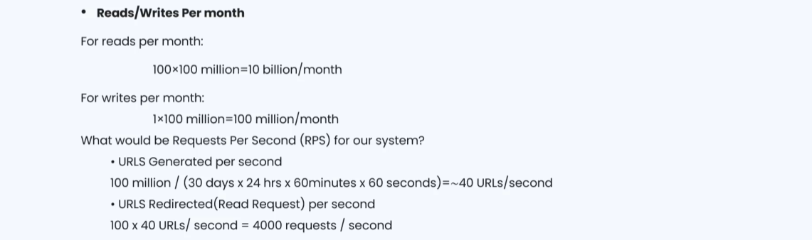
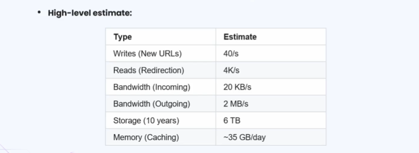
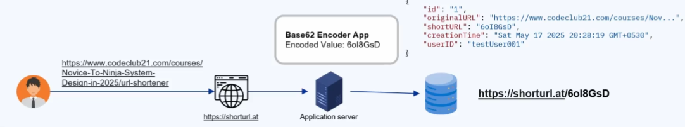
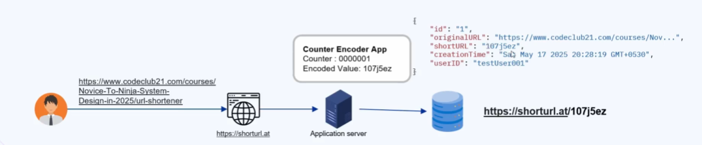
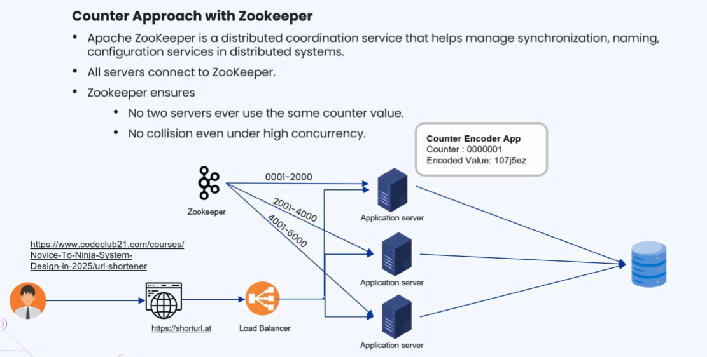
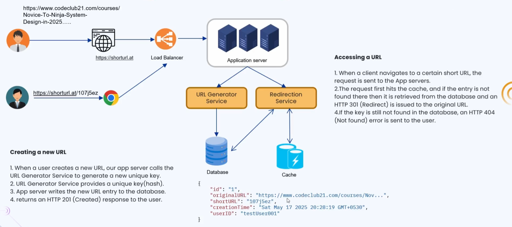

### 🔷🔶🔷 Chapter 2: System Design of URL Shortener Application

---

### 🔷🔶🔷 Introduction — What is a URL Shortener?

    🔹 A URL shortener application converts a long, verbose URL into a
      much shorter, easy to remember, and easy to share version.

    🔹 A long URL is difficult to remember or share, consumes more
      space, and is generally not very user friendly at all.

    🔹 Once a long URL is passed into a URL shortener application, it
      returns a much shorter version, which is precise and user friendly.

**🔘 Advantages of Using Shortened URLs**

    🔹 It saves space, especially useful in character-limited platforms like older
      social media posts, SMS messages, or printed materials.

    🔹 Users are far less likely to mistype a short URL, compared
      to typing out an entire long and complicated URL.

    🔹 (Additional benefit) Shortened URLs can also be used to track clicks,
      referral sources, and analytics, without exposing the original destination link.

---

### 🔷🔶🔷 The Seven Step Approach to System Design

    🔹 As discussed in the previous chapter, we follow a structured seven
      step approach to solve any system design problem.
        🔸 Step 1 — Requirement Clarification
        🔸 Step 2 — Estimation and Constraints
        🔸 Step 3 — Data Model Design
        🔸 Step 4 — API Design
        🔸 Step 5 — High Level Design
        🔸 Step 6 — Detailed Design
        🔸 Step 7 — Identify and Resolve Bottlenecks

---

### 🔷🔶🔷 Step 1 — Requirement Clarification

    🔹 In this step, we discuss with the interviewer to gather requirements,
      and classify them into functional, non-functional, and extended requirements.

**🔘 Functional Requirements**

    🔹 Whenever a user submits a long URL, the application should generate
      a unique, shorter version of that URL in response.

    🔹 When the user later uses the shortened URL, they should be
      redirected correctly to the original, longer version of that URL.

    🔹 The shortened URL should have some expiration period, and should not
      live forever — for example, expiring automatically after three months.

**🔘 Non-Functional Requirements**

    🔹 The application should be highly available, with minimum latency, and there
      should be no downtime while generating or redirecting shortened URLs.

    🔹 The system should be scalable and efficient, since it may need
      to handle millions of requests every single hour, reliably and consistently.

**🔘 Extended Requirements (Good to Have)**

    🔹 There should be a mechanism to prevent service abuse — for example,
      protecting against automation tools or bots generating millions of URLs rapidly.

    🔹 The system should ideally record analytics and metrics for redirection, helping
      track usage patterns, global reach, and what the links are primarily used for.

---

### 🔷🔶🔷 Step 2 — Estimation and Constraints

**🔘 Traffic Estimation**

    🔹 This application is expected to be a read heavy system, where
      generating a short URL is a write request, and using it
      is a read request.

    🔹 We assume a read-to-write ratio of 100 to 1, meaning for
      every one generated short URL, there will be a hundred requests
      using that same short URL.

    🔹 We also assume that 100 million short URLs will be generated
      by the system, every single month.

    🔹 Calculating read requests per month — since we generate 100 million links
      monthly, at a 100 to 1 ratio, we get 10 billion read
      requests that the system must handle every month.

    🔹 Calculating write requests per second — dividing 100 million by the seconds
      in a month (30 days, 24 hours, 60 minutes, 60 seconds), gives
      us approximately 40 new URL generation requests per second.

    🔹 Calculating read requests per second — since we generate 40 URLs per
      second, and the ratio is 100 to 1, we get approximately
      4000 redirection requests per second.

**🔘 Bandwidth Estimation**

    🔹 Assuming each request is around 500 bytes in size, the incoming
      write bandwidth is 40 requests multiplied by 500 bytes, giving approximately
      20 KB of data consumed per second.

    🔹 For read requests, 4000 requests multiplied by 500 bytes gives approximately
      2 MB of bandwidth required per second, for redirection responses.

**🔘 Storage Estimation**

    🔹 We assume that generated short URLs and their mappings will be
      stored in the system for a duration of ten years.

    🔹 With 100 million requests per month, across 12 months, across 10
      years, we arrive at approximately 12 billion total records to store.

    🔹 Assuming each record takes up 500 bytes of memory, the total
      storage requirement comes out to approximately 6 TB overall.

**🔘 Cache Estimation**

    🔹 Assuming around 4000 requests per second, this translates to roughly 350
      million requests per day that the system needs to serve.

    🔹 We plan to cache only the most frequently accessed short URLs,
      estimated at around 20% of the total daily read requests.

    🔹 Factoring in the size of each request, around 500 bytes, our
      cache should be able to support approximately 35 GB of data per day.

---

### 🔷🔶🔷 Step 3 — Data Model Design

    🔹 In this step, we decide on the tables required to support
      our URL shortener application's functionality.

**🔘 Users Table**

    🔹 This table stores user-related information, with attributes such as name, email
      address, created-at timestamp, and a unique user ID.

**🔘 URL Table**

    🔹 This table stores the actual shortened URL mappings, with attributes such
      as hash value, user ID, original URL, and expiration time.

    🔹 We create an index on the hash value column, since this
      significantly improves the performance and speed of our lookup queries.

**🔘 Choice of Database**

    🔹 For this solution, we go with NoSQL databases, such as Amazon
      DocumentDB, Amazon DynamoDB, Apache Cassandra, or MongoDB.

    🔹 (Additional insight) NoSQL databases are preferred here because the data model
      is simple, key-value like, and needs to scale horizontally with
      very high read and write throughput.

---

### 🔷🔶🔷 Step 4 — API Design

**🔘 1. Create URL API**

    🔹 This API accepts the original, long URL as an input parameter,
      and returns the generated shortened version of the URL as a string.

**🔘 2. Get URL API**

    🔹 This API accepts the shortened version of the URL, and returns
      the original, longer version of the URL as its response.

    🔹 This API is used whenever a user accesses the shortened URL,
      to redirect them correctly to the original destination page.

**🔘 3. Delete URL API**

    🔹 This API accepts the shortened version of the URL as a
      parameter, and deletes that mapping from the system entirely.

    🔹 It returns a boolean value of true if the deletion succeeds,
      or false if the deletion operation fails for any reason.

---

### 🔷🔶🔷 Step 5 — High Level Design

    🔹 Here, we discuss three different approaches for generating the shortened URL,
      building progressively toward the most reliable, production-ready solution.

---

### 🔷🔶🔷 Approach 1 — Base62 Encoding of the Long URL

    🔹 In this approach, the original long URL itself is directly encoded
      using the Base62 encoding scheme.

    🔹 It is called Base62 because it uses uppercase letters A-Z (26),
      lowercase letters a-z (26), and digits 0-9 (10), totalling 62 characters.

    🔹 The number of unique URLs possible is calculated as 62 raised
      to the power of n, where n is the length of
      the generated shortened string.
        🔸 5 characters  ->  62^5 = approximately 916 million unique URLs.
        🔸 6 characters  ->  62^6 = approximately 56.8 billion unique URLs.
        🔸 7 characters  ->  62^7 = approximately 3.5 trillion unique URLs, the
          length most commonly used in real world implementations.

**🔘 How It Works**

    🔹 The user enters a long URL on the website, which sends
      it to the application server, where the Base62 encoding logic runs.

    🔹 The generated seven-character encoded value, along with the original long URL,
      is then stored together as a record in the database.

    🔹 To access the original page, the user simply visits the shortener's
      domain, followed by this encoded value, and gets redirected accordingly.

**🔘 Major Drawback**

    🔹 This approach does not guarantee collision-resistant, non-duplicate keys, since encoding
      the same or similar URLs can produce similar encoded values.

    🔹 Because of this collision risk, this approach is generally not recommended
      for production-grade URL shortener systems.

---

### 🔷🔶🔷 Approach 2 — Counter Based Encoding

    🔹 In this approach, a counter is maintained alongside the application, initialized
      with a starting value, such as one.

    🔹 Here, we still use Base62 encoding, but instead of encoding the
      long URL itself, we encode the current counter value.

**🔘 How It Works**

    🔹 When the application starts, the counter value begins at one, and
      increments by one, every time a new long URL is submitted.

    🔹 The application server encodes the current counter value using Base62, stores
      this encoded value along with the long URL, and then increments
      the counter for the next incoming request.

**🔘 Major Advantage**

    🔹 Since the counter always increments, there is never any collision or
      duplicate encoded value, even if the same long URL is submitted
      a hundred or a thousand times over.

**🔘 Major Drawback**

    🔹 If traffic is high and multiple application servers are run in
      parallel, each server may independently start its own counter from the
      same initial value, such as one.

    🔹 This causes two different servers to potentially generate the exact same
      encoded value for two completely different long URLs, causing collisions.

---

### 🔷🔶🔷 Approach 3 — Counter Based Encoding with Apache ZooKeeper

    🔹 This approach resolves the multi-server collision problem, by combining the
      counter based approach with Apache ZooKeeper.

    🔹 Apache ZooKeeper is a distributed coordination service, that helps manage synchronization,
      naming, and configuration services across a distributed system.

    🔹 All application servers connect to ZooKeeper, which ensures that no two
      servers are ever assigned or allowed to use the same counter value.

**🔘 How It Works**

    🔹 The user enters the long URL on the website, which forwards
      the request to a load balancer, distributing traffic across multiple
      application servers.

    🔹 The selected application server checks its assigned counter range, generates an
      encoded value, and stores it along with the long URL in the database.

    🔹 ZooKeeper assigns distinct counter ranges to each server — for example, server
      one gets 1 to 2000, and server two gets 2001 to 4000.
        🔸 Once a server's range is nearly exhausted, ZooKeeper extends its
          range further — for example, from 8000 to 10,000.
        🔸 If a server restarts or reboots, ZooKeeper remembers exactly where that
          server left off, avoiding any restart from the beginning of its range.

    🔹 This coordination ensures there are no collisions, even under high
      concurrent traffic across multiple application servers simultaneously.

    🔹 This third approach, using counters with ZooKeeper coordination, is considered the
      best and most recommended approach to discuss in an interview.

---

### 🔷🔶🔷 End to End Solution — Two Key Scenarios

    🔹 The overall system includes a website, a load balancer, multiple application
      server instances, a database, and a caching layer.

**🔘 Scenario 1 — Generating a New Short URL**

    🔹 The user submits a long URL through the website, which is
      forwarded to the load balancer, and routed to an available application server.

    🔹 The application server calls the URL generator service, which produces an
      encoded value using the ZooKeeper-coordinated counter based approach.

    🔹 This encoded value, along with the original long URL, is stored
      in the database, and returned to the user with an HTTP
      201 Created status code.

**🔘 Scenario 2 — Redirecting Using a Short URL**

    🔹 The user enters the shortened URL in their browser, which is
      forwarded to the application server, and passed to the redirection service.

    🔹 The redirection service first checks the cache for that specific short
      URL entry — if found, it returns a redirect response with the
      original URL immediately.

    🔹 If there is a cache miss, the redirection service queries the
      database instead, fetching the original URL and returning the redirect response.

    🔹 If the entry is not found in the database either, the
      redirection service responds with a 404 Not Found error to the user.

---

### 🔷🔶🔷 Step 6 — Detailed Design

**🔘 Data Partitioning**

    🔹 Since this is a read heavy system expecting millions of requests
      every second, the database must be partitioned to remain scalable.

    🔹 We employ horizontal partitioning, also known as sharding, using either hash
      based partitioning or range based partitioning strategies.

**🔘 Database Cleanup**

    🔹 Expired short URL records must be removed from the database, and
      this can be done using either active or passive cleanup.
        🔸 Active Cleanup — a scheduled batch or cron job runs periodically,
          checking every record's expiry time, and deleting expired entries.
        🔸 Passive Cleanup — the expiry time is checked only when a
          user actually requests that short URL, deleting it on-demand if expired.

**🔘 Cache Management**

    🔹 The most suitable eviction policy for this type of system is
      Least Recently Used (LRU), discarding the least recently accessed key
      first, to make room for frequently accessed records.

    🔹 On a cache miss, the system looks up the database directly,
      and if the entry is found there, it is also added
      back into the cache for future requests.

**🔘 Metrics and Analytics**

    🔹 As part of the extended requirements, we can collect metadata such
      as visitor's country, and the platform used to access the short URL.

    🔹 We can also track the total number of times a specific
      short URL was accessed, useful for overall usage analytics and reporting.

---

### 🔷🔶🔷 Step 7 — Identify and Resolve Bottlenecks

**🔘 Bottleneck 1 — Application Server Crash**

    🔹 We run multiple instances of the application server, so that even
      if one server crashes, the load balancer simply routes traffic to
      another healthy server instance.

**🔘 Bottleneck 2 — Distributing Traffic Between Components**

    🔹 We use load balancers in front of multiple instances of the
      database, application servers, and cache servers, ensuring traffic is evenly
      distributed based on the chosen balancing algorithm.

**🔘 Bottleneck 3 — Reducing Load on the Database**

    🔹 Since our system is read intensive, we introduce multiple read replicas
      of the database, so that no single database instance is
      overwhelmed with heavy read traffic.

---

### 🔷🔶🔷 Summary — URL Shortener System Design at a Glance

    🔸 Purpose               ->  Converts long, verbose URLs into short, easy
                                  to remember and share links, saving space
                                  and reducing user mistyping.

    🔸 Requirement            ->  Generate unique short URLs, redirect correctly to
       Clarification             the original URL, support expiration, remain
                                  highly available, scalable, and abuse-resistant.

    🔸 Estimation             ->  A read heavy system, with approximately 40
                                  writes/sec, 4000 reads/sec, 6 TB total storage
                                  over 10 years, and roughly 35 GB
                                  of daily cache data.

    🔸 Data Model             ->  Users table and URL table, using a
                                  NoSQL database like DynamoDB, Cassandra, or
                                  MongoDB, with indexing on hash values.

    🔸 API Design             ->  Create URL API, Get URL API, and
                                  Delete URL API, covering generation, redirection,
                                  and deletion of short URLs.

    🔸 High Level Design      ->  Base62 encoding of the URL (collision-prone),
                                  Counter based encoding (collision-free but not
                                  distributed-safe), and Counter based encoding with
                                  ZooKeeper (the recommended, production-ready approach).

    🔸 Detailed Design        ->  Horizontal partitioning/sharding, active and passive database
                                  cleanup, LRU cache eviction, and collection of
                                  metrics and analytics data.

    🔸 Bottlenecks            ->  Solved using multiple application server instances,
                                  load balancers across all components, and
                                  read replicas to reduce database load.

    🔹 Following this seven step approach — from requirement clarification through bottleneck
      resolution — gives a complete, structured, and interview-ready solution for designing
      a scalable URL shortener application.

---