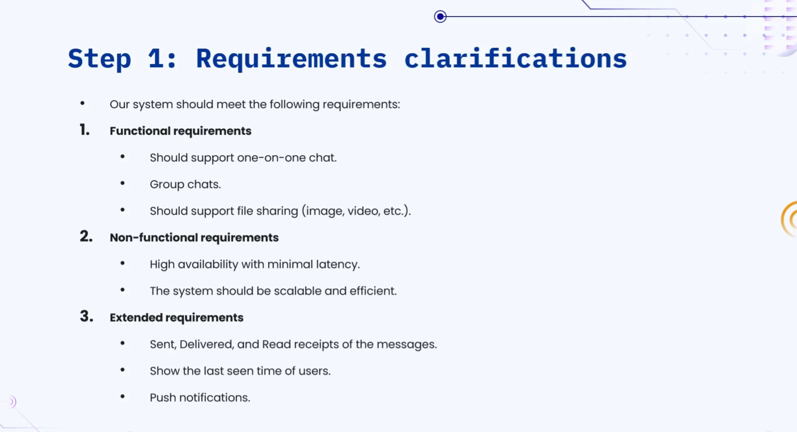
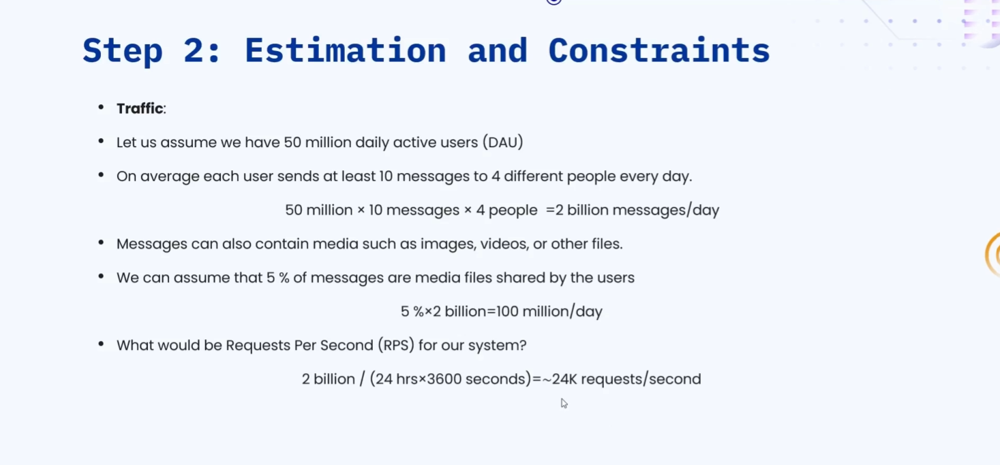
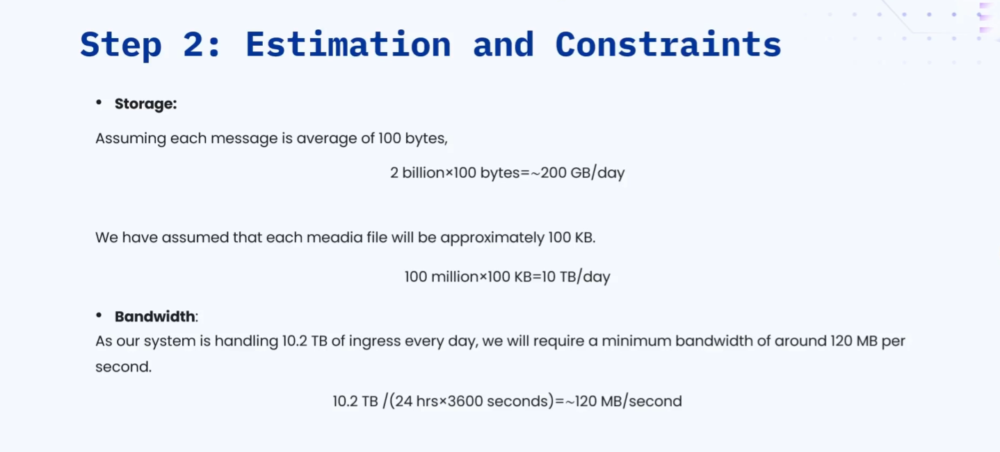
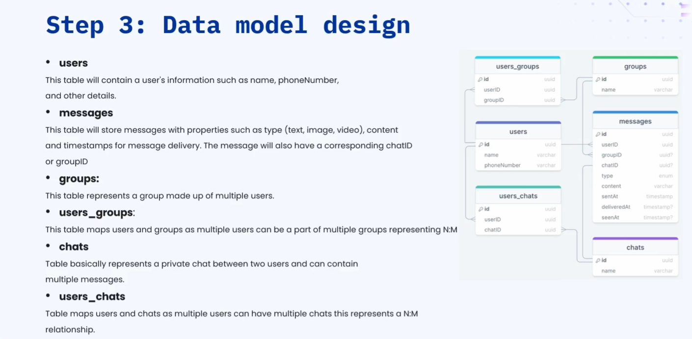
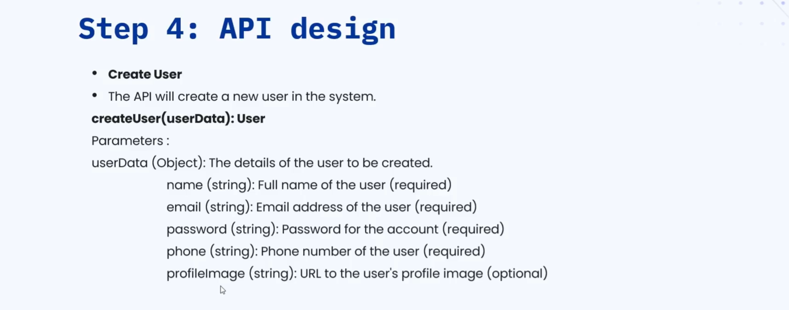
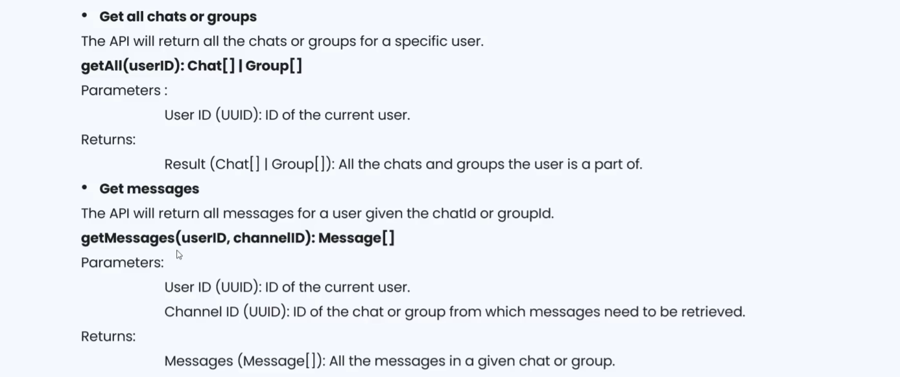
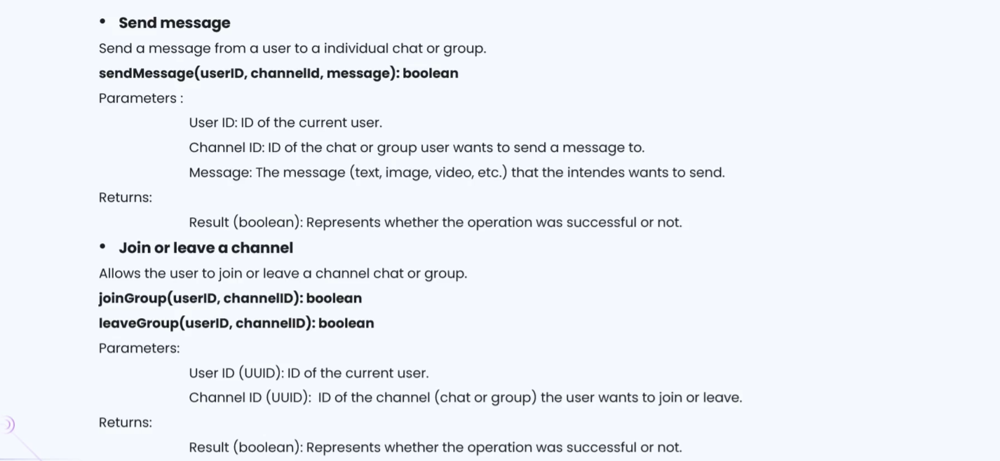
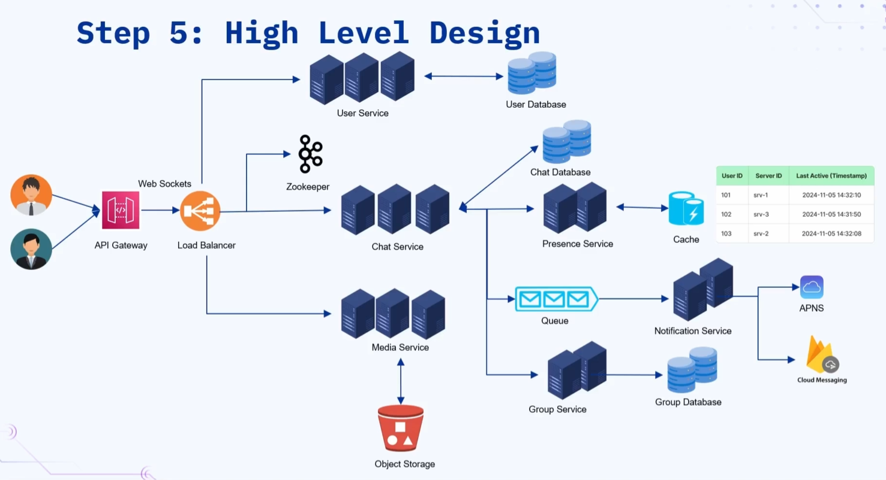
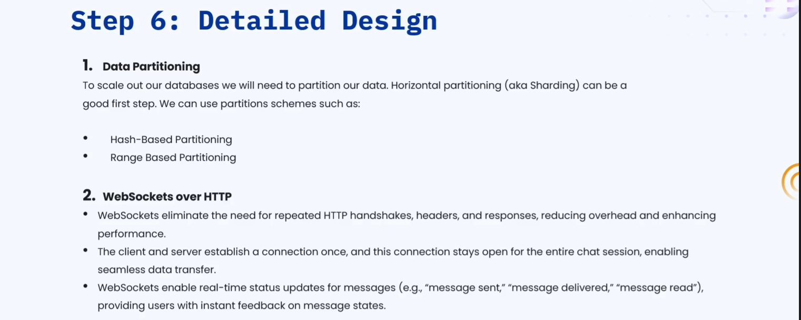
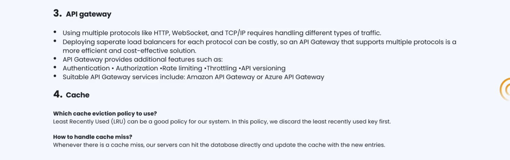

### 🔷🔶🔷 Chapter 3: System Design of WhatsApp

---

### 🔷🔶🔷 Introduction — What is WhatsApp?

    🔹 WhatsApp is a messaging platform that offers real time chat services
      to its users, across individual and group conversations.

    🔹 WhatsApp is the most used application in the world today, with
      over 2 billion users spread across more than 180 countries.

    🔹 The same design solution discussed here can also be applied to
      similar applications, such as Facebook Messenger or WeChat.

---

### 🔷🔶🔷 The Seven Step Approach

    🔹 As usual, we follow the same structured seven step approach to
      solve this system design problem, from requirements through to bottlenecks.
        🔸 Step 1 — Requirement Clarification
        🔸 Step 2 — Estimation and Constraints
        🔸 Step 3 — Data Model Design
        🔸 Step 4 — API Design
        🔸 Step 5 — High Level Design
        🔸 Step 6 — Detailed Design
        🔸 Step 7 — Identify and Resolve Bottlenecks

---

### 🔷🔶🔷 Step 1 — Requirement Clarification

**🔘 Functional Requirements**

    🔹 The system should support 1-to-1 chat between individual users, allowing
      real time private messaging.

    🔹 The system should also support group chats, allowing multiple users to
      communicate together within a single shared conversation.

    🔹 There should be provision for sharing files, videos, images, or any
      other similar media type, alongside regular text messages.

**🔘 Non-Functional Requirements**

    🔹 The system should be highly available, with very low latency, ensuring
      messages are delivered quickly and reliably at all times.

    🔹 The system should be scalable and efficient, capable of handling a
      massive number of concurrent users and messages.

**🔘 Extended Requirements (Good to Have)**

    🔹 The user should be able to see sent, delivered, and read receipts
      for each message, indicating the current status of that message.

    🔹 The system should show the last seen time of other users, along
      with support for push notifications on new incoming messages.

---

### 🔷🔶🔷 Step 2 — Estimation and Constraints

---

### 🔷🔶🔷 Step 3 — Data Model Design

---

### 🔷🔶🔷 Step 4 — API Design

**🔘 1. Create User API**

    🔹 Used to add a new user into the system, accepting a
      user data object containing name, email, password, phone number, and profile image.

    🔹 On success, it returns the same user object back as a
      response, along with an HTTP status code of 201 Created.

**🔘 2. Get All Chats/Groups API**

    🔹 Called whenever the user opens the application, using the user ID
      to fetch all active chats and groups that the user is part of.

**🔘 3. Get Messages API**

    🔹 Called whenever the user opens an individual or group chat, using
      the user ID and channel ID (chat ID or group ID)
      to retrieve all messages of that conversation.

**🔘 4. Send Message API**

    🔹 Used to send a message to either an individual chat or
      a group chat, accepting the user ID, channel ID, and the
      actual message content as parameters.

    🔹 It returns a boolean value of true if the message was sent
      successfully, or false if the send operation failed.

**🔘 5. Join/Leave Channel API**

    🔹 Used whenever a user wants to join or leave a group,
      accepting the user ID and the channel ID as parameters.

    🔹 It returns a boolean value of true if the operation succeeds, or
      false if the operation fails for any reason.

---

### 🔷🔶🔷 Step 5 — High Level Design

**🔘 Architecture Choice — Microservices**

    🔹 We adopt a microservices architecture, since it simplifies horizontal scaling, and
      enables clean decoupling between the different services in the system.

    🔹 Each microservice manages its own dedicated database, using a combination of
      SQL and NoSQL databases, depending on what best fits that service's needs.

    🔹 The key microservices involved are the User Service, Chat Service, Notification
      Service, Presence Service, Group Service, and Media Service.

    🔹 Inter-service communication happens over REST/HTTP or gRPC protocols, and a Service
      Mesh is implemented to enable managed, observable, and secure communication.

**🔘 API Gateway**

    🔹 The API Gateway acts as the single entry point for all
      incoming requests from user devices, and is connected to the load balancer.

    🔹 The load balancer is responsible for distributing the incoming load equally
      among the different servers of each service.

**🔘 User Service**

    🔹 Responsible for creating user accounts, and managing all other aspects related
      to a user's account information.

    🔹 Connected to the user database, where all user related information is
      stored and maintained.

**🔘 Chat Service**

    🔹 The most important microservice in this design, responsible for upgrading incoming
      HTTP requests into WebSocket connections for real time messaging.

    🔹 Responsible for routing every incoming message to its correct destination, and
      is connected to the chat database, where all messages are stored.

    🔹 Makes use of the Presence Service, to determine whether the destination
      user is currently online or offline.

**🔘 Presence Service**

    🔹 Maintains an in-memory cache, storing data such as which user is
      currently connected to which specific chat server.

    🔹 User devices periodically send heartbeat signals, and the Presence Service records
      the timestamp of each received heartbeat, per user.

    🔹 This timestamp data is used to determine if a user is
      online or offline, and to display their last seen time when offline.

**🔘 Notification Service**

    🔹 Connected to a message queue, and is responsible for sending push
      notifications to user devices, when direct delivery isn't possible.

    🔹 Uses APNs (Apple Push Notification System) for Apple devices, and Firebase
      Cloud Messaging for Android devices, to deliver push notifications.

**🔘 Group Service**

    🔹 Whenever a message is sent to a group, this service fetches
      all members of that group, to help route the message correctly.

    🔹 Makes use of the group database, where records of all groups
      and their respective members are stored.

**🔘 Apache ZooKeeper**

    🔹 Helps determine exactly which server a specific user is currently connected
      to, which is crucial for maintaining stable WebSocket sessions.

    🔹 Since WebSocket connections must always send and receive from the same
      server, ZooKeeper ensures users stick to a specific server for their session.

**🔘 Media Service**

    🔹 Invoked whenever a user shares media type files, such as images,
      videos, or documents, within a chat or group.

    🔹 Makes use of object storage, to store these media type files
      reliably and at scale.

---

### 🔷🔶🔷 Message Flow — Scenario 1: One-to-One Chat

    🔹 Assume User A (ID 101) wants to send a message to User
      B (ID 102), and both users open the chat application on
      their respective devices.

    🔹 When User A opens the app, an HTTP request is sent through
      the API Gateway and Load Balancer, to a chat service server.

    🔹 The chat service upgrades this HTTP request into a WebSocket connection,
      and updates ZooKeeper and the Presence Service with User A's connected
      server and current timestamp.

    🔹 Similarly, when User B opens the app, they connect via a
      WebSocket to a different server, say Server 3, and this connection
      detail is also recorded with ZooKeeper and the Presence Service.

    🔹 If a user's last recorded heartbeat timestamp is within 3 seconds
      of the current time, the system considers that user to be online.

    🔹 When User A sends a message, it first reaches the chat server
      handling User A's WebSocket connection, which records the message in
      the chat database.

    🔹 The chat service then checks the Presence Service to determine which
      server User B is connected to, finding that User B is
      connected to Server 3.

    🔹 If User B is online, the message is forwarded from Server 1
      to Server 3, which then delivers it to User B through
      their established WebSocket connection.

    🔹 If User B is offline, Server 1 instead places the message into
      a message queue, from which the Notification Service picks it up
      and sends a push notification, via APNs or Firebase Cloud Messaging,
      based on the destination device type.

---

### 🔷🔶🔷 Message Flow — Scenario 2: Group Chat

    🔹 When User A sends a message in a group, the message first
      reaches the chat service server handling User A's connection.

    🔹 This server contacts the Group Service, which fetches all members belonging
      to that specific group from the group database.

    🔹 The chat service then uses the Presence Service to check which
      of these group members are currently online, and their respective connected servers.

    🔹 The message is forwarded directly to the appropriate servers for all
      online group members, while offline members' messages are placed in the
      message queue for push notification delivery.

---

### 🔷🔶🔷 Step 6 — Detailed Design

**🔘 Database Partitioning**

    🔹 Since the data volume is expected to be huge, we use
      horizontal partitioning, also known as sharding, across our databases.

    🔹 For the user table, range based partitioning can be used —
      for example, splitting users with names A-K into one partition, and
      the rest into another.

    🔹 For the messages table, hash based partitioning is preferred instead, given
      its much higher volume and access pattern.

**🔘 WebSockets over HTTP**

    🔹 We use WebSockets instead of plain HTTP, since they eliminate the
      need for repeated handshakes, reducing overhead and improving overall performance.

    🔹 The connection between client and server operates in full duplex mode,
      meaning both sides can send and receive messages simultaneously.

**🔘 API Gateway**

    🔹 Helps manage different protocols like HTTP and WebSockets together, while also
      providing authorization, authentication, rate limiting, throttling, and API versioning.

    🔹 Examples of API gateways used here include Amazon API Gateway, or
      Microsoft Azure API Gateway.

**🔘 Caching**

    🔹 We use the Least Recently Used (LRU) eviction policy for managing
      our cache memory across the system.

    🔹 On a cache miss, we fetch the required data from the database,
      store it into the cache, and then return it to the user.

---

### 🔷🔶🔷 Step 7 — Identify and Resolve Bottlenecks

**🔘 Bottleneck 1 — Application Server Crash**

    🔹 We run multiple instances of the application server, so that even
      if one crashes, other servers remain available to handle incoming requests.

**🔘 Bottleneck 2 — Distributing Load Across Components**

    🔹 We use load balancers in front of servers, databases, and cache
      servers, wherever multiple instances of these components exist.

**🔘 Bottleneck 3 — Reducing Load on the Database**

    🔹 We use multiple read replicas, sending all write requests to the
      primary replicated databases, and all read requests to the read replicas.

    🔹 This, combined with the sharding strategy already in place, helps significantly
      reduce the overall load on our database layer.

**🔘 Bottleneck 4 — Improving Cache Availability**

    🔹 We use multiple cache instances and replicas, along with a distributed
      cache system, to ensure very high cache availability at all times.

**🔘 Bottleneck 5 — API Gateway Single Point of Failure**

    🔹 We maintain a standby replica of the API Gateway, so that
      if the primary gateway fails, the backup replica becomes active automatically,
      handling incoming requests without disruption.

**🔘 Bottleneck 6 — Making the Notification System Robust**

    🔹 We use dedicated message brokers or queues, like AWS Simple Queue
      Service, ensuring messages are delivered exactly once, and in the correct order.

**🔘 Bottleneck 7 — Reducing Media Storage Cost**

    🔹 Since media files are much larger in size, we enhance the
      Media Service with media processing and compression features, significantly reducing
      storage space and overall cost.

---

### 🔷🔶🔷 Summary — WhatsApp System Design at a Glance

    🔸 Purpose                ->  A real time messaging platform supporting 1-to-1
                                   chats, group chats, and media sharing, serving
                                   billions of users globally.

    🔸 Requirement            ->  Support 1-to-1 and group chats, media sharing,
       Clarification              high availability, low latency, scalability, along with
                                   read receipts, last seen, and push notifications.

    🔸 Estimation             ->  Approximately 2 billion messages/day, 24,000 requests/second,
                                   around 200 GB text and 10 TB media
                                   storage per day, and 120 MB/s bandwidth.

    🔸 Data Model             ->  Users, Messages, Groups, User-Groups, Chats, and
                                   User-Chats tables, using a mix of SQL
                                   (PostgreSQL) and NoSQL (Cassandra) databases.

    🔸 API Design             ->  Create User, Get Chats/Groups, Get Messages, Send
                                   Message, and Join/Leave Channel APIs.

    🔸 High Level Design      ->  A microservices architecture with User, Chat,
                                   Presence, Notification, Group, and Media services,
                                   coordinated using ZooKeeper for WebSocket stickiness.

    🔸 Detailed Design        ->  Range and hash based partitioning, WebSockets over
                                   HTTP for full duplex communication, an API
                                   Gateway for cross-cutting concerns, and LRU caching.

    🔸 Bottlenecks            ->  Solved using multiple server instances, load balancers,
                                   read replicas, distributed caching, a standby API
                                   Gateway, reliable message queues, and media compression.

    🔹 Following this seven step approach — from requirement clarification through bottleneck
      resolution — gives a complete, structured, and interview-ready solution for designing
      a scalable, real time messaging application like WhatsApp.

---