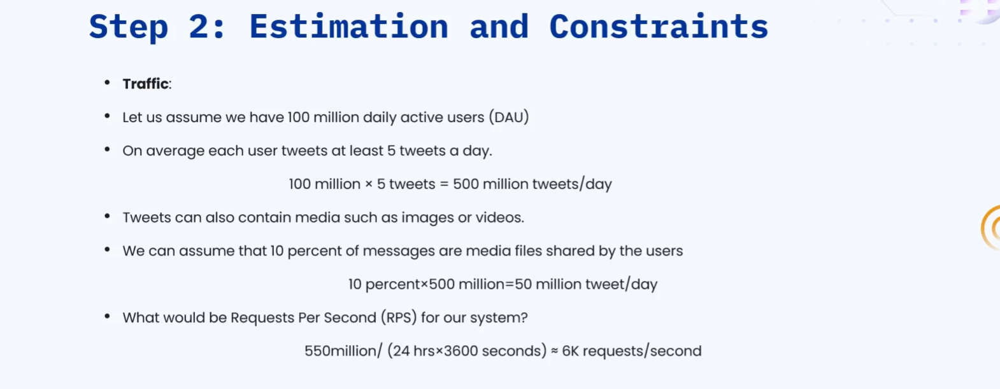
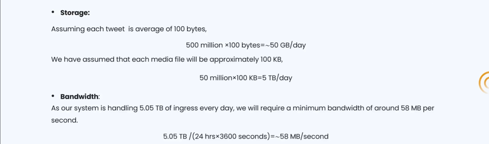
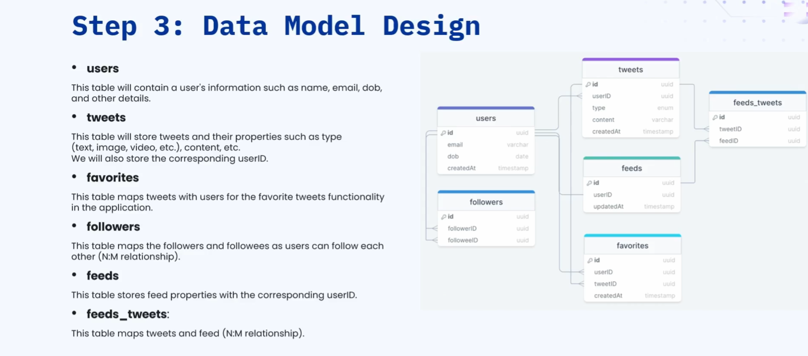
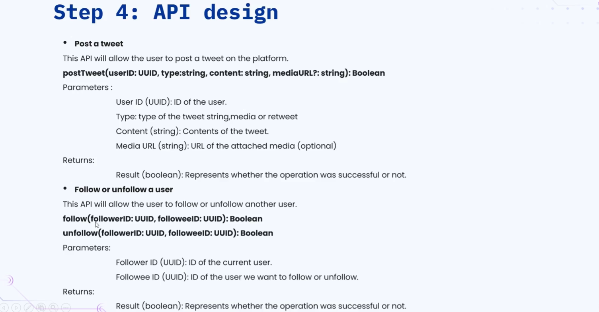
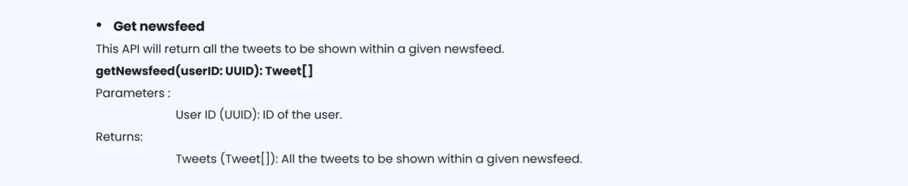
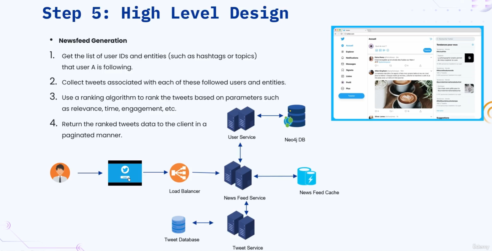
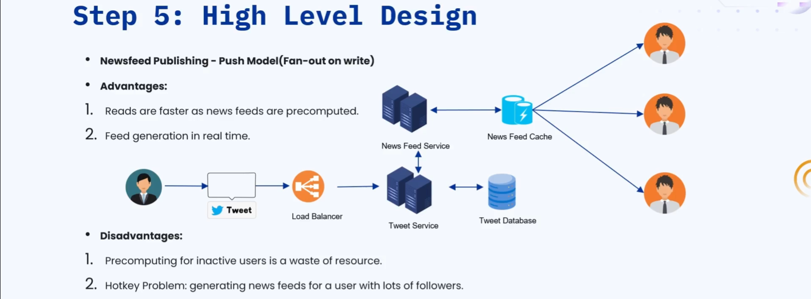
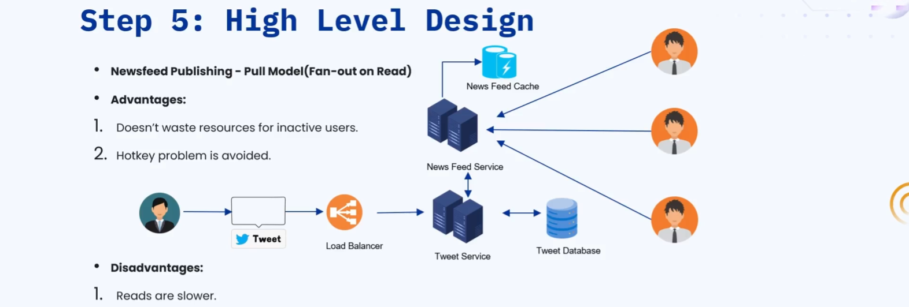
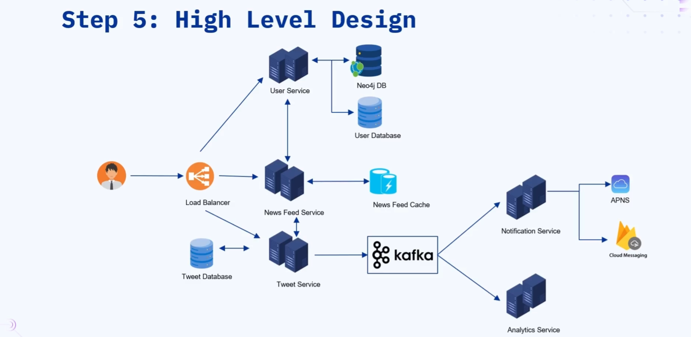
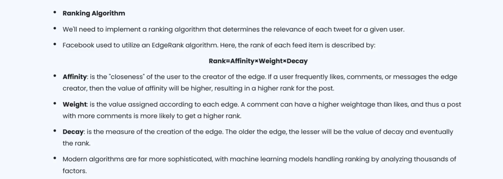

### 🔷🔶🔷 Chapter 4: System Design of Twitter (X)

---

### 🔷🔶🔷 Introduction — What is Twitter?

    🔹 Twitter, now rebranded as X, is a social media application that
      allows users to post and interact with short messages called tweets.

    🔹 Each tweet can be up to 280 characters long, and can
      also include images or videos alongside plain text.

    🔹 The main feature of Twitter is the timeline, also called the
      newsfeed, shown as soon as a user logs into the homepage.

    🔹 The newsfeed contains the latest tweets made by the users or
      topics that a particular user follows.

    🔹 In this system design, we mainly concentrate on how this newsfeed
      is generated, and the same approach also applies to designing
      systems like Instagram or Facebook.

---

### 🔷🔶🔷 The Seven Step Approach

    🔹 As usual, we follow the same structured seven step approach to
      solve this system design problem, from requirements through bottlenecks.
        🔸 Step 1 — Requirement Clarification
        🔸 Step 2 — Estimation and Constraints
        🔸 Step 3 — Data Model Design
        🔸 Step 4 — API Design
        🔸 Step 5 — High Level Design
        🔸 Step 6 — Detailed Design
        🔸 Step 7 — Identify and Resolve Bottlenecks

---

### 🔷🔶🔷 Step 1 — Requirement Clarification

**🔘 Functional Requirements**

    🔹 The user should be able to post new tweets, which can be
      text, image, or video based content.

    🔹 The user should be presented with a newsfeed or timeline, made
      up of tweets from the people that user is following.

    🔹 The user should be able to follow other users on the platform.

**🔘 Non-Functional Requirements**

    🔹 The system should be highly available, with minimum latency, and should
      also be scalable and efficient to handle heavy traffic.

**🔘 Extended Requirements (Good to Have)**

    🔹 The user should be able to retweet a tweet that was
      originally made by another user.

    🔹 There should be a mechanism to collect metrics for analytics purposes,
      helping understand trends and engagement across the platform.

---

### 🔷🔶🔷 Step 2 — Estimation and Constraints

**🔘 Traffic Estimation**

    🔹 We assume 100 million daily active users, each posting at least
      five tweets per day, giving approximately 500 million text tweets per day.

    🔹 Assuming 10% of these tweets are media tweets, we get approximately
      50 million additional media tweets generated per day.

    🔹 Converting this combined 550 million daily tweets into a per-second value
      gives us approximately 6000 requests per second, that the system must handle.

**🔘 Storage Estimation**

    🔹 Assuming each text tweet averages 100 bytes, storing 500 million text
      tweets requires approximately 50 GB of storage per day.

    🔹 Assuming each media tweet averages 100 KB, storing 50 million media
      tweets requires approximately 5 TB of storage per day.

    🔹 In total, this gives us approximately 50.5 TB of combined storage
      required per day, across both text and media tweets.

**🔘 Bandwidth Estimation**

    🔹 With 5.05 TB of data moving through the system every day, we
      calculate a required bandwidth of approximately 58 MB per second.

---

### 🔷🔶🔷 Step 3 — Data Model Design

**🔘 User Table**

    🔹 Stores user related data such as email, name, date of birth,
      and the account's creation time.

**🔘 Tweets Table**

    🔹 Stores data related to tweets, including the user ID of the
      creator, the tweet type (text or retweet), the actual content,
      and the tweet's creation time.

**🔘 Favorites Table**

    🔹 Keeps a record mapping each user to the specific tweets they
      have marked as a favorite.

**🔘 Followers Table**

    🔹 A very important table, keeping track of all the users a
      specific user follows, structured as a many-to-many mapping.

**🔘 Feeds Table**

    🔹 Stores records related to the generated newsfeed of a specific user.

**🔘 Feeds-Tweets Table**

    🔹 Maps feeds and tweets together, recording which tweets appeared in a
      specific user's newsfeed, structured as a many-to-many mapping.

---

### 🔷🔶🔷 Step 4 — API Design

**🔘 1. Post Tweet API**

    🔹 Accepts a user ID (UUID format), the tweet type (text or
      media), the actual content, and a media URL if applicable.

    🔹 Returns a boolean value — true if the tweet was posted successfully,
      or false if the request failed.

**🔘 2. Follow/Unfollow User API**

    🔹 Both APIs share the same method signature, accepting a follower ID
      and a followed user's ID as parameters.

    🔹 Returns a boolean value — true if the follow or unfollow action
      succeeded, or false if it failed for any reason.

**🔘 3. Get Newsfeed API**

    🔹 Called whenever the user lands on the home page, accepting the
      user ID to fetch that specific user's generated newsfeed.

    🔹 Returns an array of tweets, representing the newsfeed generated by
      the system for that particular user.

---

### 🔷🔶🔷 Step 5 — High Level Design

**🔘 Architecture Choice — Microservices**

    🔹 We adopt a microservices architecture, to simplify horizontal scaling and enable
      decoupling between the different services in the system.

    🔹 Each microservice manages its own independent database, appropriate to the
      specific needs of that particular service.

**🔘 Key Microservices**

    🔸 User Service — handles user creation, authentication, authorization, and user data management.
    🔸 Newsfeed Service — generates and publishes the newsfeed for each specific user.
    🔸 Tweet Service — handles posting tweets, mapping tweets to users, and
      managing favorite tweets for each user.
    🔸 Search Service — used for searching or querying tweets based on
      user requirements.
    🔸 Notification Service — sends push notifications whenever a followed user
      makes a new post.

    🔹 Inter-service communication happens through REST or gRPC protocols, and a
      Service Mesh is implemented to manage, observe, and secure this communication.

---

### 🔷🔶🔷 Newsfeed Generation

    🔹 The newsfeed feature can be broken down into two distinct parts
      — newsfeed generation, and newsfeed publishing.

**🔘 How Newsfeed Generation Works**

    🔹 When User A logs in and is redirected to the home page,
      a request is sent to the Newsfeed Service.

    🔹 The Newsfeed Service contacts the User Service, to fetch all users
      that User A is currently following.
        🔸 The User Service uses Neo4j's graph database, to efficiently manage
          and retrieve these user-to-user following relationships.

    🔹 The Newsfeed Service then contacts the Tweet Service, to fetch all
      tweets made by the different users that User A follows.

    🔹 A ranking algorithm is then applied to these retrieved tweets, based
      on parameters like relevance, time, and engagement.

    🔹 The final generated newsfeed is stored in the user newsfeed cache,
      and returned to the user for display on their home page.

    🔹 Since newsfeed generation is complex and time consuming, real world systems
      pre-compute and store these newsfeeds ahead of time in the cache.

---

### 🔷🔶🔷 Newsfeed Publishing

    🔹 Newsfeed publishing is the step where feed data is pushed out
      and computed for each specific user, and is a heavy operation
      given how many followers a user might have.

    🔹 There are three approaches to newsfeed publishing — the Push Model, the
      Pull Model, and the Hybrid Model, combining both.

**🔘 1. Push Model (Fan-Out on Write)**

    🔹 When User X posts a tweet, the Tweet Service stores it, and
      notifies the Newsfeed Service of this new tweet.

    🔹 The Newsfeed Service proactively applies the ranking algorithm, and generates a
      new newsfeed for every one of User X's followers immediately.

    🔹 This generated newsfeed is stored in the user newsfeed cache, so
      when each follower logs in, it is delivered to them instantly.

    🔹 Advantage — reads are very fast, since newsfeeds are already pre-computed and
      ready, with the newsfeed being generated in real time as tweets are made.

    🔹 Disadvantage — newsfeeds get generated even for inactive users who may
      never log in, wasting significant computing and storage resources.
        🔸 This is known as the hotkey problem — for example, a celebrity
          with 10 million followers, of which 2 million are inactive,
          still gets newsfeeds generated for all of them unnecessarily.

**🔘 2. Pull Model (Fan-Out on Load)**

    🔹 When User X posts a tweet, the Tweet Service simply stores it
      in the database, without notifying the Newsfeed Service at all.

    🔹 Only when a user actually logs in and makes a request, does
      the Newsfeed Service fetch tweets, apply ranking, and generate the newsfeed.

    🔹 Advantage — resources are never wasted on inactive users, since the newsfeed
      is only generated reactively, avoiding the hotkey problem entirely.

    🔹 Disadvantage — reads are slower, since the newsfeed must be generated on-demand,
      taking time to retrieve data and apply the ranking algorithm.

**🔘 3. Hybrid Model**

    🔹 The Hybrid Model combines the strengths of both the push and
      pull models, balancing their respective advantages.

    🔹 For users with few followers, the push model is used, pre-computing
      and generating the newsfeed proactively for all their followers.

    🔹 For users with millions of followers, the pull model is used
      instead, generating the newsfeed only on-demand when requested.

---

### 🔷🔶🔷 Overall High Level Architecture

    🔹 The Newsfeed Service generates the newsfeed, which is stored in the
      user newsfeed cache for fast, quick access by users.

    🔹 The User Service manages user data, account creation, authentication, authorization, and
      the mapping between users and their followers.
        🔸 It uses Neo4j's DB for managing user relationships, and a
          separate user database for storing name, date of birth,
          email, and password.

    🔹 The Tweet Service manages tweets made by users, storing them in
      an independent Tweet Database dedicated to this purpose.

    🔹 The Tweet Service also posts every tweet to a topic in
      the Kafka queue, allowing other services to consume this data.
        🔸 The Notification Service consumes these tweets from Kafka, and sends
          push notifications via APNs (Apple) or Firebase Cloud Messaging (Android).
        🔸 The Analytics Service also consumes these tweets from Kafka, to
          determine trending tweets, relevance, and other insights.

---

### 🔷🔶🔷 Ranking Algorithm

    🔹 The ranking algorithm helps determine the relevance of each tweet, for
      a given user's newsfeed, based on multiple weighted factors.

    🔹 Based loosely on Facebook's EdgeRank algorithm, the rank of a tweet
      is calculated using the formula — Affinity x Weight x Decay.

**🔘 Affinity**

    🔹 Affinity represents the closeness of the user to the creator of
      the tweet — for example, how often you like, comment on,
      or share content from that specific creator.

    🔹 If a user frequently engages with a particular creator's content, that
      creator's tweets are given a higher affinity score, boosting their rank.

**🔘 Weight**

    🔹 Weight considers different types of engagement differently, since some actions require
      more effort than others — for example, comments could be weighted
      five points each, while likes are weighted just one point each.

    🔹 For a tweet with 500 comments and 1000 likes, this would
      give 2500 points from comments, and 1000 points from likes,
      totalling 3500 weighted points.

**🔘 Decay (DQ)**

    🔹 Decay represents the "oldness" of the tweet — how long ago it
      was posted, relative to the current time.

    🔹 Older tweets have a higher decay value, lowering their rank, while
      recently posted tweets have a lower decay value, boosting their rank.

    🔹 In modern systems, machine learning models are typically used instead, analyzing
      thousands of factors to rank tweets faster and more accurately.

---

### 🔷🔶🔷 Handling Retweets

    🔹 To handle retweeting, a new tweet record is created in the
      database, using the user ID of the user who is retweeting.

    🔹 The type of this new record is set to "retweet," instead
      of "text" or "media," to distinguish it from an original tweet.

    🔹 The content field of this retweet record stores a reference to
      the ID of the original tweet being retweeted.

---

### 🔷🔶🔷 Step 6 — Detailed Design

**🔘 Database Partitioning**

    🔹 Since the system is both read heavy and write heavy, we
      partition our database using horizontal partitioning, also known as sharding.

    🔹 We can use different sharding strategies — hash based, list based, range
      based, or composite based sharding, depending on the specific table's needs.

**🔘 Handling Mutual Friends**

    🔹 We use Neo4j's graph database to manage the following and follower
      relationships between users, effectively building a social graph.

    🔹 In this graph, each node represents a user, and each edge
      between nodes represents the relationship between those two users.

    🔹 To find mutual friends between two users, we traverse through both
      of their followers, and identify the common, overlapping connections.

**🔘 Caching**

    🔹 Since social media applications are highly read intensive, we cache around
      20% of all tweets that are made across the system.

    🔹 We use the Least Recently Used (LRU) eviction policy, ensuring only
      the latest tweets remain available in the cache at any given time.

    🔹 On a cache miss, the data is retrieved from the database,
      stored into the cache, and then returned to the user as a response.

**🔘 Metrics and Analytics**

    🔹 A dedicated Analytics Service collects tweet information through the Kafka queue,
      making use of Apache Kafka, an open-source engine for large scale
      data processing and analysis.

    🔹 This helps determine trending tweets, total number of likes received, and
      which geographical locations are generating more tweets or engagement.

**🔘 Content Delivery Network (CDN)**

    🔹 A CDN improves overall availability and redundancy, ensuring data remains accessible
      even if one location experiences a loss of data.

    🔹 It also reduces bandwidth usage, by serving content from the nearest
      geographical location to the user, improving load times and performance.

    🔹 Examples of CDN services used here include Amazon CloudFront, or Cloudflare CDN.

---

### 🔷🔶🔷 Step 7 — Identify and Resolve Bottlenecks

**🔘 Bottleneck 1 — Application Server Crash**

    🔹 We run multiple instances of the application server, so that if
      one goes down, the load balancer diverts traffic to other
      healthy servers automatically.

**🔘 Bottleneck 2 — Distributing Traffic Between Components**

    🔹 We introduce load balancers in front of all redundant components, including
      replica databases and replica servers, wherever they exist in the system.

**🔘 Bottleneck 3 — Reducing Load on the Database**

    🔹 We use multiple read replicas, sending all write requests to the
      primary replicas, and all read requests to the read replicas instead.

**🔘 Bottleneck 4 — Improving Cache Availability**

    🔹 We implement multiple instances of our cache in a distributed manner,
      following the same distributed caching mechanism discussed in earlier chapters.

**🔘 Bottleneck 5 — Reducing Media Storage Cost**

    🔹 Since a lot of media tweets are being handled, we introduce
      media processing and compression features, significantly reducing storage space and cost.

---

### 🔷🔶🔷 Summary — Twitter (X) System Design at a Glance

    🔸 Purpose               ->  A social media platform for posting short tweets,
                                  following other users, and viewing a personalized
                                  newsfeed of relevant content.

    🔸 Requirement            ->  Post tweets (text/image/video), view a newsfeed,
       Clarification             follow other users, remain highly available and
                                  scalable, with support for retweets and analytics.

    🔸 Estimation             ->  Approximately 550 million tweets/day, 6000 requests/second,
                                  50.5 TB total storage per day, and
                                  around 58 MB/s of bandwidth required.

    🔸 Data Model             ->  User, Tweets, Favorites, Followers, Feeds, and
                                  Feeds-Tweets tables, capturing users, content, and
                                  their relationships.

    🔸 API Design             ->  Post Tweet, Follow/Unfollow User, and Get
                                  Newsfeed APIs.

    🔸 High Level Design      ->  A microservices architecture with User, Newsfeed,
                                  Tweet, Search, and Notification services, plus
                                  newsfeed generation, and Push, Pull, and Hybrid
                                  models for newsfeed publishing.

    🔸 Ranking Algorithm      ->  Rank = Affinity x Weight x Decay,
                                  factoring closeness to the creator, engagement
                                  type, and how recent the tweet is.

    🔸 Detailed Design        ->  Sharding, Neo4j-based mutual friend graphs, LRU
                                  caching, Kafka-based analytics, and a CDN for
                                  fast, redundant content delivery.

    🔸 Bottlenecks            ->  Solved using multiple server instances, load balancers,
                                  read replicas, distributed caching, and media
                                  compression for cost reduction.

    🔹 Following this seven step approach — from requirement clarification through bottleneck
      resolution — gives a complete, structured, and interview-ready solution for designing
      a scalable social media platform like Twitter (X).

---