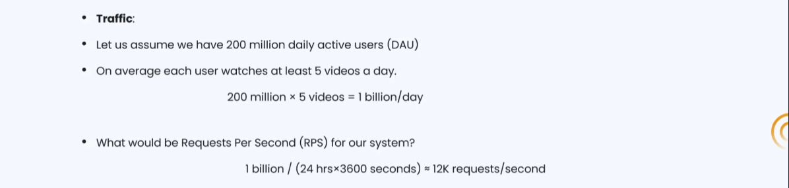
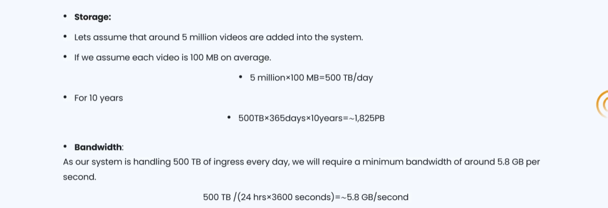
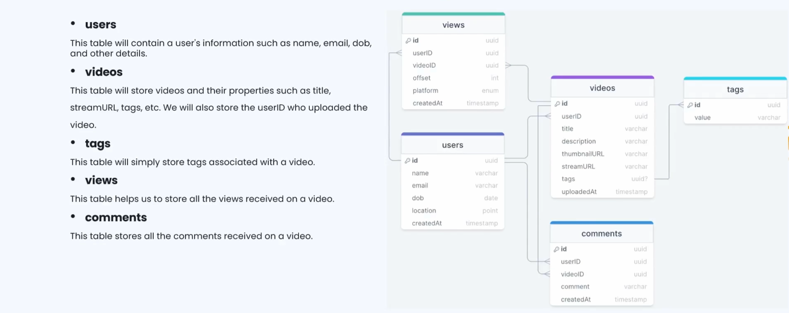
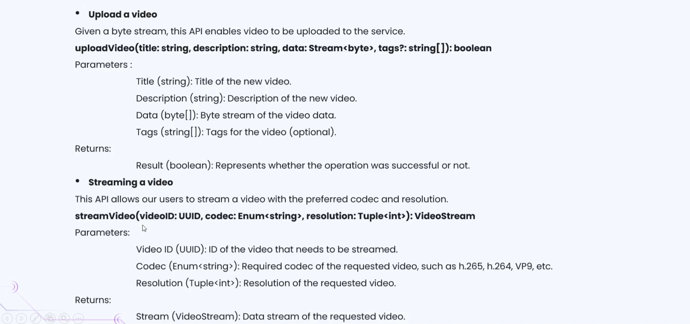
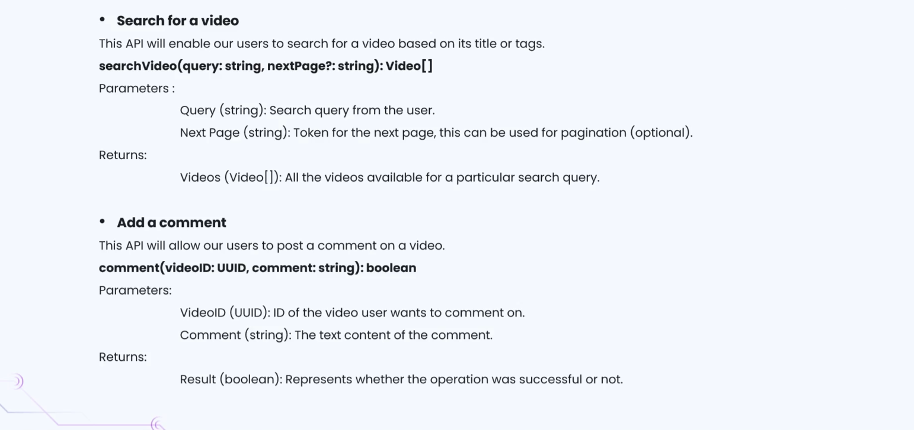
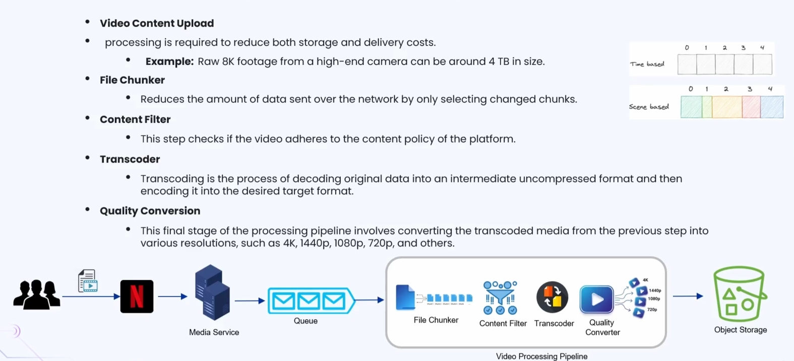
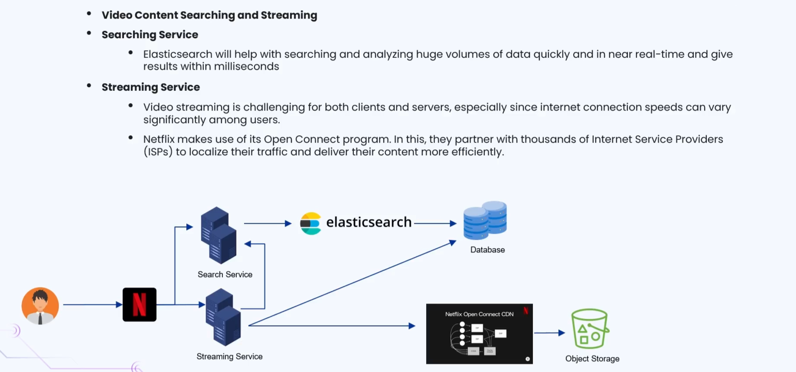
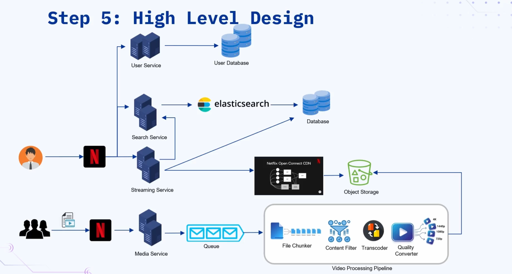

### 🔷🔶🔷 Chapter 5: System Design of Netflix

---

### 🔷🔶🔷 Introduction — What is Netflix?

    🔹 Netflix is an online video streaming service that lets users watch
      movies, TV shows, documentaries, or other original content over the internet.

    🔹 Netflix is a subscription based streaming platform, requiring users to pay
      before they can watch any content available on it.

    🔹 Netflix is available across multiple platforms, including web browsers, iOS devices,
      Android devices, and smart TVs.

    🔹 The same design strategy discussed here can also be applied to
      other video streaming services, such as YouTube.

---

### 🔷🔶🔷 The Seven Step Approach

    🔹 As usual, we follow the same structured seven step approach to
      solve this system design problem, from requirements through bottlenecks.
        🔸 Step 1 — Requirement Clarification
        🔸 Step 2 — Estimation and Constraints
        🔸 Step 3 — Data Model Design
        🔸 Step 4 — API Design
        🔸 Step 5 — High Level Design
        🔸 Step 6 — Detailed Design
        🔸 Step 7 — Identify and Resolve Bottlenecks

---

### 🔷🔶🔷 Step 1 — Requirement Clarification

**🔘 Functional Requirements**

    🔹 The content team should be able to upload videos, such as
      movies, TV shows, and other related content, into the platform.

    🔹 Users should be able to stream and watch the videos that
      have been uploaded by the content team.

    🔹 Users should be able to search for videos, using either the
      title of the video, or the tags associated with it.

**🔘 Non-Functional Requirements**

    🔹 The platform should be highly available, with minimum latency, since very
      little delay is acceptable while watching a streamed video.

    🔹 The platform should be highly reliable, ensuring no video uploads are
      ever lost during the upload process.

    🔹 The system should also be very scalable and efficient, capable of
      handling a large volume of concurrent viewers and uploads.

**🔘 Extended Requirements (Good to Have)**

    🔹 Content should be geo-blocked, meaning certain videos or movies should not
      be made available for viewing in all countries.

    🔹 There should be an option to resume video playback, from the
      exact point where the user had previously left off.

---

### 🔷🔶🔷 Step 2 — Estimation and Constraints

**🔘 Traffic Estimation**

    🔹 We assume 200 million daily active users, each watching at least
      five videos a day, giving approximately 1 billion requests per day.

    🔹 Converting this into a per-second value gives us approximately 12,000 requests
      per second, that our system must be able to handle.

**🔘 Storage Estimation**

    🔹 We assume 5 million video uploads occur every day, with each video
      averaging around 100 MB in size, giving approximately 500 GB of
      storage required per day.

    🔹 Over a period of ten years, this accumulates to approximately 1,825
      PB (petabytes) of total storage required, for storing all uploaded video content.

**🔘 Bandwidth Estimation**

    🔹 With 500 TB of ingress data expected every day, we calculate a
      required bandwidth of approximately 5.8 GB per second.

---

### 🔷🔶🔷 Step 3 — Data Model Design

**🔘 Users Table**

    🔹 Stores user related attributes, such as name, email address, date of
      birth, location, and the account's created-at timestamp.

**🔘 Videos Table**

    🔹 Stores video related attributes, such as user ID of the uploader,
      title, description, thumbnail, streaming URL, tags, and the upload timestamp.

**🔘 Tags Table**

    🔹 Associated with the videos table, storing all tags related to a
      specific video, useful for improving searchability.

**🔘 Views Table**

    🔹 A very important table, mapping users to the videos they watch,
      helping determine each user's watching behavior over time.

    🔹 Contains an offset attribute, crucial for the resume playback feature, keeping
      track of exactly how long a video has already been watched.

**🔘 Comments Table**

    🔹 Not required for Netflix, but very important for platforms like YouTube,
      mapping users, videos, and the comments made on each video.

---

### 🔷🔶🔷 Step 4 — API Design

**🔘 1. Upload Video API**

    🔹 Accepts the title (string), description, the actual video data (as a
      stream), and optional tags related to the video.

    🔹 Returns a boolean value — true if the video was successfully uploaded,
      or false if the upload operation failed for any reason.

**🔘 2. Stream Video API**

    🔹 Accepts the video ID, codec information (used to determine the correct
      transcoder), and the desired resolution of the video to be streamed.

    🔹 Returns the video as a stream, delivering chunks of video data
      progressively, rather than sending the entire file all at once.

**🔘 3. Search API**

    🔹 Accepts a query string, representing the search filters, along with pagination
      information indicating which page of results is being requested.

    🔹 Returns an array of videos, matching the given query string and
      filter parameters as closely as possible.

**🔘 4. Add Comment API**

    🔹 Accepts the video ID being commented on, along with the actual
      comment text being posted by the user.

    🔹 Returns a boolean value — true if the comment was successfully posted,
      or false if the comment failed to post for any reason.

---

### 🔷🔶🔷 Step 5 — High Level Design

**🔘 Architecture Choice — Microservices**

    🔹 We adopt a microservices architecture, to simplify horizontal scaling, and enable
      better decoupling between the different services in the system.

    🔹 Each microservice maintains its own independent database and data model, appropriate
      to that specific service's needs.

**🔘 Key Microservices**

    🔸 User Service — handles account creation, account management, authentication, and authorization.
    🔸 Streaming Service — comes into play whenever a user wants to
      watch a movie or a video.
    🔸 Search Service — handles user queries for searching titles or specific videos.
    🔸 Media Service — handles all video uploads made on the platform.
    🔸 Analytics Service — processes data for analytics, metrics, and powers the
      recommendation engine.

    🔹 Inter-service communication happens over REST or gRPC protocols, with gRPC being
      faster and more efficient compared to REST for this use case.

    🔹 A Service Mesh is also implemented, to enable manageable, observable, and
      secure communication between the individual microservices.

---

### 🔷🔶🔷 Feature 1 — Video Content Upload

    🔹 Processing an uploaded video is important, since it significantly reduces both
      the storage and delivery costs involved in streaming it later.

    🔹 For example, a raw 8K footage file from a high end camera
      could be around 40 GB in size, making storage and streaming
      as a single chunk very expensive.

**🔘 Upload and Processing Flow**

    🔹 The content team uploads the video through an API Gateway, which
      forwards the request to the Media Service.

    🔹 The Media Service places the uploaded video into a queue, ensuring
      videos are processed one after another, given how resource-intensive processing is.

    🔹 The queued video is then picked up by the video processing
      pipeline, made up of multiple sequential services.

**🔘 1. File Chunker Service**

    🔹 Receives the video from the queue, and divides it into multiple
      smaller parts, since streaming chunks is far easier and more reliable
      than streaming one large complete file.

    🔹 Netflix uses scene based chunking, instead of time based chunking, delivering
      an entire scene to the user at once, avoiding mid-scene buffering issues.

**🔘 2. Content Filter**

    🔹 Checks whether the uploaded video chunks adhere to the platform's content
      policy, before allowing further processing to continue.

**🔘 3. Transcoder**

    🔹 Decodes the original video file into an intermittent, uncompressed format, and
      then converts it into the desired target format.

    🔹 For example, an uploaded MP4 file might be decompressed, and then
      converted into a different format like AVI, better suited for streaming
      across different devices and platforms.

**🔘 4. Quality Converter**

    🔹 Converts the processed video chunks into multiple different resolutions, such as
      4K, 1080p, or 720p, based on the user's device and quality needs.

    🔹 One of these resolutions is automatically chosen for streaming, though the
      user can also manually select their preferred resolution.

    🔹 The final result is that a single uploaded video is converted
      into multiple formats and resolutions, all stored together in object storage.

---

### 🔷🔶🔷 Feature 2 — Searching and Streaming a Video

**🔘 Search Flow**

    🔹 When a user searches for a specific title, the Search Service
      comes into play, making use of Elasticsearch to query the database.

    🔹 Elasticsearch is used instead of normal SQL queries, since it is
      an open-source analytics engine, capable of searching and analyzing huge
      volumes of data almost in real time, within milliseconds.

**🔘 Streaming Flow**

    🔹 Once the user selects a video to watch, the Streaming Service
      comes into play, contacting the Search Service for additional details,
      such as the video's streaming URL.

    🔹 The Streaming Service then connects with Netflix's own Open Connect CDN,
      to fetch and stream the requested video content.

    🔹 Open Connect caches popular movies and TV shows closer to the
      user's geographical location, and is fed by the object storage
      containing all processed video content.

    🔹 The Streaming Service also continuously updates the database, tracking the user's
      watch behavior, including the current video and playback offset, useful
      for the resume playback feature.

---

### 🔷🔶🔷 Overall High Level Architecture

    🔹 The User Service handles account creation, management, and authentication, backed by
      its own dedicated user database.

    🔹 The Search Service uses Elasticsearch to efficiently query and search through
      the video database.

    🔹 The Streaming Service uses the Search Service, relevant databases, and the
      Open Connect CDN together, to stream video content back to the user.

    🔹 The Media Service uses a messaging queue, to process videos uploaded
      by the content team, or in YouTube's case, uploaded by users directly.

    🔹 Multiple server and database replicas exist across all these services, and
      load balancers should always be placed in front of any redundant
      component within the system.

---

### 🔷🔶🔷 Step 6 — Detailed Design

**🔘 Open Connect CDN**

    🔹 Netflix has developed its own proprietary CDN, called Open Connect, used
      for delivering video content quickly, smoothly, and at the best
      possible quality to users.

    🔹 Netflix partners with popular local internet service providers in each region
      — for example, AT&T in the US, or Airtel in India — placing
      Open Connect appliances closer to users, reducing latency and improving quality.

    🔹 Open Connect currently serves 95% of Netflix's total traffic, using appliances
      deployed across over 1000 separate locations worldwide.

    🔹 If a local ISP or CDN faces issues, requests can automatically failover
      and be rerouted to Netflix's original central servers instead.

**🔘 Recommendation Engine**

    🔹 The recommendation engine is a crucial system, influencing over 80% of
      all content streamed on the Netflix platform.

    🔹 Netflix uses advanced machine learning models, analyzing each user's viewing history,
      to predict what content that user might enjoy watching next.

    🔹 The engine collects a wide range of data points to make
      these predictions, including:
        🔸 User profile information — such as age, gender, and location.
        🔸 Viewing behavior — titles watched, skipped, or rewatched previously.
        🔸 Browsing and scrolling patterns — how long a user scrolls before choosing.
        🔸 Time and date of viewing — morning, evening, or late night habits.
        🔸 Device information — whether streamed via TV, mobile, tablet, or desktop.
        🔸 Search activity — keywords used, and searches that were abandoned.
        🔸 Interaction data — likes, dislikes, "my list" additions, comments, and ratings.
        🔸 Session length — how much of each video was actually watched.
        🔸 Playback behavior — skipped or rewound sections within a video.

    🔹 This extensive data collection is how Netflix achieves around 80% accuracy
      in its recommendations, in terms of users actually watching what
      was recommended to them.

**🔘 Geo-Blocking**

    🔹 Geo-blocking exists because Netflix maintains different content libraries per country, based
      on licensing agreements with production houses and studios.

    🔹 Netflix determines the user's location, typically using their IP address, and
      only displays videos and titles licensed for that specific region.

    🔹 Adhering to these regional licensing agreements is very important and crucial
      for Netflix, both legally and contractually.

---

### 🔷🔶🔷 Step 7 — Identify and Resolve Bottlenecks

**🔘 Bottleneck 1 — Application Server Crash**

    🔹 We run multiple instances of the application server, so that even
      if one fails, traffic is rerouted to other healthy servers automatically.

**🔘 Bottleneck 2 — Distributing Traffic Between Components**

    🔹 We use load balancers between clients, servers, databases, and cache servers,
      placing them wherever redundant components exist in the system.

**🔘 Bottleneck 3 — Reducing Load on the Database**

    🔹 We use multiple database replicas, sending all write requests to the
      primary replicas, and all read requests to the read replicas.

**🔘 Bottleneck 4 — Improving Cache Availability**

    🔹 We implement multiple instances of our cache in a distributed manner,
      improving overall cache availability and resilience across the system.

---

### 🔷🔶🔷 Summary — Netflix System Design at a Glance

    🔸 Purpose               ->  A subscription based video streaming platform for
                                  watching movies, TV shows, and documentaries, available
                                  across web, mobile, and smart TV platforms.

    🔸 Requirement            ->  Upload, stream, and search videos, remain highly
       Clarification             available, reliable, and scalable, with support for
                                  geo-blocking and resume playback.

    🔸 Estimation             ->  Approximately 1 billion requests/day, 12,000 requests/second,
                                  around 1,825 PB total storage over 10 years,
                                  and 5.8 GB/s of bandwidth required.

    🔸 Data Model             ->  Users, Videos, Tags, Views, and Comments tables,
                                  with the Views table's offset attribute enabling
                                  resume playback.

    🔸 API Design             ->  Upload Video, Stream Video, Search, and Add
                                  Comment APIs.

    🔸 High Level Design      ->  A microservices architecture with User, Streaming,
                                  Search, Media, and Analytics services, plus a
                                  detailed video processing pipeline (Chunker, Content
                                  Filter, Transcoder, Quality Converter).

    🔸 Detailed Design        ->  Netflix's own Open Connect CDN for fast,
                                  ISP-partnered delivery, a machine learning powered
                                  recommendation engine, and IP-based geo-blocking.

    🔸 Bottlenecks            ->  Solved using multiple server instances, load balancers,
                                  read replicas, and distributed caching for high
                                  availability.

    🔹 Following this seven step approach — from requirement clarification through bottleneck
      resolution — gives a complete, structured, and interview-ready solution for designing
      a scalable video streaming platform like Netflix or YouTube.

---